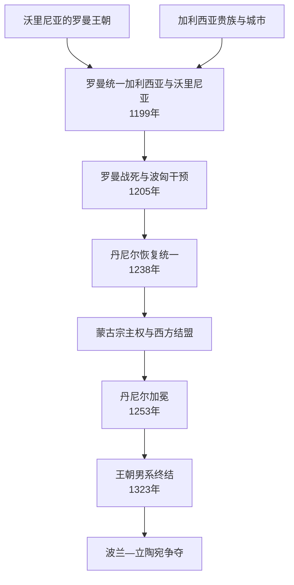

# 加利西亚-沃里尼亚王国

## 时间

1199—1340/1349年；1253年丹尼尔加冕后常称“罗斯王国”或“卢森尼亚王国”。

## 概括

加利西亚—沃里尼亚由罗曼・姆斯季斯拉维奇在1199年结合沃里尼亚和加利西亚两片罗斯领地。它处在波兰、匈牙利、立陶宛、草原和黑海贸易之间，贵族、城市与王族力量都很强。蒙古征服后丹尼尔承认金帐宗主权，同时寻求教廷和中欧联盟，1253年受冠为“罗斯国王”。王朝男系1323年断绝，末王尤里二世1340年被毒杀后，波兰与立陶宛长期争夺；加利西亚最终主要入波兰，沃里尼亚主要入立陶宛。

## 建立背景

- 沃里尼亚以弗拉基米尔—沃伦斯基为中心，位于通往波兰和基辅的路线；加利西亚围绕盐矿、喀尔巴阡通道和德涅斯特河贸易发展，地方波雅尔尤其强大。
- 加利西亚原王朝1198/1199年绝嗣后，沃里尼亚的罗曼・姆斯季斯拉维奇兼并该地。他曾多次介入基辅，形成西南罗斯最有实力的统治集团。
- 1205年罗曼在对波兰作战时战死，幼子丹尼尔与瓦西里科无法立即继位。匈牙利、波兰、加利西亚贵族和不同罗斯王公轮番干预，政权在三十多年间反复分合。

## 分阶段发展

### 1199—1205年：罗曼统一

罗曼压制部分加利西亚波雅尔，连接沃里尼亚的王朝土地与加利西亚资源，并向基辅和草原施加影响。其权力仍依赖个人军事成功；没有完成可在幼主时期自动运转的继承制度，故死后迅速崩解。

### 1205—1238年：幼主、外来君主与复国

- 丹尼尔和弟弟瓦西里科在母亲安娜与波兰盟友保护下辗转，逐步收复沃里尼亚。
- 匈牙利王子科洛曼一度以教廷支持的“加利西亚国王”身份统治，波兰和匈牙利试图划分影响。
- 姆斯季斯拉夫“勇者”等罗斯王公也控制加利西亚。地方波雅尔可邀请、驱逐君主，个别贵族甚至自称统治者。
- 丹尼尔1238年取得加利西亚，随后在亚罗斯拉夫战役中击败波匈支持者，完成较稳定统一。

### 1238—1264年：丹尼尔时期

- 丹尼尔控制基辅并委任德米特罗守城，但1240年蒙古攻陷基辅；1241年西南城市也遭破坏。
- 1245/1246年丹尼尔赴拔都汗廷承认宗主权，保住内部统治。他建设霍尔姆、利沃夫等城市，引入工匠和移民，重建贸易与防御。
- 为摆脱金帐控制，他联系教皇、匈牙利、波兰和立陶宛。1253年教廷使节为其加冕，但西方没有提供足以对抗蒙古的十字军援助。
- 1250年代丹尼尔一度攻击蒙古代理势力；1259年布隆代逼迫其拆除多座城防，显示王国自主权的上限。

### 1264—1323年：列夫一世至罗曼男系断绝

列夫一世更积极参与中欧和立陶宛战争，政治中心向利沃夫一带移动。尤里一世采用“罗斯国王”称号并设立加利西亚都主教区，试图强化教会独立。安德烈与列夫二世共治，可能在对蒙古或立陶宛作战中同时死亡，1323年罗曼王朝男系绝嗣。

### 1323—1349年：末王与瓜分

波雅尔选择马佐夫舍皮雅斯特家族的博列斯瓦夫，受洗改名尤里二世。他在波兰、立陶宛、金帐与本地贵族间平衡，1340年被毒杀。立陶宛的柳巴尔塔斯控制沃里尼亚，波兰卡齐米日三世进军加利西亚；波兰—立陶宛战争持续到14世纪后半叶，1349年通常视为加利西亚被波兰稳定兼并的节点。

## 统治结构

| 层次 | 作用 |
| --- | --- |
| 王公 / 国王 | 统率军队、外交、分封和城市建设；1253年后国王称号增加西方合法性，但未改变金帐宗主关系。 |
| 波雅尔 | 控制庄园、城堡和军队，加利西亚波雅尔尤其能干预继承；并非统一集团。 |
| 城市与商人 | 盐、农产、手工业和跨喀尔巴阡贸易提供财政；霍尔姆、利沃夫等新中心帮助王权绕开旧贵族。 |
| 教会 | 东正教为主体；与君士坦丁堡、基辅都主教和教廷关系交错。加冕不等于王国整体改宗天主教。 |
| 外部宗主与盟友 | 金帐汗国收取贡赋并要求军事服从；波兰、匈牙利、立陶宛既通婚结盟也争夺领土。 |

## 重要事件

| 时间 | 事件 | 影响 |
| --- | --- | --- |
| 1199年 | 罗曼统一两公国 | 西南罗斯强权形成。 |
| 1205年 | 罗曼战死 | 幼主危机和外部干预开始。 |
| 1214年 | 波匈安排科洛曼为王 | 显示中欧势力争夺与宗教政治。 |
| 1238年 | 丹尼尔恢复加利西亚 | 统一主线重建。 |
| 1240—1241年 | 蒙古征服 | 城市遭破坏，王国进入宗主体系。 |
| 1245年 | 亚罗斯拉夫战役 | 丹尼尔击败波匈和贵族对手。 |
| 1253年 | 丹尼尔加冕 | 获“罗斯国王”称号，寻求反蒙古联盟。 |
| 1259年 | 布隆代迫拆城防 | 自主反抗失败。 |
| 1323年 | 安德烈、列夫二世死亡 | 罗曼王朝男系断绝。 |
| 1340—1349年 | 尤里二世死及波立争夺 | 王国作为独立政治实体终结。 |

## 鼎盛与灭亡原因

### 鼎盛条件

王国掌握盐矿、农业、贸易通道和人口较密集地区；罗曼、丹尼尔以沃里尼亚家族土地为稳定基础，利用新城对冲加利西亚波雅尔；处在中欧与黑海之间又提供多方向外交空间。

### 衰落因素

- 王位继承高度依赖单一家族男嗣，幼主和绝嗣都会引发外来王朝竞争；
- 波雅尔拥有独立军事和跨国联系，可邀请外国君主；
- 金帐贡赋、军事征调和拆城限制削弱防务；
- 波兰、匈牙利、立陶宛和金帐围绕同一地区长期竞争。

### 直接终结

1323年男系绝嗣后，尤里二世缺乏本地王朝根基；1340年其被毒杀触发波兰入侵和立陶宛继承。王国不是在一天内整体被某国吞并：加利西亚、沃里尼亚和边区分别进入波兰、立陶宛及金帐影响，14世纪后半叶才逐步稳定。

## 统治者世系

| 顺序 | 统治者 | 统治期 | 说明 |
| --- | --- | --- | --- |
| 1 | **罗曼・姆斯季斯拉维奇** | 1199—1205年 | 建国者，战死。 |
| 2 | 丹尼尔、瓦西里科的幼主权利 | 1205年起；实际控制反复 | 罗曼诸子，由母亲及盟友保护；不是稳定共治。 |
| 3 | 科洛曼・阿尔帕德 | 1214—1219年间 | 匈牙利王子、教廷承认的加利西亚国王，控制多次中断。 |
| 4 | 姆斯季斯拉夫“勇者” | 1219—1228年间 | 诺夫哥罗德—罗斯王公，多次争取加利西亚。 |
| 5 | **丹尼尔・罗曼诺维奇** | 1238—1264年 | 恢复统一，1253年加冕。 |
| 6 | 瓦西里科・罗曼诺维奇 | 1238—1269年在沃里尼亚共治 | 丹尼尔之弟，治理沃里尼亚；兄弟并非互相取代。 |
| 7 | 列夫一世 | 1264—1301年 | 丹尼尔之子，扩大对中欧事务参与。 |
| 8 | 尤里一世 | 1301—1308年 | 列夫之子，强化王号和教会。 |
| 9 | 安德烈与列夫二世 | 1308—1323年共治 | 尤里诸子，男系末代。 |
| 10 | 尤里二世・博列斯瓦夫 | 1323—1340年 | 马佐夫舍皮雅斯特家族，受洗继位，被毒杀。 |
| 11 | 柳巴尔塔斯 | 1340年后在沃里尼亚 | 丹尼尔家族姻亲、立陶宛格迪米纳斯之子；与波兰长期战争，不再统一加利西亚。 |

> 1205—1238年控制权极其频繁，波匈王子、罗斯王公和波雅尔短期政权并立。上表列主要、获得广泛承认者；具体每次占城的纪年存在编年异文。

## 演变关系

- 前一节点：[基辅罗斯](/%E4%BA%BA%E6%96%87%E7%A7%91%E5%AD%A6/%E5%8E%86%E5%8F%B2/%E6%AC%A7%E6%B4%B2/%E6%96%AF%E6%8B%89%E5%A4%AB/%E4%B8%9C%E6%96%AF%E6%8B%89%E5%A4%AB/%E5%9F%BA%E8%BE%85%E7%BD%97%E6%96%AF.md)、[蒙古征服与罗斯分流](/%E4%BA%BA%E6%96%87%E7%A7%91%E5%AD%A6/%E5%8E%86%E5%8F%B2/%E6%AC%A7%E6%B4%B2/%E6%96%AF%E6%8B%89%E5%A4%AB/%E4%B8%9C%E6%96%AF%E6%8B%89%E5%A4%AB/%E8%92%99%E5%8F%A4%E5%BE%81%E6%9C%8D%E4%B8%8E%E7%BD%97%E6%96%AF%E5%88%86%E6%B5%81.md)。
- 后续：[哥萨克酋长国](/%E4%BA%BA%E6%96%87%E7%A7%91%E5%AD%A6/%E5%8E%86%E5%8F%B2/%E6%AC%A7%E6%B4%B2/%E6%96%AF%E6%8B%89%E5%A4%AB/%E4%B8%9C%E6%96%AF%E6%8B%89%E5%A4%AB/%E5%93%A5%E8%90%A8%E5%85%8B%E9%85%8B%E9%95%BF%E5%9B%BD.md)之前还经历立陶宛和[波兰-立陶宛联邦](/%E4%BA%BA%E6%96%87%E7%A7%91%E5%AD%A6/%E5%8E%86%E5%8F%B2/%E6%AC%A7%E6%B4%B2/%E6%96%AF%E6%8B%89%E5%A4%AB/%E8%A5%BF%E6%96%AF%E6%8B%89%E5%A4%AB/%E6%B3%A2%E5%85%B0-%E7%AB%8B%E9%99%B6%E5%AE%9B%E8%81%94%E9%82%A6.md)体系。
- 并列：[弗拉基米尔-苏兹达尔大公国](/%E4%BA%BA%E6%96%87%E7%A7%91%E5%AD%A6/%E5%8E%86%E5%8F%B2/%E6%AC%A7%E6%B4%B2/%E6%96%AF%E6%8B%89%E5%A4%AB/%E4%B8%9C%E6%96%AF%E6%8B%89%E5%A4%AB/%E5%BC%97%E6%8B%89%E5%9F%BA%E7%B1%B3%E5%B0%94-%E8%8B%8F%E5%85%B9%E8%BE%BE%E5%B0%94%E5%A4%A7%E5%85%AC%E5%9B%BD.md)。
