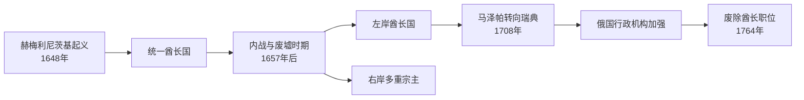

# 哥萨克酋长世系表

[返回哥萨克酋长国](/%E4%BA%BA%E6%96%87%E7%A7%91%E5%AD%A6/%E5%8E%86%E5%8F%B2/%E6%AC%A7%E6%B4%B2/%E6%96%AF%E6%8B%89%E5%A4%AB/%E4%B8%9C%E6%96%AF%E6%8B%89%E5%A4%AB/%E5%93%A5%E8%90%A8%E5%85%8B%E9%85%8B%E9%95%BF%E5%9B%BD.md)

## 表格范围

“哥萨克酋长国”不是固定领土、单线世袭王朝。酋长原则上由哥萨克拉达选举，但选举常受军官集团、波兰—立陶宛联邦、莫斯科国家、奥斯曼帝国和克里米亚汗国影响。1657年后内战造成左岸、右岸及全乌克兰主张者并立；因此本页按阶段与岸别分表，复位、代理、流亡和行政委员会均明确标注。

## 统一酋长国与分裂开端

| 顺序 | 酋长 | 任期 | 产生方式与关系 | 关键事件 / 备注 |
| --- | --- | --- | --- | --- |
| 1 | **博格丹・赫梅利尼茨基** | 1648—1657年 | 扎波罗热军选举；起义领袖 | 1648年击败联邦军并建立政权；1654年佩列亚斯拉夫会议接受沙皇保护关系，协议的主权含义后来各方解释不同。 |
| 2 | 尤里・赫梅利尼茨基 | 1657年短暂当选，未实际亲政 | 博格丹之子，未成年 | 军官集团转而选举维霍夫斯基；其后又两次成为不同阵营的酋长。 |
| 3 | 伊凡・维霍夫斯基 | 1657—1659年 | 总书记继任，经拉达确认 | 1658年哈佳奇条约拟在联邦内建立“罗斯大公国”；与莫斯科战争中科诺托普获胜，但内部分裂迫其辞职。 |
| 4 | 尤里・赫梅利尼茨基 | 1659—1663年 | 复选，博格丹之子 | 先受莫斯科制约，后在楚德诺夫战役后转向联邦；1663年退位入修道院，酋长国事实上分裂。 |

## 左岸酋长主线

| 顺序 | 酋长 / 机构 | 任期 | 地位 | 关键事件 / 备注 |
| --- | --- | --- | --- | --- |
| 1 | 伊凡・布留霍韦茨基 | 1663—1668年 | “黑拉达”选出的左岸酋长 | 与莫斯科签订更严格条款；后转而反俄，在起事中被多罗申科阵营杀死。 |
| 2 | 德米扬・姆诺霍赫里什尼 | 1669—1672年 | 左岸酋长 | 格卢霍夫条款部分恢复自治；被军官集团逮捕并交俄国流放。 |
| 3 | **伊凡・萨莫伊洛维奇** | 1672—1687年 | 左岸酋长；1674年起自称两岸酋长 | 参与俄土战争和右岸人口迁移；克里米亚远征失败后被罢黜流放。 |
| 4 | **伊凡・马泽帕** | 1687—1708年 | 左岸酋长 | 文化赞助与军官地产扩张并存；大北方战争中转向瑞典查理十二世，波尔塔瓦败局前被俄方废黜。 |
| 5 | 伊凡・斯科罗帕德斯基 | 1708—1722年 | 在沙皇控制地区选出 | 驻军和俄国官员权力扩大；彼得一世1722年设第一小俄罗斯委员会。 |
| 6 | 帕夫洛・波卢博托克 | 1722—1724年 | 代理酋长 | 未获正式全权；反对委员会侵蚀自治，被囚于圣彼得堡并死于狱中。 |
| 7 | 第一小俄罗斯委员会 | 1722—1727年 | 俄国设立的合议行政机关 | 由谢苗・韦利亚米诺夫等俄国官员主持，与总军事文书处并行；不是一位酋长。 |
| 8 | **丹尼洛・阿波斯托尔** | 1727—1734年 | 经俄国许可恢复选举 | 依据“决定条款”恢复有限行政与司法；财政、外交和军事仍受帝国监督。 |
| 9 | 酋长政府管理委员会 | 1734—1750年 | 俄国与哥萨克官员各三人的合议机构 | 由帝国代表掌握决定性权力；酋长职位空缺而非某人长期代理。 |
| 10 | **基里尔・拉祖莫夫斯基** | 1750—1764年 | 经女皇伊丽莎白允许当选 | 推进司法和军制整顿，试图使职位世袭；叶卡捷琳娜二世迫其辞职并废除酋长职位。 |
| 11 | 第二小俄罗斯委员会 | 1764—1786年 | 以彼得・鲁缅采夫为首的帝国机关 | 清理自治机构、推行省制和税役统一；1781年团区制撤销，1783年农奴制度与正规军改编加深。 |

## 右岸与“两岸”主张者

| 顺序 | 酋长 | 任期 | 宗主与控制范围 | 关键事件 / 备注 |
| --- | --- | --- | --- | --- |
| 1 | 帕夫洛・泰捷里亚 | 1663—1665年 | 联邦支持的右岸酋长 | 联波进攻左岸失败，因反抗和派系斗争退往波兰。 |
| 2 | **彼得罗・多罗申科** | 1665—1676年 | 右岸酋长；1668年短暂声称统一两岸；后接受奥斯曼保护 | 试图摆脱俄波分割；长期战争和人口流失削弱基础，1676年向俄方投降。 |
| 3 | 米哈伊尔・哈年科 | 1669—1674年 | 联邦承认的右岸竞争酋长 | 与多罗申科并立，最终向萨莫伊洛维奇交出权标。 |
| 4 | 奥斯塔普・霍霍尔 | 1675—1679年约 | 联邦支持，控制范围有限 | 右岸战争中的地方酋长，确切起止年有异文。 |
| 5 | 尤里・赫梅利尼茨基 | 1677—1681年、1685年短暂再用 | 奥斯曼任命的“乌克兰 / 鲁塞尼亚亲王” | 借父名号建立奥斯曼属地，实际控制不稳；死亡年份和方式有史料异文。 |
| 6 | 格奥尔基・杜卡 | 1681—1683年 | 奥斯曼任命，兼摩尔达维亚统治者 | 名义治理右岸，依赖奥斯曼军政体系。 |
| 7 | 斯特凡・库尼茨基 | 1683—1684年 | 联邦支持的右岸酋长 | 参加对奥斯曼战争，兵败后被部下杀死。 |
| 8 | 安德烈・莫希拉 | 1684—1689年 | 联邦支持 | 维持少数哥萨克团，控制范围和死亡年份不详。 |
| 9 | 赫雷霍里・赫雷什科、萨穆伊洛・萨穆斯等地方酋长 | 1689—1704年间 | 联邦体系内的右岸团区 | 职位承续与名号有异文；萨穆斯在1702年起义，1704年把权标交给马泽帕，右岸独立酋长线终止。 |

## 流亡与反俄主张

| 统治者 | 任期 / 主张期 | 性质 |
| --- | --- | --- |
| **佩利普・奥尔雷克** | 1710—1742年 | 马泽帕阵营流亡者在本德尔选出的酋长；与瑞典、奥斯曼结盟，1710年宪制文件限制酋长权力；未稳定统治酋长国本土。 |
| 佩特罗・多罗申科之外的短期“全乌克兰酋长”称号 | 17世纪后半叶 | 常为政治主张而非同时有效控制两岸；表中按实际岸别列入，避免把自称当作统一事实。 |

## 灭亡过程

- 1667年《安德鲁索沃停战》由俄国与联邦划分第聂伯河两岸，却未由哥萨克政权作为平等缔约方参与，分裂由此制度化。
- 大北方战争后，俄罗斯驻军、财政监督和小俄罗斯委员会逐步把自治变成受控地方行政。
- 1764年不是所有制度瞬间消失：先废酋长职位，随后团区、财政、司法和军事制度在1760—1780年代分阶段并入帝国。
- 1775年俄军摧毁扎波罗热塞契，1781年撤团区、1783年把哥萨克部队改编并强化农奴制，才构成直接终结链条。

## 相关笔记

- 政权过程、制度与兴衰见[哥萨克酋长国](/%E4%BA%BA%E6%96%87%E7%A7%91%E5%AD%A6/%E5%8E%86%E5%8F%B2/%E6%AC%A7%E6%B4%B2/%E6%96%AF%E6%8B%89%E5%A4%AB/%E4%B8%9C%E6%96%AF%E6%8B%89%E5%A4%AB/%E5%93%A5%E8%90%A8%E5%85%8B%E9%85%8B%E9%95%BF%E5%9B%BD.md)。
- 前置西南罗斯见[加利西亚-沃里尼亚王国](/%E4%BA%BA%E6%96%87%E7%A7%91%E5%AD%A6/%E5%8E%86%E5%8F%B2/%E6%AC%A7%E6%B4%B2/%E6%96%AF%E6%8B%89%E5%A4%AB/%E4%B8%9C%E6%96%AF%E6%8B%89%E5%A4%AB/%E5%8A%A0%E5%88%A9%E8%A5%BF%E4%BA%9A-%E6%B2%83%E9%87%8C%E5%B0%BC%E4%BA%9A%E7%8E%8B%E5%9B%BD.md)。
- 俄国宗主权扩大见[沙皇俄国](/%E4%BA%BA%E6%96%87%E7%A7%91%E5%AD%A6/%E5%8E%86%E5%8F%B2/%E6%AC%A7%E6%B4%B2/%E6%96%AF%E6%8B%89%E5%A4%AB/%E4%B8%9C%E6%96%AF%E6%8B%89%E5%A4%AB/%E6%B2%99%E7%9A%87%E4%BF%84%E5%9B%BD.md)与[俄罗斯帝国](/%E4%BA%BA%E6%96%87%E7%A7%91%E5%AD%A6/%E5%8E%86%E5%8F%B2/%E6%AC%A7%E6%B4%B2/%E6%96%AF%E6%8B%89%E5%A4%AB/%E4%B8%9C%E6%96%AF%E6%8B%89%E5%A4%AB/%E4%BF%84%E7%BD%97%E6%96%AF%E5%B8%9D%E5%9B%BD.md)。
