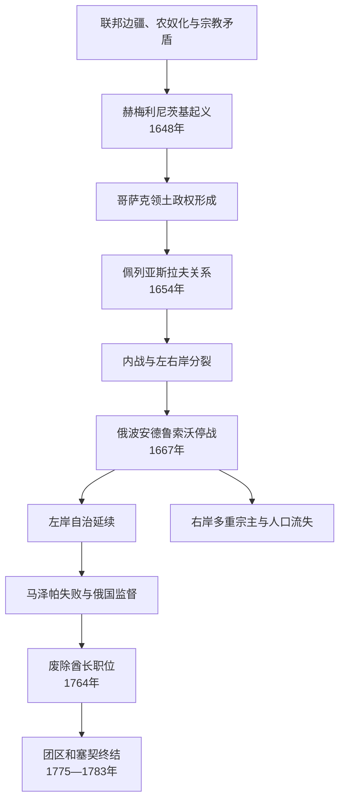

# 哥萨克酋长国

## 时间

1648—1764年为酋长职位主线；1663年后长期分为左岸与右岸，1764年废酋长后自治机构至1780年代才分阶段终结。

## 概括

哥萨克酋长国由博格丹・赫梅利尼茨基领导的1648年起义发展而来，其正式自称“扎波罗热军”。它以选举酋长、总军事文书处、团—连队区划、军官会议和哥萨克拉达治理，既是军政共同体，也是拥有农民、城市、教会和贵族的领土国家。1654年接受沙皇保护关系后，俄国与波兰—立陶宛战争把乌克兰问题国际化；1667年两国划分第聂伯河两岸，酋长国陷入“废墟时期”。左岸在俄国宗主权下延续，彼得一世和叶卡捷琳娜二世逐步削减自治，1764年废酋长、1775年毁塞契、1781—1783年撤团区和改军役，构成灭亡过程。

## 建立背景

- 波兰—立陶宛联邦把鲁塞尼亚土地纳入贵族庄园、王室边疆和城市网络。注册哥萨克享有军役身份，未注册者、农民和城镇居民则面对庄园扩张、劳役与税负。
- 1596年布列斯特教会合并造成东仪天主教与东正教制度竞争，但起义不能简化为“被迫全民改宗”；阶级、军籍、土地、地方自治和宗教保护共同作用。
- 扎波罗热塞契是草原军事中心，注册哥萨克团分布在定居区。多次早期起义被镇压，联邦限制注册名额，矛盾未解。
- 赫梅利尼茨基同地方贵族的冲突成为直接引线。他联合克里米亚汗国，1648年在若夫季沃德、科尔孙、皮利亚夫齐连续获胜，起义扩展为社会战争。

## 建国与战争：1648—1657年

起义军建立团—连队行政，把原联邦省份转为哥萨克管辖。1649年兹博里夫协议扩大注册和自治，却保留联邦宗主；1651年别列斯捷奇科败后权利收缩。1652年巴托赫战役恢复军事声势，但克里米亚盟军有自身利益，多次在关键时刻求和或掠俘。

赫梅利尼茨基寻求奥斯曼、摩尔达维亚、特兰西瓦尼亚、瑞典和莫斯科支持。1654年佩列亚斯拉夫会议向沙皇宣誓，随后“3月条款”等文件约定军队、财政和行政。乌克兰传统常强调条约与自治，俄国帝国叙事常解释为“永久统一”；当时更接近双方对保护、臣属和共同战争含义不同的政治契约。

## 废墟时期与分裂：1657—1687年

### 继承危机

博格丹未能建立稳定继承。维霍夫斯基代表军官贵族路线，1658年哈佳奇条约拟使“罗斯大公国”成为联邦第三构成体，但宗教、土地和战争阻碍执行。1659年科诺托普虽击败俄军，他仍因内部分裂辞职。尤里・赫梅利尼茨基在莫斯科、联邦和奥斯曼间摇摆，1663年退位。

### 左右岸并立

1663年左岸“黑拉达”选布留霍韦茨基，右岸由泰捷里亚、多罗申科等统治。俄国与联邦1667年《安德鲁索沃停战》未经哥萨克政权同意划分：左岸归俄，右岸归联邦，基辅原定暂归俄后长期保留。多罗申科接受奥斯曼保护试图统一，俄、波、奥、克里米亚军队反复作战，右岸城市毁坏、人口被强制或自发迁往左岸和斯洛博达乌克兰，“废墟”由此得名。

### 宗主权与自治

左岸酋长每次选举常签新条款，俄国驻军、财政和外交限制逐步增加；但团区法院、土地、军队和教会仍有真实自治。1686年“永久和平”确认俄国取得基辅和左岸；基辅都主教区转入莫斯科牧首管辖，其教会法性质后来仍有争议。

## 马泽帕与大北方战争

伊凡・马泽帕1687—1708年长期执政，依军官地主和教会建设稳定左岸，也使社会分层加深。彼得一世在大北方战争征用哥萨克军、粮秣和劳役；瑞典军进入乌克兰后，马泽帕与查理十二世结盟，意图保住或扩大自治。多数团未及时或不愿加入，俄军1708年摧毁巴图林；1709年波尔塔瓦战役瑞典—马泽帕联盟失败。马泽帕流亡奥斯曼领地，佩利普・奥尔雷克1710年制定限制酋长权力的宪制文件，但未稳定统治本土。

## 自治被撤：1708—1783年

- 斯科罗帕德斯基在俄国控制区当选，彼得派驻监理官；1722年第一小俄罗斯委员会监督财政和司法。
- 波卢博托克代理并抗议限制，被囚死。1727年因对奥斯曼战争需要，帝国允许选丹尼洛・阿波斯托尔，自治有限恢复。
- 1734—1750年合议管理取代酋长；伊丽莎白女皇时期因拉祖莫夫斯基家族关系恢复基里尔・拉祖莫夫斯基。
- 1764年叶卡捷琳娜二世拒绝世袭化请求，迫拉祖莫夫斯基辞职，设第二小俄罗斯委员会。
- 1775年俄军摧毁扎波罗热塞契；1781年团区行政改省，1783年哥萨克部队改为帝国正规团并在左岸强化农奴制度。自治不是在1764年一刻全部消失，而是二十年内分项取消。

## 统治结构

| 层次 | 职能与变化 |
| --- | --- |
| 酋长 | 统军、外交、任命和颁地；原则上经拉达选举，实际受军官与宗主国确认。 |
| 总军官团 | 总书记、军法官、军需官等构成中央行政与法院。 |
| 团—连队 | 同时是军队编制和领土行政，团长兼军事、财政与司法权。 |
| 哥萨克拉达 | 理论上全体哥萨克参与，后期高级军官会议更常决定人选。 |
| 军官贵族 | 从选举官职逐步形成世袭地主，与普通哥萨克和农民利益分化。 |
| 城市与农民 | 城市有马格德堡法和行会传统；农民在战争后曾减轻庄园束缚，18世纪重新农奴化。 |
| 东正教会 | 是教育、印刷与合法性中心；与基辅都主教、莫斯科牧首和地方修道院关系复杂。 |

## 重要事件

| 时间 | 事件 | 转折 |
| --- | --- | --- |
| 1648年 | 起义连续胜利 | 领土政权形成。 |
| 1649年 | 兹博里夫协议 | 联邦首次承认广泛哥萨克自治。 |
| 1654年 | 佩列亚斯拉夫会议 | 接受沙皇保护，主权解释分歧开始。 |
| 1658年 | 哈佳奇条约 | 联邦三元构想未能落实。 |
| 1659年 | 科诺托普战役 | 维霍夫斯基军事胜利但政治失败。 |
| 1663年 | 两岸分别选酋长 | 分裂制度化。 |
| 1667年 | 安德鲁索沃停战 | 俄波在酋长国之外划分两岸。 |
| 1686年 | 俄波永久和平 | 左岸和基辅归俄格局确认。 |
| 1708—1709年 | 马泽帕转向瑞典、波尔塔瓦战役 | 俄国加强直接监督。 |
| 1722年 | 第一小俄罗斯委员会 | 中央自治首次被合议机构替代。 |
| 1764年 | 废除酋长职位 | 王朝式最高职务终结。 |
| 1775—1783年 | 毁塞契、撤团区、改军役 | 政权制度直接终结。 |

## 崛起与灭亡原因

### 崛起机制

哥萨克军事组织提供现成干部和区域网络；联邦对注册、土地和宗教矛盾处理失败；克里米亚骑兵使早期起义突破联邦正规军；农民、城市、低阶神职和部分鲁塞尼亚贵族形成广泛联盟。

### 衰落因素

选举制和军官派系使继承不稳；外部大国能扶植竞争酋长；战争造成人口和经济破坏；高级军官日益地主化，削弱社会联盟；两岸地理和宗主分割难以逆转。

### 直接灭亡

帝国在波尔塔瓦后有军力压制自治，18世纪官僚和省制又能替代团区。1764年废酋长是政治顶点，1775、1781、1783年措施才完成军事、行政和社会整合。因此“完全吞并于1764年”过于简化。

## 酋长世系

两岸并立、复位、流亡和无酋长管理机构的完整表见[哥萨克酋长世系表](/%E4%BA%BA%E6%96%87%E7%A7%91%E5%AD%A6/%E5%8E%86%E5%8F%B2/%E6%AC%A7%E6%B4%B2/%E6%96%AF%E6%8B%89%E5%A4%AB/%E4%B8%9C%E6%96%AF%E6%8B%89%E5%A4%AB/%E5%93%A5%E8%90%A8%E5%85%8B%E9%85%8B%E9%95%BF%E4%B8%96%E7%B3%BB%E8%A1%A8.md)。

## 演变关系

- 前一节点：[加利西亚-沃里尼亚王国](/%E4%BA%BA%E6%96%87%E7%A7%91%E5%AD%A6/%E5%8E%86%E5%8F%B2/%E6%AC%A7%E6%B4%B2/%E6%96%AF%E6%8B%89%E5%A4%AB/%E4%B8%9C%E6%96%AF%E6%8B%89%E5%A4%AB/%E5%8A%A0%E5%88%A9%E8%A5%BF%E4%BA%9A-%E6%B2%83%E9%87%8C%E5%B0%BC%E4%BA%9A%E7%8E%8B%E5%9B%BD.md)和[波兰-立陶宛联邦](/%E4%BA%BA%E6%96%87%E7%A7%91%E5%AD%A6/%E5%8E%86%E5%8F%B2/%E6%AC%A7%E6%B4%B2/%E6%96%AF%E6%8B%89%E5%A4%AB/%E8%A5%BF%E6%96%AF%E6%8B%89%E5%A4%AB/%E6%B3%A2%E5%85%B0-%E7%AB%8B%E9%99%B6%E5%AE%9B%E8%81%94%E9%82%A6.md)体系。
- 宗主与后续：[沙皇俄国](/%E4%BA%BA%E6%96%87%E7%A7%91%E5%AD%A6/%E5%8E%86%E5%8F%B2/%E6%AC%A7%E6%B4%B2/%E6%96%AF%E6%8B%89%E5%A4%AB/%E4%B8%9C%E6%96%AF%E6%8B%89%E5%A4%AB/%E6%B2%99%E7%9A%87%E4%BF%84%E5%9B%BD.md)、[俄罗斯帝国](/%E4%BA%BA%E6%96%87%E7%A7%91%E5%AD%A6/%E5%8E%86%E5%8F%B2/%E6%AC%A7%E6%B4%B2/%E6%96%AF%E6%8B%89%E5%A4%AB/%E4%B8%9C%E6%96%AF%E6%8B%89%E5%A4%AB/%E4%BF%84%E7%BD%97%E6%96%AF%E5%B8%9D%E5%9B%BD.md)。
- 现代国家记忆：[乌克兰](/%E4%BA%BA%E6%96%87%E7%A7%91%E5%AD%A6/%E5%8E%86%E5%8F%B2/%E6%AC%A7%E6%B4%B2/%E6%96%AF%E6%8B%89%E5%A4%AB/%E4%B8%9C%E6%96%AF%E6%8B%89%E5%A4%AB/%E4%B9%8C%E5%85%8B%E5%85%B0.md)。
