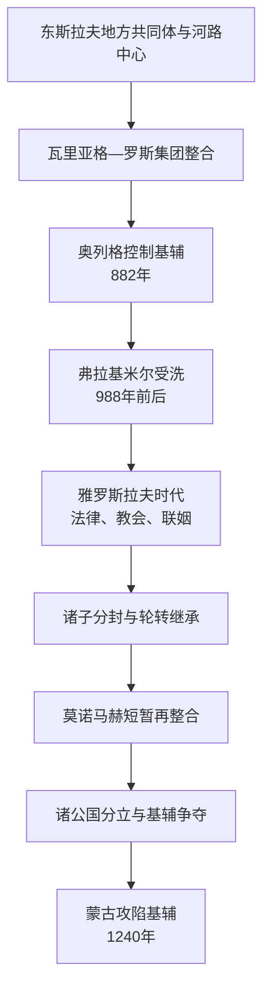

# 基辅罗斯

## 时间

约9世纪后期—1240年；以882年奥列格控制基辅为传统起点，以1240年蒙古军攻陷基辅为政权体系终点。

## 概括

基辅罗斯是由东斯拉夫、芬兰—乌戈尔等地方共同体与瓦里亚格河路军事商业集团共同形成的多中心政权。它不是现代俄罗斯、乌克兰或白俄罗斯任何一国的简单“民族国家前身”，而是三者共享又各自继承、解释的中世纪历史遗产。政权依靠第聂伯河—波罗的海—黑海贸易、贡赋征收、王族分封、城市军队和基督教教会维系；11世纪达到整合高峰，12世纪因继承竞争、贸易重心变化和地区中心成长而分散，蒙古征服则摧毁了旧有权力平衡。

## 建立背景

- 8—9世纪的东欧森林—草原交界并无统一“东斯拉夫国家”。波利安、德列夫利安、塞韦里安、克里维奇等名称来自后期编年史，对应的可能是贡赋区、政治联盟或地域群体，而非固定民族边界。
- 第聂伯河、洛瓦季河、沃尔霍夫河等水路把波罗的海、伏尔加、黑海和里海网络连接起来。毛皮、蜂蜡、奴隶、银币和奢侈品贸易使拉多加、诺夫哥罗德、斯摩棱斯克、切尔尼戈夫和基辅等节点具有战略价值。
- “862年留里克受邀”与“882年奥列格夺取基辅”主要来自12世纪编成的《往年纪事》。这些叙事保存王朝记忆，却不能当作无争议的逐日国史；考古与外部文字资料显示国家形成是几十年至更长时间的互动过程。
- “罗斯”最初可能与瓦里亚格统治—商贸集团关系密切，随后扩展为政权、土地和基督教共同体名称；统治集团很快斯拉夫化，不能把王朝起源简化为单一族群征服。

## 崛起机制

1. **控制河路与贡赋**：奥列格及继承者把北方基地、基辅和通往拜占庭的路线连成政治网络，以军事随从保护贸易并向地方共同体征收贡赋。
2. **王族分封**：基辅大公把诸子和亲属安置于主要城市，形成同一王朝覆盖的多中心结构。它能迅速整合广域，也把继承冲突写入制度。
3. **对外战争与条约**：奥列格、伊戈尔和斯维亚托斯拉夫对拜占庭、可萨、佩切涅格和保加利亚作战；贸易条约确认罗斯商人的待遇，战利品反哺随从集团。
4. **宗教与文字制度**：弗拉基米尔一世在988年前后接受拜占庭基督教，建立教区、什一税教堂和王朝婚姻。受洗不是全境瞬间改宗，而是长期将城市礼仪、书写文化和王权合法性纳入东正教世界。
5. **法律与城市合作**：《罗斯法典》从雅罗斯拉夫及其后继者时期逐步形成，调整赔偿、债务、财产与身份关系。大公仍须同军队、波雅尔、教会和城市大会协商，不能按后世绝对君主制理解。

## 分阶段发展

### 形成期：约9世纪—980年

- 奥列格控制基辅后向周边共同体征贡，并与拜占庭缔结条约。
- 伊戈尔945年因重复征贡被德列夫利安人杀死，说明早期王权仍受地方承受能力制约。
- 奥丽加摄政时设置征收地点和额度，反映从巡回掠取向较规则贡赋行政转变。
- 斯维亚托斯拉夫一世摧毁可萨汗国核心、进入多瑙河，却因战线过长和草原威胁无法建立稳定巴尔干帝国；其死后诸子内战由弗拉基米尔胜出。

### 基督教化与鼎盛：980—1054年

- 弗拉基米尔以婚姻、分封和军事征服重新整合各中心。受洗后拆除部分异教祭祀，建立教堂与学校，但地方信仰长期共存。
- 1015年后的继承战争包括鲍里斯、格列布被杀，斯维亚托波尔克与雅罗斯拉夫借波兰、诺夫哥罗德和瓦里亚格力量争位，显示外援和区域资源的重要性。
- 雅罗斯拉夫一世统治时期兴建圣索菲亚大教堂、发展法典和翻译文化，并通过子女婚姻联系法国、挪威、匈牙利、波兰和拜占庭宫廷。
- 鼎盛依赖基辅河路、王朝威望、相对稳定的分封和对草原的军事防御，而非一个拥有统一官僚、常备军和固定疆界的中央集权国家。

### 诸公共治与危机：1054—1113年

- 雅罗斯拉夫把主要城市分给诸子，并要求按年长次序轮转。随着每一代支系增加，“谁有资格轮转到哪一座城”变得难以解决。
- 1068年阿尔塔河败于波洛韦茨人后，基辅民众要求武器未果，起义释放弗谢斯拉夫并拥立，说明城市政治可改变大公。
- 1097年柳别奇会议试图以“各守祖业”减少跨支系争夺，却也承认地方公国的世袭化。
- 对波洛韦茨战争既有冲突也有婚姻和联盟。把草原势力只写成外敌，会忽略诸公常借其军队参与内战。

### 莫诺马赫再整合与分裂：1113—1169年

- 1113年斯维亚托波尔克二世死后，基辅因债务和社会矛盾骚乱，弗拉基米尔・莫诺马赫受邀即位并调整高利贷规则。
- 莫诺马赫与姆斯季斯拉夫一世依个人威望、家族网络和军事胜利暂时恢复协调；1132年姆斯季斯拉夫死后，制度并无足以替代强人的中央机制。
- 诺夫哥罗德、弗拉基米尔—苏兹达尔、斯摩棱斯克、切尔尼戈夫和加利西亚等地区的农业、贸易与王朝支系成长，开始按本地利益行动。
- 1169年安德烈・博戈柳布斯基组织联军攻陷并洗劫基辅，却没有迁往基辅亲政，而是留下代理人。这一事件象征基辅仍有名号价值，实际政治中心已经多元化。

### 末期争位与蒙古征服：1169—1240年

- 基辅大公位在斯摩棱斯克、切尔尼戈夫、沃里尼亚与东北罗斯支系间反复转移；留里克二世等人多次复位，城市和周边领地常由不同力量控制。
- 1203年留里克二世及波洛韦茨盟军再次洗劫基辅，内部战争持续消耗人口与财富。
- 1223年卡尔卡河战役中罗斯诸公与波洛韦茨联军因指挥分散败于蒙古先遣军；蒙古随后撤走，诸公未建立持久联合防御。
- 1237—1240年拔都系统征服东北与南部罗斯。丹尼尔任命德米特罗守卫基辅；1240年12月城破，大量居民死亡或被俘，旧基辅大公体系失去物质和政治基础。

## 统治结构

| 层次 | 机构 / 群体 | 作用与限制 |
| --- | --- | --- |
| 大公与王族 | 留里克诸支 | 组织战争、外交和分封；权力依赖实际军力、城市支持与家族资历。 |
| 德鲁日纳 | 王公军事随从 | 提供骑兵、征贡和行政骨干；高级成员逐渐形成波雅尔地主。 |
| 城市大会 | 维彻 | 在基辅、诺夫哥罗德等城可决定动员、驱逐或邀请王公，强弱因地因时不同。 |
| 教会 | 都主教、主教、修道院 | 提供书写、司法、慈善和王权礼仪；都主教通常与君士坦丁堡联系。 |
| 地方共同体 | 城镇、村社和纳贡群体 | 承担贡赋和兵役，也可反抗过度征收；地域身份长期存在。 |
| 草原与邻国 | 佩切涅格、波洛韦茨、拜占庭、波兰、匈牙利等 | 既是敌手，也是贸易、婚姻和内战盟友。 |

## 重要事件

| 时间 | 事件 | 转折意义 |
| --- | --- | --- |
| 882年（传统纪年） | 奥列格控制基辅 | 北方—第聂伯河路政治网络形成。 |
| 945年 | 伊戈尔被杀、奥丽加改革贡赋 | 暴露巡回征贡风险，推动行政规则化。 |
| 988年前后 | 弗拉基米尔受洗 | 罗斯进入拜占庭基督教与文字文化体系。 |
| 1019—1054年 | 雅罗斯拉夫长期统治 | 法律、教会、建筑和王朝外交达到高峰。 |
| 1068年 | 基辅起义 | 城市民众直接改变大公位。 |
| 1097年 | 柳别奇会议 | “祖业”原则缓和一时冲突，也确认地方世袭化。 |
| 1113年 | 莫诺马赫即位 | 社会危机后短暂重建中央协调。 |
| 1169年 | 基辅被安德烈联军洗劫 | 权力中心多元化的象征。 |
| 1223年 | 卡尔卡河战役 | 蒙古军事能力首次集中显现，罗斯联合失败。 |
| 1240年 | 蒙古攻陷基辅 | 旧政权物质中心与大公位体系终结。 |

## 鼎盛条件与衰落原因

### 鼎盛条件

- 控制波罗的海—黑海贸易和贡赋节点；
- 王朝分封覆盖各主要城市且强势大公能调停支系；
- 拜占庭宗教、法律与外交资源强化合法性；
- 城市、教会、随从和地方共同体之间尚能维持交换；
- 对佩切涅格、波洛韦茨等草原力量取得阶段性优势。

### 结构性衰落

- 轮转继承与祖业世袭原则冲突，支系倍增导致争位常态化；
- 地方公国经济和军事基础成长，不再需要基辅持续分配资源；
- 地中海、黑海与北方贸易网络变化，使基辅河路的相对优势下降；
- 草原边境压力、内战借兵和反复洗劫造成南部人口外流；
- 教会与文化共同性仍存在，却不足以形成统一税制和常备军。

### 外部压力与直接灭亡

蒙古征服不是分裂的“必然惩罚”，也不是唯一衰落原因。蒙古军拥有高度机动、统一指挥、攻城技术和跨区域情报；罗斯诸公分立使联合困难。1237—1240年连续战役逐城击破，1240年基辅陷落是直接军事终点。其后东北诸公接受金帐宗主权，西南罗斯在丹尼尔家族下延续，诺夫哥罗德保持自身制度，东斯拉夫历史由此分流。

## 大公世系

公认的大公、摄政、复位者、共治者与争议名义持有者已逐一列于[基辅罗斯大公世系表](/%E4%BA%BA%E6%96%87%E7%A7%91%E5%AD%A6/%E5%8E%86%E5%8F%B2/%E6%AC%A7%E6%B4%B2/%E6%96%AF%E6%8B%89%E5%A4%AB/%E4%B8%9C%E6%96%AF%E6%8B%89%E5%A4%AB/%E5%9F%BA%E8%BE%85%E7%BD%97%E6%96%AF%E5%A4%A7%E5%85%AC%E4%B8%96%E7%B3%BB%E8%A1%A8.md)。本页不再使用“后期诸公”等合并项。

## 演变关系

- 前一节点：[东斯拉夫准国家组织](/%E4%BA%BA%E6%96%87%E7%A7%91%E5%AD%A6/%E5%8E%86%E5%8F%B2/%E6%AC%A7%E6%B4%B2/%E6%96%AF%E6%8B%89%E5%A4%AB/%E4%B8%9C%E6%96%AF%E6%8B%89%E5%A4%AB/%E4%B8%9C%E6%96%AF%E6%8B%89%E5%A4%AB%E5%87%86%E5%9B%BD%E5%AE%B6%E7%BB%84%E7%BB%87.md)。
- 征服与分流：[蒙古征服与罗斯分流](/%E4%BA%BA%E6%96%87%E7%A7%91%E5%AD%A6/%E5%8E%86%E5%8F%B2/%E6%AC%A7%E6%B4%B2/%E6%96%AF%E6%8B%89%E5%A4%AB/%E4%B8%9C%E6%96%AF%E6%8B%89%E5%A4%AB/%E8%92%99%E5%8F%A4%E5%BE%81%E6%9C%8D%E4%B8%8E%E7%BD%97%E6%96%AF%E5%88%86%E6%B5%81.md)。
- 主要后续：[弗拉基米尔-苏兹达尔大公国](/%E4%BA%BA%E6%96%87%E7%A7%91%E5%AD%A6/%E5%8E%86%E5%8F%B2/%E6%AC%A7%E6%B4%B2/%E6%96%AF%E6%8B%89%E5%A4%AB/%E4%B8%9C%E6%96%AF%E6%8B%89%E5%A4%AB/%E5%BC%97%E6%8B%89%E5%9F%BA%E7%B1%B3%E5%B0%94-%E8%8B%8F%E5%85%B9%E8%BE%BE%E5%B0%94%E5%A4%A7%E5%85%AC%E5%9B%BD.md)、[加利西亚-沃里尼亚王国](/%E4%BA%BA%E6%96%87%E7%A7%91%E5%AD%A6/%E5%8E%86%E5%8F%B2/%E6%AC%A7%E6%B4%B2/%E6%96%AF%E6%8B%89%E5%A4%AB/%E4%B8%9C%E6%96%AF%E6%8B%89%E5%A4%AB/%E5%8A%A0%E5%88%A9%E8%A5%BF%E4%BA%9A-%E6%B2%83%E9%87%8C%E5%B0%BC%E4%BA%9A%E7%8E%8B%E5%9B%BD.md)。
