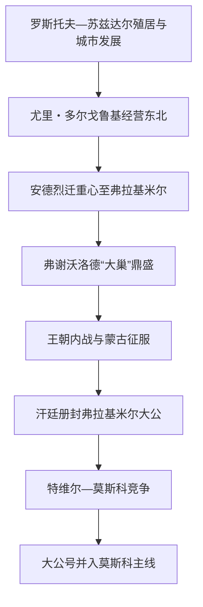

# 弗拉基米尔-苏兹达尔大公国

## 时间

约1125—1389年；1157年后弗拉基米尔成为核心，1238年后进入金帐宗主权时代，1389年后大公号与莫斯科王朝稳定合一。

## 概括

弗拉基米尔—苏兹达尔是基辅罗斯东北部在森林地带形成的多中心公国体系，并非蒙古征服后突然出现。尤里・多尔戈鲁基、安德烈・博戈柳布斯基和弗谢沃洛德“大巢”推动罗斯托夫—苏兹达尔向弗拉基米尔转移。蒙古征服后，汗廷以诏书、贡赋和惩罚性远征控制大公号；特维尔、莫斯科、苏兹达尔等支系在宗主体系内竞争，最终莫斯科把弗拉基米尔大公号世袭化。

## 建立背景与崛起

- 奥卡河—伏尔加河上游拥有森林、河运、农业和毛皮资源，斯拉夫移民与梅里亚等芬兰—乌戈尔居民长期融合。罗斯托夫、苏兹达尔、弗拉基米尔并非一条线替代，而是各有贵族、教会与商业基础。
- 基辅王族把东北作为封地经营。尤里・多尔戈鲁基建立或扩充城堡，参与南方争位；莫斯科1147年首次见于编年史，不等于当年“建城”。
- 安德烈・博戈柳布斯基1157年以弗拉基米尔为政治中心，扶植圣母崇拜和宫廷礼仪，试图越过罗斯托夫、苏兹达尔旧波雅尔。1174年他被近臣刺杀，显示集中化仍受精英联盟限制。
- 弗谢沃洛德“大巢”依众多家族联系、军事与城市发展扩大权威，但给多个儿子分封，死后继承战争削弱统一。

## 分阶段过程

### 1157—1212年：弗拉基米尔中心形成

安德烈1169年攻陷基辅却不在那里居住，使弗拉基米尔成为可与基辅并列的礼仪中心。弗谢沃洛德在梁赞、诺夫哥罗德和伏尔加保加尔事务中扩大影响，圣母升天大教堂等建筑表达王权。但所谓“专制萌芽”不应夸大：波雅尔、城市、王族支系和教会仍是必要合作者。

### 1212—1238年：继承战争与蒙古入侵

弗谢沃洛德死后，康斯坦丁与尤里二世围绕长幼和父命争位。1216年利皮察战役是罗斯王族内战的高峰之一。尤里复位后尚未完成整合，1237—1238年蒙古军先后摧毁梁赞、莫斯科、弗拉基米尔等城；尤里在锡季河战死，东北军事网络崩溃。

### 1238—1304年：在金帐宗主权下重建

雅罗斯拉夫二世、亚历山大・涅夫斯基等赴汗廷接受大公号。大公负责协调贡赋和服从，汗廷则利用兄弟、支系之间的竞争。人口与城市逐渐恢复，教会获得相对保护；同时人口普查、贡赋、征发和惩罚远征构成真实负担。亚历山大对西方军事抵抗与对金帐妥协并行，是有限条件下的政治选择。

### 1304—1389年：特维尔、莫斯科与苏兹达尔竞争

特维尔最初继承大公号并拥有更强资源。莫斯科通过婚姻、购买土地、教会驻节、代征贡赋和协助汗廷镇压1327年特维尔起事反超。大公号并非自然“民族统一奖赏”，而是金帐政治、地方财政和王朝战争共同作用。德米特里・顿斯科伊在库里科沃击败马迈，却仍在1382年遭脱脱迷失焚毁莫斯科；其真正制度转折是遗嘱直接把大公号传子，减少汗廷另选空间。

## 统治结构

| 要素 | 机制 |
| --- | --- |
| 大公号 | 1238年后通常须汗廷确认；持有人可向其他公国主张优先权，但实际能力取决于自身领地。 |
| 分封公国 | 特维尔、莫斯科、苏兹达尔、下诺夫哥罗德等由同族支系占有，既合作又竞争。 |
| 贡赋体系 | 人口、土地和城市向金帐纳贡，大公或其代理承担征收和押送，形成财政权力。 |
| 教会 | 都主教逐步移向东北，1320年代常驻莫斯科；教会土地和跨公国网络有调停作用。 |
| 城市与波雅尔 | 供给军队、税收与行政人员；在王位危机中可改换支持。 |

## 重要事件

| 时间 | 事件 | 影响 |
| --- | --- | --- |
| 1157年 | 安德烈以弗拉基米尔为核心 | 东北政治中心成形。 |
| 1169年 | 安德烈联军洗劫基辅 | 基辅与最高实力中心分离。 |
| 1174年 | 安德烈被刺 | 暴露宫廷和波雅尔冲突。 |
| 1216年 | 利皮察战役 | 王朝继承内战达到高峰。 |
| 1237—1238年 | 蒙古征服东北罗斯 | 城市毁灭，大公体系转入汗廷宗主权。 |
| 1252年 | “涅夫留伊军”讨伐 | 安德烈二世失位，亚历山大获大公号。 |
| 1327年 | 特维尔反金帐起事 | 莫斯科借镇压取得长期优势。 |
| 1380年 | 库里科沃战役 | 莫斯科声望上升，但未立即终结贡属。 |
| 1382年 | 脱脱迷失焚毁莫斯科 | 证明金帐军事实力仍在。 |
| 1389年 | 顿斯科伊遗嘱传位 | 弗拉基米尔大公号趋于莫斯科世袭。 |

## 鼎盛、衰落与转化

鼎盛依赖森林区人口增长、伏尔加贸易、王朝军事能力和宗教象征。衰落的结构因素是分封继承和城市贵族竞争；外部压力是蒙古攻城与长期贡赋；直接转化则不是被莫斯科一次“灭国”，而是大公号逐步被莫斯科公兼有，原公国分化为多个领地。1389年后本页作为独立世系终止，东北罗斯政治继续在莫斯科国家中发展。

## 大公世系

完整列出争位、复位、短期共授和汗廷册封者，见[东北罗斯与弗拉基米尔大公世系表](/%E4%BA%BA%E6%96%87%E7%A7%91%E5%AD%A6/%E5%8E%86%E5%8F%B2/%E6%AC%A7%E6%B4%B2/%E6%96%AF%E6%8B%89%E5%A4%AB/%E4%B8%9C%E6%96%AF%E6%8B%89%E5%A4%AB/%E4%B8%9C%E5%8C%97%E7%BD%97%E6%96%AF%E4%B8%8E%E5%BC%97%E6%8B%89%E5%9F%BA%E7%B1%B3%E5%B0%94%E5%A4%A7%E5%85%AC%E4%B8%96%E7%B3%BB%E8%A1%A8.md)。

## 演变关系

- 前一节点：[蒙古征服与罗斯分流](/%E4%BA%BA%E6%96%87%E7%A7%91%E5%AD%A6/%E5%8E%86%E5%8F%B2/%E6%AC%A7%E6%B4%B2/%E6%96%AF%E6%8B%89%E5%A4%AB/%E4%B8%9C%E6%96%AF%E6%8B%89%E5%A4%AB/%E8%92%99%E5%8F%A4%E5%BE%81%E6%9C%8D%E4%B8%8E%E7%BD%97%E6%96%AF%E5%88%86%E6%B5%81.md)。
- 后一节点：[莫斯科公国](/%E4%BA%BA%E6%96%87%E7%A7%91%E5%AD%A6/%E5%8E%86%E5%8F%B2/%E6%AC%A7%E6%B4%B2/%E6%96%AF%E6%8B%89%E5%A4%AB/%E4%B8%9C%E6%96%AF%E6%8B%89%E5%A4%AB/%E8%8E%AB%E6%96%AF%E7%A7%91%E5%85%AC%E5%9B%BD.md)。
- 并列路径：[加利西亚-沃里尼亚王国](/%E4%BA%BA%E6%96%87%E7%A7%91%E5%AD%A6/%E5%8E%86%E5%8F%B2/%E6%AC%A7%E6%B4%B2/%E6%96%AF%E6%8B%89%E5%A4%AB/%E4%B8%9C%E6%96%AF%E6%8B%89%E5%A4%AB/%E5%8A%A0%E5%88%A9%E8%A5%BF%E4%BA%9A-%E6%B2%83%E9%87%8C%E5%B0%BC%E4%BA%9A%E7%8E%8B%E5%9B%BD.md)。
