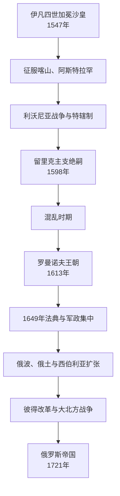

# 沙皇俄国

## 时间

1547—1721年；又称俄罗斯沙皇国、莫斯科沙皇国。1721年彼得一世改称皇帝后进入俄罗斯帝国阶段。

## 概括

沙皇俄国承接莫斯科大公国的领土集中，以“全罗斯沙皇”称号、缙绅会议、波雅尔杜马、中央衙门和服役贵族治理。它征服伏尔加汗国、越过乌拉尔进入西伯利亚，又在波罗的海、黑海与第聂伯河方向同瑞典、波兰—立陶宛、奥斯曼和克里米亚汗国竞争。伊凡四世后期战争与特辖制削弱国家，1598年王朝绝嗣和饥荒引发混乱时期；1613年罗曼诺夫王朝重建秩序。17世纪军政和农奴制日趋集中，彼得一世通过大北方战争与制度改革把国家转为欧洲帝国。

## 建立与合法性

- 伊凡四世1547年采用拜占庭式加冕礼。“沙皇”来自“凯撒”，宣示其高于普通大公，并声称统治全部罗斯土地；这不等于当时已控制基辅、西部罗斯或所有东斯拉夫地区。
- 都主教、波雅尔杜马与缙绅会议为新称号提供宗教和政治认可。沙皇权强大，但仍须依靠贵族军役、教会土地和地方行政。
- 1550年代“重臣会议”推动新法典、军制、地方自治和教会会议。早期改革与征服相互促进。

## 扩张与国家塑造

### 伏尔加与乌拉尔

1552年喀山汗国被攻克，1556年阿斯特拉罕被并吞，伏尔加河主线进入莫斯科控制。征服包含围城、人口迁徙、东正教传教和地方精英合作；鞑靼、楚瓦什、马里、巴什基尔等群体并未消失，而是在税役、自治与反抗间调整。对诺盖和克里米亚汗国的关系仍不稳定，1571年克里米亚军焚毁莫斯科。

### 西伯利亚

16世纪后期斯特罗加诺夫家族和叶尔马克哥萨克队攻击西伯利亚汗国。此后堡垒、毛皮贡赋、河运和哥萨克远征把俄国权力推进至太平洋。扩张不是无人区殖居：汉特、曼西、雅库特、布里亚特、楚科奇等原住民遭征贡、疫病、暴力和协商。跨区域详情应与[北亚历史](/%E4%BA%BA%E6%96%87%E7%A7%91%E5%AD%A6/%E5%8E%86%E5%8F%B2/%E5%8C%97%E4%BA%9A/README.md)对读。

### 波罗的海战争与特辖制

1558—1583年利沃尼亚战争最初获利，随后面对波兰—立陶宛、瑞典和丹麦竞争。长期动员、瘟疫、克里米亚袭击和财政压力造成危机。伊凡四世1565年设特辖区，以直属军清洗、迁徙和没收打击被怀疑的贵族；1570年诺夫哥罗德遭大规模暴力。特辖制并未带来有效军事中央化，反而破坏生产与精英合作。

## 混乱时期：1598—1613年

### 结构因素

- 伊凡四世杀死或失去成年继承人，费奥多尔一世无嗣，留里克王朝莫斯科主支1598年终结。
- 1601—1603年连续歉收造成大饥荒、逃亡和社会动荡。
- 服役贵族、哥萨克、农民和边疆群体对土地、军饷和束缚的利益不同；中央无法稳定整合。
- 波兰—立陶宛与瑞典利用王位危机，宗教和王朝问题国际化。

### 过程与转折

鲍里斯・戈东诺夫由缙绅会议选出，却受王朝合法性质疑。伪德米特里一世借边疆支持和波兰贵族进入莫斯科，旋被政变杀死。舒伊斯基政府面对波洛特尼科夫起事、第二伪德米特里和外军。1610年七波雅尔废黜沙皇并向波兰王子瓦迪斯瓦夫宣誓，波兰军驻莫斯科。1611—1612年地方城镇、教会、商人与军人组织第二民兵，米宁筹资、波扎尔斯基统军，迫使驻军投降。1613年缙绅会议选米哈伊尔・罗曼诺夫，不是简单血缘继承，而是各派寻求低冲突妥协。

## 罗曼诺夫重建与17世纪国家

### 行政、军队与社会

中央以“衙门”管理外交、军务、财政和地方，地方总督执行税役。新式军团引入火器和外国军官，旧贵族骑兵仍重要。1649年《会议法典》规定永久追捕逃亡农民，标志农奴制法制化；城镇居民也被固定在税役共同体。国家动员增强的代价是社会身份封闭和多次起义。

### 教会分裂

牧首尼孔1650年代按希腊礼仪校正仪式，引发旧礼仪派反对。尼孔本人后来失势，改革仍被1666—1667年教会会议确认。旧礼仪派遭压制、迁徙并形成独特社群，宗教分裂延续数世纪。

### 乌克兰与西部战争

1648年赫梅利尼茨基起义建立哥萨克政权。1654年佩列亚斯拉夫会议使酋长国接受沙皇保护，但双方对自治和主权理解不同，不能简写成一次“自愿并入”。俄波战争后1667年《安德鲁索沃停战》把左岸与基辅置于俄方、右岸留在联邦；两岸社会和教会联系仍在。俄国随后同奥斯曼、克里米亚汗国争夺乌克兰草原。

### 社会反抗

1648年盐税骚乱、1662年铜币骚乱、1670—1671年斯捷潘・拉辛起义均与税负、货币、军役、农奴化和边疆自治相关。政府以军队镇压，同时调整部分税政，显示集中化不是无阻力直线。

## 彼得一世改革

- 1682年伊凡五世与彼得共治，索菲娅摄政；1689年彼得阵营夺权，1696年伊凡死后单独统治。
- 1697—1698年“大使团”考察欧洲军政与造船；射击军叛乱被严厉镇压。
- 大北方战争初期1700年纳尔瓦惨败，促使征兵、铸炮、税收和工业加速。1703年建立圣彼得堡，1709年波尔塔瓦胜利扭转战争。
- 彼得设参议院、院部、省制、人头税和服役要求，削弱牧首制度并以神圣宗教会议管理教会。这些改革提高动员能力，也把税役、征兵和强迫劳动压到农民与城市。
- 1721年《尼斯塔德和约》确认俄国取得波罗的海领地；参议院和宗教会议授彼得“皇帝”称号，阶段转为俄罗斯帝国。

## 重要事件

| 时间 | 事件 | 意义 |
| --- | --- | --- |
| 1547年 | 伊凡四世加冕 | 沙皇称号制度化。 |
| 1552、1556年 | 征服喀山、阿斯特拉罕 | 控制伏尔加主线。 |
| 1558—1583年 | 利沃尼亚战争 | 西向扩张失败并引发财政社会危机。 |
| 1565—1572年 | 特辖制 | 清洗和土地重组破坏统治联盟。 |
| 1598年 | 王朝绝嗣 | 混乱时期的合法性起点。 |
| 1612—1613年 | 民兵收复莫斯科、选立米哈伊尔 | 国家重建与罗曼诺夫王朝建立。 |
| 1649年 | 《会议法典》 | 农奴制和中央法制深化。 |
| 1654—1667年 | 佩列亚斯拉夫与俄波战争 | 左岸乌克兰进入俄国保护和控制。 |
| 1666—1667年 | 教会会议 | 尼孔改革获确认，旧礼仪派分裂。 |
| 1670—1671年 | 拉辛起义 | 边疆与农奴化矛盾爆发。 |
| 1700—1721年 | 大北方战争 | 获波罗的海出海口，帝国地位形成。 |

## 兴衰分析

### 崛起条件

继承莫斯科整合的土地和服役体系；火器、堡垒和征税能力提高；伏尔加与西伯利亚毛皮提供资源；邻近汗国和利沃尼亚秩序分裂创造机会；罗曼诺夫重建后长期王朝稳定。

### 危机因素

伊凡后期战争过长、特辖制破坏精英和生产、继承绝嗣、气候与饥荒、农奴化和军役矛盾叠加，导致混乱时期。17世纪虽恢复，却以社会束缚加深为代价。

### 阶段终结

沙皇俄国并非被推翻，而是彼得一世在同一王朝和国家上改称帝国。直接条件是大北方战争胜利和波罗的海领土；结构条件是军政、财政和教会改革建立更持续的帝国动员体制。

## 统治者世系

完整沙皇、共治、摄政、混乱时期争位者和后续皇帝，见[俄罗斯沙皇与皇帝世系表](/%E4%BA%BA%E6%96%87%E7%A7%91%E5%AD%A6/%E5%8E%86%E5%8F%B2/%E6%AC%A7%E6%B4%B2/%E6%96%AF%E6%8B%89%E5%A4%AB/%E4%B8%9C%E6%96%AF%E6%8B%89%E5%A4%AB/%E4%BF%84%E7%BD%97%E6%96%AF%E6%B2%99%E7%9A%87%E4%B8%8E%E7%9A%87%E5%B8%9D%E4%B8%96%E7%B3%BB%E8%A1%A8.md)。

## 演变关系

- 前一节点：[莫斯科公国](/%E4%BA%BA%E6%96%87%E7%A7%91%E5%AD%A6/%E5%8E%86%E5%8F%B2/%E6%AC%A7%E6%B4%B2/%E6%96%AF%E6%8B%89%E5%A4%AB/%E4%B8%9C%E6%96%AF%E6%8B%89%E5%A4%AB/%E8%8E%AB%E6%96%AF%E7%A7%91%E5%85%AC%E5%9B%BD.md)。
- 相关：[哥萨克酋长国](/%E4%BA%BA%E6%96%87%E7%A7%91%E5%AD%A6/%E5%8E%86%E5%8F%B2/%E6%AC%A7%E6%B4%B2/%E6%96%AF%E6%8B%89%E5%A4%AB/%E4%B8%9C%E6%96%AF%E6%8B%89%E5%A4%AB/%E5%93%A5%E8%90%A8%E5%85%8B%E9%85%8B%E9%95%BF%E5%9B%BD.md)、[波兰-立陶宛联邦](/%E4%BA%BA%E6%96%87%E7%A7%91%E5%AD%A6/%E5%8E%86%E5%8F%B2/%E6%AC%A7%E6%B4%B2/%E6%96%AF%E6%8B%89%E5%A4%AB/%E8%A5%BF%E6%96%AF%E6%8B%89%E5%A4%AB/%E6%B3%A2%E5%85%B0-%E7%AB%8B%E9%99%B6%E5%AE%9B%E8%81%94%E9%82%A6.md)。
- 后一节点：[俄罗斯帝国](/%E4%BA%BA%E6%96%87%E7%A7%91%E5%AD%A6/%E5%8E%86%E5%8F%B2/%E6%AC%A7%E6%B4%B2/%E6%96%AF%E6%8B%89%E5%A4%AB/%E4%B8%9C%E6%96%AF%E6%8B%89%E5%A4%AB/%E4%BF%84%E7%BD%97%E6%96%AF%E5%B8%9D%E5%9B%BD.md)。
