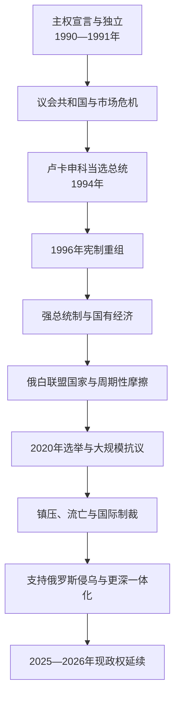

# 白俄罗斯

## 时间

1991年8月25日至今；本页事实核验截止2026年7月14日。

## 概括

白俄罗斯由白俄罗斯苏维埃社会主义共和国转化为主权国家。独立初期由议会政治和舒什克维奇领导，1994年卢卡申科当选首任总统。1996年宪制冲突后，总统权力、国有经济和安全机构高度集中；对俄廉价能源、市场和联盟安排支撑社会稳定，也形成深度依赖。2020年争议选举引发空前抗议和严厉镇压，大量反对派、公民组织和媒体被迫流亡。白俄罗斯领土在2022年被俄罗斯用于全面入侵乌克兰，军事和经济一体化进一步加深。截止2026年7月，卢卡申科任总统兼全白俄罗斯人民大会主席，亚历山大・图尔钦任总理。

## 独立与早期议会政治：1991—1994年

1991年八一九事件失败后，最高苏维埃赋予主权宣言宪法地位并改国名。舒什克维奇作为最高苏维埃主席担任国家元首，同叶利钦、克拉夫丘克签署别洛韦日协议。白俄罗斯放弃境内苏联核武并加入国际组织。

苏联市场瓦解造成通胀、生产下滑和生活困难。总理克比奇主张与俄罗斯密切整合，议会政治派系化；白俄罗斯人民阵线推动语言和民族复兴，但社会中苏维埃认同、俄语使用和对经济稳定的需求同样强。1994年新宪法设总统，反腐和民粹竞选的卢卡申科击败旧精英。

## 权力集中：1994—2001年

总统与议会围绕经济、任命和修宪冲突。1995年公投改变国旗国徽、给予俄语官方地位并支持对俄一体化。1996年公投延长总统任期、改组议会并扩大总统法令和任命权；反对派和部分法官认为程序违宪，俄罗斯调停者促成妥协失败，原第十三届最高苏维埃被替代为两院国民会议。

政府保留国有大型企业、价格和就业干预，以对俄优惠能源和市场避免激进私有化的社会冲击。工资、教育和秩序相对稳定，但独立媒体、反对党和工会空间收缩。1999—2000年多名反对派人士失踪，国际调查和人权团体怀疑国家人员涉入，官方否认。

## 俄白联盟与经济模式

1999年签署联盟国家条约，设最高国务委员会和部长会议，规划经济、国防与公民权协调。但双方未合并为单一国家：各自保留宪法、总统、联合国席位、军队和货币。能源价格、关税、食品贸易和政治主权造成周期性“油气战争”。

白俄罗斯经济以国有制造、化肥、炼油、农业和俄国市场为支柱，政府通过全就业、工资和福利建立社会契约。优点是避免1990年代式急剧去工业化，弱点是效率、创新、外债和对俄补贴依赖。与欧盟关系在人权制裁和短暂解冻间摇摆。

## 选举与政治控制

2004年公投取消总统连任次数限制。2006、2010、2015年选举均由官方宣布卢卡申科大胜，反对派和欧洲观察机构质疑自由公平；2010年抗议后多人被捕。政府通过总统办公体系、地方执行委员会、安全部门、国有媒体和受控选举委员会维持统治。

白俄罗斯语和俄语均为官方语言，俄语在城市与国家机构占优势。民族认同不能简化为“亲俄”：许多人同时认同白俄罗斯国家、俄语文化和不同外交方向。历史旗帜、战争记忆和语言成为政府与反对派争夺的象征。

## 2020年政治危机

卢卡申科寻求第六任期，潜在竞争者被捕或流亡；斯韦特兰娜・季哈诺夫斯卡娅代表联合反对派参选。官方宣布卢卡申科获约八成选票，反对派指控大规模舞弊。全国出现持续数月的游行、妇女队伍、工厂行动和社区组织。

安全部队使用震撼弹、殴打和大规模拘押，监狱酷刑指控广泛。反对派协调委员会受打压，季哈诺夫斯卡娅流亡立陶宛并建立联合过渡内阁。它获得一些外国政治承认和侨民支持，但不控制白俄罗斯境内国家机关，故不是实际或法定政府。

镇压使独立媒体、非政府组织、律师、公会和政党大量关闭，政治犯人数上升。欧盟、美国等施加制裁；政府更依赖俄罗斯贷款、安全和市场。2021年白俄罗斯迫使瑞安航空客机降落并逮捕异见记者，引发航空制裁；同年边境移民危机加剧与欧盟邻国冲突。

## 2022年以后：战争、修宪与深化依俄

### 对俄乌战争的作用

俄罗斯2022年从白俄罗斯境内出动部队、飞机和导弹进攻乌克兰北部，使用机场、铁路和训练设施。白俄罗斯政府提供领土、后勤和政治支持，但未宣布本国正规军以完整作战编制进入乌克兰。国际法责任、共同侵略支持与“是否正式交战国”是不同问题。

俄军撤离乌克兰北部后，白俄罗斯继续接收训练和武器；俄罗斯宣布在白俄罗斯部署战术核武，具体指挥控制仍由俄方主导。白俄罗斯社会对直接参战支持有限，铁路破坏等反战行动遭重判。

### 2022年宪法与全白俄罗斯人民大会

公投修宪重新设置总统任期限制但只从新宪法生效后计算，强化全白俄罗斯人民大会。2024年大会成为拥有战略方针、紧急状态、选举与法官等权限的宪法机构，卢卡申科兼任主席。它没有削弱他的实际权力，反而提供总统之外的长期权力平台。

### 2025—2026年

官方结果宣布卢卡申科在2025年总统选举再获大胜并于3月25日就职第七任期；欧盟等认为选举环境受镇压、无真实竞争。罗曼・戈洛夫琴科转任国家银行后，亚历山大・图尔钦2025年3月10日任总理。截止2026年7月14日，白俄罗斯总统与政府官方名录仍显示二人在任。

个别政治犯获释和外交接触并未改变总体强制结构；与俄罗斯的军事、能源和产业合作继续加深。国家仍有自身官僚、边界和外交利益，不能写成已被俄罗斯吞并。

## 统治结构

| 层次 | 权力与功能 |
| --- | --- |
| 总统 | 任命政府和地方负责人，主导安全、外交、法令与经济大方向。 |
| 全白俄罗斯人民大会 | 2022年后具宪法地位，决定战略和部分人事、紧急权限；主席由卢卡申科兼任。 |
| 国民会议 | 众议院与共和国院立法，政治竞争受行政体系严格控制。 |
| 政府与总理 | 管理国有经济、预算、产业和社会政策，政治独立性有限。 |
| 安全部门 | 克格勃、内务部及特种警察维护政权，2020年后角色更加突出。 |
| 地方执行委员会 | 负责人由总统任命或确认，形成垂直行政。 |
| 国有企业与工会 | 提供就业和社会控制，也是制裁、俄国市场与效率压力交汇点。 |

## 重要事件

| 时间 | 事件 | 影响 |
| --- | --- | --- |
| 1991年 | 独立与别洛韦日协议 | 主权国家形成、苏联终结。 |
| 1994年 | 首届总统选举 | 卢卡申科上台。 |
| 1995年 | 语言、象征与对俄一体化公投 | 国家身份和外交路线转折。 |
| 1996年 | 修宪公投与议会改组 | 强总统制确立。 |
| 1999年 | 联盟国家条约 | 对俄制度一体化框架。 |
| 2004年 | 取消总统连任限制 | 长期个人统治法律障碍消除。 |
| 2010年 | 选后镇压 | 与西方关系再度恶化。 |
| 2020年 | 争议选举与全国抗议 | 最大政治危机和全面镇压。 |
| 2021年 | 客机迫降、边境移民危机 | 国际孤立和制裁加深。 |
| 2022年 | 领土用于俄罗斯全面入侵 | 对俄军事依赖达到新阶段。 |
| 2022—2024年 | 修宪与人民大会制度化 | 权力结构增加新顶层机关。 |
| 2025年 | 第七任期、图尔钦任总理 | 现政权连续。 |

## 稳定条件与长期风险

政权稳定依靠强安全机构、国有就业和福利、俄国能源市场、反对派碎片化及对战争和1990年代混乱的官方记忆。风险包括经济对单一伙伴依赖、人口外流、制裁与技术获取、主权被军事整合侵蚀、领导接班缺乏制度化，以及2020年后国家—社会信任断裂。外部制裁不是全部原因，国内政治选择和经济结构同样关键。

## 国家领导

完整最高苏维埃主席、代理元首、总统和历任正式 / 代理总理见[白俄罗斯国家领导表](/%E4%BA%BA%E6%96%87%E7%A7%91%E5%AD%A6/%E5%8E%86%E5%8F%B2/%E6%AC%A7%E6%B4%B2/%E6%96%AF%E6%8B%89%E5%A4%AB/%E4%B8%9C%E6%96%AF%E6%8B%89%E5%A4%AB/%E7%99%BD%E4%BF%84%E7%BD%97%E6%96%AF%E5%9B%BD%E5%AE%B6%E9%A2%86%E5%AF%BC%E8%A1%A8.md)。

## 演变关系

- 前一节点：[白俄罗斯苏维埃政权](/%E4%BA%BA%E6%96%87%E7%A7%91%E5%AD%A6/%E5%8E%86%E5%8F%B2/%E6%AC%A7%E6%B4%B2/%E6%96%AF%E6%8B%89%E5%A4%AB/%E4%B8%9C%E6%96%AF%E6%8B%89%E5%A4%AB/%E7%99%BD%E4%BF%84%E7%BD%97%E6%96%AF%E8%8B%8F%E7%BB%B4%E5%9F%83%E6%94%BF%E6%9D%83.md)。
- 共享历史背景：[基辅罗斯](/%E4%BA%BA%E6%96%87%E7%A7%91%E5%AD%A6/%E5%8E%86%E5%8F%B2/%E6%AC%A7%E6%B4%B2/%E6%96%AF%E6%8B%89%E5%A4%AB/%E4%B8%9C%E6%96%AF%E6%8B%89%E5%A4%AB/%E5%9F%BA%E8%BE%85%E7%BD%97%E6%96%AF.md)和立陶宛—波兰体系。
- 当代关联：[俄罗斯](/%E4%BA%BA%E6%96%87%E7%A7%91%E5%AD%A6/%E5%8E%86%E5%8F%B2/%E6%AC%A7%E6%B4%B2/%E6%96%AF%E6%8B%89%E5%A4%AB/%E4%B8%9C%E6%96%AF%E6%8B%89%E5%A4%AB/%E4%BF%84%E7%BD%97%E6%96%AF.md)、[乌克兰](/%E4%BA%BA%E6%96%87%E7%A7%91%E5%AD%A6/%E5%8E%86%E5%8F%B2/%E6%AC%A7%E6%B4%B2/%E6%96%AF%E6%8B%89%E5%A4%AB/%E4%B8%9C%E6%96%AF%E6%8B%89%E5%A4%AB/%E4%B9%8C%E5%85%8B%E5%85%B0.md)。
