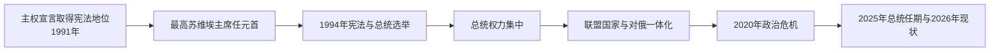

# 白俄罗斯国家领导表

[返回白俄罗斯](/%E4%BA%BA%E6%96%87%E7%A7%91%E5%AD%A6/%E5%8E%86%E5%8F%B2/%E6%AC%A7%E6%B4%B2/%E6%96%AF%E6%8B%89%E5%A4%AB/%E4%B8%9C%E6%96%AF%E6%8B%89%E5%A4%AB/%E7%99%BD%E4%BF%84%E7%BD%97%E6%96%AF.md)

## 范围与核验日期

本表覆盖白俄罗斯1991年独立以后国家元首和政府首脑，截止2026年7月14日。1994年前由最高苏维埃主席履行国家元首职能；1994年设总统后，亚历山大・卢卡申科持续任职。表格记录官方任职事实，同时把选举、公民权利与国际承认争议放在说明中。

## 国家元首完整表

| 顺序 | 国家元首 | 任期 | 地位与关键事件 |
| --- | --- | --- | --- |
| 1 | **斯坦尼斯拉夫・舒什克维奇** | 1991年9月18日—1994年1月26日 | 最高苏维埃主席，作为集体议会国家的元首；参与别洛韦日协议。因议会权力斗争和腐败指控被免，相关指控并未形成定罪。 |
| 2 | 维亚切斯拉夫・库兹涅佐夫 | 1994年1月26—28日代理 | 最高苏维埃第一副主席，在新主席产生前短期代行。 |
| 3 | 梅奇斯拉夫・格里布 | 1994年1月28日—7月20日 | 最高苏维埃主席；首届总统选举和权力移交期间的国家元首。 |
| 4 | **亚历山大・卢卡申科** | 1994年7月20日至今 | 首任总统；通过1996年公投后的宪制重组扩大总统权力。官方结果显示其在2025年选举后于3月25日开始第七个任期；截止2026年7月14日仍任总统。 |

## 政府首脑完整表

| 顺序 | 政府首脑 | 任期 | 正式 / 代理及说明 |
| --- | --- | --- | --- |
| 1 | 维亚切斯拉夫・克比奇 | 1990年9月19日—1994年7月21日 | 从白俄罗斯苏维埃部长会议主席过渡为独立国家首任总理；1994年总统选举败北。 |
| 2 | 米哈伊尔・奇吉尔 | 1994年7月21日—1996年11月18日 | 卢卡申科早期总理；因反对总统政策辞职，后加入反对派。 |
| 3 | 谢尔盖・林格 | 1996年11月18日代理、1997年2月19日—2000年2月18日正式 | 宪政危机后的政府首脑。 |
| 4 | 弗拉基米尔・叶尔莫申 | 2000年3月14日—2001年10月1日 | 原明斯克市长；2001年总统选举前后任总理。 |
| 5 | 根纳季・诺维茨基 | 2001年10月1日—2003年7月10日 | 负责经济与行政管理。 |
| 6 | 谢尔盖・西多尔斯基 | 2003年7月10日代理、12月19日正式—2010年12月28日 | 长期总理；能源补贴、工业国有体系和俄白经济摩擦并存。 |
| 7 | 米哈伊尔・米亚斯尼科维奇 | 2010年12月28日—2014年12月27日 | 2011年货币危机后推动稳定措施。 |
| 8 | 安德烈・科比亚科夫 | 2014年12月27日—2018年8月18日 | 经济停滞和对俄关系调整时期。 |
| 9 | 谢尔盖・鲁马斯 | 2018年8月18日—2020年6月4日 | 倡导部分市场化改革；2020年总统选举前被撤换。 |
| 10 | 罗曼・戈洛夫琴科 | 2020年6月4日—2025年3月10日 | 2020年政治危机、国际制裁及更深俄白整合时期总理。 |
| 11 | **亚历山大・图尔钦** | 2025年3月10日至今 | 原明斯克州执行委员会主席；白俄罗斯政府官方名录和2026年活动记录确认其截止2026年7月14日仍为总理。 |

## 实际权力结构

- 1994年宪法设总统；1996年公投后的文本扩大总统对政府、法令、地方行政和议会重组的影响，形成强总统制。
- 总理由总统任命并需下院同意，负责日常经济和行政，但重大干部、安全、外交和国家企业方向由总统体系主导。
- 全白俄罗斯人民大会的宪法地位在2022年修宪后上升，2024年起成为拥有战略和人事权限的最高代表机构之一；卢卡申科兼任其主席，进一步叠加正式权力。
- 俄白“联盟国家”拥有最高国务委员会和部长会议，但白俄罗斯与俄罗斯仍是各自的联合国会员国和主权国家；联盟机构不取代白俄罗斯总统、议会和政府。

## 选举、抗议与国际争议

- 1996年公投程序、总统任期延长和议会重组受到国内反对派及欧洲机构质疑。
- 2020年官方宣布卢卡申科连任，引发大规模抗议、罢工、拘捕与流亡。反对派和多个外国政府不接受官方结果；斯韦特兰娜・季哈诺夫斯卡娅建立流亡协调与“联合过渡内阁”，但未在白俄罗斯境内行使国家机关控制，故不列为法定国家元首。
- 2025年官方选举结果和第七次就职延续现政权；欧盟等机构认为选举不自由、不公平。记录在任事实不等于认可选举质量。
- 俄罗斯2022年从白俄罗斯领土发动对乌克兰进攻，白俄罗斯提供基地、后勤和政治支持，但白俄罗斯政府未宣告本国正规军以交战国身份全面参战。其责任与参战程度须分层表述。

## 相关笔记

- 独立以来的经济、社会和外交过程见[白俄罗斯](/%E4%BA%BA%E6%96%87%E7%A7%91%E5%AD%A6/%E5%8E%86%E5%8F%B2/%E6%AC%A7%E6%B4%B2/%E6%96%AF%E6%8B%89%E5%A4%AB/%E4%B8%9C%E6%96%AF%E6%8B%89%E5%A4%AB/%E7%99%BD%E4%BF%84%E7%BD%97%E6%96%AF.md)。
- 苏维埃前置阶段见[白俄罗斯苏维埃政权](/%E4%BA%BA%E6%96%87%E7%A7%91%E5%AD%A6/%E5%8E%86%E5%8F%B2/%E6%AC%A7%E6%B4%B2/%E6%96%AF%E6%8B%89%E5%A4%AB/%E4%B8%9C%E6%96%AF%E6%8B%89%E5%A4%AB/%E7%99%BD%E4%BF%84%E7%BD%97%E6%96%AF%E8%8B%8F%E7%BB%B4%E5%9F%83%E6%94%BF%E6%9D%83.md)。
- 与俄罗斯的制度对照见[俄罗斯国家领导表](/%E4%BA%BA%E6%96%87%E7%A7%91%E5%AD%A6/%E5%8E%86%E5%8F%B2/%E6%AC%A7%E6%B4%B2/%E6%96%AF%E6%8B%89%E5%A4%AB/%E4%B8%9C%E6%96%AF%E6%8B%89%E5%A4%AB/%E4%BF%84%E7%BD%97%E6%96%AF%E5%9B%BD%E5%AE%B6%E9%A2%86%E5%AF%BC%E8%A1%A8.md)。
