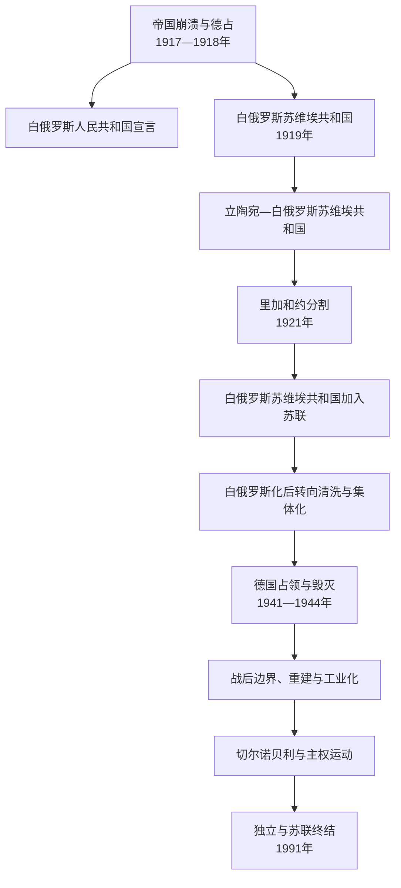

# 白俄罗斯苏维埃政权

## 时间

1919年1月—1991年8/12月。白俄罗斯苏维埃社会主义共和国1919年多次改组，1922年成为苏联创始成员；1991年8月25日使主权宣言具有宪法效力，12月苏联终结。

## 概括

第一次世界大战和帝国崩溃使白俄罗斯土地成为德军、波兰、布尔什维克、白俄罗斯民族运动和地方苏维埃竞争区。1918年白俄罗斯人民共和国宣布独立但缺少稳定领土控制；1919年布尔什维克建立白俄罗斯苏维埃共和国，随后一度并入立陶宛—白俄罗斯苏维埃共和国。1921年《里加和约》把白俄罗斯分为波兰西部和苏维埃东部。1920年代白俄罗斯化后，斯大林集体化、清洗和俄罗斯化重创社会。1941—1944年德国占领造成极高人口损失和大屠杀；战后边界西移、工业化和城市化使共和国重建。切尔诺贝利污染、语言民族复兴和联盟危机推动1991年独立。

## 1917—1921年：建国竞争与分割

### 战争和占领背景

白俄罗斯是俄德战线和难民迁徙区。1917年革命后，全白俄罗斯代表大会讨论自治或国家地位，布尔什维克军人解散会议。1918年德国占领明斯克，根据布列斯特和约控制大片土地。

### 白俄罗斯人民共和国

1918年3月25日拉达宣布白俄罗斯人民共和国独立，发展白红白旗、纹章、外交和教育构想。德国未承认其完整主权，政府缺少军队、税收和稳定领土；德国撤军后拉达流亡。它对后来的民族国家象征重要，却不能与实际控制全境的政府等同。

### 苏维埃共和国与立陶宛—白俄罗斯联邦

1919年1月布尔什维克在斯摩棱斯克宣布白俄罗斯苏维埃社会主义共和国，政府很快迁明斯克。部分东部领土划入俄罗斯，西部与立陶宛苏维埃共和国合成“立陶宛—白俄罗斯苏维埃社会主义共和国”（立白共和国）。波兰军进攻使其崩溃。1920年红军重返明斯克，恢复较小版图的白俄罗斯苏维埃共和国。

### 里加和约

1921年波苏《里加和约》把西白俄罗斯划入波兰，东部归苏维埃白俄罗斯。边界穿过语言、宗教和经济区域，双方均实施各自国家整合。苏维埃共和国1924、1926年从俄罗斯划入若干白俄罗斯人口较多地区，领土扩大。

## 1920年代：白俄罗斯化与联盟体制

1922年白俄罗斯与俄罗斯、乌克兰、外高加索联邦创建苏联。共和国保留宪法、最高机关、白俄罗斯语文化和边界，核心党政、军队和经济受联盟控制。1920年代本土化推动白俄罗斯语进入学校、出版和行政，科学院、剧院和文学发展；意第绪语、波兰语等也曾获制度空间，反映共和国多语言社会。

1920年代末政策逆转，知识分子被指“民族民主主义”。1930年“解放白俄罗斯联盟案”等制造案件打击文化精英，语言规范被调整得更接近俄语，行政俄罗斯化加深。

## 集体化、大清洗与边境社会

农业集体化、反“富农”运动和征粮造成驱逐、饥饿和农村冲突，虽没有乌克兰和哈萨克斯坦同等规模的1932—1933年死亡，政策暴力仍深刻。1937—1938年大清洗中，党政干部、知识分子、宗教人士、波兰人等遭处决和流放；库拉帕蒂是明斯克附近大规模处决地象征。苏波边界地区因间谍恐惧和“民族行动”受特别镇压。

## 1939年西部并入

苏德互不侵犯条约后，1939年9月苏军进入波兰东部，西白俄罗斯经苏联组织的人民会议并入白俄罗斯共和国。部分白俄罗斯农民欢迎土地改革和结束波兰化限制，另有波兰官员、地主、军人及其他居民遭逮捕、驱逐。比亚韦斯托克等地最初划入，战后边界又调整归波兰。把1939年只写成“统一”或只写成“占领”都不足以容纳不同群体经验；国际法上行动源于苏德瓜分波兰。

## 1941—1944年：德国占领与人口灾难

德国1941年夏迅速占领白俄罗斯。占领当局实施殖民、粮食掠夺和反游击报复，数千村庄被焚毁。明斯克等地建立隔都，犹太居民遭枪杀、驱逐和灭绝；战前白俄罗斯犹太社会几乎被摧毁。苏联战俘大量饿死，平民被强迫劳动。

白俄罗斯游击运动规模巨大，依森林地形、地方网络和苏联支援作战；德国以集体惩罚回应。也有白俄罗斯中央拉达、辅助警察等合作机构，成员动机从民族主义、反苏、求生到机会主义不等，其中一些参与迫害。1944年“巴格拉季昂行动”摧毁德军中央集团军群并收复共和国。白俄罗斯损失占战前人口比例极高，常见“每四人一人”是纪念性概括，精确比例因边界和统计口径不同。

战争详见[苏联卫国战争](/%E4%BA%BA%E6%96%87%E7%A7%91%E5%AD%A6/%E5%8E%86%E5%8F%B2/%E6%AC%A7%E6%B4%B2/%E6%96%AF%E6%8B%89%E5%A4%AB/%E4%B8%9C%E6%96%AF%E6%8B%89%E5%A4%AB/%E8%8B%8F%E8%81%94%E5%8D%AB%E5%9B%BD%E6%88%98%E4%BA%89.md)。

## 战后重建与社会转型

- 1945年苏波边界大体沿寇松线调整，比亚韦斯托克归波兰，西部多数留白俄罗斯。白俄罗斯和乌克兰作为创始会员分别拥有联合国席位，但外交仍受莫斯科主导。
- 明斯克、维捷布斯克等城重建，机械、卡车、化工和军工发展。来自农村和苏联其他地区的人口进入城市，白俄罗斯从农业社会转为高度城市化工业共和国。
- 西部完成集体化，天主教、东正教和民间宗教均受国家无神论政策限制。
- 俄语成为城市、高等教育和职业上升的主要语言，白俄罗斯语在农村、文学和部分教育中保留；双语现实不能简化为“民族认同高所以自然俄语化”。
- 彼得・马谢罗夫1965—1980年长期执政，强调战争记忆、工业和社会福利，在共和国拥有较高声望；政治仍在共产党垄断下。

## 切尔诺贝利与独立

1986年切尔诺贝利放射性沉降严重影响白俄罗斯东南部，污染土地、迁移人口并造成长期健康和经济负担。苏联初期隐瞒强化环保和民族运动。1988年库拉帕蒂处决地公开，历史记忆与民主诉求结合；白俄罗斯人民阵线推动语言、主权和改革。

1990年最高苏维埃通过国家主权宣言。1991年八一九事件失败后，8月25日宣言获得宪法法律地位，共和国改名白俄罗斯共和国。12月8日舒什克维奇与叶利钦、克拉夫丘克在别洛韦日签协议，宣布苏联作为国际法主体和地缘政治现实停止存在并建立独联体。

## 统治结构

| 层次 | 作用 |
| --- | --- |
| 白俄罗斯共产党 | 第一书记掌握实际最高政治权力，受苏共中央干部体系制约。 |
| 最高苏维埃主席团 / 最高苏维埃 | 长期为法定元首和立法机关，1990—1991年成为主权决策中心。 |
| 人民委员会 / 部长会议 | 管理共和国经济、教育、卫生和地方行政，关键工业受联盟部委直接控制。 |
| 地方苏维埃与党委 | 执行计划和社会服务，党组织决定干部。 |
| 联盟安全军政机关 | 边境、军队、克格勃和战略产业由联盟控制；白俄罗斯地理位置使军事部署密集。 |
| 文化科研机构 | 发展白俄罗斯文学、历史和科学，也受意识形态、语言政策与清洗影响。 |

## 重要事件

| 时间 | 事件 | 影响 |
| --- | --- | --- |
| 1918年3月 | 白俄罗斯人民共和国宣言 | 民族国家象征形成，但实控有限。 |
| 1919年1月 | 白俄罗斯苏维埃共和国成立 | 苏维埃国家线开端。 |
| 1919年 | 立白共和国 | 与立陶宛短暂合并，因战争崩溃。 |
| 1921年 | 里加和约 | 白俄罗斯分为波兰西部和苏维埃东部。 |
| 1922年 | 加入苏联 | 创始加盟共和国。 |
| 1924、1926年 | 东部领土划入 | 共和国版图扩大。 |
| 1930年代 | 集体化和大清洗 | 农村、政治和文化精英遭重创。 |
| 1939年 | 西白俄罗斯并入 | 领土统一与苏联化、驱逐并行。 |
| 1941—1944年 | 德国占领 | 大屠杀、村庄毁灭和巨大人口损失。 |
| 1945年 | 战后边界与联合国席位 | 现代大体疆域稳定。 |
| 1986年 | 切尔诺贝利污染 | 环境、健康与政治信任危机。 |
| 1990—1991年 | 主权宣言、独立与别洛韦日协议 | 苏维埃阶段终结。 |

## 兴衰与终结原因

政权依靠红军胜利、联盟市场、工业投资、社会保障和战争后重建形成稳定；共和国制度也培养本地干部和边界认同。经济停滞、切尔诺贝利、语言文化诉求、斯大林罪行公开和党垄断衰退使合法性下降。1991年政变失败是直接触发，俄罗斯、乌克兰和白俄罗斯领导人共同终止联盟则完成政治和法律转折。

## 领导结构

白俄罗斯共产党第一书记是实际权力主线，最高苏维埃主席团和部长会议则是法定国家与政府机关。联盟级完整三表见[苏联国家领导表](/%E4%BA%BA%E6%96%87%E7%A7%91%E5%AD%A6/%E5%8E%86%E5%8F%B2/%E6%AC%A7%E6%B4%B2/%E6%96%AF%E6%8B%89%E5%A4%AB/%E4%B8%9C%E6%96%AF%E6%8B%89%E5%A4%AB/%E8%8B%8F%E8%81%94%E5%9B%BD%E5%AE%B6%E9%A2%86%E5%AF%BC%E8%A1%A8.md)；独立后领导见[白俄罗斯国家领导表](/%E4%BA%BA%E6%96%87%E7%A7%91%E5%AD%A6/%E5%8E%86%E5%8F%B2/%E6%AC%A7%E6%B4%B2/%E6%96%AF%E6%8B%89%E5%A4%AB/%E4%B8%9C%E6%96%AF%E6%8B%89%E5%A4%AB/%E7%99%BD%E4%BF%84%E7%BD%97%E6%96%AF%E5%9B%BD%E5%AE%B6%E9%A2%86%E5%AF%BC%E8%A1%A8.md)。

## 演变关系

- 前置：[俄罗斯帝国](/%E4%BA%BA%E6%96%87%E7%A7%91%E5%AD%A6/%E5%8E%86%E5%8F%B2/%E6%AC%A7%E6%B4%B2/%E6%96%AF%E6%8B%89%E5%A4%AB/%E4%B8%9C%E6%96%AF%E6%8B%89%E5%A4%AB/%E4%BF%84%E7%BD%97%E6%96%AF%E5%B8%9D%E5%9B%BD.md)及1918年白俄罗斯人民共和国。
- 并列：[苏俄与苏联](/%E4%BA%BA%E6%96%87%E7%A7%91%E5%AD%A6/%E5%8E%86%E5%8F%B2/%E6%AC%A7%E6%B4%B2/%E6%96%AF%E6%8B%89%E5%A4%AB/%E4%B8%9C%E6%96%AF%E6%8B%89%E5%A4%AB/%E8%8B%8F%E4%BF%84%E4%B8%8E%E8%8B%8F%E8%81%94.md)、[乌克兰苏维埃政权](/%E4%BA%BA%E6%96%87%E7%A7%91%E5%AD%A6/%E5%8E%86%E5%8F%B2/%E6%AC%A7%E6%B4%B2/%E6%96%AF%E6%8B%89%E5%A4%AB/%E4%B8%9C%E6%96%AF%E6%8B%89%E5%A4%AB/%E4%B9%8C%E5%85%8B%E5%85%B0%E8%8B%8F%E7%BB%B4%E5%9F%83%E6%94%BF%E6%9D%83.md)。
- 后续：[白俄罗斯](/%E4%BA%BA%E6%96%87%E7%A7%91%E5%AD%A6/%E5%8E%86%E5%8F%B2/%E6%AC%A7%E6%B4%B2/%E6%96%AF%E6%8B%89%E5%A4%AB/%E4%B8%9C%E6%96%AF%E6%8B%89%E5%A4%AB/%E7%99%BD%E4%BF%84%E7%BD%97%E6%96%AF.md)。
