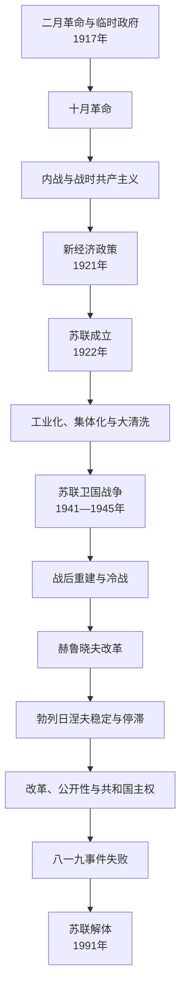

# 苏俄与苏联

## 时间

1917年11月7日—1991年12月26日。苏俄指俄罗斯苏维埃联邦社会主义共和国，1922年12月30日起与乌克兰、白俄罗斯和外高加索联邦共同组成苏维埃社会主义共和国联盟。

## 概括

十月革命后布尔什维克以苏维埃名义建立政府，在内战、外国干预和“战时共产主义”中形成一党国家。1921年新经济政策缓和危机，1922年苏联以联邦形式成立。斯大林时期快速工业化、农业集体化、大饥荒、大清洗与高度集权并行；1941—1945年战争以巨大伤亡换取胜利，苏联随后成为超级大国。战后安全缓冲、核武、社会福利和教育科技扩张支撑其国际地位，计划经济僵化、民族—联盟关系、财政和政治合法性问题却不断累积。戈尔巴乔夫改革释放竞争而未重建有效联邦，1991年政变失败和加盟共和国独立最终终结联盟。

## 革命与建国

### 二月革命后的双重权力

1917年二月革命推翻帝制，临时政府继续参战并迟迟未解决土地。彼得格勒苏维埃和各地工兵农代表机构拥有群众和军队影响。列宁提出“全部政权归苏维埃”；布尔什维克在战争、经济崩溃和科尔尼洛夫事件后取得关键城市多数。

### 十月革命与制宪会议

11月7日布尔什维克和军事革命委员会夺取彼得格勒要点，第二次全俄苏维埃代表大会建立人民委员会，颁布和平和土地法令。革命在各地的交接并不同步，莫斯科发生战斗，边疆与民族地区形成多种政府。1918年制宪会议只开一天即被解散，布尔什维克把苏维埃阶级代表制置于普选议会之上。

### 内战与国家暴力

红军面对白军、地方民族政权、农民军、外国干预和波苏战争。布列斯特—立托夫斯克和约使俄国退出一战并丧失大片土地，德国战败后失效。“战时共产主义”实行粮食征集、工业国有化和配给；契卡镇压反对者，红色恐怖与白色恐怖并存。红军控制核心人口、铁路和军工区，拥有更统一的政治指挥；白军分散且拒绝明确土地和民族自治方案。1920—1921年主要白军失败，但农民起义、喀琅施塔得起义和饥荒迫使政策转向。

## 新经济政策与联盟成立

1921年以粮食税代替征集，允许小商业和一定私营，国家控制重工业、银行和外贸。经济恢复，但城乡“剪刀差”、失业和党内路线争论持续。同年禁止党内派别，政治垄断继续加强。

关于联盟结构，斯大林主张各共和国加入俄罗斯，列宁反对“大俄罗斯沙文主义”，最终采用名义平等共和国组成联盟、保留退出权的形式。1922年俄罗斯、乌克兰、白俄罗斯和外高加索联邦签署联盟条约。联盟掌握外交、军队、外贸和核心经济，各共和国拥有宪法、语言文化机关与边界，但共产党干部体系确保中央控制。这一“形式联邦—实际集中”既培育共和国国家机构，也埋下主权冲突。

## 斯大林时期

### 权力集中

列宁1924年去世后，斯大林利用总书记的人事网络，与季诺维也夫、加米涅夫结盟打击托洛茨基，再联合布哈林打击左派，最后清除右派。1930年代个人崇拜、安全机关和干部任命使政治局集体制被个人集权取代。

### 工业化与集体化

第一个五年计划集中资源建设钢铁、煤炭、机械、军工和新城市，识字、技术教育和女性就业扩大。投资通过压低消费、粮食出口、强制劳动和农村提取实现。农业集体化消灭“富农”阶层，大批家庭被驱逐流放；征粮、政策惩罚、收成和行政混乱造成1932—1933年乌克兰、哈萨克斯坦、北高加索等地大饥荒。乌克兰对“饥荒灭绝”的法律和学术定性、全苏区域差异与意图证据须分层说明，不能否认人为政策的决定性责任。

### 大清洗与社会流动

1936—1938年党政军干部、少数民族群体和普通民众遭逮捕、处决或古拉格劳役。公开审判制造阴谋叙事，配额式镇压破坏机构记忆。同时教育、城市化和工业岗位使部分工农出身者上升；社会现代化与国家暴力并非互相抵消。

## 对外政策与第二次世界大战

1930年代苏联推动集体安全又同西方互不信任。1939年苏德互不侵犯条约秘密议定势力范围；苏联进入波兰东部、吞并波罗的海三国和比萨拉比亚，并对芬兰发动冬季战争。这些扩张不能只用“安全缓冲”消除当地被占领和镇压的经验。

1941年6月德国发动“巴巴罗萨”，苏联初期因部署、情报判断、清洗后果和德军战术遭灾难性损失。莫斯科、斯大林格勒、库尔斯克、巴格拉季昂等战役逐步逆转，工业东迁、全社会动员、盟军租借物资和反法西斯联盟共同支撑胜利。详细过程见[苏联卫国战争](/%E4%BA%BA%E6%96%87%E7%A7%91%E5%AD%A6/%E5%8E%86%E5%8F%B2/%E6%AC%A7%E6%B4%B2/%E6%96%AF%E6%8B%89%E5%A4%AB/%E4%B8%9C%E6%96%AF%E6%8B%89%E5%A4%AB/%E8%8B%8F%E8%81%94%E5%8D%AB%E5%9B%BD%E6%88%98%E4%BA%89.md)。战争造成约两千多万至近三千万苏联军民死亡，精确数字随口径不同；乌克兰、白俄罗斯和俄占区遭屠杀、饥饿、强迫劳动与大规模破坏。

## 战后超级大国

### 斯大林晚期

苏联在东欧建立共产党主导政权，与美国进入冷战；1949年试爆原子弹。重建优先重工业和军工，农业与消费恢复较慢。政治镇压、民族强制迁徙和晚期反犹运动延续，古拉格规模庞大。

### 赫鲁晓夫时期

1956年秘密报告批判斯大林个人崇拜，释放和恢复部分受害者名誉。处女地、住房建设、教育和太空计划带来社会变化，政策频繁和农业问题也造成不稳。1956年匈牙利起义被军事镇压，1962年古巴导弹危机把核对抗推向极限。党政改革、经济困难和精英反感导致赫鲁晓夫1964年被集体罢免。

### 勃列日涅夫时期

领导层强调稳定、福利、住房、教育和军事实力，石油收入支持消费与联盟内部补贴。1968年入侵捷克斯洛伐克并提出有限主权逻辑；与美国缓和及军控并存。1970年代后生产率下降、创新和供应不足、部门利益固化，非正式经济和腐败扩张。1979年出兵阿富汗带来长期成本，国际关系再度紧张。

## 戈尔巴乔夫改革与解体

### 改革的两难

1985年后“加速”未能改善经济，改革允许企业自主却未建立稳定价格和产权机制，造成短缺和财政失衡。公开性揭露清洗、环境灾害和官僚问题，竞争性选举使社会政治化。1986年切尔诺贝利事故暴露信息封锁和跨共和国治理缺陷。

### 民族与共和国主权

波罗的海独立运动、高加索冲突、俄罗斯本身主权宣言及乌克兰等共和国国家机构强化，使联盟法律与共和国法律冲突。戈尔巴乔夫试图签署新联盟条约，保守派和独立派都不满意。俄罗斯总统叶利钦拥有独立民选合法性，与苏联总统形成双重权力。

### 直接终结

1991年8月保守派国家紧急状态委员会软禁戈尔巴乔夫，宣布代总统和紧急状态。军队拒绝全面镇压，叶利钦在俄罗斯议会大厦组织抵抗，政变三天失败。共产党联盟中枢被暂停，各共和国加速独立。乌克兰12月1日公投以压倒多数确认独立；12月8日俄、乌、白领导人签别洛韦日协议，21日阿拉木图文件扩大承认。戈尔巴乔夫25日辞职，联盟最高苏维埃共和国院26日确认停止存在。

## 统治与经济结构

| 层次 | 机制 |
| --- | --- |
| 共产党 | 通过政治局、书记处、组织部门和干部名册控制国家与社会；1988—1990年后垄断逐步取消。 |
| 苏维埃机关 | 名义最高权力机关，选举和立法长期受党控制；改革后代表大会获得真实辩论功能。 |
| 政府与计划机关 | 人民委员会 / 部长会议、国家计划委员会分配投资、生产和物资。 |
| 加盟共和国 | 有宪法、最高苏维埃、政府和文化机构；外交军事实权长期集中，1990年后主权迅速实质化。 |
| 安全与军队 | 契卡—国家政治保卫局—内务人民委员部—克格勃和红军 / 苏军是体制支柱，内部也有部门利益。 |
| 社会契约 | 充分就业、教育、医疗、住房和低价基本品换取政治服从；短缺、等级特供和信息控制削弱信任。 |

## 重要事件

| 时间 | 事件 | 影响 |
| --- | --- | --- |
| 1917年11月 | 十月革命 | 苏维埃政府建立。 |
| 1918—1921年 | 内战与战时共产主义 | 一党军事化国家形成。 |
| 1921年 | 新经济政策 | 从强制征集转向有限市场恢复。 |
| 1922年 | 苏联成立 | 形式联邦、实际集中体制确立。 |
| 1928—1933年 | 工业化与集体化 | 重工业跃升，大饥荒与强制迁徙。 |
| 1936—1938年 | 大清洗 | 党军社会遭大规模国家暴力。 |
| 1939年 | 苏德条约与领土扩张 | 安全、占领与战争责任争议延续。 |
| 1941—1945年 | 苏德战争 | 巨大伤亡下战胜纳粹德国。 |
| 1956年 | 秘密报告 | 去斯大林化开端。 |
| 1961年 | 加加林进入太空 | 科技和超级大国象征。 |
| 1968年 | 入侵捷克斯洛伐克 | 改革边界与有限主权。 |
| 1979年 | 入侵阿富汗 | 长期军事、财政与合法性成本。 |
| 1986年 | 切尔诺贝利事故 | 体制信息和安全危机。 |
| 1991年 | 政变失败与解体 | 联盟中央权力终结。 |

## 崛起与衰落原因

### 崛起条件

红军控制核心工业和交通、布尔什维克组织统一、土地法令削弱白军吸引力；计划动员快速建设重工业和军工；教育科技、人口与资源支撑总体战；二战胜利和东欧缓冲带形成超级大国体系。

### 结构性衰落

计划指标鼓励数量而非质量，价格不能有效传递稀缺；军工与补贴负担高；政治垄断抑制纠错；共和国机构拥有边界、精英和民族叙事，却缺少平衡中央的合法协商机制。能源价格、军备和阿富汗战争是压力，不是单因。

### 直接触发

改革使旧控制失效而新市场、联邦和民主制度尚未稳定；1991年政变摧毁中央强制权威，乌克兰公投使没有乌克兰的联盟失去可行性，俄白乌协议完成政治决断。

## 国家领导

法定元首、1922—1938年集体主席、全部政府首脑、党内实际领导和代理状态见[苏联国家领导表](/%E4%BA%BA%E6%96%87%E7%A7%91%E5%AD%A6/%E5%8E%86%E5%8F%B2/%E6%AC%A7%E6%B4%B2/%E6%96%AF%E6%8B%89%E5%A4%AB/%E4%B8%9C%E6%96%AF%E6%8B%89%E5%A4%AB/%E8%8B%8F%E8%81%94%E5%9B%BD%E5%AE%B6%E9%A2%86%E5%AF%BC%E8%A1%A8.md)。

## 演变关系

- 前一节点：[俄罗斯帝国](/%E4%BA%BA%E6%96%87%E7%A7%91%E5%AD%A6/%E5%8E%86%E5%8F%B2/%E6%AC%A7%E6%B4%B2/%E6%96%AF%E6%8B%89%E5%A4%AB/%E4%B8%9C%E6%96%AF%E6%8B%89%E5%A4%AB/%E4%BF%84%E7%BD%97%E6%96%AF%E5%B8%9D%E5%9B%BD.md)。
- 并列加盟共和国：[乌克兰苏维埃政权](/%E4%BA%BA%E6%96%87%E7%A7%91%E5%AD%A6/%E5%8E%86%E5%8F%B2/%E6%AC%A7%E6%B4%B2/%E6%96%AF%E6%8B%89%E5%A4%AB/%E4%B8%9C%E6%96%AF%E6%8B%89%E5%A4%AB/%E4%B9%8C%E5%85%8B%E5%85%B0%E8%8B%8F%E7%BB%B4%E5%9F%83%E6%94%BF%E6%9D%83.md)、[白俄罗斯苏维埃政权](/%E4%BA%BA%E6%96%87%E7%A7%91%E5%AD%A6/%E5%8E%86%E5%8F%B2/%E6%AC%A7%E6%B4%B2/%E6%96%AF%E6%8B%89%E5%A4%AB/%E4%B8%9C%E6%96%AF%E6%8B%89%E5%A4%AB/%E7%99%BD%E4%BF%84%E7%BD%97%E6%96%AF%E8%8B%8F%E7%BB%B4%E5%9F%83%E6%94%BF%E6%9D%83.md)。
- 后续主权国家：[俄罗斯](/%E4%BA%BA%E6%96%87%E7%A7%91%E5%AD%A6/%E5%8E%86%E5%8F%B2/%E6%AC%A7%E6%B4%B2/%E6%96%AF%E6%8B%89%E5%A4%AB/%E4%B8%9C%E6%96%AF%E6%8B%89%E5%A4%AB/%E4%BF%84%E7%BD%97%E6%96%AF.md)、[乌克兰](/%E4%BA%BA%E6%96%87%E7%A7%91%E5%AD%A6/%E5%8E%86%E5%8F%B2/%E6%AC%A7%E6%B4%B2/%E6%96%AF%E6%8B%89%E5%A4%AB/%E4%B8%9C%E6%96%AF%E6%8B%89%E5%A4%AB/%E4%B9%8C%E5%85%8B%E5%85%B0.md)、[白俄罗斯](/%E4%BA%BA%E6%96%87%E7%A7%91%E5%AD%A6/%E5%8E%86%E5%8F%B2/%E6%AC%A7%E6%B4%B2/%E6%96%AF%E6%8B%89%E5%A4%AB/%E4%B8%9C%E6%96%AF%E6%8B%89%E5%A4%AB/%E7%99%BD%E4%BF%84%E7%BD%97%E6%96%AF.md)。
