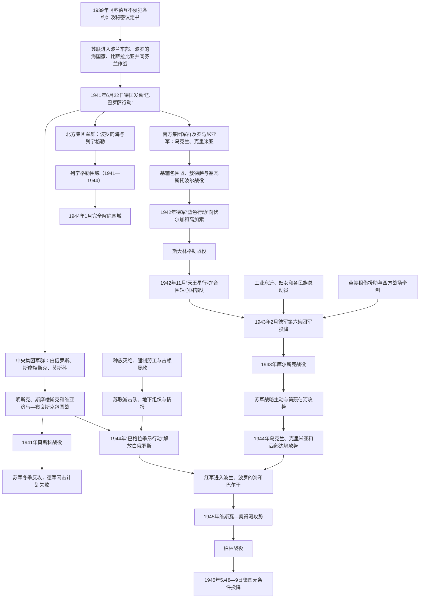

# 苏联卫国战争

## 时间

1941年6月22日—1945年5月9日；这是苏联对德战争的常用名称，不等于1939—1945年第二次世界大战的全部时段

## 概括

“伟大卫国战争／苏联卫国战争”指纳粹德国及其欧洲盟国入侵苏联后，苏联在欧洲战场进行的战争。1941年6月22日“巴巴罗萨行动”发动，德军及罗马尼亚、芬兰、匈牙利、意大利、斯洛伐克、克罗地亚附属部队从波罗的海至黑海进攻。红军在大清洗后指挥体系受损、部署前出、情报判断和动员准备不足，数月内遭受巨大包围损失，白俄罗斯和乌克兰大部被占，列宁格勒被围，德军推进至莫斯科近郊。

战争从一开始就是军事征服、殖民和种族灭绝战争。纳粹“东方总计划”、饥饿政策、反犹屠杀、战俘虐待、强制劳工和村庄报复造成数以百万计平民死亡。犹太人在巴比亚尔、马雷特罗斯捷涅茨等地被枪杀或送往灭绝中心；苏联战俘因饥饿、疾病和处决大量死亡。当地居民既有红军、游击队和救援者，也有出于反苏、民族主义、生存压力或机会主义参与的合作机构；不能把任何民族整体等同于抵抗或合作。

苏联依靠工业东迁、全国动员、红军指挥和战术改进、辽阔纵深、占领暴政引起的抵抗，以及英美租借援助和整个反法西斯联盟的共同战争，在莫斯科、斯大林格勒和库尔斯克逐步扭转战局。1944年“巴格拉季昂行动”等攻势摧毁德军中央集团军群，白俄罗斯和乌克兰全境先后重新由苏联控制；1945年红军攻入柏林。胜利使苏联成为超级大国，也以约2700万军民死亡、城市村庄毁灭、人口迁徙和更强国家控制为代价。战后胜利记忆成为苏联及多个继承国政治认同核心，但各国对1939年、占领、合作、民族武装和斯大林镇压的叙述差异很大。

## 战争进程图

## 战争前奏（1939—1941）

### 苏德条约和东欧重组

1939年8月23日，苏联与德国签署《苏德互不侵犯条约》，秘密议定书划分东欧势力范围。德国9月1日进攻波兰，苏军9月17日进入波兰东部；相关地区在受到苏联控制的选举与兼并程序后并入乌克兰、白俄罗斯苏维埃共和国。苏联安全机关逮捕、驱逐大量波兰官员、军人、地主和其他居民，1940年卡廷等地处决波兰战俘和精英。

苏联1939—1940年同芬兰进行冬季战争，虽然取得领土，却暴露指挥和训练问题。1940年吞并爱沙尼亚、拉脱维亚、立陶宛，并从罗马尼亚取得比萨拉比亚和北布科维纳。苏联把这些行动解释为建立安全缓冲，受影响国家则视为入侵、占领和非法吞并。它们为后来德国进攻改变边界和人口，也使部分居民把德军初到误认为摆脱苏联统治。

### 德国进攻准备

希特勒始终把征服苏联、夺取“生存空间”、消灭“犹太布尔什维主义”和获得粮食石油视为战争目标。1940年法国战败后，德国开始准备“巴巴罗萨行动”。计划预期在数月内摧毁红军、占领阿尔汉格尔斯克—阿斯特拉罕线以西地区，并以饥饿政策把粮食转供德国。

苏联情报从多方得到进攻警告，斯大林担心英国诱使苏德开战，又认为希特勒不会在结束对英战争前冒险，因而禁止部分前线部队采取可能“挑衅”的充分行动。红军正快速扩编、换装和重组，许多新部队缺员缺车；1937—1938年军官清洗、僵化指挥和边界西移后的部署混乱加剧脆弱性。

## 1941年：入侵与苏联危机

### 三路进攻

1941年6月22日，约三百余万轴心国军队跨越边界，是历史上规模最大的陆地入侵之一。

| 战略方向 | 主要目标 | 1941年进展 |
|---|---|---|
| 北方集团军群 | 穿越波罗的海、夺取列宁格勒并同芬兰军会合 | 快速占领波罗的海地区，9月起围困列宁格勒；芬兰收复冬季战争失地但未直接攻入列宁格勒市区。 |
| 中央集团军群 | 经明斯克、斯摩棱斯克直取莫斯科 | 比亚韦斯托克—明斯克、斯摩棱斯克、维亚济马—布良斯克形成大包围，后在莫斯科近郊受阻。 |
| 南方集团军群 | 夺取乌克兰粮食、工业、顿巴斯和通往高加索路线 | 在乌曼、基辅等地包围红军，罗马尼亚军攻占比萨拉比亚、敖德萨并向克里米亚推进。 |

空军在开战最初数日摧毁大量苏联飞机，装甲集群穿透前线，步兵包围后方。苏军前出部署、通讯中断和“不得退却”命令使许多部队来不及撤离。数百万红军人员在1941年阵亡、负伤或被俘。

### 国家动员

6月30日成立以斯大林为主席的国防委员会，集中党、政府、军队和经济权力。最高统帅部协调各战线，斯大林自8月任最高统帅。朱可夫、沙波什尼科夫、华西列夫斯基、罗科索夫斯基、科涅夫等将领在战争中承担不同指挥职责，成功与失败均来自集体机构和政治干预，不能把胜利归于一人。

约数千家工厂及大量机器、工人向乌拉尔、西西伯利亚、伏尔加河和中亚转移。乌克兰、俄罗斯西部和白俄罗斯的工业设备能撤多少取决于进攻速度，许多资源来不及转移。妇女、青少年、古拉格囚犯和来自中亚、高加索、西伯利亚的各族劳工进入工厂和农场，军需生产在1942年后恢复并增长。

### 莫斯科战役

德国在夏季围绕先取莫斯科还是转向乌克兰、列宁格勒发生战略争论。中央装甲部队一度南下协助基辅包围，9月底才发动“台风行动”。维亚济马、布良斯克再次发生大包围，但苏军残部、民兵和新建防线拖延推进。

秋雨泥泞、补给线过长、人员装备损耗和严寒共同削弱德军；“只因冬天失败”会忽视苏军抵抗和德方计划缺陷。12月，朱可夫等指挥西方面军和预备队反攻，把德军逐离莫斯科。德军未被全面击溃，却失去在1941年快速迫使苏联投降的可能。

## 占领制度与种族灭绝

### 行政分区

德国没有把占领区恢复为独立民族国家。白俄罗斯大部纳入“东方领总辖区”的白鲁塞尼亚总区，乌克兰大部设“乌克兰国家专员辖区”，东部前线地区由军事当局控制；加利西亚纳入波兰总督府，罗马尼亚管理德涅斯特河与南布格河之间的“德涅斯特河沿岸”地区。不同机构、党卫队、军队和经济部门相互竞争，却共享掠夺和种族目标。

某些民族主义者试图利用德国进攻建国。乌克兰民族主义者组织班德拉派1941年6月在利沃夫宣布恢复国家，德国随即逮捕班德拉和多名领导，显示纳粹并不接受真正独立。各地建立地方行政、警察和辅助部队，参与者动机从反苏、反犹和民族政治到求生、强迫、报酬不等。

### 犹太人大屠杀

战争前苏联西部和1939—1940年并入地区有数百万犹太人。特别行动队、秩序警察、党卫队、军队机构及地方辅助人员跟随前线，以“反游击”“反布尔什维克”为名实施大规模枪决。1941年9月基辅巴比亚尔两日内约三万三千余名犹太人被杀，随后该地继续杀害罗姆人、苏联战俘和其他居民。明斯克隔都、马雷特罗斯捷涅茨等是白俄罗斯主要杀戮中心。

部分受害者被迁入隔都、强迫劳动后处决，另一些从西欧被运往东部杀害。当地有人协助搜捕和掠夺，也有人隐藏、营救犹太人。罪责应追到具体德国机构、合作人员和命令链，不能以整个民族替代个人和组织责任。

### 苏联战俘和“饥饿计划”

德国把苏联战俘视为种族和意识形态敌人，拒绝给予正常补给与保护。1941—1942年大批战俘在露天营地因饥饿、疾病、寒冷和处决死亡，政治委员和犹太军人遭特别筛选杀害。战争期间约有数百万苏联战俘死于德国拘禁。

德国经济政策优先把粮食、矿产和劳动力用于国防军及德国，城市和乡村遭征用。数百万居民被强制送往德国劳动。列宁格勒围城中德军和芬兰军封锁陆路，城市居民因饥饿、寒冷和炮击死亡；拉多加湖“生命之路”维持有限补给和疏散。

### 村庄报复和反游击战

德军、党卫队和合作警察常以游击活动为由焚毁村庄、杀害居民或驱逐劳工。白俄罗斯哈廷等村庄成为毁灭象征。反游击行动经常把整个区域人口视为敌人，屠杀规模远超真实武装人员。

占领政策把最初因斯大林统治而不满的部分居民推向抵抗，却也制造生存困境：向任何一方提供食物都可能遭另一方惩罚。

## 抵抗、合作与多重内战

### 苏联游击队

党和安全机关在后方建立地下组织，早期因准备不足遭严重损失。1942年后中央游击运动司令部加强协调，游击队破坏铁路、桥梁、通讯，收集情报并袭击驻军。白俄罗斯森林和沼泽适合大规模活动，1944年巴格拉季昂行动前“铁轨战”协助扰乱德军运输。

游击队有真实群众支持，也强征物资、惩罚被视为合作者者，部分单位对平民实施暴力。民族主义武装、波兰家乡军和苏联游击队有时共同抗德，有时争夺战后领土并互相攻击。

### 乌克兰民族主义武装

乌克兰民族主义者组织分裂为梅利尼克派和班德拉派；部分成员早期同德国合作，希望建国，随后因德国镇压转入地下。乌克兰反抗军自1942年后发展，同德国部队、苏联游击队、波兰地下军及后来苏联安全机关交战。

1943—1944年，乌克兰反抗军及相关力量在沃里尼亚、东加利西亚对波兰平民实施大规模屠杀和驱逐；波兰武装也进行报复。这些事件既属于德占环境下的民族领土战争，也不能以反苏或反德身份为其针对平民的暴力开脱。

### 合作力量

俄罗斯解放军、地方辅助警察、波罗的海和乌克兰等地武装、哥萨克单位及其他编制以不同形式为德国作战。安德烈·弗拉索夫原为苏军将领，被俘后参与建立反斯大林政治和军队，但德国直到战末才允许较大独立编制。

“合作”需区分自愿政治合作、战俘营中为求生加入辅助队、强制征用和地方警务；法律与道德责任仍取决于具体行为。战争结束时苏联对遣返人员普遍审查，一些人被处决或送入劳改，也有许多普通战俘最终返乡。

## 1942年：高加索与斯大林格勒

莫斯科失利后，德国1942年把主攻转向南方，目标是顿河、伏尔加航运和高加索石油。“蓝色行动”初期快速推进，攻占顿巴斯余部、罗斯托夫并进入高加索，另一路攻击斯大林格勒。兵力在两个方向分散，侧翼由装备较弱的罗马尼亚、意大利和匈牙利军防守。

斯大林发布第227号命令“不许后退”，建立督战、惩戒和强制纪律；它反映危机，也不是所有苏军坚持战斗的唯一原因。城市战从1942年夏延续至冬，瓦西里·崔可夫第62集团军紧贴德军，苏联炮兵和补给位于伏尔加东岸。

11月19日苏军发动“天王星行动”，攻击罗马尼亚侧翼并合围德军第六集团军及盟军单位。希特勒禁止突围，空运无法维持，曼施泰因解围失败。1943年2月初残余部队投降。斯大林格勒消灭德国重要野战力量，鼓舞盟国和被占领欧洲，但苏军在同时期其他攻势也付出巨大代价。

## 1943年：库尔斯克与战略主动

德国1943年夏发动“堡垒行动”，企图夹击库尔斯克突出部。苏联通过情报预知计划，构筑多层反坦克、雷区和预备队。德军新型坦克具有局部优势，却受机械故障、兵力不足和苏联纵深防御限制。普罗霍罗夫卡战斗后来被神话为单日最大、苏军绝对胜利，实际战术损失和过程更复杂。

盟军7月登陆西西里、苏军在奥廖尔和别尔哥罗德—哈尔科夫方向反攻，使德国停止“堡垒”。此后红军基本保持战略主动，越过第聂伯河、收复基辅及乌克兰东部。战争工业产量、炮兵集中、装甲集团、空地协同和后勤组织均显著改善。

## 1944年：收复乌克兰和白俄罗斯

### 乌克兰方向

1943年底至1944年，苏军发动第聂伯河—喀尔巴阡、科尔孙—舍甫琴科、尼科波尔—克里沃罗格、乌曼—博托沙尼等系列攻势，收复右岸乌克兰并进入罗马尼亚。1944年5月克里米亚被重新控制，苏联随即以集体合作指控把克里米亚鞑靼人整体强制迁往中亚，途中和流放初期造成大量死亡；这种集体惩罚不能因军事胜利而忽略。

夏秋的利沃夫—桑多梅日、东喀尔巴阡等行动把德军逐出西乌克兰，1944年10月苏联宣布乌克兰全境恢复控制。红军返回后重新征兵、恢复党政机构，并同乌克兰反抗军进行延续多年的反游击战。

### “巴格拉季昂行动”

1944年6月22日，苏军在白俄罗斯发动以巴格拉季昂命名的大攻势。四个主要方面军利用欺骗、炮兵、空军、装甲和游击队铁路破坏，突破德军要塞体系，合围维捷布斯克、博布鲁伊斯克、明斯克等地。德军中央集团军群遭到毁灭性失败，苏军推进至波兰和东普鲁士边境。

白俄罗斯大部在夏季重新控制，城市、村庄和人口损失极重。对“解放”一词需区分层面：它结束纳粹种族占领，同时恢复苏联一党政治、安全机关和战前边界安排；波兰、波罗的海和部分民族地下力量并不把苏军到来视为完整政治自由。

### 波兰与华沙

红军推进至维斯瓦河时，波兰家乡军于1944年8月发动华沙起义，希望在苏军到达前恢复合法政府权力。德军残酷镇压并摧毁城市。苏军为何未能或不愿及时援助，涉及前线补给、德军反击、机场和斯大林排斥伦敦流亡政府等因素；政治冷漠与军事限制并存，不能只用一个原因概括。

## 1945年：进入德国与战争结束

1945年1月维斯瓦—奥得河攻势从波兰桥头堡迅速推进至柏林以东，东普鲁士、波美拉尼亚和西里西亚战役同时展开。德军和大量德国平民向西撤逃，红军士兵在德国及其他地区实施强奸、掠夺和报复，规模巨大；苏联军纪机关虽有惩处，暴力不能因纳粹罪行而正当化。

4月柏林战役中，朱可夫第一白俄罗斯方面军从泽洛高地推进，科涅夫第一乌克兰方面军自南侧包围。希特勒4月30日自杀，柏林守军5月2日投降。德国无条件投降书于5月8日深夜在柏林签署，莫斯科时区已是5月9日，因此苏联和许多后继国家在5月9日纪念胜利日。

布拉格行动等战斗延续至5月中旬。苏联随后依据盟国协定于8月对日宣战，进攻满洲、南萨哈林和千岛；这是第二次世界大战的苏日战争阶段，不属于通常以5月结束的“伟大卫国战争”。

## 统治与指挥结构

| 层级 | 负责人 / 机构 | 权力和作用 |
|---|---|---|
| 党国最高领导 | **约瑟夫·斯大林** | 联共（布）总书记、人民委员会主席、国防委员会主席、最高统帅；控制战略、人事、外交和战时动员，也对初期误判、严酷纪律和多项错误决策负责。 |
| 国防委员会 | 斯大林、莫洛托夫、贝利亚、马林科夫、伏罗希洛夫等，成员随时段变化 | 超越普通政府部门集中经济、运输、治安和军事资源。 |
| 最高统帅部 | 斯大林任最高统帅，沙波什尼科夫、华西列夫斯基、安东诺夫、朱可夫等参与 | 制订战略、协调方面军、预备队和军工后勤。 |
| 红军各方面军 | 朱可夫、罗科索夫斯基、科涅夫、瓦图京、托尔布欣、马利诺夫斯基等众多指挥员 | “方面军”是多集团军战略单位，以地理方向命名，不是某加盟共和国的民族军队。 |
| 海军与空军 | 库兹涅佐夫等海军领导、空军和远程航空兵指挥体系 | 保卫港口和海上交通、支援地面作战、轰炸及运输。 |
| 内务人民委员部 | 贝利亚主管 | 后方治安、边防、反间谍、古拉格劳动力、强制迁徙和部分作战部队；兼有安全与镇压职能。 |
| 加盟共和国机关 | 乌克兰、白俄罗斯、俄罗斯及其他共和国党政机构 | 动员人口和恢复行政，但重大军政权力集中于联盟中央。 |
| 反法西斯联盟 | 英国、美国、中国及其他盟国政府与联合机构 | 在全球多战场牵制轴心国，提供租借援助、战略轰炸、情报和第二战场；并非苏联指挥体系下属。 |

## 盟国援助和全球战争

苏联承担了欧洲陆战中摧毁德国军队的主要部分，胜利也属于全球反法西斯联盟。英国自1940年已独自和英联邦继续对德战争，美国1941年12月参战；北非、地中海、战略轰炸、大西洋海战、意大利战场和1944年诺曼底登陆迫使德国分配空军、海军和陆军资源。

租借援助包括卡车、吉普、机车、铁轨、航空燃料、食品、铝、铜、炸药、无线电和部分坦克飞机。其在苏联总产量中的比例因品类不同，战争初期到货有限，1943年后对机动后勤、铁路和持续攻势尤其重要。把胜利说成“完全靠援助”会否定苏联动员，把援助说成“毫无作用”也不符合后勤事实。

北极船队、波斯走廊和太平洋航线承担运输，水手和商船损失显著。英美破解情报、战略轰炸和第二战场同苏军攻势相互影响，但盟国对战后东欧安排也很快产生矛盾。

## 苏联取胜条件

### 人力和社会动员

苏联人口和领土纵深使其在初期灾难后仍能组建新军。俄罗斯、乌克兰、白俄罗斯、哈萨克、中亚、高加索、波罗的海和其他民族共同服役，胜利不能专属某一民族。妇女担任医护、工人，也作为飞行员、狙击手、防空和其他战斗人员。

高压动员、爱国宣传、保卫家园、对占领暴行的认知和同袍关系共同维持战斗意志。仅用恐惧或仅用自愿爱国都无法解释。

### 工业和后勤

东迁工厂在极端条件下恢复坦克、火炮和飞机生产，设计趋向便于量产和维修。国家计划能集中资源，却以消费匮乏、超长工时和强制劳动为代价。租借卡车与铁路物资提高后期机械化部队补给。

### 红军学习

1941年红军在大规模机械化、通讯、空地协同和军官自主方面问题严重。战争中形成更成熟的纵深作战：侦察和欺骗、集中炮火、工兵突破、坦克集团军扩大缺口、预备队轮换和后勤跟进。失败仍很多，苏军往往以高伤亡换取速度，但不能把后期胜利只解释为“人海”。

### 德国战略失败

德国低估苏联兵力、工业和政治韧性，后勤依赖道路与马匹，铁路轨距转换缓慢。目标在莫斯科、乌克兰、列宁格勒和高加索间分散；希特勒对战术撤退和预备队的干预加剧包围损失。占领暴政破坏争取反斯大林人口的可能，种族主义使战争成为无法妥协的生存斗争。

### 联盟和多战场

英美工业、海上封锁、轰炸和西线迫使德国无法把全部资源投入东线。罗马尼亚石油和轴心盟军虽支援德国，却在装备和战略目标上不统一；意大利退出、罗马尼亚和保加利亚1944年转向又使德国南翼崩溃。

## 人员伤亡与破坏

苏联战争死亡通常估计约2600万至2700万，包含军人和平民；具体分类因失踪、边界、战俘和人口统计方法不同而有差异。红军不可恢复军事损失约数百万至八百余万的不同官方和学术口径并存，另有伤病和被俘后返还。平民死亡来自屠杀、围城、饥饿、强制劳动、报复、战斗和苏联镇压。

白俄罗斯按人口比例损失极重，大量村庄被毁；乌克兰是主要战场、占领区、犹太人大屠杀中心和强制劳工来源；俄罗斯西部承受列宁格勒围城、莫斯科和斯大林格勒等战役。其他加盟共和国也贡献大量士兵、工人和撤退安置空间。

人口数字不能用于民族间“谁贡献更多”的竞争。苏联统计按战时边界、军事单位和族别记录不完备，混合家庭和多次迁徙也使简单分配不可靠。

## 重要事件

| 时间 | 事件 | 直接结果 | 长期意义 |
|---|---|---|---|
| 1939年8—9月 | 苏德条约、德国和苏联先后进入波兰 | 东欧边界被两国重划 | 为1941年战场、占领记忆和战后边界争议奠定背景。 |
| 1941年6月22日 | 巴巴罗萨行动 | 苏德战争爆发，红军边境集团遭突袭 | 纳粹灭绝性东方战争开始。 |
| 1941年6—7月 | 明斯克、斯摩棱斯克包围战 | 白俄罗斯大部失守 | 德军快速推进但遭持续消耗。 |
| 1941年9月 | 基辅包围战 | 苏军西南方面军遭重大损失 | 乌克兰大部向德军开放。 |
| 1941年9月—1944年1月 | 列宁格勒围城 | 城市遭饥饿、炮击和大量死亡 | 成为平民承受与抵抗象征。 |
| 1941年9月29—30日 | 巴比亚尔屠杀 | 两日约三万三千余名犹太人被杀 | 展示“子弹大屠杀”的组织化规模。 |
| 1941年10月—1942年1月 | 莫斯科战役 | 德军被逐离首都近郊 | 闪击迫降苏联的战略失败。 |
| 1942年7月—1943年2月 | 斯大林格勒战役 | 德军第六集团军等被合围投降 | 东线战略转折和全球象征。 |
| 1943年7—8月 | 库尔斯克战役 | 德军攻势停止，苏军反攻 | 苏军获得持续战略主动。 |
| 1943年下半年 | 第聂伯河战役 | 苏军收复基辅和乌克兰东部 | 战线向西推进，伤亡巨大。 |
| 1944年1月 | 列宁格勒围城完全解除 | 北方交通和城市安全改善 | 结束近九百日封锁。 |
| 1944年5月 | 克里米亚重新控制及鞑靼人被驱逐 | 整个民族遭集体强制迁徙 | 战时安全理由被用于国家镇压。 |
| 1944年6—8月 | 巴格拉季昂行动 | 德军中央集团军群毁灭，白俄罗斯重新控制 | 苏军进入波兰和东普鲁士边界。 |
| 1944年7—10月 | 利沃夫—桑多梅日等攻势 | 乌克兰全境重新由苏联控制 | 民族地下战争和苏维埃恢复同时展开。 |
| 1945年1月 | 维斯瓦—奥得河攻势 | 红军抵达柏林近郊 | 德国东部战线崩溃。 |
| 1945年4—5月 | 柏林战役 | 希特勒自杀、柏林投降 | 欧洲战争进入终局。 |
| 1945年5月8—9日 | 德国无条件投降 | 欧洲战事结束 | 5月9日成为苏联胜利日。 |

## 战后结果

### 边界和人口

苏联保留1939—1940年取得的大部分西部领土，波兰国界整体向西移动；乌克兰、白俄罗斯共和国边界接近战后形态。德意志人、波兰人、乌克兰人等发生大规模强制或协议迁移。波罗的海国家重新纳入苏联，西方长期不普遍承认吞并合法性。

克里米亚鞑靼人、车臣人、印古什人、卡尔梅克人、伏尔加德意志人及其他被指集体合作的族群遭驱逐，许多人直到数十年后才获平反或返乡权。

### 苏联超级大国地位

红军驻扎东欧，波兰、东德、捷克斯洛伐克、匈牙利、罗马尼亚、保加利亚等形成共产党主导政权。苏联获得联合国安理会常任席位，乌克兰和白俄罗斯苏维埃共和国也作为创始会员单独拥有联合国席位，这是斯大林争取更多联盟代表和承认其战争损失的结果，并不意味着两共和国当时拥有完整外交主权。

同西方盟国的战时合作迅速转为冷战对抗。胜利提高苏联合法性和国际影响，也加强军工、安全机关和中央计划体系。

### 社会和记忆

战争促进教育、技术和女性就业，却没有自动带来政治自由。复员、住房和农业恢复困难，1946—1947年部分地区发生严重饥荒。战俘、被占区居民和遣返劳工受到安全审查，一些人被监禁或歧视。

苏联官方逐步突出党、斯大林或“苏联人民”领导的胜利，犹太人大屠杀的特定性、1939年条约、苏联错误和民族主义抵抗常被淡化。赫鲁晓夫、勃列日涅夫及后苏联时期记忆重点又变化。俄罗斯、乌克兰、白俄罗斯和波罗的海、波兰等国家今天使用不同纪念日、英雄和法律框架，反映各自占领经验与政治选择。

## 关键辨析

- 第二次世界大战始于1939年；“伟大卫国战争”通常只指1941年6月至1945年5月苏德战争。
- 德国入侵前苏联已依据秘密议定书参与瓜分波兰并吞并波罗的海国家，不能从战争背景中删除。
- “德国军队”之外还有轴心盟国部队和地方合作力量；责任仍需按国家、机构和具体罪行区分。
- 苏联红军不是“俄罗斯民族军队”，来自所有加盟共和国和多种民族。
- 乌克兰和白俄罗斯并非都在1941年某一天完整失守、1944年某一天完整“解放”；占领和收复按地区持续数月乃至数年。
- 结束纳粹占领可称军事解放，但对波罗的海、波兰部分力量及反苏地下组织而言，苏军到来同时意味着苏维埃控制恢复。
- 所有民族均有抵抗者、受害者和合作者，不能以合作部队存在对整个民族定罪。
- 反法西斯身份不能掩盖苏联强制迁徙、战俘审查、强征和其他国家暴力。
- 斯大林格勒和库尔斯克是关键转折，但胜利由长期工业、后勤、联盟和多次战役共同造成。
- 西方租借援助不是苏联胜利的全部原因，也不是可忽略的边角；后期卡车、铁路、燃料和食品作用尤其重要。
- 德国主要陆军损失发生在东线，不等于西方盟国、殖民地军队、中国和其他战场对轴心国失败无关紧要。
- 胜利日的5月8日与5月9日差异来自投降签署和时区，并不代表两场不同欧洲战争。
- 苏联约2700万死亡是多民族军民总损失，具体共和国和类别数字存在统计争议。
- 乌克兰、白俄罗斯1945年拥有联合国席位，但仍是苏联加盟共和国；完整独立发生于1991年。

## 演变关系

- 前一节点：[苏俄与苏联](/%E4%BA%BA%E6%96%87%E7%A7%91%E5%AD%A6/%E5%8E%86%E5%8F%B2/%E6%AC%A7%E6%B4%B2/%E6%96%AF%E6%8B%89%E5%A4%AB/%E4%B8%9C%E6%96%AF%E6%8B%89%E5%A4%AB/%E8%8B%8F%E4%BF%84%E4%B8%8E%E8%8B%8F%E8%81%94.md)、[乌克兰苏维埃政权](/%E4%BA%BA%E6%96%87%E7%A7%91%E5%AD%A6/%E5%8E%86%E5%8F%B2/%E6%AC%A7%E6%B4%B2/%E6%96%AF%E6%8B%89%E5%A4%AB/%E4%B8%9C%E6%96%AF%E6%8B%89%E5%A4%AB/%E4%B9%8C%E5%85%8B%E5%85%B0%E8%8B%8F%E7%BB%B4%E5%9F%83%E6%94%BF%E6%9D%83.md)、[白俄罗斯苏维埃政权](/%E4%BA%BA%E6%96%87%E7%A7%91%E5%AD%A6/%E5%8E%86%E5%8F%B2/%E6%AC%A7%E6%B4%B2/%E6%96%AF%E6%8B%89%E5%A4%AB/%E4%B8%9C%E6%96%AF%E6%8B%89%E5%A4%AB/%E7%99%BD%E4%BF%84%E7%BD%97%E6%96%AF%E8%8B%8F%E7%BB%B4%E5%9F%83%E6%94%BF%E6%9D%83.md)。
- 战后现代国家线：[乌克兰](/%E4%BA%BA%E6%96%87%E7%A7%91%E5%AD%A6/%E5%8E%86%E5%8F%B2/%E6%AC%A7%E6%B4%B2/%E6%96%AF%E6%8B%89%E5%A4%AB/%E4%B8%9C%E6%96%AF%E6%8B%89%E5%A4%AB/%E4%B9%8C%E5%85%8B%E5%85%B0.md)、[俄罗斯](/%E4%BA%BA%E6%96%87%E7%A7%91%E5%AD%A6/%E5%8E%86%E5%8F%B2/%E6%AC%A7%E6%B4%B2/%E6%96%AF%E6%8B%89%E5%A4%AB/%E4%B8%9C%E6%96%AF%E6%8B%89%E5%A4%AB/%E4%BF%84%E7%BD%97%E6%96%AF.md)、[白俄罗斯](/%E4%BA%BA%E6%96%87%E7%A7%91%E5%AD%A6/%E5%8E%86%E5%8F%B2/%E6%AC%A7%E6%B4%B2/%E6%96%AF%E6%8B%89%E5%A4%AB/%E4%B8%9C%E6%96%AF%E6%8B%89%E5%A4%AB/%E7%99%BD%E4%BF%84%E7%BD%97%E6%96%AF.md)。
- 欧洲总览：[欧洲历史](/%E4%BA%BA%E6%96%87%E7%A7%91%E5%AD%A6/%E5%8E%86%E5%8F%B2/%E6%AC%A7%E6%B4%B2/README.md)。
- 返回：[东斯拉夫历史演变](/%E4%BA%BA%E6%96%87%E7%A7%91%E5%AD%A6/%E5%8E%86%E5%8F%B2/%E6%AC%A7%E6%B4%B2/%E6%96%AF%E6%8B%89%E5%A4%AB/%E4%B8%9C%E6%96%AF%E6%8B%89%E5%A4%AB/README.md)。
