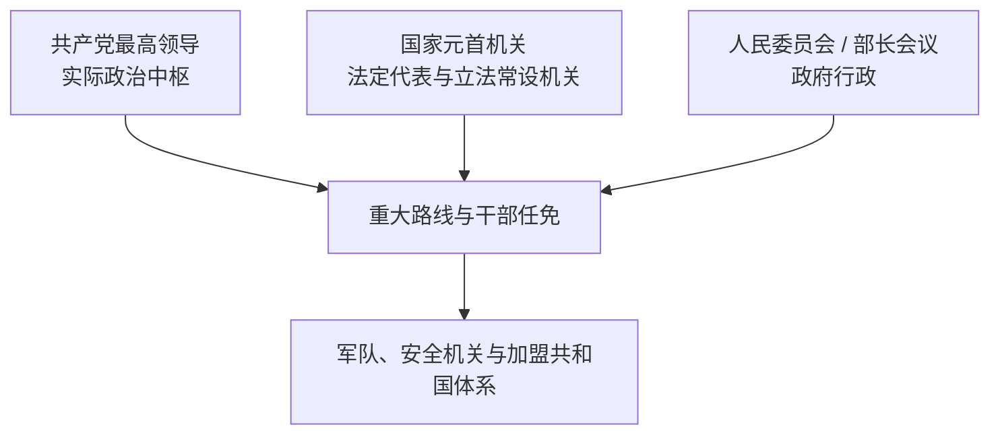

# 苏联国家领导表

[返回苏俄与苏联](/%E4%BA%BA%E6%96%87%E7%A7%91%E5%AD%A6/%E5%8E%86%E5%8F%B2/%E6%AC%A7%E6%B4%B2/%E6%96%AF%E6%8B%89%E5%A4%AB/%E4%B8%9C%E6%96%AF%E6%8B%89%E5%A4%AB/%E8%8B%8F%E4%BF%84%E4%B8%8E%E8%8B%8F%E8%81%94.md)

## 表格原则

苏联不是君主制，“最高领导人”不能用单一世系替代全部法定职务。本页分别列法定国家元首、政府首脑和共产党最高领导。1922—1938年苏联中央执行委员会由各加盟共和国主席共同主持，是集体国家元首；1938年后才形成较清楚的最高苏维埃主席团主席序列。党、国家与政府职务可能由同一人兼任，也可能分立。

## 苏俄法定国家元首：1917—1922年

| 顺序 | 国家元首 / 机关代表 | 任期 | 说明 |
| --- | --- | --- | --- |
| 1 | 列夫・加米涅夫 | 1917年11月9—21日 | 全俄中央执行委员会主席；十月革命后首位短期主席。 |
| 2 | 雅科夫・斯维尔德洛夫 | 1917年11月21日—1919年3月16日 | 全俄中央执行委员会主席，兼具党务与国家组织作用；病逝。 |
| 3 | 米哈伊尔・弗拉基米尔斯基 | 1919年3月16—30日代理 | 斯维尔德洛夫死后代理主席。 |
| 4 | **米哈伊尔・加里宁** | 1919年3月30日—1938年7月19日任苏俄中央执行委员会主席 | 1922年后同时成为苏联集体国家元首成员。 |

## 苏联中央执行委员会共同主席：1922—1938年

| 代表加盟共和国 | 共同主席 | 任期 | 备注 |
| --- | --- | --- | --- |
| 俄罗斯苏维埃联邦社会主义共和国 | **米哈伊尔・加里宁** | 1922—1938年 | 联盟层面最常承担礼仪代表者，但法律上不是唯一国家元首。 |
| 乌克兰苏维埃社会主义共和国 | 格里戈里・彼得罗夫斯基 | 1922—1938年 | 从联盟成立至1938年宪制改组。 |
| 白俄罗斯苏维埃社会主义共和国 | 亚历山大・切尔维亚科夫 | 1922—1937年 | 1937年大清洗中自杀；其后由米哈伊尔・斯塔昆等短期代行共和国代表职能，资料列法不一。 |
| 外高加索苏维埃联邦社会主义共和国 | 纳里曼・纳里曼诺夫 | 1922—1925年 | 1925年去世。 |
| 外高加索苏维埃联邦社会主义共和国 | 加赞法尔・穆萨别科夫 | 1925—1937年 | 外高加索联邦1936年撤销，1937年大清洗中被捕。 |
| 土库曼苏维埃社会主义共和国 | 内迪尔拜・艾塔科夫 | 1925—1937年 | 土库曼与乌兹别克加入后共同主席人数增加。 |
| 乌兹别克苏维埃社会主义共和国 | 法伊祖拉・霍贾耶夫 | 1925—1937年 | 同时长期任乌兹别克政府首脑；大清洗中被捕。 |
| 塔吉克苏维埃社会主义共和国 | 努斯拉图洛・马克苏姆 | 1931—1934年 | 塔吉克成为加盟共和国后列入共同主席。 |
| 塔吉克苏维埃社会主义共和国 | 阿卜杜洛・拉希姆巴耶夫 | 1934—1937年 | 继任塔吉克代表，后在大清洗中被处决。 |

> 这一时期的国家元首是合议机关。不同名录对某些代理人、共和国改组日期的列法有差异；本表列正式长期共同主席，并明确不把加里宁误写成唯一法定元首。

## 最高苏维埃时期法定国家元首：1938—1991年

| 顺序 | 国家元首 | 任期 | 职务与交接 |
| --- | --- | --- | --- |
| 1 | **米哈伊尔・加里宁** | 1938年1月17日—1946年3月19日 | 最高苏维埃主席团主席；从中央执行委员会体制过渡而来。 |
| 2 | 尼古拉・什维尔尼克 | 1946年3月19日—1953年3月15日 | 最高苏维埃主席团主席。 |
| 3 | 克利缅特・伏罗希洛夫 | 1953年3月15日—1960年5月7日 | 最高苏维埃主席团主席。 |
| 4 | 列昂尼德・勃列日涅夫 | 1960年5月7日—1964年7月15日 | 首次任国家元首；尚未成为党最高领导。 |
| 5 | 阿纳斯塔斯・米高扬 | 1964年7月15日—1965年12月9日 | 赫鲁晓夫末期至勃列日涅夫初期。 |
| 6 | 尼古拉・波德戈尔内 | 1965年12月9日—1977年6月16日 | 与总书记、部长会议主席构成常说的集体领导。 |
| 7 | **列昂尼德・勃列日涅夫** | 1977年6月16日—1982年11月10日 | 总书记兼国家元首。 |
| 8 | 瓦西里・库兹涅佐夫 | 1982年11月10日—1983年6月16日代理 | 主席团第一副主席依法代行。 |
| 9 | 尤里・安德罗波夫 | 1983年6月16日—1984年2月9日 | 总书记兼国家元首。 |
| 10 | 瓦西里・库兹涅佐夫 | 1984年2月9日—4月11日代理 | 第二次代理。 |
| 11 | 康斯坦丁・契尔年科 | 1984年4月11日—1985年3月10日 | 总书记兼国家元首。 |
| 12 | 瓦西里・库兹涅佐夫 | 1985年3月10日—7月2日代理 | 第三次代理。 |
| 13 | 安德烈・葛罗米柯 | 1985年7月2日—1988年10月1日 | 最高苏维埃主席团主席。 |
| 14 | **米哈伊尔・戈尔巴乔夫** | 1988年10月1日—1989年5月25日 | 主席团主席。 |
| 15 | **米哈伊尔・戈尔巴乔夫** | 1989年5月25日—1990年3月15日 | 改任最高苏维埃主席，仍为法定国家元首。 |
| 16 | **米哈伊尔・戈尔巴乔夫** | 1990年3月15日—1991年12月25日 | 新设苏联总统；辞职后职务随联盟终结。 |
| 17 | 根纳季・亚纳耶夫 | 1991年8月19—21日自称代总统 | “国家紧急状态委员会”以戈尔巴乔夫健康为由宣布代行；政变失败，合法性不获承认，列为争议夺权而非正常继任。 |

## 苏联政府首脑完整表

| 顺序 | 政府首脑 | 任期 | 机构与关键说明 |
| --- | --- | --- | --- |
| 1 | **弗拉基米尔・列宁** | 1923年7月6日—1924年1月21日 | 苏联人民委员会主席；联盟成立后政府机关于1923年正式运作。 |
| 2 | 阿列克谢・李可夫 | 1924年2月2日—1930年12月19日 | 人民委员会主席；新经济政策退潮中失势。 |
| 3 | 维亚切斯拉夫・莫洛托夫 | 1930年12月19日—1941年5月6日 | 集体化、工业化和大清洗时期政府首脑。 |
| 4 | **约瑟夫・斯大林** | 1941年5月6日—1953年3月5日 | 人民委员会主席，1946年机构改称部长会议主席；战争中兼国防委员会主席和最高统帅。 |
| 5 | 格奥尔基・马林科夫 | 1953年3月5日—1955年2月8日 | 斯大林死后任部长会议主席，早期权力竞争中败给赫鲁晓夫。 |
| 6 | 尼古拉・布尔加宁 | 1955年2月8日—1958年3月27日 | 部长会议主席；1957年“反党集团”事件后地位下降。 |
| 7 | **尼基塔・赫鲁晓夫** | 1958年3月27日—1964年10月15日 | 第一书记兼政府首脑。 |
| 8 | **阿列克谢・柯西金** | 1964年10月15日—1980年10月23日 | 长期部长会议主席；推行1965年经济改革，后受官僚结构限制。 |
| 9 | 尼古拉・吉洪诺夫 | 1980年10月23日—1985年9月27日 | 勃列日涅夫晚期至戈尔巴乔夫初期。 |
| 10 | 尼古拉・雷日科夫 | 1985年9月27日—1991年1月14日 | 改革时期政府首脑；经济失衡和联盟—共和国冲突加剧。 |
| 11 | 瓦连京・帕夫洛夫 | 1991年1月14日—8月28日 | 新设“总理”；参与八一九事件后被免职。 |
| 12 | 伊万・西拉耶夫 | 1991年8月24日—12月26日 | 苏联国民经济运行管理委员会主席、后跨共和国经济委员会主席；实际主持残余行政协调，不是按旧制产生的正式部长会议主席。 |

## 共产党最高领导完整表

| 顺序 | 领导人 | 主导时期 | 正式职务与权力性质 |
| --- | --- | --- | --- |
| 1 | **弗拉基米尔・列宁** | 1917—1924年 | 党中央公认领袖、政府首脑；没有后来意义的总书记最高职制。 |
| 2 | **约瑟夫・斯大林** | 1924—1953年 | 1922年任总书记；通过书记处、干部任命和政治局斗争建立个人集权。 |
| 3 | 格奥尔基・马林科夫 | 1953年3—9月权力过渡 | 斯大林死后短期主持书记处并任政府首脑；无正式“最高领导人”法定任命，随后辞去书记工作。 |
| 4 | **尼基塔・赫鲁晓夫** | 1953年9月—1964年10月 | 中央第一书记；1957年击败反党集团，1964年被中央全会撤换。 |
| 5 | **列昂尼德・勃列日涅夫** | 1964年10月—1982年11月 | 第一书记，1966年后称总书记；后期兼国家元首。 |
| 6 | 尤里・安德罗波夫 | 1982年11月—1984年2月 | 总书记；任期短且长期病重。 |
| 7 | 康斯坦丁・契尔年科 | 1984年2月—1985年3月 | 总书记；延续老年政治局过渡。 |
| 8 | **米哈伊尔・戈尔巴乔夫** | 1985年3月—1991年8月24日 | 总书记；推动改革与公开性，1990年另任苏联总统；八一九事件后辞去总书记。 |
| 9 | 弗拉基米尔・伊瓦什科 | 1991年8月24—29日代行总书记事务 | 副总书记在戈尔巴乔夫辞职后短暂代行；联盟层面党的活动很快被暂停，不能视为稳定最高领导。 |

## 实际权力如何变化

- 列宁时期党政高度重叠但仍有政治局集体讨论；斯大林通过人事、警察和个人崇拜形成远强于法定国家元首的统治。
- 1953—1964年经历马林科夫、贝利亚、赫鲁晓夫等竞争，不能把某一法定职务自动等同最高权力。
- 勃列日涅夫时代形成总书记主导、政治局协调、政府执行的稳定结构；总书记晚年失能使部门利益固化。
- 戈尔巴乔夫另设总统并引入竞争性选举，却同时削弱党垄断；俄罗斯等加盟共和国取得主权和自身总统后，联盟中央失去财政、军政和法律执行基础。

## 终结过程

- 结构因素：计划经济效率下降、财政与供应失衡、民族—加盟共和国主权诉求、党国合法性衰退。
- 外部压力：军备竞赛、阿富汗战争和国际能源价格变化加重成本，但不能单独解释解体。
- 直接触发：1991年八一九事件失败使联盟中央权威崩溃；乌克兰独立公投、别洛韦日协议与阿拉木图文件先后终止联盟。
- 法律终点：戈尔巴乔夫12月25日辞职，最高苏维埃共和国院12月26日确认苏联停止存在。俄罗斯承续联合国席位和多数中央资产安排，不等于对其他加盟共和国主权的“唯一继承”。

## 相关笔记

- 国家形成、战争、改革与解体过程见[苏俄与苏联](/%E4%BA%BA%E6%96%87%E7%A7%91%E5%AD%A6/%E5%8E%86%E5%8F%B2/%E6%AC%A7%E6%B4%B2/%E6%96%AF%E6%8B%89%E5%A4%AB/%E4%B8%9C%E6%96%AF%E6%8B%89%E5%A4%AB/%E8%8B%8F%E4%BF%84%E4%B8%8E%E8%8B%8F%E8%81%94.md)。
- 加盟共和国分别见[乌克兰苏维埃政权](/%E4%BA%BA%E6%96%87%E7%A7%91%E5%AD%A6/%E5%8E%86%E5%8F%B2/%E6%AC%A7%E6%B4%B2/%E6%96%AF%E6%8B%89%E5%A4%AB/%E4%B8%9C%E6%96%AF%E6%8B%89%E5%A4%AB/%E4%B9%8C%E5%85%8B%E5%85%B0%E8%8B%8F%E7%BB%B4%E5%9F%83%E6%94%BF%E6%9D%83.md)和[白俄罗斯苏维埃政权](/%E4%BA%BA%E6%96%87%E7%A7%91%E5%AD%A6/%E5%8E%86%E5%8F%B2/%E6%AC%A7%E6%B4%B2/%E6%96%AF%E6%8B%89%E5%A4%AB/%E4%B8%9C%E6%96%AF%E6%8B%89%E5%A4%AB/%E7%99%BD%E4%BF%84%E7%BD%97%E6%96%AF%E8%8B%8F%E7%BB%B4%E5%9F%83%E6%94%BF%E6%9D%83.md)。
- 战争专题见[苏联卫国战争](/%E4%BA%BA%E6%96%87%E7%A7%91%E5%AD%A6/%E5%8E%86%E5%8F%B2/%E6%AC%A7%E6%B4%B2/%E6%96%AF%E6%8B%89%E5%A4%AB/%E4%B8%9C%E6%96%AF%E6%8B%89%E5%A4%AB/%E8%8B%8F%E8%81%94%E5%8D%AB%E5%9B%BD%E6%88%98%E4%BA%89.md)。
