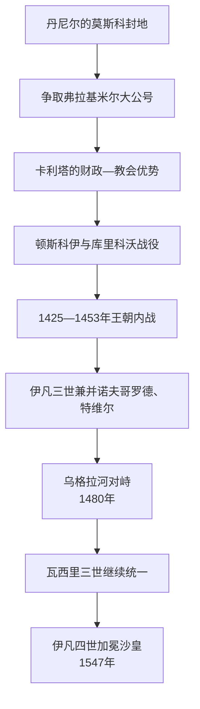

# 莫斯科公国

## 时间

约1283—1547年；1389年后兼有弗拉基米尔大公号，1547年伊凡四世加冕沙皇后进入沙皇俄国阶段。

## 概括

莫斯科从亚历山大・涅夫斯基幼子丹尼尔的次级封地成长为东北罗斯核心。其崛起不是单靠“反蒙古”：早期君主借金帐汗廷册封、代征贡赋和镇压对手积累优势，又通过购买、婚姻、继承、教会驻节与战争兼并土地。15世纪内战后，大公权力压倒旁支；伊凡三世兼并诺夫哥罗德和特维尔、1480年停止对大帐持续纳贡，瓦西里三世继续统一。幼年即位的伊凡四世1547年加冕“全罗斯沙皇”，标志名号和政治阶段变化。

## 建立背景

- 莫斯科位于奥卡—伏尔加河网与通往诺夫哥罗德路线之间，有木材、农业与交通条件，但13世纪末仍远弱于特维尔、梁赞和下诺夫哥罗德。
- 丹尼尔继承的土地小，反而避免早期兄弟分封进一步碎裂。他兼并科洛姆纳并获得佩列斯拉夫尔遗产，控制河运与人口。
- 金帐汗国把弗拉基米尔大公号授予不同罗斯君主，以贡赋、忠诚和宫廷联盟制衡各支。莫斯科善用这一体系，并非从一开始就独立。

## 崛起过程

### 丹尼尔至卡利塔：封地积累

尤里・丹尼洛维奇与特维尔米哈伊尔争夺大公号，以婚姻联系乌兹别克汗宫廷。双方领袖先后在汗廷被杀，竞争极其暴力。1327年特维尔居民反抗金帐使团，伊凡・卡利塔参加镇压并获得大公号和征贡优势。都主教彼得、费奥格诺斯特先后偏向莫斯科，使其成为宗教中心。财政积累来自贡赋中介、土地购买和较稳定治安，不宜浪漫化为纯粹和平发展。

### 顿斯科伊时期：军事声望与有限独立

德米特里幼年时，大公号曾落入苏兹达尔；都主教阿列克谢和波雅尔集团帮助其恢复。1378年沃扎河、1380年库里科沃战役击败马迈，成为反草原统治的象征。然而1382年得到正统汗位的脱脱迷失焚毁莫斯科，贡赋恢复。真正长远变化是德米特里把大公号作为家产传给瓦西里一世，减少汗廷选择余地。

### 1425—1453年：莫斯科内战

瓦西里一世死后，十岁之子瓦西里二世依据父子继承即位；叔父尤里依据旧兄弟轮转权利挑战。尤里、瓦西里“斜眼”、德米特里・舍米亚卡多次夺取莫斯科，瓦西里二世被刺瞎仍复位。战争牵涉金帐、立陶宛、教会、城市和贵族选择。瓦西里最终获胜后，旁支被消灭或流亡，父子继承和中央军事动员显著强化。

### 伊凡三世：领土整合与主权转折

- 1463年兼并雅罗斯拉夫尔，1478年取消诺夫哥罗德共和国独立，1485年吞并特维尔；大量土地和贵族被重新安置。
- 1472年迎娶拜占庭末代皇族索菲娅・巴列奥略，双头鹰和宫廷礼仪逐步发展；“第三罗马”观念在后续教会文献中成熟，不能倒推为当时完整国策。
- 1480年大帐汗阿赫马德与莫斯科军在乌格拉河对峙后撤退，常视为长期贡属终点。金帐早已分裂，莫斯科仍与克里米亚汗国等结盟或交战，不是草原关系突然消失。
- 1497年全国法典规范司法和官员收费，并限制农民在特定时段迁移，是中央法权和后来农奴化的重要节点。
- 伊凡晚年发生长孙德米特里与次子瓦西里两派继承斗争；最终瓦西里三世即位，说明集中化仍伴随宫廷派系。

### 瓦西里三世与幼主过渡

瓦西里三世兼并普斯科夫、斯摩棱斯克和梁赞，独立罗斯公国所剩无几。他为获得男性继承人休妻再婚，伊凡四世三岁继位。叶连娜・格林斯卡娅摄政推行货币改革、修筑防线；1538年她死后，舒伊斯基、别尔斯基等波雅尔争斗。1547年伊凡加冕沙皇，宣示高于普通大公的普世和帝国权威。

## 统治结构

| 结构 | 内容 |
| --- | --- |
| 大公宫廷 | 掌握土地分配、外交和最高司法；依靠侍从贵族与书记官体系。 |
| 服役贵族 | 以领地换取骑兵和行政服务，逐步与旧世袭波雅尔并存。 |
| 分封亲王 | 王族旁支持有封地，15世纪内战后被逐步剥夺独立外交和军事权。 |
| 教会 | 都主教和修道院提供合法性、识字官僚与土地资源；教会内部也有财产与改革争论。 |
| 城市与地方 | 总督代大公征税司法；诺夫哥罗德等并入后地方精英被迁徙、重组。 |
| 汗国关系 | 册封、贡赋、外交、婚姻和战争并存；莫斯科从宗主体系参与者转为多个后金帐政权的竞争者。 |

## 重要事件

| 时间 | 事件 | 转折 |
| --- | --- | --- |
| 1303年 | 获得科洛姆纳等地 | 控制奥卡河节点。 |
| 1327—1328年 | 特维尔起事与镇压 | 莫斯科取得大公号和征贡优势。 |
| 1380年 | 库里科沃战役 | 军事声望上升。 |
| 1382年 | 脱脱迷失焚毁莫斯科 | 说明尚未摆脱汗权。 |
| 1425—1453年 | 王朝内战 | 父子继承胜出，旁支削弱。 |
| 1478年 | 吞并诺夫哥罗德 | 北方贸易与土地并入。 |
| 1480年 | 乌格拉河对峙 | 长期贡属关系终止。 |
| 1485年 | 吞并特维尔 | 东北最强竞争者消失。 |
| 1497年 | 全国法典 | 中央司法与社会控制加强。 |
| 1510、1521年 | 兼并普斯科夫、梁赞 | 主要独立罗斯公国终结。 |
| 1547年 | 伊凡四世加冕 | 转入沙皇俄国。 |

## 崛起条件与阶段终结

### 崛起条件

莫斯科兼具河运位置、相对人口安全区、王朝不再反复分封、教会驻节和金帐册封优势。历代君主持续时间较长，能以小规模累积取代一次性扩张。对手特维尔内部分裂、诺夫哥罗德寡头政治与立陶宛关系、金帐汗国分裂也提供外部机会。

### 暴力与代价

集中化伴随诺夫哥罗德居民和贵族迁徙、土地没收、贡赋、战争和农民流动受限。把统一只写成“民族解放”会遮蔽莫斯科曾借汗廷压制同属罗斯的竞争者，也会忽略地方制度被取消。

### 阶段终结

1547年不是政权被灭亡，而是同一王朝、都城和官僚在称号与统治理念上升级。莫斯科公国的领土整合成果成为沙皇俄国基础，伊凡四世仍是同一名君主。

## 君主世系

完整表含瓦西里二世多次失位、尤里和舍米亚卡争位、幼主摄政，见[莫斯科大公世系表](/%E4%BA%BA%E6%96%87%E7%A7%91%E5%AD%A6/%E5%8E%86%E5%8F%B2/%E6%AC%A7%E6%B4%B2/%E6%96%AF%E6%8B%89%E5%A4%AB/%E4%B8%9C%E6%96%AF%E6%8B%89%E5%A4%AB/%E8%8E%AB%E6%96%AF%E7%A7%91%E5%A4%A7%E5%85%AC%E4%B8%96%E7%B3%BB%E8%A1%A8.md)。

## 演变关系

- 前一节点：[弗拉基米尔-苏兹达尔大公国](/%E4%BA%BA%E6%96%87%E7%A7%91%E5%AD%A6/%E5%8E%86%E5%8F%B2/%E6%AC%A7%E6%B4%B2/%E6%96%AF%E6%8B%89%E5%A4%AB/%E4%B8%9C%E6%96%AF%E6%8B%89%E5%A4%AB/%E5%BC%97%E6%8B%89%E5%9F%BA%E7%B1%B3%E5%B0%94-%E8%8B%8F%E5%85%B9%E8%BE%BE%E5%B0%94%E5%A4%A7%E5%85%AC%E5%9B%BD.md)。
- 后一节点：[沙皇俄国](/%E4%BA%BA%E6%96%87%E7%A7%91%E5%AD%A6/%E5%8E%86%E5%8F%B2/%E6%AC%A7%E6%B4%B2/%E6%96%AF%E6%8B%89%E5%A4%AB/%E4%B8%9C%E6%96%AF%E6%8B%89%E5%A4%AB/%E6%B2%99%E7%9A%87%E4%BF%84%E5%9B%BD.md)。
