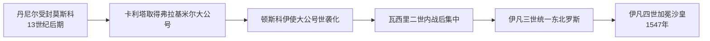

# 莫斯科大公世系表

[返回莫斯科公国](/%E4%BA%BA%E6%96%87%E7%A7%91%E5%AD%A6/%E5%8E%86%E5%8F%B2/%E6%AC%A7%E6%B4%B2/%E6%96%AF%E6%8B%89%E5%A4%AB/%E4%B8%9C%E6%96%AF%E6%8B%89%E5%A4%AB/%E8%8E%AB%E6%96%AF%E7%A7%91%E5%85%AC%E5%9B%BD.md)

## 范围与名号

莫斯科在13世纪后半叶由次级封地成长为东北罗斯核心。表中先列莫斯科公，再列取得弗拉基米尔大公号后的同一王朝统治者，直至伊凡四世1547年改以“全罗斯沙皇”加冕。个别幼主时期由母后、都主教或波雅尔集团摄政，不能把法定君主与实际执政者混为一人。

## 完整世系表

| 顺序 | 统治者 | 在位 | 与前任关系 | 关键事件 / 摄政 / 争位 |
| --- | --- | --- | --- | --- |
| 1 | **丹尼尔・亚历山德罗维奇** | 约1283—1303年 | 亚历山大・涅夫斯基幼子 | 莫斯科公国王朝奠基者；兼并科洛姆纳和佩列斯拉夫尔，控制河运节点。早年受封时间可能早至1260年代，实际独立执政约始于1280年代。 |
| 2 | 尤里・丹尼洛维奇 | 1303—1325年 | 丹尼尔长子 | 与特维尔争夺弗拉基米尔大公号；1318—1322年持大公号，1325年在汗廷被德米特里・特维尔杀死。 |
| 3 | **伊凡一世・丹尼洛维奇“卡利塔”** | 1325—1340年 | 尤里之弟 | 借1327年特维尔起事后秩序重组取得大公号；代汗廷征收贡赋，积累土地和财政，莫斯科都主教地位上升。 |
| 4 | 谢苗・伊凡诺维奇“骄傲者” | 1340—1353年 | 伊凡一世长子 | 延续对大公号与诺夫哥罗德关系的控制；在黑死病中去世，成年男性继承人皆亡。 |
| 5 | 伊凡二世・伊凡诺维奇“温和者” | 1353—1359年 | 谢苗之弟 | 权力相对受都主教阿列克谢与波雅尔制约；其死后继承人年幼。 |
| 6 | **德米特里・伊凡诺维奇“顿斯科伊”** | 1359—1389年；1362/1363年起兼弗拉基米尔大公 | 伊凡二世之子 | 幼年由都主教阿列克谢等辅政；库里科沃战役强化象征地位，1382年莫斯科仍被脱脱迷失焚毁；遗嘱把大公号传子。 |
| 7 | 瓦西里一世・德米特里耶维奇 | 1389—1425年 | 德米特里长子 | 兼并下诺夫哥罗德等地；在金帐分裂、立陶宛扩张与帖木儿威胁间维持国家。妻索菲娅为立陶宛维陶塔斯之女。 |
| 8 | 瓦西里二世・瓦西里耶维奇“失明者” | 1425—1433年、1434年、1434—1446年、1447—1462年 | 瓦西里一世之子 | 即位时十岁；与叔父尤里及堂兄瓦西里・斜眼、德米特里・舍米亚卡进行长期内战，1446年被刺瞎后仍复位，最终压制旁支。 |
| 9 | 尤里・德米特里耶维奇 | 1433年、1434年 | 德米特里・顿斯科伊之子，瓦西里二世之叔 | 依据旧轮转传统挑战侄儿，两度夺取莫斯科；第二次即位后不久死亡。 |
| 10 | 瓦西里・尤里耶维奇“斜眼” | 1434年 | 尤里长子 | 父死后继位但未获兄弟支持，败后被刺瞎。 |
| 11 | 德米特里・尤里耶维奇“舍米亚卡” | 1446—1447年实际占据莫斯科 | 尤里之子 | 绑架并刺瞎瓦西里二世；因教会、城市与波雅尔支持不足被逐，1453年死亡。 |
| 12 | **伊凡三世・瓦西里耶维奇“大帝”** | 1462—1505年 | 瓦西里二世之子；曾于1450年代协助父亲 | 兼并雅罗斯拉夫尔、诺夫哥罗德、特维尔；1480年乌格拉河对峙结束对大帐汗国的纳贡从属；1497年法典和宫廷礼仪推进集中化。 |
| 13 | 瓦西里三世・伊凡诺维奇 | 1505—1533年 | 伊凡三世之子 | 兼并普斯科夫、斯摩棱斯克与梁赞，消除主要独立公国；继承安排因长期无子而紧张。 |
| 14 | **伊凡四世・瓦西里耶维奇“雷帝”** | 1533—1547年为莫斯科大公；1547—1584年为沙皇 | 瓦西里三世之子 | 三岁继位；母亲叶连娜・格林斯卡娅1533—1538年摄政，其死后舒伊斯基、别尔斯基等波雅尔争权；1547年加冕沙皇，世系续见沙皇表。 |

## 幼主、复位与继承说明

| 时段 | 法定君主 | 主要执政者 | 性质 |
| --- | --- | --- | --- |
| 1359—约1367年 | 德米特里・顿斯科伊 | 都主教阿列克谢、母族与莫斯科波雅尔 | 幼主辅政，同时与苏兹达尔争夺大公号。 |
| 1425—1453年 | 瓦西里二世及争位者 | 索菲娅・维托夫托芙娜、都主教、波雅尔和诸公联盟 | 王朝内战；表中逐次列出实际占领莫斯科者，未把争位期并为一项。 |
| 1533—1538年 | 伊凡四世 | 叶连娜・格林斯卡娅摄政 | 推行货币统一和防务建设。 |
| 1538—1547年 | 伊凡四世 | 舒伊斯基、别尔斯基等波雅尔集团轮替 | 法定大公未变，实际宫廷权力反复。 |

## 崛起机制

- 莫斯科处于伏尔加—奥卡河交通和森林农业区的交汇处，早期虽小，却较少直接暴露于草原突袭。
- 获得金帐汗诏和代征贡赋权，使莫斯科能把宗主权转化为财政与政治优势；这不是简单“反蒙古”直线。
- 都主教驻节、土地购买、婚姻、继承和军事兼并共同扩张，不是单靠一场战争。
- 1425—1453年内战淘汰旁支后，父子继承和中央宫廷更稳；1480年后不再持续纳贡，才进入主权整合阶段。

## 相关笔记

- 背景与阶段分析见[莫斯科公国](/%E4%BA%BA%E6%96%87%E7%A7%91%E5%AD%A6/%E5%8E%86%E5%8F%B2/%E6%AC%A7%E6%B4%B2/%E6%96%AF%E6%8B%89%E5%A4%AB/%E4%B8%9C%E6%96%AF%E6%8B%89%E5%A4%AB/%E8%8E%AB%E6%96%AF%E7%A7%91%E5%85%AC%E5%9B%BD.md)。
- 前置名号见[东北罗斯与弗拉基米尔大公世系表](/%E4%BA%BA%E6%96%87%E7%A7%91%E5%AD%A6/%E5%8E%86%E5%8F%B2/%E6%AC%A7%E6%B4%B2/%E6%96%AF%E6%8B%89%E5%A4%AB/%E4%B8%9C%E6%96%AF%E6%8B%89%E5%A4%AB/%E4%B8%9C%E5%8C%97%E7%BD%97%E6%96%AF%E4%B8%8E%E5%BC%97%E6%8B%89%E5%9F%BA%E7%B1%B3%E5%B0%94%E5%A4%A7%E5%85%AC%E4%B8%96%E7%B3%BB%E8%A1%A8.md)。
- 后续称号见[俄罗斯沙皇与皇帝世系表](/%E4%BA%BA%E6%96%87%E7%A7%91%E5%AD%A6/%E5%8E%86%E5%8F%B2/%E6%AC%A7%E6%B4%B2/%E6%96%AF%E6%8B%89%E5%A4%AB/%E4%B8%9C%E6%96%AF%E6%8B%89%E5%A4%AB/%E4%BF%84%E7%BD%97%E6%96%AF%E6%B2%99%E7%9A%87%E4%B8%8E%E7%9A%87%E5%B8%9D%E4%B8%96%E7%B3%BB%E8%A1%A8.md)。
