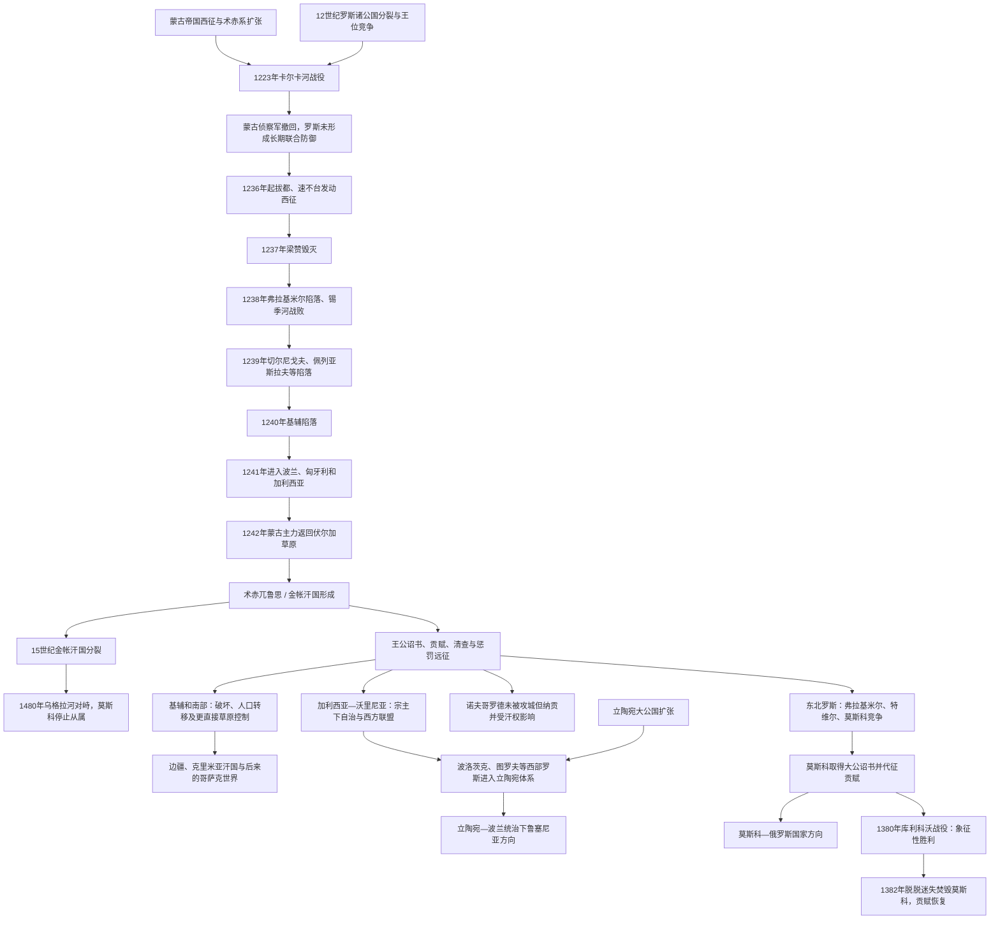

# 蒙古征服与罗斯分流

## 时间

1223年首次大规模交锋；1237—1241年征服主阶段；罗斯诸公国对金帐汗国的贡赋依附持续至15世纪，地区退出时间不同

## 概括

13世纪蒙古征服摧毁或重创许多罗斯城市，却没有把整个旧罗斯地区用同一种方式“直接并吞”。拔都、速不台等在1237—1240年先后攻陷梁赞、弗拉基米尔、切尔尼戈夫和基辅，迫使幸存王公接受术赤兀鲁思及后来金帐汗国的最高权威。汗廷通常让留里克王公在本地继续统治，通过诏书、贡赋、人口清查、人质和军事惩罚控制继承与财政；草原、伏尔加河下游和部分南部地区受更直接统治，森林地带则多保留王公、城市议会和东正教会结构。

征服加速而非单独创造了罗斯政治中心的分流。东北罗斯的弗拉基米尔、特维尔、莫斯科等竞争“弗拉基米尔大公”诏书，最终莫斯科以替汗征税、教会支持、王朝策略和军事扩张取得优势；诺夫哥罗德未被蒙古军直接攻陷，却承认汗权并缴纳贡赋；西南的加利西亚—沃里尼亚一度在蒙古宗主下寻求教宗、匈牙利和波兰联盟；西部罗斯诸地逐步进入立陶宛大公国，后来同波兰政治结合；基辅和南部草原人口、城市网络受破坏最重，又成为金帐、立陶宛、波兰和地方势力争夺区。

“蒙古—鞑靼枷锁”是后世形成的强烈历史概念，能概括征服、贡赋和政治从属，却易把两百多年关系写成完全停滞和单向压迫。战争死亡、奴役和税负真实而重大；同时贸易、外交、军事技术、官僚实践及跨族精英合作也持续存在。蒙古因素必须同罗斯诸公国内部分裂、波兰—立陶宛扩张、东正教网络和草原经济一起解释。

## 征服与分流图

## 征服前的罗斯格局

11世纪末以后，留里克王朝实行复杂的资序与分封继承，基辅大公名义尊贵却难以持续控制全罗斯。诺夫哥罗德、弗拉基米尔—苏兹达尔、斯摩棱斯克、切尔尼戈夫、波洛茨克、加利西亚—沃里尼亚等各有王朝分支、贵族和贸易利益。王公常借草原波洛韦茨／库曼人参与内战，也同其通婚。

这种分裂不等于文化共同体消失：东正教会、教会斯拉夫书写、留里克血缘和“罗斯之地”观念仍连接各地。但没有可长期动员全境军队和税收的中央机构。城市和王公各自判断威胁，使蒙古军能够逐一打击。

12世纪基辅已在1169年遭安德烈·博戈柳布斯基联盟劫掠，东北和西南中心在蒙古入侵前已经上升。因此，蒙古征服是重大断裂，却不是“统一基辅国家突然分成三支”的唯一起点。

## 1223年卡尔卡河战役

成吉思汗将领哲别、速不台在追击花剌子模残余和穿越高加索后进入黑海草原，击败阿兰、钦察等力量。钦察汗向罗斯王公求援，基辅、加利西亚、切尔尼戈夫、斯摩棱斯克等军队组成临时联盟。

罗斯—钦察军缺乏统一指挥，追击蒙古佯退后在卡尔卡河遭包围。部分王公被俘处死，钦察和罗斯军损失惨重。蒙古军随后向东撤退，并未立即占领罗斯。战役提供了警告，但罗斯王公仍忙于内部竞争，也不了解蒙古帝国将在十余年后发动全面西征。

## 1237—1241年征服过程

### 梁赞和东北罗斯

1236年蒙古军征服伏尔加保加利亚，翌年要求梁赞诸王公臣服。谈判失败后，梁赞城于1237年12月陷落并被毁。蒙古军沿奥卡、克利亚济马河推进，攻克科洛姆纳、莫斯科、弗拉基米尔等地。弗拉基米尔大公尤里二世离城集结军队，其家族多在城破时死亡；1238年3月锡季河战役中尤里战败身亡。

蒙古军围攻小城和堡垒的时长不一，科泽利斯克抵抗尤其持久。春季泥泞、森林补给和战略选择使主力没有继续攻击诺夫哥罗德。诺夫哥罗德因此避免直接毁城，不等于完全战胜蒙古，后来仍接受清查和纳贡。

### 南部和基辅

1239年蒙古军攻克佩列亚斯拉夫、切尔尼戈夫等地。拔都使者要求基辅投降，守军和居民拒绝。1240年末蒙古军以攻城器械突破城墙，基辅遭严重毁坏和人口损失，圣索菲亚等少数建筑幸存。考古和旅行者记载显示城市规模急剧缩小，但“全城无人”式表述可能带有修辞。

蒙古军随后进入加利西亚—沃里尼亚，攻占多座城市；坚固的霍尔姆等中心可能避免直接陷落。1241年军队分路进入波兰和匈牙利，在莱格尼察、莫希等战役获胜。1242年撤回伏尔加草原，原因包括大汗窝阔台去世后的继承政治、补给和建立新西部汗国需要，不能归为单一欧洲抵抗。

## 金帐汗国统治结构

### 术赤兀鲁思到金帐汗国

拔都的领地属于成吉思汗长子术赤一系，核心沿伏尔加河下游和钦察草原。拔都建立萨莱等汗廷中心，统治突厥语钦察、蒙古人、伏尔加保加尔、阿兰、罗斯及其他社群。后世称“金帐汗国”，同时代名称多为术赤兀鲁思或钦察汗国。

统治精英逐步突厥化并在14世纪伊斯兰化。对罗斯诸公国的关系由汗廷最高权威、王公地方统治和教会特权共同构成。

### 王公诏书

罗斯王公需要赴汗廷获得“雅尔里克”诏书，以确认公位，特别是弗拉基米尔大公称号。汗可在同族竞争者之间选择，要求礼仪服从、人质和军役。王公利用汗权排挤对手，汗廷也借王公维持地方秩序。

这种制度没有取消留里克王朝，反而使某些分支获得垄断机会。王公之争不能简单解释为被动受辱，他们也主动告发、结盟和请求蒙古军惩罚竞争城市。

### 清查与贡赋

1250年代蒙古官员在东北罗斯和诺夫哥罗德等地推行人口、户籍及税源清查。早期“八思哈”官员和税吏直接监督，地方反抗后，汗廷逐渐让获得信任的王公代征贡赋。常规贡赋之外还有交通、军需和临时摊派，负担因时期和地区不同。

征税支持汗国军队和贸易，也造成逃亡、债务和地方不满。惩罚远征可焚毁拒贡城市，使“是否按时交贡”成为王公生存关键。

### 东正教会

汗廷通常给予东正教会和神职人员免税、财产与司法特权，希望其祈祷并维持社会秩序。教会因此在战争毁坏后恢复较快，基辅都主教驻地逐步转向弗拉基米尔和莫斯科。教会并非汗国统治的简单反对派，也会支持善于维持和平和保护财产的王公。

宗教宽容不消除征服暴力；它是蒙古统治多宗教帝国的政策和地方合作机制。

## 地区分流

### 东北罗斯

弗拉基米尔大公保持名义首位，苏兹达尔、特维尔、莫斯科、下诺夫哥罗德等分支竞争。亚历山大·涅夫斯基一面抵抗瑞典和利沃尼亚骑士团，一面接受拔都及其继承者宗主权，认为避免再次蒙古毁灭更现实。其弟安德烈寻求反抗后遭1252年“涅夫留伊军”惩罚，亚历山大取得大公位。

14世纪特维尔和莫斯科争夺大公诏书。莫斯科的尤里、伊凡一世等同汗廷密切合作，伊凡一世获得替汗征收较广贡赋的地位，并把财富、教会驻地和土地集中于莫斯科。莫斯科崛起不是单靠“继承基辅”，而是利用金帐政治、王朝婚姻、地理与教会资源。

### 诺夫哥罗德和西北

诺夫哥罗德未遭1238年直接围城，保留城市议会、商人和王公邀请制度。它面对瑞典、丹麦和德意志骑士团的西方压力，又需同弗拉基米尔大公及汗廷协调。1250年代清查在城内引发抵制，亚历山大·涅夫斯基迫使诺夫哥罗德接受贡赋安排。

因此，西北不是“完全未受蒙古统治”，而是通过王公和贡赋间接纳入，城市制度保存程度较高。普斯科夫后来逐渐取得更大自主。

### 加利西亚—沃里尼亚

罗曼·姆斯季斯拉维奇在1199年结合加利西亚和沃里尼亚，其子丹尼尔经历王公竞争、匈牙利—波兰干预和蒙古征服。丹尼尔于1246年赴拔都汗廷承认宗主，保留本国行政并继续向西外交。1253年他接受教宗使节加冕为“罗斯国王”，试图争取反蒙古联盟，却没有获得足够西方军事支持。

丹尼尔一度清除部分蒙古据点，1259年在将领布伦代压力下拆毁若干城防。其国家仍保持活力，直到14世纪王朝绝嗣和波兰、立陶宛竞争导致分割。西南罗斯并非征服后立即归波兰，也不是完全独立于汗国。

### 西部罗斯和立陶宛

波洛茨克、图罗夫—平斯克、黑罗斯及今日白俄罗斯、乌克兰西部多地在13—14世纪逐步进入立陶宛大公国。立陶宛统治者通常保留鲁塞尼亚王公、东正教、地方成文法和鲁塞尼亚书写语，国家人口中东斯拉夫语居民占很大比例。

立陶宛扩张有战争、婚姻、继承和地方精英寻求保护等多种方式。1362年前后蓝水之战后，基辅和波多利亚等地更深进入立陶宛势力。此路线后来经克雷沃联合、卢布林联合进入波兰—立陶宛共同国家，深刻影响乌克兰和白俄罗斯历史。

### 基辅、南部和草原

基辅毁坏后仍是宗教和象征中心，却不再恢复旧罗斯首位。当地王公更频繁由汗廷或邻近强权安排，14世纪进入立陶宛体系。佩列亚斯拉夫等南部公国受破坏更大，人口向森林区和西北迁移。

黑海—里海草原成为金帐汗国核心经济空间，城市、牧业、奴隶贸易和欧亚商路发展。不能把“南部直接并吞”理解为所有今日乌克兰土地都变成无居民草原；森林草原城市、加利西亚—沃里尼亚和基辅各有不同制度。

## 反抗、合作与汗国变化

### 1252年和1293年惩罚远征

汗廷利用远征惩罚不服王公或重新分配权力。1252年涅夫留伊军击败安德烈·雅罗斯拉维奇，1293年“杜登军”毁坏多座东北城市。暴力提醒王公汗权仍具实质军事基础，也促使地方精英优先维持贡赋和平。

### 1327年特维尔起义

特维尔居民反抗驻当地的蒙古使团，莫斯科的伊凡一世同汗国军队参与镇压。特维尔遭重创，莫斯科获得政治与征税优势。事件显示罗斯城市的反蒙古情绪真实存在，也显示王公可借蒙古力量打败同族竞争者。

### 库利科沃和脱脱迷失

1380年，莫斯科大公德米特里在库利科沃击败权臣马麦的军队，成为跨罗斯反抗和莫斯科领导权的重要象征。马麦并非获普遍承认的术赤系大汗，金帐合法汗脱脱迷失随后统一汗国。1382年脱脱迷失攻陷并焚毁莫斯科，贡赋恢复。

库利科沃不是当年立即结束“蒙古统治”，但它证明罗斯联盟能在野战中击败强大草原军队，并为莫斯科历史叙事积累声望。

### 15世纪分裂和乌格拉河

帖木儿1395年打击脱脱迷失并破坏金帐城市，内战、贸易变化及地方汗系竞争促成喀山、克里米亚、阿斯特拉罕、大帐等政权分裂。罗斯王公得以更灵活结盟和拒贡。

1480年，莫斯科大公伊凡三世与大帐汗阿合马在乌格拉河对峙，双方撤军，莫斯科此后不再承认大帐宗主。该事件常视为从属终点；事实上贡赋早有中断和恢复，莫斯科仍需同克里米亚、喀山等汗国战争或结盟。

## 重要事件

| 时间 | 事件 | 直接结果 | 长期意义 |
|---|---|---|---|
| 1223年 | 卡尔卡河战役 | 罗斯—钦察联盟惨败，蒙古侦察军后撤 | 暴露罗斯缺乏统一指挥。 |
| 1236年 | 伏尔加保加利亚被征服 | 蒙古建立进攻罗斯基地 | 西征进入定居和征税阶段。 |
| 1237年 | 梁赞陷落 | 梁赞公国遭毁灭性打击 | 全面征服罗斯开始。 |
| 1238年 | 弗拉基米尔陷落、锡季河战役 | 尤里二世死亡，东北主力败亡 | 东北王公转入汗廷确认体系。 |
| 1239—1240年 | 佩列亚斯拉夫、切尔尼戈夫、基辅陷落 | 南部城市和人口重创 | 基辅政治中心地位不可逆下降。 |
| 1241年 | 蒙古军进入波兰、匈牙利 | 莱格尼察、莫希等胜利 | 罗斯征服成为欧亚西征一环。 |
| 1243年前后 | 雅罗斯拉夫二世获汗廷确认 | 弗拉基米尔大公进入诏书体系 | 王公地方统治与汗权结合。 |
| 1246年 | 丹尼尔赴拔都汗廷 | 加利西亚—沃里尼亚承认宗主 | 西南保留自治并继续西方外交。 |
| 1250年代 | 人口清查和贡赋制度扩大 | 诺夫哥罗德等地也纳入征税 | 从军事征服转向稳定财政支配。 |
| 1252年 | 涅夫留伊惩罚远征 | 安德烈失势、亚历山大获大公位 | 汗权介入东北王位竞争。 |
| 1253年 | 丹尼尔受教宗加冕 | 获“罗斯国王”称号 | 反蒙古西方联盟未获足够军援。 |
| 1327年 | 特维尔起义 | 蒙古—莫斯科联军镇压 | 莫斯科在大公竞争中取得优势。 |
| 1380年 | 库利科沃战役 | 德米特里击败马麦 | 莫斯科领导反抗的象征形成。 |
| 1382年 | 脱脱迷失焚毁莫斯科 | 贡赋恢复 | 说明1380年并未终结汗权。 |
| 1395年 | 帖木儿打击金帐汗国 | 汗国城市和统一受损 | 15世纪分裂加速。 |
| 1480年 | 乌格拉河对峙 | 阿合马撤退、莫斯科拒绝从属 | 通常视为东北罗斯汗权终点。 |

## 征服成功原因

- 蒙古帝国拥有跨区域情报、驿站、严格指挥和多军团协同。
- 速不台等将领已在1223年侦察地形与罗斯军作战方式。
- 复合弓骑兵机动、工程师和攻城器械可同时应对草原军与设防城市。
- 罗斯王公分裂，军队分别保卫本城，难以集中持久战略。
- 钦察等草原盟友自身分裂，一部分逃亡或改换效忠。
- 冬季冻结河流和沼泽反而为骑兵及辎重提供快速道路。
- 蒙古军先征服伏尔加保加利亚，拥有后勤和侧翼基地。
- 逐城恐怖和对抵抗者严惩促使部分后续目标投降。

## 罗斯从属延续条件

1. 汗廷不必全面驻军，利用留里克王公和教会即可低成本征税。
2. 王公需要汗诏书打败同族竞争者，形成合作激励。
3. 惩罚远征保持可信威胁，城市难以联合承受再次毁灭。
4. 金帐控制草原和伏尔加贸易，拥有财政与骑兵资源。
5. 东正教会特权减少制度性宗教反抗，并帮助稳定社会。
6. 波兰、立陶宛、条顿骑士团等西方压力使部分王公避免同时对蒙古开战。
7. 罗斯各地对汗权负担不同，难以形成同一时点的共同退出。

## 金帐衰落与罗斯摆脱原因

### 汗国内部

术赤系继承战争、马麦与脱脱迷失之争、帖木儿入侵和区域汗国分裂削弱中央。黑死病、贸易路线变化和城市破坏也减少财政。克里米亚、喀山等新汗国各有利益，不再能统一约束罗斯。

### 罗斯内部

莫斯科通过代征贡赋、兼并土地、王朝婚姻、教会驻地和稳定继承积累资源。火器、堡垒和常备军发展提高抗击草原远征能力。其他东北公国被并入后，莫斯科可用更大税源和军队拒贡。

### 国际格局

立陶宛控制西部和南部罗斯，限制金帐向西北恢复；克里米亚同莫斯科有时结盟对抗大帐；奥斯曼扩张又改变黑海汗国关系。1480年对峙是这些长期变化的结果，而非突然民族觉醒。

## 长期影响

### 政治制度

汗诏书和贡赋竞争强化弗拉基米尔大公名义，莫斯科借此集中东北。学界争论蒙古制度对莫斯科专制、驿站、税制和军队影响程度；可以确认有实际借鉴和共同欧亚环境，但不能把俄国所有专制现象单因归给蒙古。

### 人口和经济

1237—1241年造成大量死亡、奴役、城市破坏和手工业中断，南部尤其严重。恢复速度地区不同，诺夫哥罗德、加利西亚和某些东北城市保持贸易。金帐和平时期伏尔加、黑海、意大利商站和中亚贸易也带来经济连接。

### 宗教和文化

东正教会在免税和跨公国网络下成为少数连续机构，促进“罗斯之地”共同意识。基辅都主教驻地北移加强弗拉基米尔、莫斯科地位，西部东正教则在立陶宛—波兰环境中发展不同制度。

### 多条现代国家线

东北莫斯科线后来形成沙皇俄国和俄罗斯帝国；西部、南部鲁塞尼亚地区进入立陶宛、波兰和哥萨克政治，对乌克兰、白俄罗斯形成至关重要；诺夫哥罗德、普斯科夫及北方芬兰—乌戈尔空间又有不同经历。蒙古征服是共同断裂之一，却不能把现代俄、乌、白三民族的全部差异单独追溯到1240年。

## 关键辨析

- 1237—1241年征服对象是已经分裂的罗斯诸公国，不是仍由基辅统一治理的单一国家。
- 金帐汗国没有对全部罗斯实行完全相同的直接行政；多数王公保留本地统治并纳贡。
- 诺夫哥罗德未被蒙古军直接攻陷，但接受清查、贡赋和汗权确认，不能写成完全不受影响。
- 加利西亚—沃里尼亚受蒙古宗主约束，也维持王朝、外交和城市，不能简单列为“未被征服”或“直接吞并”。
- 西部罗斯进入立陶宛不是所有地区一次被征服，而有继承、婚姻、合作和军事扩张等路径。
- 金帐统治者逐步突厥化、伊斯兰化；“蒙古”与后世“鞑靼”名称在不同时段所指不同。
- 库利科沃战役具有象征性，却没有在1380年终结贡赋；1382年莫斯科再次被毁。
- 1480年乌格拉河对峙通常视为从属终点，但莫斯科同各汗国的战争、外交和贡赐继续。
- 蒙古征服促进莫斯科崛起只是部分解释；地理、王朝、教会、经济和竞争者失误同样重要。
- “枷锁”概念不能抹去暴力，也不应阻止研究合作、贸易与制度互动。
- 基辅罗斯和蒙古时代遗产由俄罗斯、乌克兰、白俄罗斯及其他地区共享，不能按现代战争立场改写为排他继承。

## 演变关系

- 前一节点：[基辅罗斯](/%E4%BA%BA%E6%96%87%E7%A7%91%E5%AD%A6/%E5%8E%86%E5%8F%B2/%E6%AC%A7%E6%B4%B2/%E6%96%AF%E6%8B%89%E5%A4%AB/%E4%B8%9C%E6%96%AF%E6%8B%89%E5%A4%AB/%E5%9F%BA%E8%BE%85%E7%BD%97%E6%96%AF.md)。
- 东北方向：[弗拉基米尔-苏兹达尔大公国](/%E4%BA%BA%E6%96%87%E7%A7%91%E5%AD%A6/%E5%8E%86%E5%8F%B2/%E6%AC%A7%E6%B4%B2/%E6%96%AF%E6%8B%89%E5%A4%AB/%E4%B8%9C%E6%96%AF%E6%8B%89%E5%A4%AB/%E5%BC%97%E6%8B%89%E5%9F%BA%E7%B1%B3%E5%B0%94-%E8%8B%8F%E5%85%B9%E8%BE%BE%E5%B0%94%E5%A4%A7%E5%85%AC%E5%9B%BD.md)与[莫斯科公国](/%E4%BA%BA%E6%96%87%E7%A7%91%E5%AD%A6/%E5%8E%86%E5%8F%B2/%E6%AC%A7%E6%B4%B2/%E6%96%AF%E6%8B%89%E5%A4%AB/%E4%B8%9C%E6%96%AF%E6%8B%89%E5%A4%AB/%E8%8E%AB%E6%96%AF%E7%A7%91%E5%85%AC%E5%9B%BD.md)。
- 西南方向：[加利西亚-沃里尼亚王国](/%E4%BA%BA%E6%96%87%E7%A7%91%E5%AD%A6/%E5%8E%86%E5%8F%B2/%E6%AC%A7%E6%B4%B2/%E6%96%AF%E6%8B%89%E5%A4%AB/%E4%B8%9C%E6%96%AF%E6%8B%89%E5%A4%AB/%E5%8A%A0%E5%88%A9%E8%A5%BF%E4%BA%9A-%E6%B2%83%E9%87%8C%E5%B0%BC%E4%BA%9A%E7%8E%8B%E5%9B%BD.md)。
- 后续跨国方向：[波兰-立陶宛联邦](/%E4%BA%BA%E6%96%87%E7%A7%91%E5%AD%A6/%E5%8E%86%E5%8F%B2/%E6%AC%A7%E6%B4%B2/%E6%96%AF%E6%8B%89%E5%A4%AB/%E8%A5%BF%E6%96%AF%E6%8B%89%E5%A4%AB/%E6%B3%A2%E5%85%B0-%E7%AB%8B%E9%99%B6%E5%AE%9B%E8%81%94%E9%82%A6.md)与[哥萨克酋长国](/%E4%BA%BA%E6%96%87%E7%A7%91%E5%AD%A6/%E5%8E%86%E5%8F%B2/%E6%AC%A7%E6%B4%B2/%E6%96%AF%E6%8B%89%E5%A4%AB/%E4%B8%9C%E6%96%AF%E6%8B%89%E5%A4%AB/%E5%93%A5%E8%90%A8%E5%85%8B%E9%85%8B%E9%95%BF%E5%9B%BD.md)。
- 返回：[东斯拉夫历史演变](/%E4%BA%BA%E6%96%87%E7%A7%91%E5%AD%A6/%E5%8E%86%E5%8F%B2/%E6%AC%A7%E6%B4%B2/%E6%96%AF%E6%8B%89%E5%A4%AB/%E4%B8%9C%E6%96%AF%E6%8B%89%E5%A4%AB/README.md)。
