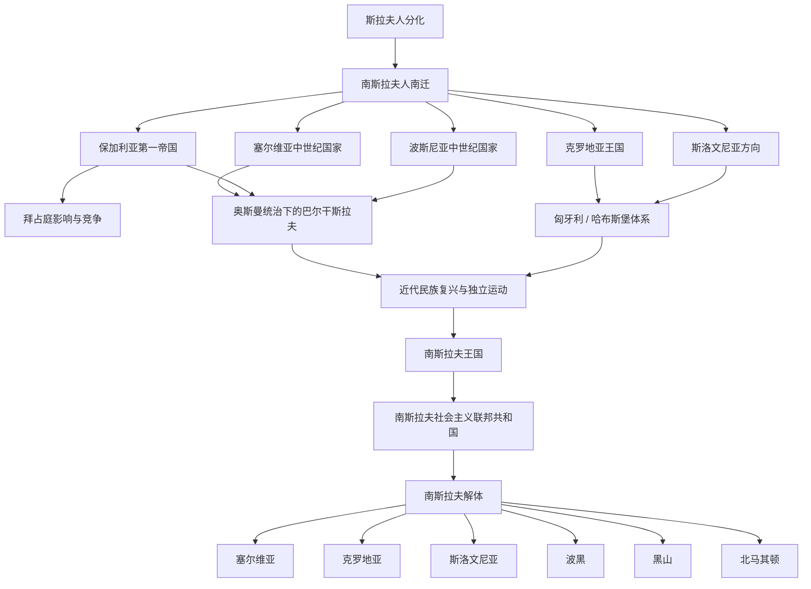

# 南斯拉夫历史

## 历史主线

南斯拉夫历史主要展开在巴尔干半岛，可按“斯拉夫人南迁 → 巴尔干南斯拉夫诸国形成 → 拜占庭、保加利亚、塞尔维亚、克罗地亚、匈牙利、奥斯曼和哈布斯堡竞争 → 近代民族复兴 → 南斯拉夫国家实验 → 南斯拉夫解体与当代巴尔干国家”来理解。这里的“南斯拉夫”既可指斯拉夫三大分支之一，也可指20世纪的南斯拉夫国家，两者需要区分。

## 南斯拉夫历史演变脉络图

## 导航表

| 顺序 | 名称 | 时间 | 简要概括 |
|---:|---|---|---|
| 1 | [斯拉夫人分化](/%E4%BA%BA%E6%96%87%E7%A7%91%E5%AD%A6/%E5%8E%86%E5%8F%B2/%E6%AC%A7%E6%B4%B2/%E6%96%AF%E6%8B%89%E5%A4%AB/%E6%96%AF%E6%8B%89%E5%A4%AB%E4%BA%BA%E5%88%86%E5%8C%96.md) | 6世纪前后 | 南斯拉夫人向巴尔干方向迁徙，与拜占庭、阿瓦尔、保加尔、罗马化居民等互动。 |
| 2 | [早期南斯拉夫人](/%E4%BA%BA%E6%96%87%E7%A7%91%E5%AD%A6/%E5%8E%86%E5%8F%B2/%E6%AC%A7%E6%B4%B2/%E6%96%AF%E6%8B%89%E5%A4%AB/%E5%8D%97%E6%96%AF%E6%8B%89%E5%A4%AB/%E6%97%A9%E6%9C%9F%E5%8D%97%E6%96%AF%E6%8B%89%E5%A4%AB%E4%BA%BA.md) | 6-7世纪以后 | 南斯拉夫人进入巴尔干半岛，形成后来的保加利亚、塞尔维亚、克罗地亚、斯洛文尼亚等方向。 |
| 3 | [保加利亚第一帝国](/%E4%BA%BA%E6%96%87%E7%A7%91%E5%AD%A6/%E5%8E%86%E5%8F%B2/%E6%AC%A7%E6%B4%B2/%E6%96%AF%E6%8B%89%E5%A4%AB/%E5%8D%97%E6%96%AF%E6%8B%89%E5%A4%AB/%E4%BF%9D%E5%8A%A0%E5%88%A9%E4%BA%9A%E7%AC%AC%E4%B8%80%E5%B8%9D%E5%9B%BD.md) | 681年-1018年 | 保加尔人与斯拉夫人融合形成的巴尔干强国，是南斯拉夫和东正教文化史的重要节点。 |
| 4 | [塞尔维亚中世纪国家](/%E4%BA%BA%E6%96%87%E7%A7%91%E5%AD%A6/%E5%8E%86%E5%8F%B2/%E6%AC%A7%E6%B4%B2/%E6%96%AF%E6%8B%89%E5%A4%AB/%E5%8D%97%E6%96%AF%E6%8B%89%E5%A4%AB/%E5%A1%9E%E5%B0%94%E7%BB%B4%E4%BA%9A%E4%B8%AD%E4%B8%96%E7%BA%AA%E5%9B%BD%E5%AE%B6.md) | 9世纪-15世纪 | 塞尔维亚方向的中世纪国家发展，后受拜占庭、保加利亚和奥斯曼影响。 |
| 5 | [克罗地亚王国](/%E4%BA%BA%E6%96%87%E7%A7%91%E5%AD%A6/%E5%8E%86%E5%8F%B2/%E6%AC%A7%E6%B4%B2/%E6%96%AF%E6%8B%89%E5%A4%AB/%E5%8D%97%E6%96%AF%E6%8B%89%E5%A4%AB/%E5%85%8B%E7%BD%97%E5%9C%B0%E4%BA%9A%E7%8E%8B%E5%9B%BD.md) | 925年-1102年及以后 | 克罗地亚方向形成王国，后来与匈牙利、哈布斯堡体系长期相连。 |
| 6 | [奥斯曼统治下的巴尔干斯拉夫](/%E4%BA%BA%E6%96%87%E7%A7%91%E5%AD%A6/%E5%8E%86%E5%8F%B2/%E6%AC%A7%E6%B4%B2/%E6%96%AF%E6%8B%89%E5%A4%AB/%E5%8D%97%E6%96%AF%E6%8B%89%E5%A4%AB/%E5%A5%A5%E6%96%AF%E6%9B%BC%E7%BB%9F%E6%B2%BB%E4%B8%8B%E7%9A%84%E5%B7%B4%E5%B0%94%E5%B9%B2%E6%96%AF%E6%8B%89%E5%A4%AB.md) | 14世纪末-19世纪 | 奥斯曼扩张重塑巴尔干政治、宗教和民族格局。 |
| 7 | [南斯拉夫王国](/%E4%BA%BA%E6%96%87%E7%A7%91%E5%AD%A6/%E5%8E%86%E5%8F%B2/%E6%AC%A7%E6%B4%B2/%E6%96%AF%E6%8B%89%E5%A4%AB/%E5%8D%97%E6%96%AF%E6%8B%89%E5%A4%AB/%E5%8D%97%E6%96%AF%E6%8B%89%E5%A4%AB%E7%8E%8B%E5%9B%BD.md) | 1918年-1941年 | 一战后南斯拉夫统一国家实验的君主制阶段。 |
| 8 | [南斯拉夫社会主义联邦共和国](/%E4%BA%BA%E6%96%87%E7%A7%91%E5%AD%A6/%E5%8E%86%E5%8F%B2/%E6%AC%A7%E6%B4%B2/%E6%96%AF%E6%8B%89%E5%A4%AB/%E5%8D%97%E6%96%AF%E6%8B%89%E5%A4%AB/%E5%8D%97%E6%96%AF%E6%8B%89%E5%A4%AB%E7%A4%BE%E4%BC%9A%E4%B8%BB%E4%B9%89%E8%81%94%E9%82%A6%E5%85%B1%E5%92%8C%E5%9B%BD.md) | 1945年-1992年 | 二战后建立的联邦社会主义国家，包含多个南斯拉夫民族共和国。 |
| 9 | [南斯拉夫解体](/%E4%BA%BA%E6%96%87%E7%A7%91%E5%AD%A6/%E5%8E%86%E5%8F%B2/%E6%AC%A7%E6%B4%B2/%E6%96%AF%E6%8B%89%E5%A4%AB/%E5%8D%97%E6%96%AF%E6%8B%89%E5%A4%AB/%E5%8D%97%E6%96%AF%E6%8B%89%E5%A4%AB%E8%A7%A3%E4%BD%93.md) | 1991年以后 | 联邦瓦解并伴随战争、独立和边界重组，形成当代西巴尔干国家格局。 |
| 10 | 当代南斯拉夫诸国 | 1991年至今 | 包括斯洛文尼亚、克罗地亚、波黑、塞尔维亚、黑山、北马其顿等；保加利亚通常属于南斯拉夫语族 / 文化方向但不属于20世纪南斯拉夫国家。 |

## 重要转折与时间节点

| 时间 | 事件 | 意义 |
|---|---|---|
| 6-7世纪 | 斯拉夫人进入巴尔干 | 南斯拉夫历史的族群和空间基础形成。 |
| 681年 | 保加利亚第一帝国建立 | 巴尔干早期斯拉夫—保加尔国家形成。 |
| 1018年 | 拜占庭恢复对保加利亚控制 | 拜占庭重新主导巴尔干部分地区。 |
| 14-15世纪 | 奥斯曼征服巴尔干 | 塞尔维亚、保加利亚、波斯尼亚等方向进入奥斯曼时代。 |
| 1878年 | 柏林会议 | 巴尔干民族国家和自治实体进一步重组。 |
| 1918年 | 塞尔维亚人、克罗地亚人和斯洛文尼亚人王国成立 | 后来南斯拉夫王国的前身。 |
| 1945年 | 南斯拉夫社会主义联邦共和国建立 | 二战后南斯拉夫联邦国家形成。 |
| 1991年以后 | [南斯拉夫解体](/%E4%BA%BA%E6%96%87%E7%A7%91%E5%AD%A6/%E5%8E%86%E5%8F%B2/%E6%AC%A7%E6%B4%B2/%E6%96%AF%E6%8B%89%E5%A4%AB/%E5%8D%97%E6%96%AF%E6%8B%89%E5%A4%AB/%E5%8D%97%E6%96%AF%E6%8B%89%E5%A4%AB%E8%A7%A3%E4%BD%93.md) | 当代西巴尔干国家格局形成。 |

## 后续可细化笔记

以下笔记已建立基础页，后续可继续补充世系、事件和地区差异：

- [早期南斯拉夫人](/%E4%BA%BA%E6%96%87%E7%A7%91%E5%AD%A6/%E5%8E%86%E5%8F%B2/%E6%AC%A7%E6%B4%B2/%E6%96%AF%E6%8B%89%E5%A4%AB/%E5%8D%97%E6%96%AF%E6%8B%89%E5%A4%AB/%E6%97%A9%E6%9C%9F%E5%8D%97%E6%96%AF%E6%8B%89%E5%A4%AB%E4%BA%BA.md)
- [保加利亚第一帝国](/%E4%BA%BA%E6%96%87%E7%A7%91%E5%AD%A6/%E5%8E%86%E5%8F%B2/%E6%AC%A7%E6%B4%B2/%E6%96%AF%E6%8B%89%E5%A4%AB/%E5%8D%97%E6%96%AF%E6%8B%89%E5%A4%AB/%E4%BF%9D%E5%8A%A0%E5%88%A9%E4%BA%9A%E7%AC%AC%E4%B8%80%E5%B8%9D%E5%9B%BD.md)
- [塞尔维亚中世纪国家](/%E4%BA%BA%E6%96%87%E7%A7%91%E5%AD%A6/%E5%8E%86%E5%8F%B2/%E6%AC%A7%E6%B4%B2/%E6%96%AF%E6%8B%89%E5%A4%AB/%E5%8D%97%E6%96%AF%E6%8B%89%E5%A4%AB/%E5%A1%9E%E5%B0%94%E7%BB%B4%E4%BA%9A%E4%B8%AD%E4%B8%96%E7%BA%AA%E5%9B%BD%E5%AE%B6.md)
- [克罗地亚王国](/%E4%BA%BA%E6%96%87%E7%A7%91%E5%AD%A6/%E5%8E%86%E5%8F%B2/%E6%AC%A7%E6%B4%B2/%E6%96%AF%E6%8B%89%E5%A4%AB/%E5%8D%97%E6%96%AF%E6%8B%89%E5%A4%AB/%E5%85%8B%E7%BD%97%E5%9C%B0%E4%BA%9A%E7%8E%8B%E5%9B%BD.md)
- [波斯尼亚中世纪国家](/%E4%BA%BA%E6%96%87%E7%A7%91%E5%AD%A6/%E5%8E%86%E5%8F%B2/%E6%AC%A7%E6%B4%B2/%E6%96%AF%E6%8B%89%E5%A4%AB/%E5%8D%97%E6%96%AF%E6%8B%89%E5%A4%AB/%E6%B3%A2%E6%96%AF%E5%B0%BC%E4%BA%9A%E4%B8%AD%E4%B8%96%E7%BA%AA%E5%9B%BD%E5%AE%B6.md)
- [奥斯曼统治下的巴尔干斯拉夫](/%E4%BA%BA%E6%96%87%E7%A7%91%E5%AD%A6/%E5%8E%86%E5%8F%B2/%E6%AC%A7%E6%B4%B2/%E6%96%AF%E6%8B%89%E5%A4%AB/%E5%8D%97%E6%96%AF%E6%8B%89%E5%A4%AB/%E5%A5%A5%E6%96%AF%E6%9B%BC%E7%BB%9F%E6%B2%BB%E4%B8%8B%E7%9A%84%E5%B7%B4%E5%B0%94%E5%B9%B2%E6%96%AF%E6%8B%89%E5%A4%AB.md)
- [南斯拉夫王国](/%E4%BA%BA%E6%96%87%E7%A7%91%E5%AD%A6/%E5%8E%86%E5%8F%B2/%E6%AC%A7%E6%B4%B2/%E6%96%AF%E6%8B%89%E5%A4%AB/%E5%8D%97%E6%96%AF%E6%8B%89%E5%A4%AB/%E5%8D%97%E6%96%AF%E6%8B%89%E5%A4%AB%E7%8E%8B%E5%9B%BD.md)
- [南斯拉夫社会主义联邦共和国](/%E4%BA%BA%E6%96%87%E7%A7%91%E5%AD%A6/%E5%8E%86%E5%8F%B2/%E6%AC%A7%E6%B4%B2/%E6%96%AF%E6%8B%89%E5%A4%AB/%E5%8D%97%E6%96%AF%E6%8B%89%E5%A4%AB/%E5%8D%97%E6%96%AF%E6%8B%89%E5%A4%AB%E7%A4%BE%E4%BC%9A%E4%B8%BB%E4%B9%89%E8%81%94%E9%82%A6%E5%85%B1%E5%92%8C%E5%9B%BD.md)
- [南斯拉夫解体](/%E4%BA%BA%E6%96%87%E7%A7%91%E5%AD%A6/%E5%8E%86%E5%8F%B2/%E6%AC%A7%E6%B4%B2/%E6%96%AF%E6%8B%89%E5%A4%AB/%E5%8D%97%E6%96%AF%E6%8B%89%E5%A4%AB/%E5%8D%97%E6%96%AF%E6%8B%89%E5%A4%AB%E8%A7%A3%E4%BD%93.md)
