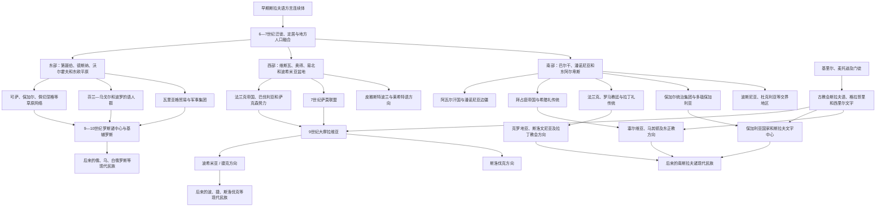

# 斯拉夫人分化

## 时间

约6—10世纪；语言学上的东、西、南斯拉夫三大方向是在长期迁徙、接触和国家形成中逐步清晰，并非6世纪某一年正式分族

## 概括

6世纪以后，使用相近斯拉夫方言的社群从中东欧向东欧平原、中欧和巴尔干广泛扩展。地理距离、河流交通和山地阻隔造成方言差异；更重要的是，各地进入不同政治、宗教和文化网络：东部同草原汗国、芬兰—乌戈尔和北欧商战集团互动，最终形成罗斯世界；西部同法兰克帝国、神圣罗马政治和拉丁教会联系，形成大摩拉维亚、波希米亚与波兰等方向；南部同拜占庭、保加尔、阿瓦尔、罗马教廷和巴尔干原居民融合，形成保加利亚、克罗地亚、塞尔维亚、卡兰塔尼亚等多条线。

东、西、南三分首先是语言历史分类，不是三个统一民族或三个共同国家。每一支内部仍有方言连续体、小语群和过渡地区；现代俄罗斯人、乌克兰人、白俄罗斯人、波兰人、捷克人、斯洛伐克人、斯洛文尼亚人、克罗地亚人、塞尔维亚人、波什尼亚克人、黑山人、马其顿人和保加利亚人的形成，均经历更晚的王朝、教会、帝国、标准语和民族国家建构。

## 分化演变图

## 分化的含义

### 不是一次性“民族分家”

6世纪的斯克拉维尼、安特人和各地方共同体仍能使用高度相通的方言，外部作者也未按东、西、南三支列出完整族谱。分化主要是现代比较语言学根据后世音韵、词形和词汇创新重建的结果。不同创新在不同时段传播，边界通常呈渐变而非硬线。

“向东、西、南迁徙”可作宏观导航，但人口并非从一个中心分成三支整齐队伍。许多社群原地扩展、同邻人融合或反复迁移，政治联盟又会跨越语言分类。三大分支只有在8—10世纪教会、王朝和书写中心固定后才更清晰。

### 语言、政治和民族三层不能混同

- **语言分支**描述方言之间历史亲缘。
- **政治共同体**指某一王朝、城市、部落联盟或国家的臣民，疆域可包含多种语言。
- **现代民族**通常经近代学校、标准语、统计、教会和国家制度形成。

例如基辅罗斯使用东斯拉夫方言并统治芬兰—乌戈尔、波罗的和北欧来源人口；大摩拉维亚的遗产被捷克、斯洛伐克等多种民族史追溯；第一保加利亚帝国由保加尔统治集团、斯拉夫语社群和地方人口融合。不能因现代分类反推所有中世纪居民已有相同民族身份。

## 东斯拉夫方向

### 地理和接触网络

东部社群沿第聂伯河、德斯纳河、索日河、奥卡河、沃尔霍夫河和西德维纳河扩展，同波罗的语、芬兰—乌戈尔语及伊朗语、突厥语草原人群互动。森林提供毛皮、蜂蜡和林产品，南北河路连接波罗的海、黑海、里海与拜占庭。

编年史后来列出波利亚涅、德列夫利亚涅、谢韦里亚涅、克里维奇、斯洛文人、维亚季奇等名称。这些是政治—地理共同体，不应直接当作现代民族的固定祖先部落。其边界、纳贡关系和自称都可能变化。

### 草原贡赋与罗斯形成

可萨汗国控制或影响东南贸易和部分斯拉夫社群，要求贡赋并保护商路。北欧瓦里亚格人在8—9世纪沿河道建立贸易、征贡和军事据点，同当地斯拉夫和芬兰—乌戈尔人口融合。诺夫哥罗德、基辅等中心逐步组成罗斯政治网络。

9—10世纪留里克王朝、基辅权力和对拜占庭贸易促成更大国家，988年前后弗拉基米尔受洗使拜占庭基督教和教会斯拉夫书写成为核心。基辅罗斯是俄罗斯、乌克兰和白俄罗斯共同追溯的重要遗产，不能独占为现代俄罗斯国家的简单前身。

详见[东斯拉夫](/%E4%BA%BA%E6%96%87%E7%A7%91%E5%AD%A6/%E5%8E%86%E5%8F%B2/%E6%AC%A7%E6%B4%B2/%E6%96%AF%E6%8B%89%E5%A4%AB/%E4%B8%9C%E6%96%AF%E6%8B%89%E5%A4%AB/README.md)与[东斯拉夫准国家组织](/%E4%BA%BA%E6%96%87%E7%A7%91%E5%AD%A6/%E5%8E%86%E5%8F%B2/%E6%AC%A7%E6%B4%B2/%E6%96%AF%E6%8B%89%E5%A4%AB/%E4%B8%9C%E6%96%AF%E6%8B%89%E5%A4%AB/%E4%B8%9C%E6%96%AF%E6%8B%89%E5%A4%AB%E5%87%86%E5%9B%BD%E5%AE%B6%E7%BB%84%E7%BB%87.md)。

## 西斯拉夫方向

### 中欧分布

西部斯拉夫语社群分布于维斯瓦河、奥得河、易北河、波希米亚盆地、摩拉瓦河和喀尔巴阡北侧。传统语言分类包括莱希特语群、捷克—斯洛伐克语群和索布语群；波美拉尼亚、波拉布等许多中世纪方言后来在德语东扩、城市化和国家同化中消退，卡舒比语、上索布语和下索布语等则保存至今。

“西斯拉夫”不等同于“全部受德国统治”。波兰、波希米亚和大摩拉维亚发展本地王朝，法兰克与神圣罗马帝国则通过战争、传教、边区和封臣关系施加不同程度影响。

### 萨莫联盟和大摩拉维亚

7世纪萨莫联盟联合部分斯拉夫社群反抗阿瓦尔并抵御法兰克，是早期较大政治共同体，但疆域和中心不确定，也不是现代捷克或斯洛伐克国家的直接完整前身。

9世纪大摩拉维亚在莫伊米尔、拉斯季斯拉夫和斯瓦托普卢克时期扩展。为减少法兰克教会依赖，拉斯季斯拉夫向拜占庭请求传教士，基里尔、麦托迪发展斯拉夫礼仪和格拉哥里文字。其门徒后来在保加利亚延续事业。大摩拉维亚约在10世纪初受内部斗争和马扎尔人进入潘诺尼亚冲击而瓦解。

### 波希米亚、波兰和斯洛伐克方向

普热米斯尔王朝在波希米亚建立公国并进入神圣罗马帝国体系；皮雅斯特王朝在10世纪统一波兰核心区，966年梅什科一世受拉丁礼洗礼。斯洛伐克地区在大摩拉维亚后逐步进入匈牙利王国，地方斯拉夫语人口延续，但长期没有独立王朝国家。

三地共同接受拉丁教会和拉丁字母传统，却拥有不同王朝、国家法和帝国归属。详见[西斯拉夫](/%E4%BA%BA%E6%96%87%E7%A7%91%E5%AD%A6/%E5%8E%86%E5%8F%B2/%E6%AC%A7%E6%B4%B2/%E6%96%AF%E6%8B%89%E5%A4%AB/%E8%A5%BF%E6%96%AF%E6%8B%89%E5%A4%AB/README.md)。

## 南斯拉夫方向

### 巴尔干定居和人口融合

6—7世纪斯拉夫语群体越过多瑙河并进入巴尔干、潘诺尼亚西部和东阿尔卑斯，同拜占庭希腊语和罗曼语居民、阿尔巴尼亚语人群、阿瓦尔人、保加尔人及其他社群融合。沿海城市和岛屿保持不同程度罗马—拜占庭连续，内陆则出现新的乡村和地方首领共同体。

“南斯拉夫人”是语言文化分类，不是当时统一自称。后来的克罗地亚、塞尔维亚、波斯尼亚、杜克利亚、卡兰塔尼亚和保加利亚等政治中心分别形成。

### 保加尔—斯拉夫融合

约680年阿斯帕鲁赫领导的保加尔人建立多瑙保加利亚，681年获拜占庭承认。保加尔统治集团原有草原突厥语和汗国传统，同人数众多的斯拉夫社群、色雷斯等地方人口逐渐融合，国家语言和身份日益斯拉夫化。

鲍里斯一世在9世纪受洗，基里尔、麦托迪的门徒在普雷斯拉夫和奥赫里德发展斯拉夫书写，古教会斯拉夫语和西里尔字母文化向塞尔维亚、罗斯等地传播。保加利亚因此既是早期南斯拉夫国家，也是跨斯拉夫文字文化中心。

### 西方和东方教会影响

克罗地亚、卡兰塔尼亚等西北地区更多进入法兰克、罗马教廷和拉丁礼网络；保加利亚、塞尔维亚、马其顿等更多受拜占庭礼影响。波斯尼亚、达尔马提亚和南亚得里亚海长期位于交界，礼仪和教会管辖并非从一开始固定。

1054年东西教会分裂、奥斯曼征服和后来的宗教改革进一步强化差异，但不能把天主教、东正教、伊斯兰三分直接投射到6世纪迁徙者。详见[早期南斯拉夫人](/%E4%BA%BA%E6%96%87%E7%A7%91%E5%AD%A6/%E5%8E%86%E5%8F%B2/%E6%AC%A7%E6%B4%B2/%E4%B8%9C%E5%8D%97%E6%AC%A7%E4%B8%8E%E5%B7%B4%E5%B0%94%E5%B9%B2/%E5%8D%97%E6%96%AF%E6%8B%89%E5%A4%AB%E5%8E%86%E5%8F%B2/%E6%97%A9%E6%9C%9F%E5%8D%97%E6%96%AF%E6%8B%89%E5%A4%AB%E4%BA%BA.md)。

## 分化机制

### 地理距离与生态

东欧大河网络、中欧盆地与边区、巴尔干山地和亚得里亚海分别连接不同贸易路线。距离和政治边界限制某些语言创新继续传播，使方言逐步产生特有音变和词汇。

### 国家和王朝

罗斯、波兰、波希米亚、保加利亚、克罗地亚和塞尔维亚等王朝国家通过征税、军队、婚姻和法律把地方社群纳入不同中心。国家边界经常改变，却能使某种宫廷、教会和书写传统长期积累。

### 教会与文字

拉丁礼地区主要使用拉丁字母和罗马教会组织，拜占庭礼地区主要发展教会斯拉夫语、西里尔字母和君士坦丁堡教会关系。格拉哥里传统跨越简单东西界线，在克罗地亚天主教地区也长期使用。文字制度促进标准化，但口语仍保持方言连续。

### 邻近人群的融合

东部同芬兰—乌戈尔、波罗的和草原人群融合，西部同日耳曼、马扎尔和波罗的人互动，南部同希腊、罗曼、阿尔巴尼亚语和草原保加尔社群融合。现代斯拉夫民族因此都不是“纯粹”保存某个原始人口。

### 帝国和征服

法兰克、神圣罗马、匈牙利、拜占庭、蒙古、波兰—立陶宛、奥斯曼和哈布斯堡等帝国在不同时期重组斯拉夫世界。征服可切断旧联系，也可能通过统一市场、教会和行政产生新共同体。例如蒙古征服推动罗斯诸公国分流，奥斯曼—哈布斯堡边界则加深南斯拉夫内部宗教和制度差异。

## 语言分支对照

| 分支 | 主要历史空间 | 代表语言 / 语言群 | 早期国家与外部网络 | 关键辨析 |
|---|---|---|---|---|
| 东斯拉夫 | 第聂伯、德斯纳、奥卡、沃尔霍夫及东欧平原 | 俄语、乌克兰语、白俄罗斯语，另有鲁辛语等 | 基辅罗斯；拜占庭、可萨、草原汗国和北欧河路 | 罗斯不是现代俄罗斯一国专属，三大现代民族形成很晚。 |
| 西斯拉夫 | 维斯瓦、奥得、易北、波希米亚和喀尔巴阡 | 波兰语、捷克语、斯洛伐克语、卡舒比语、索布语等 | 萨莫联盟、大摩拉维亚、波希米亚、波兰；法兰克和拉丁教会 | 许多波拉布方言消退，分支不只现存三个国家。 |
| 南斯拉夫 | 巴尔干、潘诺尼亚南部、东阿尔卑斯和亚得里亚海 | 斯洛文尼亚语、克罗地亚语、波斯尼亚语、塞尔维亚语、黑山语、马其顿语、保加利亚语等 | 保加利亚、克罗地亚、塞尔维亚、卡兰塔尼亚等；拜占庭、法兰克、罗马和阿瓦尔 | 语言连续体、现代标准语和20世纪南斯拉夫国家是三个不同概念。 |

## 重要节点

| 时间 | 过程或事件 | 对分化的意义 |
|---|---|---|
| 6世纪 | 斯克拉维尼、安特人频繁见于资料 | 斯拉夫语群体扩展加速，三方向尚未固定。 |
| 6—7世纪 | 跨多瑙定居巴尔干、向易北和东欧扩展 | 地理距离与邻近人群接触增强。 |
| 623—658年左右 | 萨莫联盟 | 西部社群首次形成可见的大区域联盟。 |
| 681年 | 拜占庭承认保加利亚国家 | 保加尔—斯拉夫融合产生南部国家中心。 |
| 8世纪 | 卡兰塔尼亚进入巴伐利亚—法兰克体系 | 西北南斯拉夫地区更深受拉丁教会影响。 |
| 9世纪 | 大摩拉维亚、克罗地亚、塞尔维亚等政权发展 | 王朝与教会边界促进区域认同。 |
| 863年以后 | 基里尔、麦托迪传教 | 斯拉夫礼仪与书写成为跨分支文化资源。 |
| 864年前后 | 鲍里斯一世受洗 | 保加利亚基督教国家化并吸收斯拉夫文字传统。 |
| 966年 | 梅什科一世受洗 | 波兰进入拉丁基督教国家体系。 |
| 988年前后 | 弗拉基米尔受洗 | 罗斯进入拜占庭基督教和教会斯拉夫文化圈。 |
| 9—10世纪 | 马扎尔人进入喀尔巴阡盆地 | 西斯拉夫与南斯拉夫陆上连续部分被重组，斯洛伐克等进入匈牙利方向。 |
| 10世纪以后 | 王朝国家和教区稳定 | 三大方向及其内部小分支逐步清晰。 |

## 分化后的继续交叉

三分以后，斯拉夫世界仍持续交流：

- 教会斯拉夫语从保加利亚文学中心传入塞尔维亚和罗斯，形成跨东、南分支书写共同体。
- 波兰—立陶宛联邦统治大量东斯拉夫语人口，鲁塞尼亚书写传统影响乌克兰、白俄罗斯和立陶宛政治。
- 哈布斯堡帝国内同时存在捷克、斯洛伐克、波兰、斯洛文尼亚、克罗地亚、塞尔维亚等社群。
- 19世纪泛斯拉夫主义尝试把语言亲缘转化为文化或政治合作，却因国家利益、宗教和大国竞争产生多种版本。
- 南斯拉夫国家只包括部分南斯拉夫民族，从未包括保加利亚；“南斯拉夫”国家名不能代表全部斯拉夫人。
- 苏联以东斯拉夫核心建立多民族联邦，不能简单视为“全斯拉夫国家”。

语言亲缘提供互译和文化想象条件，却不决定政治联盟。

## 关键辨析

- 东、西、南三分是渐进的语言历史结果，不是6世纪召开会议后的正式划分。
- 三大分支内部没有共同统治者或永久边界，每支都包含被同化、消退或处于过渡的语言。
- 基督教东西界线同语言界线大体相关但不完全重合；天主教克罗地亚格拉哥里传统就是例外。
- 保加尔人最初的语言和统治传统不同于斯拉夫人，现代保加利亚语身份来自长期融合。
- 马其顿语与保加利亚语接近，但现代标准语、民族和国家形成有各自历史，不能仅凭语言相似取消政治身份。
- 塞尔维亚语、克罗地亚语、波斯尼亚语和黑山语建立在高度连续的中南斯拉夫方言基础上，标准语言和民族名称仍有不同制度史。
- 鲁辛语、卡舒比语、索布语等说明斯拉夫历史不能只按现有民族国家列举。
- 基辅罗斯、大摩拉维亚和早期巴尔干诸国均可被多个现代民族追溯，不能画成单一排他的直系继承。
- 泛斯拉夫主义是近代政治文化运动，不是古代共同国家的复兴。

## 演变关系

- 前一节点：[早期斯拉夫人](/%E4%BA%BA%E6%96%87%E7%A7%91%E5%AD%A6/%E5%8E%86%E5%8F%B2/%E6%AC%A7%E6%B4%B2/%E6%96%AF%E6%8B%89%E5%A4%AB/%E6%97%A9%E6%9C%9F%E6%96%AF%E6%8B%89%E5%A4%AB%E4%BA%BA.md)。
- 东部分支：[东斯拉夫](/%E4%BA%BA%E6%96%87%E7%A7%91%E5%AD%A6/%E5%8E%86%E5%8F%B2/%E6%AC%A7%E6%B4%B2/%E6%96%AF%E6%8B%89%E5%A4%AB/%E4%B8%9C%E6%96%AF%E6%8B%89%E5%A4%AB/README.md)，后续入口为[东斯拉夫准国家组织](/%E4%BA%BA%E6%96%87%E7%A7%91%E5%AD%A6/%E5%8E%86%E5%8F%B2/%E6%AC%A7%E6%B4%B2/%E6%96%AF%E6%8B%89%E5%A4%AB/%E4%B8%9C%E6%96%AF%E6%8B%89%E5%A4%AB/%E4%B8%9C%E6%96%AF%E6%8B%89%E5%A4%AB%E5%87%86%E5%9B%BD%E5%AE%B6%E7%BB%84%E7%BB%87.md)与[基辅罗斯](/%E4%BA%BA%E6%96%87%E7%A7%91%E5%AD%A6/%E5%8E%86%E5%8F%B2/%E6%AC%A7%E6%B4%B2/%E6%96%AF%E6%8B%89%E5%A4%AB/%E4%B8%9C%E6%96%AF%E6%8B%89%E5%A4%AB/%E5%9F%BA%E8%BE%85%E7%BD%97%E6%96%AF.md)。
- 西部分支：[西斯拉夫](/%E4%BA%BA%E6%96%87%E7%A7%91%E5%AD%A6/%E5%8E%86%E5%8F%B2/%E6%AC%A7%E6%B4%B2/%E6%96%AF%E6%8B%89%E5%A4%AB/%E8%A5%BF%E6%96%AF%E6%8B%89%E5%A4%AB/README.md)，后续入口为[大摩拉维亚](/%E4%BA%BA%E6%96%87%E7%A7%91%E5%AD%A6/%E5%8E%86%E5%8F%B2/%E6%AC%A7%E6%B4%B2/%E6%96%AF%E6%8B%89%E5%A4%AB/%E8%A5%BF%E6%96%AF%E6%8B%89%E5%A4%AB/%E5%A4%A7%E6%91%A9%E6%8B%89%E7%BB%B4%E4%BA%9A.md)。
- 南部分支：[南斯拉夫历史](/%E4%BA%BA%E6%96%87%E7%A7%91%E5%AD%A6/%E5%8E%86%E5%8F%B2/%E6%AC%A7%E6%B4%B2/%E4%B8%9C%E5%8D%97%E6%AC%A7%E4%B8%8E%E5%B7%B4%E5%B0%94%E5%B9%B2/%E5%8D%97%E6%96%AF%E6%8B%89%E5%A4%AB%E5%8E%86%E5%8F%B2/README.md)与[早期南斯拉夫人](/%E4%BA%BA%E6%96%87%E7%A7%91%E5%AD%A6/%E5%8E%86%E5%8F%B2/%E6%AC%A7%E6%B4%B2/%E4%B8%9C%E5%8D%97%E6%AC%A7%E4%B8%8E%E5%B7%B4%E5%B0%94%E5%B9%B2/%E5%8D%97%E6%96%AF%E6%8B%89%E5%A4%AB%E5%8E%86%E5%8F%B2/%E6%97%A9%E6%9C%9F%E5%8D%97%E6%96%AF%E6%8B%89%E5%A4%AB%E4%BA%BA.md)。
- 返回：[斯拉夫历史](/%E4%BA%BA%E6%96%87%E7%A7%91%E5%AD%A6/%E5%8E%86%E5%8F%B2/%E6%AC%A7%E6%B4%B2/%E6%96%AF%E6%8B%89%E5%A4%AB/README.md)。
