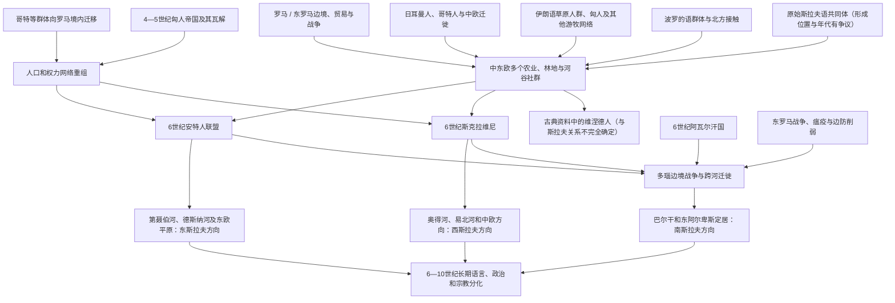

# 早期斯拉夫人

## 时间

约公元前1千纪后期—6世纪；“斯拉夫人”作为可较可靠辨识的文字名称主要见于6世纪资料

## 范围与史料口径

早期斯拉夫人的形成地通常在中东欧森林—草原过渡地带讨论，可能涉及维斯瓦河、布格河、普里皮亚季沼泽和第聂伯河中上游之间的广大区域。学界对“原乡”的精确位置、人口规模和考古文化对应仍有争议，不宜把现代国家边界或单一河谷写成无争议起源地。

古典作者在1—2世纪提到的“维涅德人／维涅蒂”有时被解释为同后来的斯拉夫人有关，但名称范围宽泛，不能仅凭同名确认其语言和现代族群归属。6世纪拜占庭和哥特传统作者所称斯克拉维尼、安特人，才是同斯拉夫语群体联系较明确的外部记载。语言学、考古学、地名学和后来的历史文献必须交叉使用，器物类型、基因或外部族名均不能单独等同于固定民族。

## 概括

早期斯拉夫人不是一个拥有共同国王、边界和统一自称的国家民族，而是使用相近方言、共享部分物质文化和社会习惯、由许多地方社群组成的人群网络。其生活空间连接波罗的海、黑海、草原和罗马边境，长期同波罗的人、日耳曼人、萨尔马提亚人、哥特人、匈人、阿瓦尔人及东罗马帝国互动。

4—6世纪的匈人体系瓦解、哥特人迁移、东罗马边防压力、气候和人口变化，以及阿瓦尔汗国的军事动员，为斯拉夫语群体大范围迁徙创造条件。6世纪后，斯克拉维尼和安特人频繁出现在多瑙河、黑海北岸及拜占庭记载中；部分群体越过多瑙进入巴尔干，另一些向中欧、东欧平原扩展。长期地理分离和不同帝国、教会、政治中心的影响，后来才逐渐形成东、西、南斯拉夫三大语言历史方向。

## 形成与扩展图

## 起源问题

### 语言学证据

斯拉夫语属于印欧语系，与波罗的语关系尤其接近；两者共享大量词汇、音韵和语法创新，但究竟经历了多长共同阶段仍有不同模型。原始斯拉夫语中的森林、沼泽、河流、农业和温带植物词汇，常被用于推测形成环境；借词又显示同日耳曼语、伊朗语、拉丁语、希腊语和后来的突厥语接触。

语言学能重建相对变化，难以给出精确地图。某个词在各斯拉夫语中存在，不等于其使用者始终住在同一地点；借词也可能通过贸易链传播。较稳妥的认识是：公元最初数世纪仍存在高度相通的晚期原始斯拉夫语方言连续体，6世纪以后扩展速度加快，地区差异才明显累积。

### 考古文化

研究者曾把普热沃斯克、扎鲁宾齐、基辅、布拉格—科尔恰克、佩尼科夫卡、科洛钦等考古文化分别同早期斯拉夫阶段联系。布拉格型简朴手制陶器、半地穴房屋和火葬墓等组合在5—7世纪许多地区出现，常被视为斯拉夫扩散线索。

但“考古文化”是现代学者按器物和遗址特征建立的分类，不必等于一个自觉民族。相似陶器可因技术传播、经济简化或人口迁移产生，一种文化内部也可能包含多种语言。将任何考古文化直接命名为“纯斯拉夫民族”会夸大证据。

### 文字名称

| 名称 | 主要资料与时代 | 可确认内容 | 需要保留的疑问 |
|---|---|---|---|
| 维涅德人／维涅蒂 | 塔西佗、托勒密、普林尼等1—2世纪作者 | 大致位于日耳曼世界以东、波罗的海至中东欧某区域的宽泛人群名称 | 是否说斯拉夫语、同后世斯拉夫人的连续程度均不能确定。 |
| 斯克拉维尼 | 普罗科匹厄斯、约达尼斯及6世纪拜占庭资料 | 活跃于多瑙河以北和巴尔干边境，同斯拉夫语群体联系明确 | 名称是自称还是外称、涵盖多少独立社群并不清楚。 |
| 安特人 | 6世纪黑海北部和拜占庭资料 | 第聂伯河至黑海北岸一带的军事政治联盟，常被视为斯拉夫语相关 | 统治层可能吸收草原因素，不能简单等同所有东斯拉夫祖先。 |
| 文德人 | 中世纪德语、拉丁语传统 | 常泛指德语地区以东的斯拉夫邻人 | 是外部集合称呼，不对应单一国家或现代民族。 |

## 地理环境与生活方式

### 河流、森林和交通

早期聚落常位于河流支流、森林边缘和可耕地附近。第聂伯河、德斯纳河、普里皮亚季河、布格河、维斯瓦河和奥得河流域既提供水、鱼、农地和林产品，也连接波罗的海、黑海与多瑙边境。河网有利于小舟交通和季节流动，但沼泽、林地也使大型征服军难以持久控制。

“普里皮亚季沼泽原乡”是影响很大的传统假说之一，却不是唯一答案。现代研究更常把早期形成理解为跨越多个相邻生态区的长期互动，而非所有斯拉夫人从一个狭小村落突然扩散。

### 农业与家庭经济

考古材料显示谷物种植、畜牧、渔猎、采集、纺织、木工和铁器生产结合。聚落规模通常不大，房屋以木、泥和半地穴结构为主，储藏坑和简易炉灶常见。家庭和亲族承担主要生产，地方共同体共享林地、牧地或防御责任。

简朴物质文化不能直接解释为“原始”或与外界隔绝。金属、玻璃、钱币和罗马商品通过贸易、战争、贡赐或雇佣进入，许多有机材料又难以保存。迁徙期的轻便房屋也可能是适应流动和边境不稳定的选择。

## 社会与政治组织

6世纪外部作者常描述斯拉夫社群由许多首领、议事和自由战士组成，不受单一君王长期统治。《莫里斯战略》称其难以被一次击败，因为各群体彼此独立并熟悉森林、河流和伏击。这些描述服务于拜占庭军事目的，可能把复杂社会概括为“无秩序部落”。

实际组织从家庭、村社、临时战团到区域联盟不等。成功战争首领可通过战利品、俘虏和外部贡赐建立追随者，安特人等也能派使节、同拜占庭签约或提供军队。没有中央国家不等于没有权力等级；奴隶、战俘、富裕首领和普通农户的地位并不相同。

“部落”一词可作方便概括，但容易造成每个名称都有固定疆域、血缘和统一制度的错觉。更准确的表达是地方政治共同体和可重组的联盟。

## 信仰与仪式

斯拉夫基督教化前没有留下自己的成体系经书，相关知识来自晚期记载、民俗比较、地名和考古。雷神佩伦、与牲畜财富相关的维列斯／沃洛斯等神名在后世资料中较明确，但其早期分布和祭祀形式可能因地区而异。水、林地、祖先、家宅和季节仪式也是研究中常见主题。

火葬在许多早期遗址中常见，土葬和不同墓制随后增加。外部作者提到献祭、占卜和对河湖神灵的敬畏，但不能把几百年后东斯拉夫编年史记录完整投射到所有6世纪社群。

基督教接触在正式受洗前已存在：俘虏、商人、边境军人和罗马城市居民可传播信仰。东、西教会的系统传教和国家基督教化主要发生在8—10世纪，见于各分支国家形成阶段。

## 与邻近世界的互动

### 罗马和东罗马帝国

罗马帝国的多瑙边防既阻挡袭掠，也提供市场、雇佣军职位和外交贡赐。4—6世纪帝国把部分北方人安置境内，边民也向北交易。查士丁尼一世时期帝国重建堡垒并多次派军渡河攻击斯拉夫、匈人和其他群体。

长期意大利战争、对波斯战争、541年后瘟疫及内部财政压力削弱巴尔干防御。斯拉夫人因此并非仅凭人口增长“淹没”帝国，而是在帝国军事资源分散、阿瓦尔攻势和地方城市网络收缩的共同背景下扩展。

### 哥特人与匈人

3—4世纪哥特政治网络覆盖黑海北部和东欧部分地区，斯拉夫语社群可能以贸易、附属或冲突方式参与。匈人帝国在5世纪把多种人群纳入军事贡赋体系，453年阿提拉死后联盟崩溃，权力真空和人口重新组合为后来的斯拉夫扩展提供机会。

“哥特人离开、斯拉夫人填空”只是部分地区的概括。许多居民留下并融入新共同体，地方名称和技术也通过连续人口传承。

### 阿瓦尔人

约567年阿瓦尔人进入喀尔巴阡盆地，建立汗国并支配或联合多种斯拉夫群体。他们利用斯拉夫步兵、舟船和围城劳力进攻拜占庭，斯拉夫首领也可借阿瓦尔军事网络迁徙和获取战利品。关系同时包含压迫、合作和反叛，不能把所有巴尔干进攻都归为阿瓦尔或斯拉夫单一一方。

623年前后萨莫领导的联盟反抗阿瓦尔，说明部分西部斯拉夫社群能够形成较大政治共同体。626年君士坦丁堡围攻失败后，阿瓦尔权威受挫，许多南部和西部社群发展更自主。

### 草原与波罗的海网络

黑海北部的斯拉夫语社群同萨尔马提亚、阿兰、后来的保加尔和其他草原群体接触，军事称号、器物与社会组织可能相互影响。北方则同波罗的语和芬兰—乌戈尔语人群共享河路、婚姻和贸易。斯拉夫化常通过双语和地方融合完成，不是单向驱逐。

## 5—6世纪扩展

### 人口流动的可能动力

- 匈人和哥特政治体系瓦解使中东欧权力重新组合。
- 农业和小型聚落模式适合在林地、河谷和废弃边境扩展。
- 罗马边境贸易与袭掠提供财富、俘虏和军事经验。
- 东罗马在其他战线投入资源，巴尔干堡垒难以全面驻守。
- 阿瓦尔汗国能组织跨区域行动，也推动被支配群体迁徙。
- 战争、瘟疫和城市收缩降低部分巴尔干地区的国家控制。
- 地方人口同新来者通婚、改用斯拉夫语，扩大语言传播而不必都来自远距离移民。

这些因素的相对重要性按地区不同；不能用单一人口爆炸、气候变化或军事入侵解释全部扩展。

### 方向尚未固定

6世纪的斯克拉维尼、安特人并不等于已经形成的西、东、南三支。方言仍高度相通，政治联盟可跨越后来的分类。只有在若干世纪的地理分隔、同法兰克、拜占庭、保加利亚、草原汗国及地方人群互动后，三大方向才逐渐清晰。

## 重要事件与证据节点

| 时间 | 事件或证据 | 意义 |
|---|---|---|
| 公元1—2世纪 | 罗马作者记录维涅德人等东部人群 | 可能保存与后世斯拉夫有关的早期外称，但语言归属不确定。 |
| 3—4世纪 | 黑海北部哥特政治网络发展 | 早期斯拉夫语社群卷入日耳曼—草原—罗马互动。 |
| 约370年代以后 | 匈人进入东欧 | 多族军事联盟和迁徙重组中东欧。 |
| 453年以后 | 匈人帝国瓦解 | 地方首领和人口网络重新组合。 |
| 5—6世纪 | 布拉格—科尔恰克、佩尼科夫卡等文化扩展 | 与早期斯拉夫扩散有关，但考古文化不等于单一民族。 |
| 6世纪前半 | 普罗科匹厄斯等记录斯克拉维尼、安特人 | 对斯拉夫语相关群体最早较明确的连续文字记载。 |
| 545年前后 | 安特人等同拜占庭订约、服役 | 说明其可组成区域联盟并参与帝国外交。 |
| 558年以后 | 阿瓦尔人接近并进入中欧 | 斯拉夫社群被纳入更大军事网络。 |
| 580年代 | 跨多瑙袭掠和巴尔干定居加深 | 南斯拉夫方向的空间基础形成。 |
| 602年以后 | 拜占庭多瑙攻势中断 | 帝国在内战和波斯战争中失去边境主动。 |
| 623—658年左右 | 萨莫联盟 | 西部斯拉夫社群反抗阿瓦尔并形成早期大联盟。 |
| 626年 | 阿瓦尔—斯拉夫等围攻君士坦丁堡失败 | 阿瓦尔控制力下降，巴尔干聚落仍继续。 |

## 从共同体到三大方向

### 东部空间

第聂伯河、德斯纳河、奥卡河和更北森林地带的社群同波罗的人、芬兰—乌戈尔人、草原汗国及后来北欧瓦里亚格商战集团互动。8—10世纪形成罗斯诸中心，但“东斯拉夫”身份和现代俄罗斯、乌克兰、白俄罗斯民族均是更晚历史过程。

### 西部空间

奥得河、易北河、维斯瓦河和波希米亚盆地的社群同法兰克、萨克森、巴伐利亚和阿瓦尔世界接触。萨莫联盟、大摩拉维亚、波希米亚和皮雅斯特波兰等国家先后形成，拉丁教会和西方王权制度影响加深。

### 南部空间

越过多瑙和进入东阿尔卑斯的社群同东罗马、阿瓦尔、保加尔、罗曼城市和地方巴尔干人口融合。卡兰塔尼亚、保加利亚、克罗地亚、塞尔维亚及其他公国发展，拉丁礼与拜占庭礼的交界逐步形成。

三支是语言史与区域史的有用框架，不代表所有人都能被清楚分入三类；索布人、卡舒比人、鲁辛人、托尔拉克方言等也显示过渡和小分支的复杂性。

## 关键辨析

- 不能把1世纪维涅德人直接写成已经确认的斯拉夫民族；较明确的斯拉夫记载主要始于6世纪。
- 斯拉夫“原乡”存在多个模型，维斯瓦—第聂伯之间是宽泛讨论区，而非已证实的单一点。
- 一种陶器、房屋或墓葬不能自动证明居民说某种语言。
- 早期斯拉夫人并非统一国家，也不意味着社会完全平等或没有首领。
- 斯克拉维尼与安特人是外部资料中的大类或联盟，不是现代民族名单。
- 扩展同时包含迁徙、语言同化、俘虏安置、通婚和地方人口连续，不能写成原居民全部消失。
- 阿瓦尔与斯拉夫既有支配和共同作战，也有反抗；“阿瓦尔入侵”和“斯拉夫迁徙”经常交叠。
- 东、西、南三分是6世纪以后长期形成的语言文化方向，不是在某一年正式分族。
- 现代民族从早期斯拉夫历史中寻找源流具有合理语言联系，但不存在一条不变血缘和国家连续线。

## 演变关系

- 后一节点：[斯拉夫人分化](/%E4%BA%BA%E6%96%87%E7%A7%91%E5%AD%A6/%E5%8E%86%E5%8F%B2/%E6%AC%A7%E6%B4%B2/%E6%96%AF%E6%8B%89%E5%A4%AB/%E6%96%AF%E6%8B%89%E5%A4%AB%E4%BA%BA%E5%88%86%E5%8C%96.md)。
- 东部方向：[东斯拉夫](/%E4%BA%BA%E6%96%87%E7%A7%91%E5%AD%A6/%E5%8E%86%E5%8F%B2/%E6%AC%A7%E6%B4%B2/%E6%96%AF%E6%8B%89%E5%A4%AB/%E4%B8%9C%E6%96%AF%E6%8B%89%E5%A4%AB/README.md)。
- 西部方向：[西斯拉夫](/%E4%BA%BA%E6%96%87%E7%A7%91%E5%AD%A6/%E5%8E%86%E5%8F%B2/%E6%AC%A7%E6%B4%B2/%E6%96%AF%E6%8B%89%E5%A4%AB/%E8%A5%BF%E6%96%AF%E6%8B%89%E5%A4%AB/README.md)。
- 南部方向：[南斯拉夫历史](/%E4%BA%BA%E6%96%87%E7%A7%91%E5%AD%A6/%E5%8E%86%E5%8F%B2/%E6%AC%A7%E6%B4%B2/%E4%B8%9C%E5%8D%97%E6%AC%A7%E4%B8%8E%E5%B7%B4%E5%B0%94%E5%B9%B2/%E5%8D%97%E6%96%AF%E6%8B%89%E5%A4%AB%E5%8E%86%E5%8F%B2/README.md)。
- 返回：[斯拉夫历史](/%E4%BA%BA%E6%96%87%E7%A7%91%E5%AD%A6/%E5%8E%86%E5%8F%B2/%E6%AC%A7%E6%B4%B2/%E6%96%AF%E6%8B%89%E5%A4%AB/README.md)。
