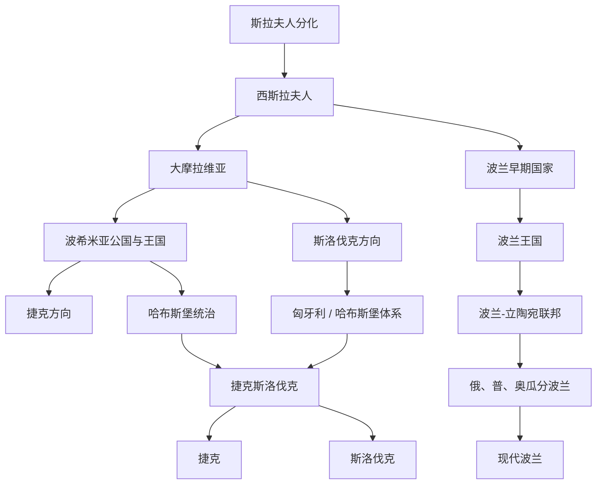

# 西斯拉夫历史

## 历史主线

西斯拉夫历史主要展开在中欧地区，可按“斯拉夫人分化 → 西斯拉夫诸部落 → 大摩拉维亚 → 波兰、波希米亚 / 捷克、斯洛伐克等方向分化 → 中欧帝国体系与民族复兴 → 现代民族国家”来理解。这个方向长期处在德意志、哈布斯堡、波兰-立陶宛、普鲁士、俄罗斯和奥地利之间，政治归属与文化身份经常交错。

## 西斯拉夫历史演变脉络图

## 导航表

| 顺序 | 名称 | 时间 | 简要概括 |
|---:|---|---|---|
| 1 | [斯拉夫人分化](/%E4%BA%BA%E6%96%87%E7%A7%91%E5%AD%A6/%E5%8E%86%E5%8F%B2/%E6%AC%A7%E6%B4%B2/%E6%96%AF%E6%8B%89%E5%A4%AB/%E6%96%AF%E6%8B%89%E5%A4%AB%E4%BA%BA%E5%88%86%E5%8C%96.md) | 6世纪前后 | 斯拉夫人分为东、西、南三大方向，西斯拉夫人主要进入中欧空间。 |
| 2 | [大摩拉维亚](/%E4%BA%BA%E6%96%87%E7%A7%91%E5%AD%A6/%E5%8E%86%E5%8F%B2/%E6%AC%A7%E6%B4%B2/%E6%96%AF%E6%8B%89%E5%A4%AB/%E8%A5%BF%E6%96%AF%E6%8B%89%E5%A4%AB/%E5%A4%A7%E6%91%A9%E6%8B%89%E7%BB%B4%E4%BA%9A.md) | 9世纪 | 中欧早期斯拉夫政权，对捷克、斯洛伐克和周边斯拉夫基督教化有重要意义。 |
| 3 | [波希米亚公国与王国](/%E4%BA%BA%E6%96%87%E7%A7%91%E5%AD%A6/%E5%8E%86%E5%8F%B2/%E6%AC%A7%E6%B4%B2/%E6%96%AF%E6%8B%89%E5%A4%AB/%E8%A5%BF%E6%96%AF%E6%8B%89%E5%A4%AB/%E6%B3%A2%E5%B8%8C%E7%B1%B3%E4%BA%9A%E5%85%AC%E5%9B%BD%E4%B8%8E%E7%8E%8B%E5%9B%BD.md) | 9世纪末以后 | 捷克方向的中世纪政治核心，长期处于神圣罗马帝国和哈布斯堡体系内。 |
| 4 | [波兰王国](/%E4%BA%BA%E6%96%87%E7%A7%91%E5%AD%A6/%E5%8E%86%E5%8F%B2/%E6%AC%A7%E6%B4%B2/%E6%96%AF%E6%8B%89%E5%A4%AB/%E8%A5%BF%E6%96%AF%E6%8B%89%E5%A4%AB/%E6%B3%A2%E5%85%B0%E7%8E%8B%E5%9B%BD.md) | 10世纪以后 | 波兰方向的核心国家，皮雅斯特、雅盖隆等王朝推动中东欧政治整合。 |
| 5 | [波兰-立陶宛联邦](/%E4%BA%BA%E6%96%87%E7%A7%91%E5%AD%A6/%E5%8E%86%E5%8F%B2/%E6%AC%A7%E6%B4%B2/%E6%96%AF%E6%8B%89%E5%A4%AB/%E8%A5%BF%E6%96%AF%E6%8B%89%E5%A4%AB/%E6%B3%A2%E5%85%B0-%E7%AB%8B%E9%99%B6%E5%AE%9B%E8%81%94%E9%82%A6.md) | 1569年-1795年 | 波兰与立陶宛形成的复合国家，连接西斯拉夫、波罗的和东斯拉夫历史。 |
| 6 | [捷克斯洛伐克](/%E4%BA%BA%E6%96%87%E7%A7%91%E5%AD%A6/%E5%8E%86%E5%8F%B2/%E6%AC%A7%E6%B4%B2/%E6%96%AF%E6%8B%89%E5%A4%AB/%E8%A5%BF%E6%96%AF%E6%8B%89%E5%A4%AB/%E6%8D%B7%E5%85%8B%E6%96%AF%E6%B4%9B%E4%BC%90%E5%85%8B.md) | 1918年-1992年 | 一战后建立的中欧共和国，后和平分为捷克和斯洛伐克。 |
| 7 | [波兰](/%E4%BA%BA%E6%96%87%E7%A7%91%E5%AD%A6/%E5%8E%86%E5%8F%B2/%E6%AC%A7%E6%B4%B2/%E6%96%AF%E6%8B%89%E5%A4%AB/%E8%A5%BF%E6%96%AF%E6%8B%89%E5%A4%AB/%E6%B3%A2%E5%85%B0.md) | 1918年至今 | 现代波兰经历复国、二战、社会主义时期和冷战后转型。 |
| 8 | [捷克](/%E4%BA%BA%E6%96%87%E7%A7%91%E5%AD%A6/%E5%8E%86%E5%8F%B2/%E6%AC%A7%E6%B4%B2/%E6%96%AF%E6%8B%89%E5%A4%AB/%E8%A5%BF%E6%96%AF%E6%8B%89%E5%A4%AB/%E6%8D%B7%E5%85%8B.md) | 1993年至今 | 捷克共和国继承波希米亚、摩拉维亚和捷克斯洛伐克中的捷克方向。 |
| 9 | [斯洛伐克](/%E4%BA%BA%E6%96%87%E7%A7%91%E5%AD%A6/%E5%8E%86%E5%8F%B2/%E6%AC%A7%E6%B4%B2/%E6%96%AF%E6%8B%89%E5%A4%AB/%E8%A5%BF%E6%96%AF%E6%8B%89%E5%A4%AB/%E6%96%AF%E6%B4%9B%E4%BC%90%E5%85%8B.md) | 1993年至今 | 斯洛伐克共和国继承中欧西斯拉夫、匈牙利王国和捷克斯洛伐克中的斯洛伐克方向。 |

## 重要转折与时间节点

| 时间 | 事件 | 意义 |
|---|---|---|
| 9世纪 | 大摩拉维亚兴起 | 西斯拉夫早期国家和基督教传播的重要节点。 |
| 966年 | 波兰接受基督教 | 波兰进入拉丁基督教欧洲政治文化圈。 |
| 1000年前后 | 波希米亚与波兰王权加强 | 中欧西斯拉夫国家方向逐渐清晰。 |
| 1569年 | 卢布林联合 | 波兰-立陶宛联邦形成，深刻影响东欧和中欧格局。 |
| 1772年、1793年、1795年 | 三次瓜分波兰 | 波兰国家暂时消失，波兰问题成为近代欧洲政治问题。 |
| 1918年 | 波兰复国、捷克斯洛伐克成立 | 一战后中东欧民族国家重组。 |
| 1993年 | 捷克斯洛伐克和平分离 | 捷克和斯洛伐克成为两个独立国家。 |

## 后续可细化笔记

以下笔记已建立基础页，后续可继续补充世系、事件和地区差异：

- [大摩拉维亚](/%E4%BA%BA%E6%96%87%E7%A7%91%E5%AD%A6/%E5%8E%86%E5%8F%B2/%E6%AC%A7%E6%B4%B2/%E6%96%AF%E6%8B%89%E5%A4%AB/%E8%A5%BF%E6%96%AF%E6%8B%89%E5%A4%AB/%E5%A4%A7%E6%91%A9%E6%8B%89%E7%BB%B4%E4%BA%9A.md)
- [波希米亚公国与王国](/%E4%BA%BA%E6%96%87%E7%A7%91%E5%AD%A6/%E5%8E%86%E5%8F%B2/%E6%AC%A7%E6%B4%B2/%E6%96%AF%E6%8B%89%E5%A4%AB/%E8%A5%BF%E6%96%AF%E6%8B%89%E5%A4%AB/%E6%B3%A2%E5%B8%8C%E7%B1%B3%E4%BA%9A%E5%85%AC%E5%9B%BD%E4%B8%8E%E7%8E%8B%E5%9B%BD.md)
- [波兰王国](/%E4%BA%BA%E6%96%87%E7%A7%91%E5%AD%A6/%E5%8E%86%E5%8F%B2/%E6%AC%A7%E6%B4%B2/%E6%96%AF%E6%8B%89%E5%A4%AB/%E8%A5%BF%E6%96%AF%E6%8B%89%E5%A4%AB/%E6%B3%A2%E5%85%B0%E7%8E%8B%E5%9B%BD.md)
- [捷克斯洛伐克](/%E4%BA%BA%E6%96%87%E7%A7%91%E5%AD%A6/%E5%8E%86%E5%8F%B2/%E6%AC%A7%E6%B4%B2/%E6%96%AF%E6%8B%89%E5%A4%AB/%E8%A5%BF%E6%96%AF%E6%8B%89%E5%A4%AB/%E6%8D%B7%E5%85%8B%E6%96%AF%E6%B4%9B%E4%BC%90%E5%85%8B.md)
- [波兰](/%E4%BA%BA%E6%96%87%E7%A7%91%E5%AD%A6/%E5%8E%86%E5%8F%B2/%E6%AC%A7%E6%B4%B2/%E6%96%AF%E6%8B%89%E5%A4%AB/%E8%A5%BF%E6%96%AF%E6%8B%89%E5%A4%AB/%E6%B3%A2%E5%85%B0.md)
- [捷克](/%E4%BA%BA%E6%96%87%E7%A7%91%E5%AD%A6/%E5%8E%86%E5%8F%B2/%E6%AC%A7%E6%B4%B2/%E6%96%AF%E6%8B%89%E5%A4%AB/%E8%A5%BF%E6%96%AF%E6%8B%89%E5%A4%AB/%E6%8D%B7%E5%85%8B.md)
- [斯洛伐克](/%E4%BA%BA%E6%96%87%E7%A7%91%E5%AD%A6/%E5%8E%86%E5%8F%B2/%E6%AC%A7%E6%B4%B2/%E6%96%AF%E6%8B%89%E5%A4%AB/%E8%A5%BF%E6%96%AF%E6%8B%89%E5%A4%AB/%E6%96%AF%E6%B4%9B%E4%BC%90%E5%85%8B.md)
