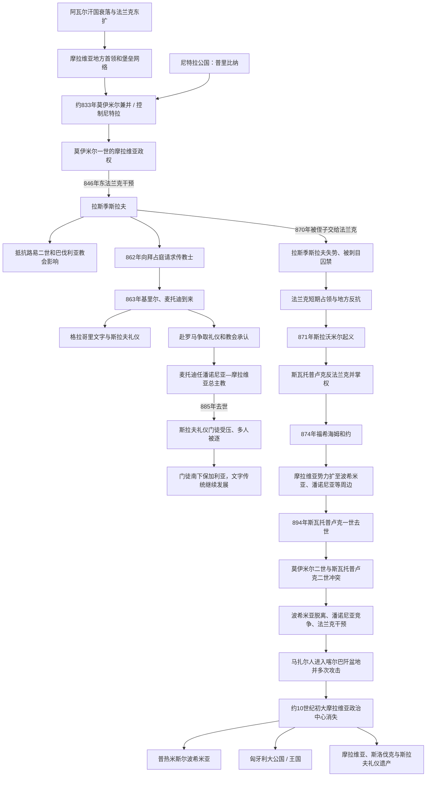

# 大摩拉维亚

## 时间

约9世纪20年代／833年—10世纪初（通常以约907年前后的政治消失为下限）

## 别称与范围

“大摩拉维亚”是后世史学常用名称，拜占庭皇帝君士坦丁七世在10世纪著作中使用过类似“大摩拉维亚”的表述。其政治中心通常定位于今捷克东部摩拉维亚与斯洛伐克西部，重要遗址包括米库尔奇采、旧梅斯托、波汉斯科和尼特拉等；不同阶段的势力还可能覆盖波希米亚、潘诺尼亚、维斯瓦河上游及周边地区。

政权疆域、首都和某些中心对应仍有争议。主流观点把核心放在摩拉瓦河中下游和尼特拉区域，也有少数“南方摩拉维亚”假说。考古、法兰克文献和后世拜占庭记载不能完整拼出固定国界，因此扩张范围宜写作控制、附庸或影响，而非现代边界式领土。

## 概括

大摩拉维亚是中欧西斯拉夫早期国家化的重要实例。9世纪初，摩拉维亚首领利用阿瓦尔汗国瓦解、法兰克帝国边疆重组、河谷贸易和地方堡垒网络扩大权力。莫伊米尔一世约在833年兼并或控制尼特拉公国，建立更大政治中心；法兰克国王路易二世于846年扶植拉斯季斯拉夫取代莫伊米尔，却未能把摩拉维亚变成稳定附庸。

拉斯季斯拉夫为减少巴伐利亚教会和东法兰克影响，于862年向拜占庭请求能用斯拉夫语传教的教师。基里尔和麦托迪于863年来到，发展格拉哥里文字和斯拉夫礼仪；麦托迪后来获教宗任命为总主教，使摩拉维亚在罗马、君士坦丁堡和法兰克教会之间争取自主。斯瓦托普卢克一世在870—894年扩张至鼎盛，并于874年同东法兰克达成和平。

894年后，继承冲突、边缘附庸脱离、东法兰克压力和马扎尔人进入喀尔巴阡盆地共同削弱国家。政权约在10世纪初消失，其人口、堡垒、教会和政治传统被波希米亚、匈牙利及地方社会重新吸收。大摩拉维亚不是现代捷克或斯洛伐克的单一直接国家，却成为两国及更广斯拉夫文化共同追溯的重要遗产。

## 政权演变图

## 建立背景

### 阿瓦尔汗国和法兰克边疆

6—8世纪，今摩拉维亚、斯洛伐克和潘诺尼亚处在阿瓦尔汗国、斯拉夫社群和法兰克—巴伐利亚边疆之间。查理曼于791—796年多次打击阿瓦尔，汗国政治网络随后瓦解。法兰克帝国把东部边区纳入藩镇和传教体系，萨尔茨堡、帕绍等教区向斯拉夫地区扩展。

阿瓦尔权力消失没有使该地区成为真空。地方斯拉夫首领控制堡垒、渡口和贡赋网络，继承部分军事、工艺和贸易资源。法兰克君主可册封或承认首领，地方统治者也以受洗、纳贡和参战换取支持，同时争取更大自主。

### 摩拉维亚和尼特拉

822年法兰克帝国议会上出现“摩拉维亚人”使者，是该政治共同体最早较明确记录之一。831年前后帕绍主教为摩拉维亚人施洗，说明统治精英已经同巴伐利亚教会接触。

尼特拉由普里比纳统治，828年前后当地教堂获萨尔茨堡主教祝圣。传统叙述认为莫伊米尔一世约833年驱逐普里比纳并合并尼特拉；普里比纳流亡后最终在东法兰克支持下统治下潘诺尼亚。具体行动是直接兼并、王朝竞争还是法兰克文献简化仍有讨论，但摩拉维亚和尼特拉结合显著扩大了莫伊米尔王朝基础。

## 统治者世系

大摩拉维亚的记录稀少，“公爵”“王”等称号来自拉丁文或后世资料。下表列通常承认的最高统治者，并把871年起义领袖和并立封地统治者单独注明，避免把附庸或争位者误写成连续国王。

| 顺序 | 统治者 | 王朝 / 身份 | 统治时间 | 与前任关系 | 关键事件与备注 |
|---:|---|---|---|---|---|
| 1 | **莫伊米尔一世**（Mojmír I） | 莫伊米尔王朝 | 约820年代／833年以前—846年 | 已知首位摩拉维亚统治者 | 约833年驱逐尼特拉的普里比纳并扩大政权；接受基督教影响，846年被东法兰克国王路易二世征伐并撤换。 |
| 2 | **拉斯季斯拉夫**（Rastislav） | 莫伊米尔王朝 | 846—870年 | 莫伊米尔一世之侄，由路易二世扶立 | 转而反抗东法兰克；862年向拜占庭请求传教士，863年迎来基里尔、麦托迪；870年被侄子斯瓦托普卢克捕获并交给法兰克，后遭刺目监禁。 |
| — | 斯拉沃米尔（Slavomír） | 莫伊米尔王朝宗亲、教士 | 871年短暂被起义者推举 | 法兰克占领下的抵抗领袖 | 摩拉维亚人以为斯瓦托普卢克已死，推举斯拉沃米尔；斯瓦托普卢克奉法兰克命镇压时倒戈，斯拉沃米尔退出最高权力。 |
| 3 | **斯瓦托普卢克一世**（Svatopluk I） | 莫伊米尔王朝 | 尼特拉封地约850年代末起；全摩拉维亚871—894年 | 拉斯季斯拉夫之侄，曾掌尼特拉 | 先与法兰克合作并交出拉斯季斯拉夫，后反抗法兰克；874年和约后扩张至鼎盛。与麦托迪合作又支持拉丁教士，894年去世。 |
| 4 | **莫伊米尔二世**（Mojmír II） | 莫伊米尔王朝 | 894—约906／907年 | 斯瓦托普卢克一世之子 | 继承最高权力，同弟弟斯瓦托普卢克二世内战；901年同东法兰克暂时和解。最后记载不完整，国家在马扎尔冲击中消失。 |

### 并立和封地统治

| 人物 | 地位与时间 | 与最高统治者关系 | 说明 |
|---|---|---|---|
| 普里比纳（Pribina） | 尼特拉统治者，至约833年 | 被莫伊米尔一世驱逐 | 并非大摩拉维亚最高统治者；后在东法兰克保护下统治下潘诺尼亚，是区域基督教化关键人物。 |
| 科采尔（Kocel） | 下潘诺尼亚统治者，约861—876年 | 普里比纳之子，法兰克封臣 | 支持麦托迪和斯拉夫礼仪，与摩拉维亚文化圈紧密，但其领地不等同大摩拉维亚本部。 |
| 斯瓦托普卢克二世（Svatopluk II） | 约894—899年控制尼特拉等封地 | 斯瓦托普卢克一世之子、莫伊米尔二世之弟 | 同兄长争位并寻求巴伐利亚援助；通常不列为统一国家最高统治者。 |
| 普雷德斯拉夫（Predslav） | 可能为斯瓦托普卢克一世之子 | 身份仅见后世推测 | 其姓名可能保留在布拉迪斯拉发相关解释中，但是否统治以及封地均无可靠连续记录。 |

## 拉斯季斯拉夫时期（846—870）

### 从法兰克扶植者到自主君主

846年路易二世入侵摩拉维亚，撤换莫伊米尔并扶立拉斯季斯拉夫，可能希望建立更可靠的边境附庸。拉斯季斯拉夫巩固本地堡垒和军队后，支持反法兰克势力并多次抵抗入侵。855年路易二世的远征未能迫使其臣服，864年法兰克军围困“多维娜”后，拉斯季斯拉夫短暂屈服，但很快恢复独立行动。

东法兰克控制的重要工具是巴伐利亚教士和教区。摩拉维亚已有拉丁传教士，问题不在是否基督教化，而在主教任命、礼仪语言和政治依附。拉斯季斯拉夫曾向罗马请求教师未获满意回应，遂转向拜占庭。

### 拜占庭传教

862年，拉斯季斯拉夫向拜占庭皇帝米海尔三世请求能解释基督教教义、使用本地语言的教师。来自塞萨洛尼基的兄弟君士坦丁／基里尔和麦托迪熟悉斯拉夫语，于863年抵达。他们及弟子翻译福音书和礼仪文本，基里尔发展格拉哥里字母，使斯拉夫语可用于高级宗教和书写。

拜占庭派遣不等于摩拉维亚改属东正教。当时东西教会尚未正式分裂，兄弟为培养本地主持圣礼者，需要在西方取得祝圣。他们前往罗马，教宗哈德良二世认可斯拉夫礼仪书并祝圣弟子。基里尔869年在罗马去世，麦托迪获任命为潘诺尼亚及摩拉维亚总主教。

### 870年政变

斯瓦托普卢克原掌尼特拉，既是拉斯季斯拉夫侄子，又同东法兰克谈判。870年拉斯季斯拉夫企图除掉侄子，反被捕并交给法兰克。法兰克法庭判其死刑，后改为刺目和终身监禁。

法兰克随后拘押斯瓦托普卢克并直接管理摩拉维亚，引发地方反抗。871年摩拉维亚人推举宗亲教士斯拉沃米尔；斯瓦托普卢克获释并奉命镇压，却在战场倒向摩拉维亚军，击败巴伐利亚统帅，成为最高统治者。

## 斯瓦托普卢克一世时期（871—894）

### 和平与扩张

873年麦托迪从巴伐利亚教士监禁中获释，回到摩拉维亚。874年斯瓦托普卢克同路易二世代表签署福希海姆和约，承诺纳贡和名义忠诚，换取较长和平。稳定边境后，他向波希米亚、维斯瓦河上游、卢萨蒂亚、潘诺尼亚和其他斯拉夫地区扩大影响。

扩张方式包括军事征服、扶植地方首领、贡赋和教会管辖，控制程度不一。后世地图常把最大势力范围画成固定疆域，实际许多边缘地可能只是短期附庸。波希米亚若干公爵曾受其影响，维斯瓦人也可能被迫臣服。

### 教会路线冲突

麦托迪倡导斯拉夫礼仪并直属教宗，巴伐利亚教士则坚持拉丁礼和本方教区权。斯瓦托普卢克在政治上利用两派，个人可能更偏好拉丁礼。880年教宗约翰八世诏书确认麦托迪地位并认可斯拉夫礼仪，同时任命德国教士维兴为尼特拉主教，为后续冲突埋下伏笔。

885年麦托迪去世后，维兴及拉丁教士取得优势。麦托迪指定的继承者戈拉兹德未能就任，许多弟子被监禁、出售或驱逐。克莱门特、瑙姆等转入保加利亚，在奥赫里德和普雷斯拉夫继续翻译与教育。大摩拉维亚本土的斯拉夫礼仪受压，却通过门徒南传成为保加利亚、塞尔维亚和罗斯文字文化的重要来源。

### 鼎盛条件

- 摩拉瓦、多瑙等河流连接盐、金属、牲畜和远距离贸易。
- 大型堡垒、贵族战士、手工业中心和贡赋网络提供国家能力。
- 莫伊米尔王朝兼并尼特拉，控制比单一河谷更广的人口和路线。
- 在东法兰克内部王位与边区冲突中灵活结盟，避免被一方长期集中攻击。
- 基督教和本地主教区提高统治合法性、书写与外交能力。
- 874年后和平让斯瓦托普卢克能将军力用于扩张而非防御。
- 周边斯拉夫小共同体尚未形成同等强度国家，容易成为附庸。

## 国家与社会结构

### 堡垒和统治网络

大摩拉维亚没有留下完整成文宪法。考古显示大型设防中心包含宫殿式建筑、教堂、工匠区和贵族墓葬，周围有较小堡垒与乡村。统治者通过亲族、地方贵族、军队和教会征集贡赋、组织战争并控制贸易。

米库尔奇采发现多座教堂和大型聚落，旧梅斯托、波汉斯科、尼特拉同样重要。哪一处是固定“首都”没有定论，最高统治者可能在多个中心巡回。

### 农业、手工业和贸易

多数居民从事谷物种植、畜牧和林地经济。铁器、武器、珠宝、陶器和宗教用品在中心生产，精英通过战利品、贡赋及贸易获得奢侈品。多瑙河联系东法兰克、潘诺尼亚、亚得里亚海和拜占庭方向。

奴隶和战俘是战争经济的一部分，中欧商路也同奴隶贸易有关。基督教化和国家整合未立即消除旧信仰、地方习惯或社会等级。

### 宗教转型

基督教在863年前已由巴伐利亚教士传播，精英受洗与教堂建设逐渐扩展。基里尔—麦托迪使命的独特之处在于创造本地书写与争取自主教会，而非首次带来基督教。拉丁语、斯拉夫语礼仪和本地旧信仰在数十年间并存。

## 894年后的继承危机

斯瓦托普卢克一世于894年去世，莫伊米尔二世继承最高权力，斯瓦托普卢克二世获得尼特拉等封地。兄弟很快冲突，后者向巴伐利亚求援。东法兰克一面同莫伊米尔谈判，一面支持分裂；波希米亚的斯皮季赫涅夫一世等转向东法兰克，摆脱摩拉维亚支配。

莫伊米尔二世仍能维持一定国家能力。约899年，他请求教宗重建独立教会，获得总主教和若干主教；900—901年摩拉维亚同巴伐利亚一度和解，共同应对马扎尔人。这表明国家并非894年立即崩溃。

## 衰落与灭亡原因

### 结构因素

1. **扩张依赖个人统治**：许多边缘地区对斯瓦托普卢克个人军威和附庸关系负责，缺乏稳定行政整合。
2. **分封与继承冲突**：尼特拉等核心区域由王族分掌，最高统治者去世后容易转为内战。
3. **教会制度未稳定**：斯拉夫礼仪与巴伐利亚拉丁教会冲突使本地主教体系反复中断。
4. **堡垒网络成本高**：大型中心依赖贡赋、贸易和军事胜利，持续战争会迅速削弱资源。
5. **边缘民族政治形成**：波希米亚等地方王朝逐渐有能力改投东法兰克并独立发展。

### 外部压力

东法兰克和巴伐利亚不断干预王位、教区与边界。更关键的是马扎尔人于9世纪末进入喀尔巴阡盆地，利用草原骑兵机动攻击潘诺尼亚、摩拉维亚和东法兰克。大摩拉维亚最初可能同马扎尔人合作打击法兰克，后来两者利益转为冲突。

### 直接崩溃过程

902年前后摩拉维亚仍同巴伐利亚交战并被记载击退马扎尔袭击；906年前后法兰克文献不再出现其王国和统治者。907年布拉迪斯拉发战役中马扎尔人重创巴伐利亚军，说明他们已控制多瑙中游战略空间。大摩拉维亚可能在此前数年经内战、附庸脱离和连续攻击瓦解，而非被一场有确切日期的“最后战役”瞬间灭亡。

国家机构消失后，人口和聚落并未消失。部分堡垒衰落，地方贵族和教会网络被波希米亚、匈牙利及其他政权吸收，摩拉维亚地区后来进入普热米斯尔国家。

## 重要事件

| 时间 | 事件 | 直接结果 | 长期意义 |
|---|---|---|---|
| 822年 | 摩拉维亚使者见于法兰克帝国会议 | 政治共同体进入可确认文献 | 表明地方首领已参与帝国外交。 |
| 831年前后 | 帕绍主教为摩拉维亚人施洗 | 拉丁基督教传播 | 863年使命并非第一次基督教接触。 |
| 约833年 | 莫伊米尔驱逐普里比纳 | 摩拉维亚兼并或控制尼特拉 | 国家人口、堡垒和河路基础扩大。 |
| 846年 | 路易二世撤换莫伊米尔 | 拉斯季斯拉夫上台 | 法兰克扶植者后来转为自主对手。 |
| 862—863年 | 向拜占庭请求传教士；基里尔、麦托迪抵达 | 斯拉夫语译经和格拉哥里文字展开 | 开创跨斯拉夫书写传统。 |
| 869年 | 麦托迪获任命为总主教 | 建立相对独立教会框架 | 摩拉维亚在罗马、拜占庭和巴伐利亚间平衡。 |
| 870—871年 | 拉斯季斯拉夫失势、法兰克占领和起义 | 斯瓦托普卢克一世掌权 | 王朝内斗转化为反法兰克国家重建。 |
| 874年 | 福希海姆和约 | 摩拉维亚名义纳贡并获和平 | 为斯瓦托普卢克扩张创造条件。 |
| 880年 | 教宗确认麦托迪教会地位 | 斯拉夫礼仪获认可 | 同拉丁教士冲突仍未解决。 |
| 885年 | 麦托迪去世，门徒被逐 | 本地斯拉夫礼仪受压 | 门徒在保加利亚传播并扩大其历史影响。 |
| 894年 | 斯瓦托普卢克一世去世 | 两子分掌并争权 | 扩张体系迅速松动。 |
| 895年 | 波希米亚公爵转向东法兰克 | 摩拉维亚失去西部附庸 | 普热米斯尔方向开始独立上升。 |
| 899年左右 | 教宗派遣主教重建摩拉维亚教会 | 莫伊米尔二世暂时恢复教会自主 | 说明晚期国家仍具外交能力。 |
| 900—906年 | 马扎尔和法兰克压力、内部冲突 | 堡垒与中央网络瓦解 | 10世纪初政权退出文献。 |

## 遗产

### 文字与礼仪

格拉哥里文字、斯拉夫译经和麦托迪教会在摩拉维亚本土延续时间有限，却经被逐门徒进入保加利亚，间接推动西里尔字母和教会斯拉夫语发展。其影响后来覆盖东正教南斯拉夫和罗斯世界，远超大摩拉维亚疆域。

### 捷克与斯洛伐克记忆

捷克民族史强调大摩拉维亚同摩拉维亚、波希米亚及早期国家形成的联系；斯洛伐克民族史强调尼特拉和今日斯洛伐克西部是国家核心之一。两种追溯都有史地依据，但大摩拉维亚不是现代任何一国边界和民族的完整复制。

捷克斯洛伐克时期，基里尔与麦托迪、大摩拉维亚常被用作捷斯共同国家的历史资源。1993年后两国分别纪念这段历史，显示中世纪遗产可被多个现代国家共享。

### 中欧政治转折

大摩拉维亚瓦解后，波希米亚普热米斯尔王朝、皮雅斯特波兰和马扎尔匈牙利分别成为中欧主要国家。斯洛伐克大部进入匈牙利王国，摩拉维亚进入波希米亚方向。此后拉丁教会在中欧占主导，但斯拉夫礼仪记忆没有完全消失。

## 关键辨析

- “大摩拉维亚”不是当时所有文献一致使用的正式国名，疆域和首都应保留不确定性。
- 普里比纳的尼特拉公国同莫伊米尔政权的关系主要来自后世法兰克资料，833年“统一”细节存在争议。
- 基里尔、麦托迪来自拜占庭，却取得教宗承认；其使命不能简单归为1054年以后意义的“东正教对天主教”。
- 格拉哥里字母由基里尔使命发展，西里尔字母主要在其门徒活动的保加利亚文学中心形成。
- 斯瓦托普卢克一世的最大疆域图多包括不同强度附庸，不能全部视作直接行政区。
- 斯拉沃米尔是871年反法兰克起义的短暂推举者，不应同长期最高统治者并列而不加说明。
- 斯瓦托普卢克二世控制尼特拉并争位，但通常不是统一大摩拉维亚的连续最高统治者。
- 国家约在10世纪初消失，具体灭亡年份和最后战役不详；907年常作时代分界而非已证实灭国日。
- 大摩拉维亚遗产由捷克、斯洛伐克、摩拉维亚地方及更广斯拉夫文化共享，不能建立排他直系继承。

## 演变关系

- 前一节点：[斯拉夫人分化](/%E4%BA%BA%E6%96%87%E7%A7%91%E5%AD%A6/%E5%8E%86%E5%8F%B2/%E6%AC%A7%E6%B4%B2/%E6%96%AF%E6%8B%89%E5%A4%AB/%E6%96%AF%E6%8B%89%E5%A4%AB%E4%BA%BA%E5%88%86%E5%8C%96.md)。
- 后续方向：[波希米亚公国与王国](/%E4%BA%BA%E6%96%87%E7%A7%91%E5%AD%A6/%E5%8E%86%E5%8F%B2/%E6%AC%A7%E6%B4%B2/%E6%96%AF%E6%8B%89%E5%A4%AB/%E8%A5%BF%E6%96%AF%E6%8B%89%E5%A4%AB/%E6%B3%A2%E5%B8%8C%E7%B1%B3%E4%BA%9A%E5%85%AC%E5%9B%BD%E4%B8%8E%E7%8E%8B%E5%9B%BD.md)、[波兰王国](/%E4%BA%BA%E6%96%87%E7%A7%91%E5%AD%A6/%E5%8E%86%E5%8F%B2/%E6%AC%A7%E6%B4%B2/%E6%96%AF%E6%8B%89%E5%A4%AB/%E8%A5%BF%E6%96%AF%E6%8B%89%E5%A4%AB/%E6%B3%A2%E5%85%B0%E7%8E%8B%E5%9B%BD.md)与[斯洛伐克](/%E4%BA%BA%E6%96%87%E7%A7%91%E5%AD%A6/%E5%8E%86%E5%8F%B2/%E6%AC%A7%E6%B4%B2/%E6%96%AF%E6%8B%89%E5%A4%AB/%E8%A5%BF%E6%96%AF%E6%8B%89%E5%A4%AB/%E6%96%AF%E6%B4%9B%E4%BC%90%E5%85%8B.md)。
- 南传文字文化：[保加利亚第一帝国](/%E4%BA%BA%E6%96%87%E7%A7%91%E5%AD%A6/%E5%8E%86%E5%8F%B2/%E6%AC%A7%E6%B4%B2/%E4%B8%9C%E5%8D%97%E6%AC%A7%E4%B8%8E%E5%B7%B4%E5%B0%94%E5%B9%B2/%E4%BF%9D%E5%8A%A0%E5%88%A9%E4%BA%9A/%E4%BF%9D%E5%8A%A0%E5%88%A9%E4%BA%9A%E7%AC%AC%E4%B8%80%E5%B8%9D%E5%9B%BD.md)。
- 返回：[西斯拉夫历史](/%E4%BA%BA%E6%96%87%E7%A7%91%E5%AD%A6/%E5%8E%86%E5%8F%B2/%E6%AC%A7%E6%B4%B2/%E6%96%AF%E6%8B%89%E5%A4%AB/%E8%A5%BF%E6%96%AF%E6%8B%89%E5%A4%AB/README.md)。
