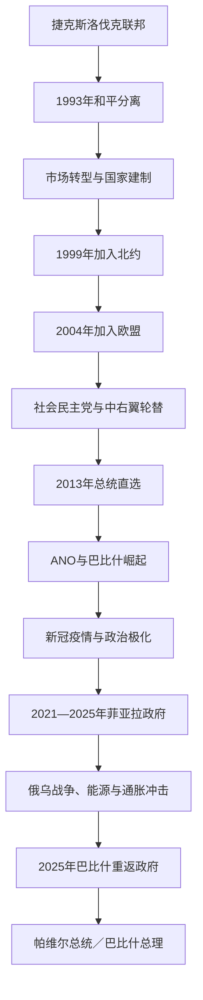

# 捷克

## 时间

1993年1月1日至今。现代捷克共和国以波希米亚、摩拉维亚和捷克西里西亚为领土核心，是捷克斯洛伐克和平解体后的两个法定继承国之一。

## 概括

捷克共和国继承波希米亚王冠的历史象征、哈布斯堡时期工业与行政基础、第一共和国民主传统和捷克斯洛伐克联邦中的捷克共和国机关。1993年的独立不是战争或殖民统治结束，而是捷克、斯洛伐克政治领导谈判分割联邦财产、军队、货币和国际义务的结果。

建国后克劳斯政府推进私有化与市场转型，较完整工业基础、邻近德国和外资供应链推动出口经济。捷克1999年加入北约，2004年加入欧盟。政治由公民民主党、社会民主党主导逐步转向多党碎片化和ANO崛起；2013年总统直选增加元首政治能见度，却没有改变政府对众议院负责的议会制。2025年选举后安德烈·巴比什重返总理职位，彼得·帕维尔继续任总统。

## 独立背景与和平分离

1989年天鹅绒革命后，捷克、斯洛伐克共同进行民主化和市场改革。捷克地区多数政治力量倾向较强联邦和快速经济自由化，斯洛伐克多数力量更强调共和国主权、财政安排与渐进改革。1992年选举分别由瓦茨拉夫·克劳斯和弗拉迪米尔·梅恰尔阵营获胜，两人未就邦联或联邦方案达成一致，转而协商解体。

联邦议会通过终止国家存在的宪法法案，没有举行全民公投。支持者认为选举结果和议会程序提供授权，批评者认为选民从未直接选择解体。财产大体按人口2比1分割，军队、外交机构和联邦债务同步拆分。捷克、斯洛伐克在边界和人口上没有南斯拉夫式武装争议，行政精英也愿意合作，因而实现“天鹅绒分离”。

## 分阶段发展

### 1993—1997年：国家建制与转型乐观

捷克继承联邦首都布拉格、较多中央机关和工业企业，独立初期制度成本相对较低。克劳斯政府采用优惠券私有化，使公民和投资基金迅速取得国企股份；价格、贸易与货币已在联邦末期开始自由化。1993年2月与斯洛伐克结束货币联盟，捷克克朗建立。

私有化速度创造私人部门，也产生基金治理不透明、银行向关联企业放贷和所有权责任模糊。政府强调低失业、财政审慎和“捷克转型例外”，但1996—1997年贸易赤字、货币压力和银行问题暴露结构弱点。党务融资丑闻使公民民主党分裂，克劳斯内阁倒台。

### 1998—2004年：社会民主党政府与欧美整合

泽曼社会民主党少数政府依与公民民主党的“反对党协议”维持，主要两党承诺不推翻政府并分配议会职位。协议提供稳定，却被批评压缩竞争和增加政党控制。政府重组银行、吸引外资，汽车、机械和电子制造深度嵌入德国—中欧供应链。

1999年加入北约，把安全制度锚定西方；2004年加入欧盟，人员、资本与商品流动扩大。捷克没有采用欧元，保留克朗和独立货币政策。加入欧盟不是单一政府成就，而是连续多届内阁、法规调整、公投与外交谈判的结果。

### 2004—2013年：联盟碎片化与信任危机

社会民主党连续更换总理，格罗斯因财产来源争议辞职。2006年众议院左右阵营各100席，长期组阁后托波拉内克建立中右翼联盟。其政府在捷克担任欧盟轮值主席国期间遭不信任案推翻，菲舍尔专家政府过渡。

内恰斯政府推进财政、养老金和反腐议程，紧缩政策和联盟冲突削弱支持。2013年总理办公室涉及监控与腐败的案件导致辞职。传统公民民主党、社会民主党都因丑闻和经济不安失去选民，企业家巴比什领导的ANO以反腐、效率和“像经营企业一样管理国家”进入权力中心。

### 总统直选与宪制实践

2012年修宪引入总统直选，泽曼2013年成为首位直选总统。总统仍不能单独制定政府政策，但直选正当性让泽曼更积极解释任命总理、接受辞职和外交发言权。鲁斯诺克政府未获众议院信任仍看守数月，是总统与议会多数张力的代表。

泽曼支持巴比什组阁并在政治危机中扩大总统议程设置。2023年彼得·帕维尔当选，风格更强调与政府和盟国协调。总统权力变化主要来自政治实践与公众授权，宪法上的议会制基础并未改变。

### 2014—2021年：ANO进入并主导政府

索博特卡政府由社会民主党、ANO和基民盟组成，经济增长、低失业和工资提高增强稳定。巴比什兼财政部长且控制大型企业与媒体，引发利益冲突争议；2017年ANO成为最大党。

巴比什第一届少数政府未获信任，第二届与社会民主党联合，并获得共产党在信任和预算上的容忍。这是1989年后共产党首次直接影响政府存续，却未正式入阁。欧盟层面的利益冲突审计、“鹳巢”补贴案件与大规模示威持续。新冠疫情中政府采取封锁、补助和频繁卫生措施，早期防控后出现高死亡与政策反复，成为2021年选举的重要背景。

### 2021—2025年：菲亚拉联盟、战争与经济压力

2021年公民民主党领导的“一起”联盟与海盗—市长联盟合组五党政府。选举制度下反对联盟席位超过ANO，说明最大单党不自动获得组阁权。政府强调财政修复、对欧合作和制度稳定。

2022年俄乌战争后，捷克接收大量乌克兰难民、提供军事援助并加快减少俄罗斯能源依赖。能源价格、通胀和实际收入下降引发抗议，政府推进能源补贴、养老金和财政紧缩。2024年海盗党因数字化建筑许可危机和部长解职退出，联盟缩小但继续执政。支持者强调安全和财政责任，反对者批评生活成本、沟通和公共服务。

### 2025—2026年：巴比什第二阶段

2025年众议院选举使ANO取得重新组阁的优势。总统帕维尔依宪法任命总理和内阁，巴比什第二届政府于2025年12月15日开始运作。至2026年7月14日，帕维尔仍任总统、巴比什任总理。

这次轮替显示捷克政党体系虽高度竞争，政府更替仍通过选举、联盟谈判、总统任命和众议院责任完成。巴比什的企业利益安排、欧盟关系、财政与安全路线仍是政府接受监督的重点。

## 国家结构与权力

| 机构 | 产生方式 | 主要权力与限制 |
|---|---|---|
| 总统 | 2013年前由议会选举，此后公民直选，任期五年 | 国家元首、任命总理、签署或否决普通法律、任命部分官员、统帅象征；许多行为需政府副署或受宪法约束。 |
| 总理与政府 | 总统任命，须获众议院信任 | 领导日常行政、预算、内外政策；可因不信任、选举或联盟瓦解更替。 |
| 众议院 | 比例代表直选，200席 | 立法、预算、信任与监督政府，可推翻普通总统否决。 |
| 参议院 | 分区两轮选举，81席，分批改选 | 审议法律、参与宪法修正和总统权力监督；政府不对其负责。 |
| 宪法法院 | 总统经参议院同意任命法官 | 审查法律、选举和权力争议，是转型后制衡核心。 |
| 地区与市镇 | 地方选举 | 负责教育、交通、医疗和地方发展；2000年后地区自治强化。 |

## 重要事件

| 时间 | 事件 | 意义 |
|---|---|---|
| 1993年1月1日 | 捷克共和国成立 | 联邦和平解体，国家机关和货币逐步独立。 |
| 1993年2月 | 哈维尔当选总统 | 建立新共和国民主象征与外交连续性。 |
| 1997年 | 货币与政府危机 | 转型早期治理问题暴露，克劳斯政府倒台。 |
| 1999年 | 加入北约 | 安全政策转入跨大西洋体系。 |
| 2004年 | 加入欧盟 | 经济法规和市场深度整合。 |
| 2009年 | 欧盟主席国期间政府倒台 | 显示国内议会政治可独立于外交时程。 |
| 2013年 | 首次总统直选、内恰斯政府危机 | 总统政治角色上升，传统政党受挫。 |
| 2017—2018年 | ANO胜选与两次组阁 | 企业家政党成为政府主导力量。 |
| 2020—2021年 | 新冠疫情 | 公共卫生、财政与政府信任受到重大考验。 |
| 2021年 | 五党联盟组阁 | 反对联盟在席位上超过最大单党并完成轮替。 |
| 2022年 | 俄乌战争冲击 | 安全、难民、能源和财政政策重新排序。 |
| 2023年 | 帕维尔就任总统 | 直选总统完成第二次人物轮替。 |
| 2025年12月 | 巴比什重返总理职位 | ANO恢复执政，进入新一轮总统—政府协作与制衡。 |

## 国家发展的条件与风险

### 发展条件

- 继承波希米亚、摩拉维亚高工业化、教育和行政基础，独立建制成本较低。
- 邻近德国、奥地利和欧盟市场，外资制造、汽车与机械出口形成增长引擎。
- 竞争选举、联合政府和司法制衡使重大危机多以制度内更替解决。
- 北约、欧盟提供安全、投资、基础设施与法规锚定。

### 结构性问题

- 经济高度依赖外部制造供应链，能源、德国需求和全球汽车转型会直接传导。
- 布拉格与其他地区、技术产业与传统工业之间收入和住房差距扩大。
- 比例代表和多党联盟有利代表性，也增加组阁复杂度与短期政策妥协。
- 企业所有权、媒体集中和政治融资使“效率型领导”与利益冲突监督持续碰撞。
- 总统直选带来双重民主正当性，若总统与众议院多数冲突，任命和看守政府边界会成为争点。

## 国家元首与政府首脑

完整总统空位代行、全部总统和历届总理，见[捷克共和国国家元首与政府首脑表](/%E4%BA%BA%E6%96%87%E7%A7%91%E5%AD%A6/%E5%8E%86%E5%8F%B2/%E6%AC%A7%E6%B4%B2/%E6%96%AF%E6%8B%89%E5%A4%AB/%E8%A5%BF%E6%96%AF%E6%8B%89%E5%A4%AB/%E6%8D%B7%E5%85%8B%E5%85%B1%E5%92%8C%E5%9B%BD%E5%9B%BD%E5%AE%B6%E5%85%83%E9%A6%96%E4%B8%8E%E6%94%BF%E5%BA%9C%E9%A6%96%E8%84%91%E8%A1%A8.md)。

截至2026年7月14日：

| 角色 | 人物 | 就任时间 | 定位 |
|---|---|---|---|
| 总统 | 彼得·帕维尔 | 2023年3月9日 | 国家元首，直选产生。 |
| 总理 | 安德烈·巴比什 | 2025年12月15日 | 政府首脑，对众议院负责；为第二段总理任期。 |

## 演变关系

- 历史基础：[波希米亚公国与王国](/%E4%BA%BA%E6%96%87%E7%A7%91%E5%AD%A6/%E5%8E%86%E5%8F%B2/%E6%AC%A7%E6%B4%B2/%E6%96%AF%E6%8B%89%E5%A4%AB/%E8%A5%BF%E6%96%AF%E6%8B%89%E5%A4%AB/%E6%B3%A2%E5%B8%8C%E7%B1%B3%E4%BA%9A%E5%85%AC%E5%9B%BD%E4%B8%8E%E7%8E%8B%E5%9B%BD.md)。
- 直接前一节点：[捷克斯洛伐克](/%E4%BA%BA%E6%96%87%E7%A7%91%E5%AD%A6/%E5%8E%86%E5%8F%B2/%E6%AC%A7%E6%B4%B2/%E6%96%AF%E6%8B%89%E5%A4%AB/%E8%A5%BF%E6%96%AF%E6%8B%89%E5%A4%AB/%E6%8D%B7%E5%85%8B%E6%96%AF%E6%B4%9B%E4%BC%90%E5%85%8B.md)。
- 同时独立的继承国：[斯洛伐克](/%E4%BA%BA%E6%96%87%E7%A7%91%E5%AD%A6/%E5%8E%86%E5%8F%B2/%E6%AC%A7%E6%B4%B2/%E6%96%AF%E6%8B%89%E5%A4%AB/%E8%A5%BF%E6%96%AF%E6%8B%89%E5%A4%AB/%E6%96%AF%E6%B4%9B%E4%BC%90%E5%85%8B.md)。
- 返回：[西斯拉夫历史](/%E4%BA%BA%E6%96%87%E7%A7%91%E5%AD%A6/%E5%8E%86%E5%8F%B2/%E6%AC%A7%E6%B4%B2/%E6%96%AF%E6%8B%89%E5%A4%AB/%E8%A5%BF%E6%96%AF%E6%8B%89%E5%A4%AB/README.md)。
