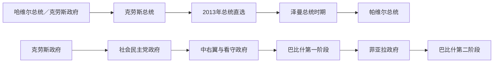

# 捷克共和国国家元首与政府首脑表

## 范围与制度

捷克共和国自1993年1月1日起实行议会共和制。总统是国家元首，任命总理并完成其他宪法职能；政府须对众议院负责，因此日常行政和政策主导通常在总理与内阁。2013年起总统由议会间接选举改为公民直选，但这没有把捷克改造成总统制。

本表核验至2026年7月14日。现任总统为彼得·帕维尔，现任总理为安德烈·巴比什；巴比什第二届政府于2025年12月15日就职。

## 总统与代行安排

| 顺序 | 国家元首／代行者 | 任期 | 产生方式 | 关键事件与备注 |
|---:|---|---|---|---|
| 1 | **瓦茨拉夫·哈维尔** | 1993年2月2日—2003年2月2日 | 议会选举，两届 | 原捷克斯洛伐克总统；为新国家建立民主象征与西方外交方向，任内捷克加入北约。 |
| — | 总统空位 | 2003年2月2日—3月7日 | 总理和众议院议长等依宪法分掌职权 | 总理弗拉迪米尔·什皮德拉、众议院议长卢博米尔·扎奥拉莱克等代行相应权限；不是集体总统。 |
| 2 | **瓦茨拉夫·克劳斯** | 2003年3月7日—2013年3月7日 | 议会选举，两届 | 市场转型设计者；对欧洲一体化较为疑欧，2009年完成《里斯本条约》批准。 |
| — | 总统空位 | 2013年3月7日—3月8日 | 宪法代行一天 | 克劳斯任满至直选总统就职之间的短暂空位。 |
| 3 | **米洛什·泽曼** | 2013年3月8日—2023年3月8日 | 公民直选，两届 | 首位直选总统；更积极介入组阁和外交辩论，与多届政府既合作又冲突。 |
| 4 | **彼得·帕维尔** | 2023年3月9日至今 | 公民直选 | 前军队总参谋长和北约军事委员会主席；任内经历菲亚拉政府末期与2025年后巴比什政府。截至2026年7月14日在任。 |

## 政府首脑

| 顺序 | 总理 | 任期 | 政党／内阁性质 | 关键事件与备注 |
|---:|---|---|---|---|
| 1 | **瓦茨拉夫·克劳斯** | 1993年1月1日—1998年1月2日 | 公民民主党，中右翼联盟 | 延续联邦时期政府；推进私有化和市场转型。1997年党务融资与经济问题使联盟瓦解。 |
| 2 | 约瑟夫·托绍夫斯基 | 1998年1月2日—7月17日 | 无党派看守政府 | 时任央行行长；负责提前选举前过渡。 |
| 3 | **米洛什·泽曼** | 1998年7月17日—2002年7月15日 | 社会民主党少数政府 | 依与公民民主党的“反对党协议”维持；完成银行重组和欧盟入盟准备。 |
| 4 | 弗拉迪米尔·什皮德拉 | 2002年7月15日—2004年8月4日 | 社会民主党领导的中左联盟 | 捷克2004年加入欧盟；欧洲议会选举失利后辞职。 |
| 5 | 斯坦尼斯拉夫·格罗斯 | 2004年8月4日—2005年4月25日 | 社会民主党联盟 | 个人财产与政治信任争议导致短任。 |
| 6 | 伊日·帕鲁贝克 | 2005年4月25日—2006年9月4日 | 社会民主党联盟 | 恢复政府稳定；2006年选举后议会左右各100席，组阁僵局。 |
| 7 | 米雷克·托波拉内克 | 2006年9月4日—2009年5月8日 | 公民民主党；先少数、后中右翼联盟 | 2007年第二届政府获信任；捷克担任欧盟轮值主席国期间内阁遭不信任案推翻。 |
| 8 | 扬·菲舍尔 | 2009年5月8日—2010年7月13日 | 无党派专家看守政府 | 完成欧盟主席国余期，应对金融危机并组织2010年选举。 |
| 9 | 彼得·内恰斯 | 2010年7月13日—2013年7月10日 | 公民民主党中右翼联盟 | 推动财政和养老金改革；总理办公室腐败与监控案后辞职。 |
| 10 | 伊日·鲁斯诺克 | 2013年7月10日—2014年1月29日 | 总统任命的专家政府 | 未获众议院信任但留任至选后交接，显示直选总统与议会多数的张力。 |
| 11 | 博胡斯拉夫·索博特卡 | 2014年1月29日—2017年12月13日 | 社会民主党、ANO与基民盟联盟 | 经济增长与低失业并存；与财政部长巴比什的利益冲突争议升级。 |
| 12 | **安德烈·巴比什** | 2017年12月13日—2021年12月17日 | ANO；先少数，后与社会民主党联合并获共产党容忍 | 企业家政党成为核心；处理新冠疫情，利益冲突与“鹳巢”案件持续引发争议。 |
| 13 | **彼得·菲亚拉** | 2021年12月17日—2025年12月15日 | 公民民主党领导的五党／后四党联盟 | 俄乌战争后推动安全与能源调整；高通胀和财政紧缩侵蚀支持，海盗党2024年退出。 |
| 14 | **安德烈·巴比什** | 2025年12月15日至今 | ANO领导的政府 | 2025年众议院选举后重返总理职位；截至2026年7月14日在任。 |

## 总统与政府权力关系

| 情形 | 制度运行 | 历史例证 |
|---|---|---|
| 正常多数政府 | 总统任命能获得众议院信任的总理，政府决定内政外交日常政策 | 什皮德拉、菲亚拉等多数联盟。 |
| 少数政府 | 总理须以容忍协议、议题支持或再组阁取得信任 | 泽曼的反对党协议；巴比什2018年后的支持安排。 |
| 组阁僵局 | 总统在提名总理、接受辞职和任命内阁方面拥有较大议程空间，但最终仍受信任投票约束 | 2006年平票、2013年鲁斯诺克专家政府。 |
| 总统空位 | 总统权限按性质转给总理和议会两院议长 | 2003年空位以及2013年一天空位。 |
| 直选总统 | 直选增强政治正当性和公众能见度，并未取消政府对众议院负责的议会制基础 | 泽曼积极介入政治；帕维尔与政府协调安全外交。 |

## 政治阶段与政府更替原因

### 1993—1998年：建国与市场转型

联邦和平解体后，捷克继承较完整的工业基础和联邦行政机构。克劳斯政府推进价格自由化、私有化和对外开放，早期增长塑造“成功转型”形象；但投资基金治理、银行坏账与党务资金问题在1997年汇集成政府危机。克劳斯辞职不是国家制度崩溃，而是执政联盟失去信任后的议会制更替。

### 1998—2006年：社会民主党执政与加入欧美体系

泽曼少数政府依“反对党协议”换取稳定，代价是主要政党瓜分制度资源的批评。继任政府完成北约整合和2004年欧盟入盟，出口制造业、外资和欧洲市场成为发展支柱。格罗斯因个人信任危机迅速下台，显示总理即便掌握联盟也必须维持党内和公众正当性。

### 2006—2013年：碎片化、改革与反建制情绪

2006年议会平票造成长期组阁；托波拉内克、内恰斯政府推动财政改革，却相继因联盟裂缝或丑闻倒台。传统公民民主党、社会民主党的互相竞争仍主导制度，却逐渐给反腐、企业化和新政党打开空间。2013年鲁斯诺克政府未获信任仍过渡数月，成为总统权力边界的重要案例。

### 2013—2021年：直选总统与ANO崛起

泽曼成为首位直选总统，巴比什的ANO以反传统政党、行政效率和社会保障组合迅速壮大。巴比什第一届内阁未获信任，第二届依社会民主党联合和共产党容忍执政。新冠疫情、利益冲突审查和司法案件加剧政治极化，但政府更替仍通过2021年选举和联盟组建完成。

### 2021—2026年：战争冲击与再次轮替

菲亚拉政府在俄乌战争、能源价格、通胀和财政赤字压力下推进对乌支持、能源替代和紧缩政策。五党联盟内部的政策与人事冲突削弱一致性。2025年选举使ANO重新取得组阁优势，巴比什于12月15日就职；总统帕维尔仍按宪法履行元首和任命职能，政府则对众议院承担政治责任。

## 连续性检查

- 捷克没有1993年以前的独立共和国总统；哈维尔在1992年7月辞去联邦总统后，于1993年2月由捷克议会另行选出。
- 2003年与2013年的总统空位必须作为代行安排记录，不能把总理或议长列为正式总统。
- 巴比什有两个不连续任期，须分列；菲亚拉任期止于2025年12月15日。
- 截至2026年7月14日，总统彼得·帕维尔、总理安德烈·巴比什均在任。

## 相关笔记

- 现代国家主线：[捷克](/%E4%BA%BA%E6%96%87%E7%A7%91%E5%AD%A6/%E5%8E%86%E5%8F%B2/%E6%AC%A7%E6%B4%B2/%E6%96%AF%E6%8B%89%E5%A4%AB/%E8%A5%BF%E6%96%AF%E6%8B%89%E5%A4%AB/%E6%8D%B7%E5%85%8B.md)
- 共同国家前史：[捷克斯洛伐克](/%E4%BA%BA%E6%96%87%E7%A7%91%E5%AD%A6/%E5%8E%86%E5%8F%B2/%E6%AC%A7%E6%B4%B2/%E6%96%AF%E6%8B%89%E5%A4%AB/%E8%A5%BF%E6%96%AF%E6%8B%89%E5%A4%AB/%E6%8D%B7%E5%85%8B%E6%96%AF%E6%B4%9B%E4%BC%90%E5%85%8B.md)
- 更早王冠历史：[波希米亚公国与王国](/%E4%BA%BA%E6%96%87%E7%A7%91%E5%AD%A6/%E5%8E%86%E5%8F%B2/%E6%AC%A7%E6%B4%B2/%E6%96%AF%E6%8B%89%E5%A4%AB/%E8%A5%BF%E6%96%AF%E6%8B%89%E5%A4%AB/%E6%B3%A2%E5%B8%8C%E7%B1%B3%E4%BA%9A%E5%85%AC%E5%9B%BD%E4%B8%8E%E7%8E%8B%E5%9B%BD.md)
- 总览：[西斯拉夫历史](/%E4%BA%BA%E6%96%87%E7%A7%91%E5%AD%A6/%E5%8E%86%E5%8F%B2/%E6%AC%A7%E6%B4%B2/%E6%96%AF%E6%8B%89%E5%A4%AB/%E8%A5%BF%E6%96%AF%E6%8B%89%E5%A4%AB/README.md)
