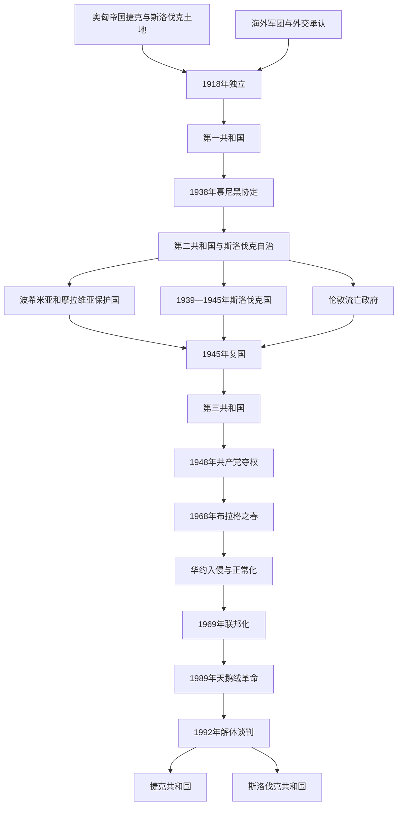

# 捷克斯洛伐克

## 时间

1918年10月28日—1992年12月31日。本土国家在1939年3月被纳粹德国肢解，但伦敦流亡政府维持法统并于1945年复国。1969年起为捷克社会主义共和国与斯洛伐克社会主义共和国组成的联邦，1990年改国名为捷克和斯洛伐克联邦共和国。

## 概括

捷克斯洛伐克是一战后建立的中欧共和国，把波希米亚、摩拉维亚、捷克西里西亚、斯洛伐克和喀尔巴阡罗斯纳入同一国家。其建国同时依靠国内民族委员会接管、捷克斯洛伐克军团的军事政治作用、马萨里克—贝奈斯海外外交和协约国胜利。国家以“捷克斯洛伐克民族”概念为统一法理，捷克地区较强的工业、官僚传统与斯洛伐克较弱的自治基础由此进入同一中央体制，结构不对称长期存在。

第一共和国保持议会民主和多党竞争，却未能充分解决苏台德德意志人、斯洛伐克自治和经济地区差距。1938年慕尼黑协定割让边境，1939年德国占领波希米亚—摩拉维亚、扶植斯洛伐克国。战后国家恢复，驱逐多数德意志人并进入苏联势力范围；共产党1948年夺权。1968年“布拉格之春”改革遭华约入侵，随后实行联邦化却在“正常化”党国中压缩实质自治。1989年天鹅绒革命恢复民主；1992年捷克、斯洛伐克选举结果与联邦制度争议使精英谈判选择和平解体。

## 建立背景

### 哈布斯堡统治下的不同历史经验

波希米亚和摩拉维亚是奥地利半部工业最发达地区之一，拥有历史王冠领地、城市中产、捷克语教育和政党网络；当地还有数量庞大、集中于边境和城市的德语人口。斯洛伐克长期处于匈牙利王国，行政、教育和土地精英较多使用匈牙利语，斯洛伐克民族组织的制度资源更弱。共同的西斯拉夫语言亲近不等于两地已有共同国家。

捷克政治中的部分领袖以“捷克斯洛伐克民族”主张把两支视为一个民族的捷克、斯洛伐克分支，可在战后边界谈判中形成多数国家。斯洛伐克国内则同时存在共同国家派、联邦／自治派和亲匈牙利或天主教政治力量。

### 一战、军团与海外委员会

马萨里克、贝奈斯和斯洛伐克人什特凡尼克组织海外委员会，争取协约国承认。俄国、法国、意大利等地的捷克斯洛伐克军团由战俘和侨民组成；俄国军团控制西伯利亚铁路的行动提高了独立运动能见度。美国捷克、斯洛伐克侨团协议承诺斯洛伐克自治，但具体约束力和落实方式后来成为争议。

1918年奥匈军事失败，布拉格民族委员会于10月28日宣布独立，斯洛伐克代表10月30日在马丁声明加入。军队随后争夺德语边区、斯洛伐克和匈牙利边界。国际条约最终确认边界，喀尔巴阡罗斯以自治承诺加入。

## 分阶段发展

### 1918—1935年：第一共和国建制与稳定

1920年宪法建立议会共和国、两院议会、比例代表制和由议会选出的总统。马萨里克拥有超越政党的道德权威，实际政治依靠“城堡集团”、五党委员会和反复联合内阁协调。土地改革、货币独立、公共教育与行政统一推进，新国家继承奥匈大部分工业，却也承受战争市场断裂。

德意志、匈牙利、鲁塞尼亚等少数族群拥有政党和议会代表，部分德语政党1926年后参加政府，说明第一共和国并非单一民族专政。然而“捷克斯洛伐克民族”在统计和国家语言制度上提高捷克—斯洛伐克共同多数，德意志精英认为历史王冠领地原则压过民族自决；斯洛伐克自治承诺也迟迟未兑现。

### 大萧条与苏台德危机

1929年后出口工业区失业严重，德语边区受冲击尤其深。康拉德·亨莱因的苏台德德意志党从自治口号转向接受希特勒指挥。德国以保护民族自决为名要求吞并防御工事和工业边区。捷克斯洛伐克与法国、苏联有条约，却受法国履约意愿和苏联援助条件限制。

1938年9月英国、法国、德国、意大利在没有捷克斯洛伐克代表正式参与的情况下签署慕尼黑协定，要求割让苏台德地区。政府在孤立与战争劣势下接受。波兰占领扎奥尔杰，匈牙利经第一次维也纳裁决取得斯洛伐克南部和喀尔巴阡罗斯部分地区。边境工事、人口、工业和交通被切走，国家安全结构崩溃。

### 第二共和国与1939年肢解

慕尼黑后贝奈斯辞职，埃米尔·哈查当选总统。斯洛伐克、喀尔巴阡罗斯取得自治，政党和媒体自由收缩。1939年3月希特勒以军事威胁迫使斯洛伐克领导层宣布独立；德军进入捷克土地，设波希米亚和摩拉维亚保护国。匈牙利吞并喀尔巴阡乌克兰并进攻斯洛伐克边境。

保护国保留哈查和本地政府外壳，实权属于德国保护长官、党卫队和警察。大学被关闭，劳动力和工业服务德国战争，犹太人、罗姆人和政治反对者遭迫害与屠杀。斯洛伐克国由约瑟夫·蒂索领导，依附德国并参与对苏战争和犹太人驱逐，但国内仍有军队、行政和政治分歧。

### 抵抗、流亡政府与斯洛伐克民族起义

贝奈斯在伦敦由民族委员会逐步建立获盟国承认的流亡政府，主张慕尼黑无效和总统法统连续。国内抵抗包括军官、知识分子、共产党和地方网络；他们与伦敦、莫斯科的联系并不统一。1942年英训伞兵刺杀海德里希，德国以利迪策、莱扎基屠杀报复。

1944年斯洛伐克民族起义由军人、共产党和民主派民族委员会共同发动，目标包括反德、推翻蒂索政权和在恢复共同国家时确认斯洛伐克平等。起义中心被德军攻陷后转为游击战。苏军、罗马尼亚军及捷克斯洛伐克部队从东推进，1945年5月布拉格起义与苏军进入结束占领。

### 1945—1948年：第三共和国

科希策纲领限定合法政党为民族阵线，禁止被认定为通敌的战前右翼，重要工业国有化。贝奈斯法令剥夺多数德意志人与匈牙利人的公民、财产资格；在盟国认可的转移框架与地方“野蛮驱逐”中，约三百万德意志人离开。驱逐降低民族边界冲突，却伴随集体惩罚与暴力，并使国家人口结构显著同质化。

共产党在捷克地区1946年选举居首，在斯洛伐克不及民主党，却控制内政、警察和宣传等关键部门。苏联安全与地缘影响、战后左转、国有经济和非共产党阵营分裂共同增强其地位。1948年2月非共产党部长以辞职迫使重新分配警察权，哥特瓦尔德动员工人武装和群众示威，贝奈斯接受共产党主导的新政府。直接夺权通过政府危机完成，背后有党组织、警察控制和苏联环境。

### 1948—1967年：斯大林化与有限改革

共产党垄断政治、国有化和农业集体化，宗教组织受压。斯兰斯基审判等政治清洗体现斯大林式安全体制，并带有反犹色彩。重工业优先使斯洛伐克工业化和城市化加快，缩小部分地区差距，也造成消费不足、环境代价和对苏联市场依赖。

1953年货币改革抹去私人储蓄，引发比尔森工人抗议。去斯大林化比波兰、匈牙利缓慢，诺沃提尼兼任党第一书记与总统。1960年宪法宣称社会主义建成并改国名；经济停滞、斯洛伐克干部对清洗不满、作家和学生争取表达自由，推动改革联盟形成。

### 1968年布拉格之春与入侵

杜布切克1968年1月取代诺沃提尼，改革派取消审查、讨论市场化、司法平反和“有人性面孔的社会主义”。《行动纲领》仍主张共产党领导和社会主义联盟，并非立即退出华约。公众结社、媒体讨论和斯洛伐克联邦化要求迅速超出保守领导预期。

苏联及东德、波兰等担心改革扩散和党权失控。多次谈判后，1968年8月20—21日华约五国入侵。捷克斯洛伐克领导人被押往莫斯科，被迫接受限制改革的议定书；只有弗兰季谢克·克里格尔拒签。群众非暴力抵抗延缓占领机构运转，却没有军事反击。

### 1969—1988年：联邦化与“正常化”

1969年联邦宪制生效，建立捷克、斯洛伐克两个共和国及双院联邦议会。联邦化是布拉格之春少数保留的制度成果，但胡萨克领导的正常化清洗数十万党员，恢复审查和政治忠诚考核。联邦机关重大决定仍受统一工人党中央控制。

消费改善、住房和福利换取社会退隐，1970年代石油与苏联贸易支撑稳定。1977年《七七宪章》以政府签署的人权义务批评制度，参与者规模有限却在国际上重要。经济技术落后、环境污染和官僚僵化在1980年代加剧，戈尔巴乔夫改革又削弱苏联以武力维持东欧旧秩序的可能。

### 1989年天鹅绒革命

1989年11月17日布拉格学生示威遭警察镇压，引发剧院、大学和城市群众持续抗议。捷克地区成立公民论坛，斯洛伐克成立“公众反暴力”。共产党先更换总书记，后删除宪法中的领导地位；恰尔法组成非共产党占多数政府，胡萨克辞职，哈维尔12月29日当选总统。

转型相对和平，原因包括群众跨行业动员、共产党安全机构不愿大规模开火、苏联不干预和谈判精英存在。它不是单日示威自动推翻政权，而是三周内街头压力、总罢工、议会修宪和政府改组的连续过程。

### 1990—1992年：民主转型与和平解体

1990年自由选举后，联邦同时进行价格自由化、私有化、外交转向和秘密警察遗产处理。捷克政治更支持快速市场改革和功能较强的联邦；斯洛伐克政治更强调主权、较慢改革和双边国家条约。国名中的连字符争议已显示两种国家想象。

1992年选举中，克劳斯领导的捷克公民民主党和梅恰尔领导的斯洛伐克民主斯洛伐克运动分别获胜。两人未就松散联邦、邦联或强联邦达成协议，转而谈判解体。联邦议会通过国家终止法和财产、货币、军队分割安排。哈维尔因反对解体且未能连任于7月辞职；没有举行全联邦公投，是过程最重要的民主争议之一。1993年1月1日两个共和国成立。

## 统治结构

| 阶段 | 法定结构 | 实际权力特点 |
|---|---|---|
| 1918—1938年 | 议会共和国，总统、两院议会、责任内阁 | 多党联盟和五党协调主导；马萨里克、贝奈斯总统具有额外政治权威。 |
| 1938—1939年 | 第二共和国，斯洛伐克与喀尔巴阡罗斯自治 | 领土危机下行政集权、民主收缩，德国直接施压。 |
| 1939—1945年 | 保护国、斯洛伐克国、伦敦流亡政府并立 | 本土实际权力分属德国占领机关与附庸政权；流亡政府维持国际法统。 |
| 1945—1948年 | 民族阵线有限多党共和国 | 共产党控制警察和关键部门，非共党仍有议会与政府角色。 |
| 1948—1968年 | 单一制人民民主／社会主义共和国 | 共产党第一书记为实际最高领导，法定总统与政府服从党。 |
| 1969—1989年 | 捷克、斯洛伐克两共和国组成联邦 | 形式联邦，实质由统一党组织集中决策。 |
| 1989—1992年 | 民主联邦、竞争选举 | 联邦与两共和国都有选举正当性，宪法否决结构使国家形式需协商。 |

## 重要事件

| 时间 | 事件 | 影响 |
|---|---|---|
| 1918年 | 独立与临时宪制 | 奥匈土地重组为共同共和国。 |
| 1920年 | 宪法通过 | 确立议会民主和中央集权国家结构。 |
| 1938年 | 慕尼黑协定 | 边境割让摧毁防御、经济与第一共和国正当性。 |
| 1939年 | 德国肢解国家 | 保护国、斯洛伐克国和流亡法统并立。 |
| 1942年 | 海德里希遇刺及报复 | 抵抗提升国际影响，德国实施大规模恐怖。 |
| 1944年 | 斯洛伐克民族起义 | 反法西斯与斯洛伐克平等诉求结合。 |
| 1945年 | 复国、国有化与人口转移 | 国家社会和民族结构根本改变。 |
| 1948年 | 二月政变 | 共产党以政府危机、警察和群众动员夺取垄断权。 |
| 1968年 | 布拉格之春与华约入侵 | 改革被终止，军事占领塑造此后正常化。 |
| 1969年 | 联邦化 | 捷克、斯洛伐克共和国制度化，实权仍集中于党。 |
| 1977年 | 七七宪章 | 人权异议网络形成。 |
| 1989年 | 天鹅绒革命 | 党国和平退出垄断，哈维尔当选。 |
| 1992年 | 解体协议与联邦终止法 | 无公投下完成制度与财产分割。 |
| 1993年 | 两个共和国成立 | 捷克斯洛伐克历史终结。 |

## 建立、稳定、危机与解体原因

### 建立与早期稳定

- 奥匈战败和民族委员会接管创造国内权力真空。
- 海外军团、侨团和协约外交使新国家获得国际承认。
- 捷克工业、官僚和政党资源为建国提供能力，斯洛伐克加入则扩大人口与战略纵深。
- 马萨里克的跨党权威和比例代表下的联盟协调维持议会民主。

### 1938—1939年崩溃

结构因素是民族自治未充分解决、边境防御和工业集中于德语区；外部压力是纳粹德国扩张及英法绥靖；直接触发是慕尼黑协定强迫割地。1939年德国军事威胁和扶植分离进一步肢解剩余国家。不能把崩溃单归因于少数族群或捷克斯洛伐克制度。

### 1948年党国化

共产党拥有战时抵抗声望、苏联支持、警察和工会组织；战后国有化和对西方失望使左转具有群众基础。非共部长集体辞职本想迫使改组，却给哥特瓦尔德填补职位机会。贝奈斯接受新政府是直接制度转折，党对强力机关的预先控制决定结果。

### 1968年改革失败

经济停滞、清洗遗产和知识界压力推动改革；媒体开放又使改革超出保守派控制。苏联把多元化视为联盟安全和党权威威胁，华约入侵是直接终止机制。联邦化得以保留，是因为它可与重新集中党权并存。

### 1992年解体

捷克、斯洛伐克已有各自共和国、议会和政党体系，1989年后统一共产党不再压住差异。市场改革速度、财政转移、国家名称和主权归属争议累积。1992年两地选民支持不同执政党，却没有明确授权“必须解体”；克劳斯、梅恰尔判断松散邦联不可运作，精英谈判成为直接路径。和平、行政连续和边界无争议使解体避免战争。

## 国家元首、政府首脑与实际领导

完整总统、总统空位代行、历届总理、保护国与斯洛伐克国行政、伦敦流亡体系、共产党第一书记／总书记，见[捷克斯洛伐克国家元首、政府首脑与实际领导表](/%E4%BA%BA%E6%96%87%E7%A7%91%E5%AD%A6/%E5%8E%86%E5%8F%B2/%E6%AC%A7%E6%B4%B2/%E6%96%AF%E6%8B%89%E5%A4%AB/%E8%A5%BF%E6%96%AF%E6%8B%89%E5%A4%AB/%E6%8D%B7%E5%85%8B%E6%96%AF%E6%B4%9B%E4%BC%90%E5%85%8B%E5%9B%BD%E5%AE%B6%E5%85%83%E9%A6%96%E6%94%BF%E5%BA%9C%E9%A6%96%E8%84%91%E4%B8%8E%E5%AE%9E%E9%99%85%E9%A2%86%E5%AF%BC%E8%A1%A8.md)。

## 演变关系

- 捷克历史前置：[波希米亚公国与王国](/%E4%BA%BA%E6%96%87%E7%A7%91%E5%AD%A6/%E5%8E%86%E5%8F%B2/%E6%AC%A7%E6%B4%B2/%E6%96%AF%E6%8B%89%E5%A4%AB/%E8%A5%BF%E6%96%AF%E6%8B%89%E5%A4%AB/%E6%B3%A2%E5%B8%8C%E7%B1%B3%E4%BA%9A%E5%85%AC%E5%9B%BD%E4%B8%8E%E7%8E%8B%E5%9B%BD.md)。
- 早期共同记忆：[大摩拉维亚](/%E4%BA%BA%E6%96%87%E7%A7%91%E5%AD%A6/%E5%8E%86%E5%8F%B2/%E6%AC%A7%E6%B4%B2/%E6%96%AF%E6%8B%89%E5%A4%AB/%E8%A5%BF%E6%96%AF%E6%8B%89%E5%A4%AB/%E5%A4%A7%E6%91%A9%E6%8B%89%E7%BB%B4%E4%BA%9A.md)；它是中世纪文化参照，不是1918年共和国的直接法统前身。
- 后继国家：[捷克](/%E4%BA%BA%E6%96%87%E7%A7%91%E5%AD%A6/%E5%8E%86%E5%8F%B2/%E6%AC%A7%E6%B4%B2/%E6%96%AF%E6%8B%89%E5%A4%AB/%E8%A5%BF%E6%96%AF%E6%8B%89%E5%A4%AB/%E6%8D%B7%E5%85%8B.md)与[斯洛伐克](/%E4%BA%BA%E6%96%87%E7%A7%91%E5%AD%A6/%E5%8E%86%E5%8F%B2/%E6%AC%A7%E6%B4%B2/%E6%96%AF%E6%8B%89%E5%A4%AB/%E8%A5%BF%E6%96%AF%E6%8B%89%E5%A4%AB/%E6%96%AF%E6%B4%9B%E4%BC%90%E5%85%8B.md)。
- 返回：[西斯拉夫历史](/%E4%BA%BA%E6%96%87%E7%A7%91%E5%AD%A6/%E5%8E%86%E5%8F%B2/%E6%AC%A7%E6%B4%B2/%E6%96%AF%E6%8B%89%E5%A4%AB/%E8%A5%BF%E6%96%AF%E6%8B%89%E5%A4%AB/README.md)。
