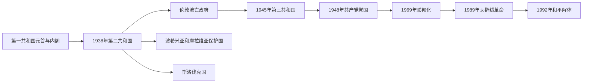

# 捷克斯洛伐克国家元首、政府首脑与实际领导表

## 范围与角色区分

1918—1992年的国家连续性曾三度改变：1939年本土国家被德国肢解而流亡政府坚持法统；1948年共产党夺取实际最高权力；1969年联邦化后，联邦与捷克、斯洛伐克两个共和国各有政府。下表把法定国家元首、政府首脑、占领行政、流亡机构和共产党最高领导分开，避免把名义职位与实际权力混为一谈。

## 捷克斯洛伐克法定国家元首

| 顺序 | 国家元首 | 任期 | 法律身份 | 关键事件与备注 |
|---:|---|---|---|---|
| 1 | **托马斯·加里格·马萨里克** | 1918年11月14日—1935年12月14日 | 共和国总统 | 独立运动领袖和首任总统；连续四次当选，形成总统协调多党政治的传统。 |
| 2 | **爱德华·贝奈斯** | 1935年12月18日—1938年10月5日 | 共和国总统 | 慕尼黑协定后辞职并流亡；其辞职与战时法统后来由流亡政府重新解释。 |
| — | 总统空位 | 1938年10月5日—11月30日 | 政府依宪法代行部分职权 | 总理扬·西罗维主持危机过渡，不能列成正式总统。 |
| 3 | 埃米尔·哈查 | 1938年11月30日—1939年3月15日 | 第二共和国总统 | 在领土割让和联邦化压力下当选；德国入侵后共和国停止在本土存在。 |
| 4 | **爱德华·贝奈斯** | 1940年7月—1945年4月，流亡法统；1945年4月—1948年6月7日，复国总统 | 伦敦流亡国家元首、战后共和国总统 | 盟国逐步承认流亡政府；战后发布总统法令，1948年共产党夺权后拒签新宪法并辞职。 |
| 5 | **克莱门特·哥特瓦尔德** | 1948年6月14日—1953年3月14日 | 共和国总统、共产党领袖 | 二月政变主导者；完成党国化、清洗与经济国有化。 |
| 6 | 安东宁·萨波托斯基 | 1953年3月21日—1957年11月13日 | 共和国总统 | 哥特瓦尔德死后继任；实际路线仍由共产党领导层决定。 |
| 7 | 安东宁·诺沃提尼 | 1957年11月19日—1968年3月22日 | 总统；兼任共产党第一书记至1968年1月 | 高度集权时期兼掌党政最高职位；改革危机中先失党职后辞总统。 |
| 8 | 卢德维克·斯沃博达 | 1968年3月30日—1975年5月28日 | 总统 | 布拉格之春时期当选；华约入侵后参与莫斯科谈判，正常化中留任，晚年因健康失能。 |
| 9 | **古斯塔夫·胡萨克** | 1975年5月29日—1989年12月10日 | 总统；兼共产党总书记至1987年 | 正常化体制象征；1989年任命非共产党占多数的政府后辞职。 |
| 10 | **瓦茨拉夫·哈维尔** | 1989年12月29日—1992年7月20日 | 捷克斯洛伐克总统，1990年起为联邦总统 | 异议作家转任元首；推动民主转型，因反对国家解体且未获斯洛伐克议员支持而辞职。 |
| — | 总统空位 | 1992年7月20日—12月31日 | 联邦总理代行部分总统职权 | 扬·斯特拉斯基在解体谈判期代行；未另选总统，国家于年末终止。 |

## 捷克斯洛伐克政府首脑

| 顺序 | 政府首脑 | 任期 | 政治阶段 | 关键事件与备注 |
|---:|---|---|---|---|
| 1 | 卡雷尔·克拉马日 | 1918年11月—1919年7月 | 第一共和国 | 首届政府总理；巴黎和会期间与国内社会改革压力并行。 |
| 2 | 弗拉斯蒂米尔·图萨尔 | 1919年7月—1920年9月 | 第一共和国 | 领导两届“红绿联盟”，处理战后经济与边界战争。 |
| 3 | 扬·切尔尼 | 1920年9月—1921年9月 | 看守／官僚政府 | 在议会联盟危机中组织非党派内阁。 |
| 4 | 爱德华·贝奈斯 | 1921年9月—1922年10月 | 第一共和国 | 兼外交政策主导者；建立广泛联合。 |
| 5 | 安东宁·什韦赫拉 | 1922年10月—1926年3月 | 第一共和国 | “五党委员会”核心，稳定多党妥协。 |
| 6 | 扬·切尔尼 | 1926年3月—10月 | 看守政府 | 第二次组织官僚内阁。 |
| 7 | 安东宁·什韦赫拉 | 1926年10月—1929年2月 | 第一共和国 | 组建包含德语政党的联盟；因健康退任。 |
| 8 | 弗兰季谢克·乌德尔扎尔 | 1929年2月—1932年10月 | 第一共和国 | 大萧条冲击下维持联盟，社会和民族矛盾加深。 |
| 9 | 扬·马利佩特尔 | 1932年10月—1935年11月 | 第一共和国 | 应对失业、极端主义与德国纳粹压力。 |
| 10 | 米兰·霍查 | 1935年11月—1938年9月 | 第一共和国 | 首位斯洛伐克籍总理；苏台德危机中辞职。 |
| 11 | 扬·西罗维 | 1938年9月—12月 | 危机与第二共和国 | 将军出任总理，接受慕尼黑割地并主持总统空位过渡。 |
| 12 | 鲁道夫·贝兰 | 1938年12月—1939年3月15日 | 第二共和国 | 党派合并、民主收缩；德国肢解国家时在任。 |
| 13 | 扬·什拉梅克 | 1940年7月—1945年4月 | 伦敦流亡政府 | 领导获盟国承认的流亡内阁，与贝奈斯共同恢复国家法统。 |
| 14 | 兹德涅克·菲尔林格 | 1945年4月—1946年7月 | 第三共和国民族阵线 | 科希策纲领下重建；共产党掌握内政等关键部门。 |
| 15 | **克莱门特·哥特瓦尔德** | 1946年7月—1948年6月 | 第三共和国至二月政变 | 共产党在1946年选举后组阁；1948年利用非共部长辞职危机夺权。 |
| 16 | 安东宁·萨波托斯基 | 1948年6月—1953年3月 | 共产党党国 | 集体化、重工业优先和政治审判时期。 |
| 17 | 威廉·西罗基 | 1953年3月—1963年9月 | 共产党党国 | 货币改革、去斯大林化有限；斯洛伐克共产党案件影响长期存在。 |
| 18 | 约瑟夫·莱纳尔特 | 1963年9月—1968年4月 | 改革前夕 | 经济改革与斯洛伐克自治诉求上升。 |
| 19 | 奥尔德日赫·切尔尼克 | 1968年4月—1970年1月 | 布拉格之春、联邦化初期 | 改革派总理；入侵后逐步妥协，正常化开始后被撤。 |
| 20 | 卢博米尔·什特劳加尔 | 1970年1月—1988年10月 | 正常化 | 任期最长的联邦总理；在计划经济停滞和有限技术改革之间维持体制。 |
| 21 | 拉迪斯拉夫·阿达梅茨 | 1988年10月—1989年12月7日 | 正常化末期 | 与公民论坛谈判但未能建立可信改革政府。 |
| 22 | **马里安·恰尔法** | 1989年12月10日—1992年7月2日 | 民主转型 | 从共产党官员转为过渡总理；组织自由选举、价格改革和联邦权力重组。 |
| 23 | 扬·斯特拉斯基 | 1992年7月2日—12月31日 | 解体政府 | 在克劳斯—梅恰尔协议后管理国家清算，并代行部分总统职权。 |

## 德国占领、流亡政府与斯洛伐克国的并立权力

### 波希米亚和摩拉维亚保护国

| 角色 | 人物 | 任期 | 实际权力说明 |
|---|---|---|---|
| 国家总统 | 埃米尔·哈查 | 1939年3月—1945年5月 | 保留有限本地行政象征，受德国保护长官和安全机构控制；不是自由的捷克斯洛伐克总统。 |
| 保护国总理 | 鲁道夫·贝兰 | 1939年3月—4月 | 第二共和国政府短暂延续后辞职。 |
| 保护国总理 | 阿洛伊斯·埃利亚什 | 1939年4月—1941年9月 | 暗中联系抵抗运动，被盖世太保捕获并于1942年处决。 |
| 保护国总理 | 雅罗斯拉夫·克赖奇 | 1942年1月—1945年1月 | 在海德里希恐怖和全面战争动员下执行占领政策。 |
| 保护国总理 | 理查德·比内特 | 1945年1月—5月 | 布拉格起义时被捕，保护国政府瓦解。 |
| 德国保护长官 | 康斯坦丁·冯·纽赖特 | 1939年—1943年；1941年起休假 | 名义最高德国长官；因政策被认为不够严厉而遭架空。 |
| 代理保护长官 | **莱因哈德·海德里希** | 1941年—1942年 | 以党卫队和警察恐怖直接统治；1942年遭抵抗组织刺杀。 |
| 代理保护长官 | 库尔特·达吕格 | 1942年—1943年 | 海德里希死后实施报复镇压，包括利迪策惨案。 |
| 德国保护长官 | 威廉·弗里克 | 1943年—1945年 | 名义长官；国务部长卡尔·赫尔曼·弗兰克掌握大量实际警察与行政权。 |

### 斯洛伐克国

| 角色 | 人物 | 任期 | 实际权力说明 |
|---|---|---|---|
| 总统 | **约瑟夫·蒂索** | 1939年10月—1945年4月 | 教士政治家、人民党领袖；国家依附纳粹德国，参与迫害和驱逐犹太人。 |
| 总理 | 约瑟夫·蒂索 | 1939年3月—10月 | 独立宣布后的首届政府首脑，后转任总统。 |
| 总理 | 沃伊捷赫·图卡 | 1939年10月—1944年9月 | 激进亲德派；推动与轴心国结盟及反犹政策。 |
| 总理 | 什特凡·蒂索 | 1944年9月—1945年4月 | 斯洛伐克民族起义被镇压后在德国占领下执政。 |
| 反抗机构 | 斯洛伐克民族委员会 | 1944年8月起 | 起义地区的政治代表，主张恢复共同国家并确认斯洛伐克民族地位。 |

### 伦敦流亡体系

| 角色 | 人物／机构 | 时间 | 说明 |
|---|---|---|---|
| 国家元首 | 爱德华·贝奈斯 | 1940年—1945年 | 盟国逐步承认其总统连续性；推动否定慕尼黑协定。 |
| 总理 | 扬·什拉梅克 | 1940年—1945年 | 统筹伦敦流亡内阁；国内抵抗、海外军队和外交承认并非由一条指挥线完全控制。 |
| 共产党流亡中心 | 克莱门特·哥特瓦尔德等 | 莫斯科，1939年—1945年 | 与伦敦政府既合作又竞争；苏军推进后在战后权力安排中占优势。 |

## 共产党实际最高领导

| 顺序 | 共产党最高领导 | 任期 | 同期法定职位与实际权力 |
|---:|---|---|---|
| 1 | **克莱门特·哥特瓦尔德** | 1945年—1953年3月 | 1945年后任党主席，1948年政变后为最高决策者；1948—1953年兼总统。 |
| 2 | **安东宁·诺沃提尼** | 1953年9月—1968年1月 | 第一书记；1957年起兼总统，把党与国家高度集中。 |
| 3 | **亚历山大·杜布切克** | 1968年1月—1969年4月 | 第一书记；推进“有人性面孔的社会主义”，华约入侵后受压撤职。 |
| 4 | **古斯塔夫·胡萨克** | 1969年4月—1987年12月 | 第一书记／总书记；清洗改革派并建立正常化体制，1975年起兼总统。 |
| 5 | 米洛什·雅克什 | 1987年12月—1989年11月24日 | 总书记；面对群众抗议和苏联不干预态度，党内权威迅速崩解。 |
| 6 | 卡雷尔·乌尔巴内克 | 1989年11月24日—12月20日 | 末任总书记；共产党放弃宪法领导地位，实际权力转向议会与协商政府。 |

## 1969年联邦化后的权力层级

- 联邦总统和联邦政府负责外交、国防、货币与跨共和国事务；捷克社会主义共和国、斯洛伐克社会主义共和国另设民族议会和政府。
- 联邦议会采用人民院与民族院双院制，民族院设置捷克、斯洛伐克两部分并要求民族多数，意在防止人口较多的捷克一方单独决定宪制问题。
- 正常化时期制度上的联邦平等受共产党统一干部体系限制，真正重大决策仍由中央主席团作出。
- 1989年后共产党指挥链消失，联邦宪法的否决结构和两共和国选举结果差异反而成为谈判解体的重要制度背景。

## 连续性与争议处理

1. 1939年3月以后，本土的保护国总统、斯洛伐克国总统和伦敦流亡总统同时出现，代表三种不同法律地位；不能合并为一张普通总统表。
2. 贝奈斯战时总统连续性的国际承认是逐步形成的，1940年以前的机构从“临时委员会”向正式流亡政府演变。
3. 1948年后总统与总理仍是宪法职位，但共产党第一书记／总书记才是党国重大人事和政策的实际核心。
4. 1968年杜布切克掌握党权而斯沃博达任总统、切尔尼克任总理；三人的角色不同。华约入侵后，莫斯科议定书和苏联军事压力又形成外部权力层。
5. 1992年哈维尔辞职后不是出现一位新正式总统，而是总统空位、总理代行部分职权，直至联邦消失。

## 相关笔记

- 政权主线：[捷克斯洛伐克](/%E4%BA%BA%E6%96%87%E7%A7%91%E5%AD%A6/%E5%8E%86%E5%8F%B2/%E6%AC%A7%E6%B4%B2/%E6%96%AF%E6%8B%89%E5%A4%AB/%E8%A5%BF%E6%96%AF%E6%8B%89%E5%A4%AB/%E6%8D%B7%E5%85%8B%E6%96%AF%E6%B4%9B%E4%BC%90%E5%85%8B.md)
- 后继国家：[捷克](/%E4%BA%BA%E6%96%87%E7%A7%91%E5%AD%A6/%E5%8E%86%E5%8F%B2/%E6%AC%A7%E6%B4%B2/%E6%96%AF%E6%8B%89%E5%A4%AB/%E8%A5%BF%E6%96%AF%E6%8B%89%E5%A4%AB/%E6%8D%B7%E5%85%8B.md)、[斯洛伐克](/%E4%BA%BA%E6%96%87%E7%A7%91%E5%AD%A6/%E5%8E%86%E5%8F%B2/%E6%AC%A7%E6%B4%B2/%E6%96%AF%E6%8B%89%E5%A4%AB/%E8%A5%BF%E6%96%AF%E6%8B%89%E5%A4%AB/%E6%96%AF%E6%B4%9B%E4%BC%90%E5%85%8B.md)
- 前置历史：[波希米亚公国与王国](/%E4%BA%BA%E6%96%87%E7%A7%91%E5%AD%A6/%E5%8E%86%E5%8F%B2/%E6%AC%A7%E6%B4%B2/%E6%96%AF%E6%8B%89%E5%A4%AB/%E8%A5%BF%E6%96%AF%E6%8B%89%E5%A4%AB/%E6%B3%A2%E5%B8%8C%E7%B1%B3%E4%BA%9A%E5%85%AC%E5%9B%BD%E4%B8%8E%E7%8E%8B%E5%9B%BD.md)
- 总览：[西斯拉夫历史](/%E4%BA%BA%E6%96%87%E7%A7%91%E5%AD%A6/%E5%8E%86%E5%8F%B2/%E6%AC%A7%E6%B4%B2/%E6%96%AF%E6%8B%89%E5%A4%AB/%E8%A5%BF%E6%96%AF%E6%8B%89%E5%A4%AB/README.md)
