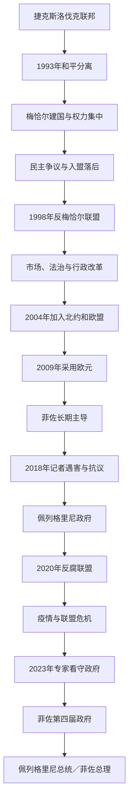

# 斯洛伐克

## 时间

1993年1月1日至今。现代斯洛伐克共和国是捷克斯洛伐克和平解体后的两个法定继承国之一；其更早历史连接大摩拉维亚、匈牙利王国北部、哈布斯堡君主国、1918年后的捷克斯洛伐克和1939—1945年斯洛伐克国。

## 概括

斯洛伐克共和国继承中欧西斯拉夫语言文化、匈牙利王国长期行政遗产和捷克斯洛伐克联邦中的斯洛伐克共和国机关。独立初期梅恰尔政府把国家建制、民族主权和强势行政结合，秘密警察、私有化与总统冲突使民主质量受质疑，并使北约、欧盟整合一度落后。1998年广泛反梅恰尔联盟执政后推进法治与市场改革，2004年同时加入北约和欧盟，2009年采用欧元。

2006年以后罗伯特·菲佐及方向—社会民主党长期主导政治，把社会政策、国家调节和文化保守结合。2018年记者扬·库恰克及未婚妻遇害引发大规模抗议，菲佐辞职；2020年反腐联盟上台，却在疫情、领导风格与联盟分裂中失稳。2023年菲佐第四次组阁，2024年彼得·佩列格里尼当选总统。至2026年7月14日，两人分别任总理和总统。

## 现代国家的历史背景

### 匈牙利王国与民族形成

大摩拉维亚约在10世纪初衰亡后，斯洛伐克地区逐步进入匈牙利王国。布拉迪斯拉发、科希策、矿业城市和北部山地分别形成不同经济社会结构，贵族、城市德语居民、匈牙利语行政与斯洛伐克语农民长期并存。奥斯曼占领匈牙利中部后，王国北部的重要行政和教会机关一度集中在今斯洛伐克区域。

18—19世纪斯洛伐克民族复兴通过语言标准化、学校、教会和文化协会发展。1848年革命中部分斯洛伐克领袖要求民族权利并与匈牙利革命政府冲突。1867年奥匈妥协后匈牙利政府强化马扎尔化，斯洛伐克语中学和文化机构受限，推动知识分子寻找捷克—斯洛伐克合作。

### 1918—1992年的共同国家经验

1918年斯洛伐克代表加入捷克斯洛伐克。共同国家带来学校、行政、土地改革和工业投资，也因布拉格中央集权、捷克官员比例和自治承诺未落实产生不满。1938年慕尼黑危机后斯洛伐克取得自治，1939年在德国压力下成立约瑟夫·蒂索领导的斯洛伐克国，依附纳粹德国并参与犹太人迫害。1944年斯洛伐克民族起义把反法西斯和恢复平等共同国家结合。

战后共产党工业化显著改变斯洛伐克，重工业、城市和教育扩张缩小与捷克的部分差距。1968年改革中，斯洛伐克领导人推动联邦化；1969年斯洛伐克社会主义共和国建立本级议会和政府。正常化时期实权仍集中于共产党，但共和国机构为1993年独立提供制度骨架。

### 1992年分离

1989年后，经济改革速度、财政转移和主权结构成为捷克、斯洛伐克争议。1992年梅恰尔阵营在斯洛伐克胜选，克劳斯阵营在捷克胜选，两者未就松散联邦达成协议。斯洛伐克国民议会通过主权宣言，联邦议会随后依法终止共同国家。过程没有全民公投，因而其民主授权一直存在争论；边界、军队和财产可协商分割，使分离保持和平。

## 分阶段发展

### 1993—1994年：建国与首次政府危机

斯洛伐克接管联邦共和国级机关，建立军队、外交、中央银行和税制。与捷克的货币联盟数周后结束。梅恰尔把快速“斯洛伐克化”与国家主导私有化结合，但执政联盟流失议员，1994年不信任案使莫拉夫奇临时政府上台。提前选举后梅恰尔重新组阁。

### 1994—1998年：梅恰尔主义

梅恰尔政府与总统米哈尔·科瓦奇公开冲突。总统之子被绑架到奥地利，秘密情报局被广泛指涉案；代行总统职权的梅恰尔后来发布赦免，成为法治危机象征。国有企业私有化常偏向政治盟友，公共媒体和反对派受压，议会多数也曾排挤反对党席位。

国家保留竞争选举和活跃公民社会，并未变成单党国家，但行政权缺乏制约。欧盟在1997年指出政治标准问题，北约首轮东扩未邀请斯洛伐克。外交落后与国内抗议促使反对党、非政府组织和选民动员。

### 1998—2006年：民主修复与改革

1998年反梅恰尔政党赢得组阁多数，祖林达领导从左到右的广泛联盟。政府修复宪法机构、推动总统直选、改革银行和公共行政。第二届政府实行统一税、养老金、劳工、医疗等市场改革，吸引汽车和电子投资。

改革实现高速增长和欧美入盟，也使失业、地区差距和社会保障压力上升。2004年加入北约、欧盟，标志从“中欧落后者”转为制度整合成员。入盟是民主标准、外交安全与经济规则三条线同步完成，不只是私有化结果。

### 2006—2010年：菲佐首次执政

菲佐以批评改革社会成本赢得选举，与民族党和梅恰尔政党组阁。政府保留多数市场框架，扩大福利、劳动保护和国家干预。与民族党合作、语言法和匈牙利少数族群问题引起争议。2009年斯洛伐克加入欧元区，降低汇率风险、强化欧洲经济整合，同时失去独立货币政策。

### 2010—2012年：中右翼政府与欧元区危机

拉迪乔娃成为首位女性总理，四党联盟试图推进透明和财政改革。联盟内部对扩大欧洲金融稳定工具分歧严重，总理把表决与信任案绑定，2011年失败；反对党方向党以支持救助换取提前选举。政府倒台说明欧盟层面责任与国内联盟政治直接相连。

### 2012—2018年：方向党主导与2018年危机

菲佐2012年获得独立后首个单党多数，2016年因极右翼进入议会而组成包括民族党和桥党在内联盟。经济增长、低失业和汽车产业扩展与医疗、教育、司法和腐败争议并存。政商关系、欧盟资金和警检独立成为调查焦点。

2018年调查税务欺诈和意大利黑手党关系的记者扬·库恰克与未婚妻玛蒂娜·库什尼罗娃遇害。大规模“为了体面的斯洛伐克”抗议要求问责。内政部长先辞，菲佐随后辞总理；同一联盟由彼得·佩列格里尼接替，从而避免立即提前选举。谋杀是直接触发，长期背景是公众对腐败网络和机构独立的不信任。

### 2018—2020年：佩列格里尼政府与方向党分裂

佩列格里尼调整内阁和警察领导以恢复稳定。调查最终起诉商人和执行者，审判过程又引发对司法的争论。2019年反腐律师苏珊娜·恰普托娃当选总统，显示城市自由派和公民运动影响。佩列格里尼后来与菲佐分裂，建立声音—社会民主党，使左翼民粹阵营由一党变两党。

### 2020—2023年：反腐联盟、疫情与失去信任

马托维奇的普通人与独立人格党以反腐和反方向党网络胜选，与自由与团结党、我们是家庭、为了人民组成联盟。新冠疫情要求集中决策，却放大总理个人化沟通和盟党不信任。未经充分协调购入俄罗斯疫苗触发危机，马托维奇2021年转任财政部长，黑格尔接任总理。

能源、通胀和俄乌战争又增加财政与外交压力。自由与团结党退出后政府变为少数，2022年失去信任。恰普托娃总统先让政府看守，后于2023年任命经济学家奥多尔领导专家内阁；该内阁未获议会信任，只管理至提前选举。

### 2023—2026年：菲佐回归

2023年方向党以社会保障、主权外交和批评前政府混乱重返第一，和声音党、民族党组阁。政府修改刑法、撤销特别检察机关、重组公共广播，支持者称纠正政治化执法，反对派和欧盟机构担心削弱法治制衡。对乌军事援助、俄罗斯关系和文化议题也改变。

2024年5月菲佐在汉德洛瓦遇刺重伤，政府运作由副总理暂时协调；他康复后恢复履职。刺杀加剧社会对仇恨语言和极化的讨论，却不是政府此前改革的起因。2024年6月佩列格里尼就任总统。至2026年7月14日，佩列格里尼任元首、菲佐任总理。

## 国家结构与权力

| 机构 | 产生方式 | 主要权力与限制 |
|---|---|---|
| 总统 | 1999年起全民直选，任期五年 | 任命总理、签署或退回法律、任命部分官员、外交国防象征；不能替代对议会负责的政府。 |
| 总理与政府 | 总统任命，须获国民议会信任 | 领导日常行政、预算与政策；联盟瓦解或不信任可导致辞职。 |
| 国民议会 | 全国单一选区比例代表，150席 | 立法、预算、信任与监督；单一选区增强全国党总部对名单影响。 |
| 宪法法院 | 审理宪法、选举与权限争议 | 在总统、议会和政府冲突中提供法律裁决。 |
| 地区与市镇 | 地方直选 | 负责学校、医疗、交通和地区发展；地方财政和中央协调仍重要。 |
| 政党联盟 | 比例制下常需多党组阁 | 代表多元利益，也使小党拥有关键否决力，2020—2023年危机尤明显。 |

## 重要事件

| 时间 | 事件 | 意义 |
|---|---|---|
| 1993年1月1日 | 独立 | 联邦机关分割，建立国家制度。 |
| 1994年 | 不信任案与提前选举 | 首次证明政府可在议会内更替，梅恰尔随后回归。 |
| 1995年—1998年 | 总统冲突、绑架案与代行赦免 | 法治和秘密机构问题成为民主评估核心。 |
| 1998年 | 反梅恰尔联盟胜选 | 开启制度修复和欧美整合。 |
| 1999年 | 首次总统直选 | 解决议会长期无法选出总统的问题。 |
| 2004年 | 加入北约、欧盟 | 完成安全、经济和政治制度锚定。 |
| 2009年 | 采用欧元 | 成为欧元区成员，货币政策转由欧洲央行体系承担。 |
| 2011年 | 欧元区救助信任案 | 联盟因欧洲政策分歧倒台。 |
| 2018年 | 库恰克遇害与大抗议 | 菲佐辞职，政治问责和反腐成为主轴。 |
| 2020年 | 反腐联盟胜选 | 方向党长期主导被打断。 |
| 2021—2023年 | 总理更替、失信与专家政府 | 联盟碎裂导致看守治理。 |
| 2023年10月 | 菲佐第四次组阁 | 方向党回归，政策路线明显调整。 |
| 2024年 | 菲佐遇刺、佩列格里尼就任总统 | 安全危机与国家元首轮替。 |

## 国家发展的条件与风险

### 发展条件

- 捷克斯洛伐克时期工业化、教育和共和国机关提供独立制度基础。
- 汽车、电子和机械制造嵌入欧盟供应链，入盟和欧元降低交易成本。
- 1998年后竞争选举能通过联合政府实现路线更替，公民社会和媒体多次推动问责。
- 地处中欧交通走廊，邻近捷克、奥地利、波兰和匈牙利市场。

### 结构性问题

- 东部与布拉迪斯拉发—西部地区在就业、基础设施和人口外流上差距显著。
- 对汽车和外需依赖使经济易受德国周期、能源价格和电动车转型影响。
- 医疗、教育、罗姆人社会排斥和地方治理改革进展不均。
- 党派个人化、警检司法争议和媒体所有权使每次反腐行动都可能被对手解释为政治清算。
- 对欧盟、俄罗斯、乌克兰和文化议题的阵营分裂，使外交安全与国内身份政治相互强化。

## 政府更替与政权韧性

斯洛伐克没有在1998年发生革命或政权灭亡，而是在相同宪法框架内通过选举结束梅恰尔时期。2018年抗议迫使总理更换，却由原联盟继续执政；2020年选举再完成更大轮替。2023年菲佐回归说明选民可重新授权曾下台的政治力量。制度风险来自制衡逐步被削弱，而韧性来自总统、法院、议会、欧盟规范、公民社会和竞争选举之间仍有多重权力中心。

## 国家元首与政府首脑

完整总统空位、代行安排、全部总统与历届总理，见[斯洛伐克共和国国家元首与政府首脑表](/%E4%BA%BA%E6%96%87%E7%A7%91%E5%AD%A6/%E5%8E%86%E5%8F%B2/%E6%AC%A7%E6%B4%B2/%E6%96%AF%E6%8B%89%E5%A4%AB/%E8%A5%BF%E6%96%AF%E6%8B%89%E5%A4%AB/%E6%96%AF%E6%B4%9B%E4%BC%90%E5%85%8B%E5%85%B1%E5%92%8C%E5%9B%BD%E5%9B%BD%E5%AE%B6%E5%85%83%E9%A6%96%E4%B8%8E%E6%94%BF%E5%BA%9C%E9%A6%96%E8%84%91%E8%A1%A8.md)。

截至2026年7月14日：

| 角色 | 人物 | 就任时间 | 定位 |
|---|---|---|---|
| 总统 | 彼得·佩列格里尼 | 2024年6月15日 | 国家元首，直选产生。 |
| 总理 | 罗伯特·菲佐 | 2023年10月25日 | 政府首脑，第四段总理任期。 |

## 演变关系

- 早期区域节点：[大摩拉维亚](/%E4%BA%BA%E6%96%87%E7%A7%91%E5%AD%A6/%E5%8E%86%E5%8F%B2/%E6%AC%A7%E6%B4%B2/%E6%96%AF%E6%8B%89%E5%A4%AB/%E8%A5%BF%E6%96%AF%E6%8B%89%E5%A4%AB/%E5%A4%A7%E6%91%A9%E6%8B%89%E7%BB%B4%E4%BA%9A.md)。
- 直接前一节点：[捷克斯洛伐克](/%E4%BA%BA%E6%96%87%E7%A7%91%E5%AD%A6/%E5%8E%86%E5%8F%B2/%E6%AC%A7%E6%B4%B2/%E6%96%AF%E6%8B%89%E5%A4%AB/%E8%A5%BF%E6%96%AF%E6%8B%89%E5%A4%AB/%E6%8D%B7%E5%85%8B%E6%96%AF%E6%B4%9B%E4%BC%90%E5%85%8B.md)。
- 同时独立的继承国：[捷克](/%E4%BA%BA%E6%96%87%E7%A7%91%E5%AD%A6/%E5%8E%86%E5%8F%B2/%E6%AC%A7%E6%B4%B2/%E6%96%AF%E6%8B%89%E5%A4%AB/%E8%A5%BF%E6%96%AF%E6%8B%89%E5%A4%AB/%E6%8D%B7%E5%85%8B.md)。
- 返回：[西斯拉夫历史](/%E4%BA%BA%E6%96%87%E7%A7%91%E5%AD%A6/%E5%8E%86%E5%8F%B2/%E6%AC%A7%E6%B4%B2/%E6%96%AF%E6%8B%89%E5%A4%AB/%E8%A5%BF%E6%96%AF%E6%8B%89%E5%A4%AB/README.md)。
