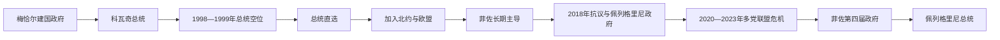

# 斯洛伐克共和国国家元首与政府首脑表

## 范围与制度

斯洛伐克共和国自1993年1月1日起实行议会共和制。总统为国家元首，总理领导对国民议会负责的政府。首任总统由议会选出；1999年起改为公民直选。总统可以任命总理、否决普通法律、提请宪法审查并在特定条件下解散议会，但日常行政和政策主导仍属于政府。

本表核验至2026年7月14日。现任总统为彼得·佩列格里尼，2024年6月15日就职；现任总理为罗伯特·菲佐，2023年10月起领导其第四届政府。

## 总统与代行安排

| 顺序 | 国家元首／代行者 | 任期 | 产生方式 | 关键事件与备注 |
|---:|---|---|---|---|
| 1 | **米哈尔·科瓦奇** | 1993年3月2日—1998年3月2日 | 国民议会选举 | 首任总统；与总理梅恰尔围绕安全机构、政府问责和总统之子绑架案激烈冲突。 |
| — | 总统空位 | 1998年3月2日—1999年6月15日 | 总理与国民议会议长分掌职权 | 初由梅恰尔政府代行部分总统权；1998年政府更替后由总理米库拉什·祖林达与议长约瑟夫·米加什按宪法分掌。代行者不是正式总统。 |
| 2 | **鲁道夫·舒斯特** | 1999年6月15日—2004年6月15日 | 首次公民直选 | 打破总统选举僵局；任内斯洛伐克完成加入北约、欧盟的主要谈判。 |
| 3 | **伊万·加什帕罗维奇** | 2004年6月15日—2014年6月15日 | 公民直选，两届 | 与多届政府合作；围绕总检察长任命和司法问题与反对派发生争议。 |
| 4 | **安德烈·基斯卡** | 2014年6月15日—2019年6月15日 | 公民直选 | 无传统大党背景；在2018年记者遇害危机中要求改组政府或提前选举。 |
| 5 | **苏珊娜·恰普托娃** | 2019年6月15日—2024年6月15日 | 公民直选 | 首位女性总统；强调法治、环境与亲欧路线，经历疫情和2022年后安全危机。 |
| 6 | **彼得·佩列格里尼** | 2024年6月15日至今 | 公民直选 | 曾任总理和国民议会议长；在执政联盟支持下当选。截至2026年7月14日在任。 |

## 政府首脑

| 顺序 | 总理 | 任期 | 政党／内阁性质 | 关键事件与备注 |
|---:|---|---|---|---|
| 1 | **弗拉迪米尔·梅恰尔** | 1993年1月1日—1994年3月15日 | 民主斯洛伐克运动 | 联邦时期斯洛伐克政府延续为独立国家首届政府；因议会失去多数遭不信任。 |
| 2 | 约瑟夫·莫拉夫奇克 | 1994年3月16日—12月13日 | 反梅恰尔临时联盟 | 组织提前选举并恢复部分外交信任，选后因梅恰尔阵营胜出交权。 |
| 3 | **弗拉迪米尔·梅恰尔** | 1994年12月13日—1998年10月30日 | 民主斯洛伐克运动领导的民族—民粹联盟 | 权力集中、私有化和秘密警察争议使欧盟、北约整合落后；1998年反对党联合取得组阁多数。 |
| 4 | **米库拉什·祖林达** | 1998年10月30日—2006年7月4日 | 广泛反梅恰尔联盟，后中右翼联盟 | 改革财政、银行、养老金和公共行政；2004年加入北约与欧盟。第二届改革带来增长，也产生社会成本与联盟冲突。 |
| 5 | **罗伯特·菲佐** | 2006年7月4日—2010年7月8日 | 方向—社会民主党领导联盟 | 强化社会政策并批评部分自由化改革；2009年采用欧元。与民族党合作引发少数族群争议。 |
| 6 | 伊薇塔·拉迪乔娃 | 2010年7月8日—2012年4月4日 | 中右翼四党联盟 | 首位女性总理；欧元区救助表决与政府信任绑定，2011年失去信任后提前选举。 |
| 7 | **罗伯特·菲佐** | 2012年4月4日—2016年3月23日 | 方向党单党多数 | 独立后首个单党多数政府；扩大社会措施，腐败和司法关系争议持续。 |
| 8 | **罗伯特·菲佐** | 2016年3月23日—2018年3月22日 | 方向党、多党联盟 | 极右翼进入议会后组成跨左右联盟；2018年扬·库恰克及未婚妻遇害触发大规模抗议，菲佐辞职。 |
| 9 | **彼得·佩列格里尼** | 2018年3月22日—2020年3月21日 | 原联盟重组 | 以方向党副主席身份接替菲佐，缓解即时危机；后与菲佐分裂并建立“声音—社会民主党”。 |
| 10 | 伊戈尔·马托维奇 | 2020年3月21日—2021年4月1日 | 普通人与独立人格党领导四党联盟 | 以反腐败胜选；疫情管理、采购和未经联盟协调购入疫苗引发内阁危机，转任财政部长。 |
| 11 | 爱德华·黑格尔 | 2021年4月1日—2023年5月15日 | 改组联盟，后少数政府 | 疫情、能源和俄乌战争压力叠加；自由与团结党退出，政府2022年失去信任。 |
| 12 | 柳多维特·奥多尔 | 2023年5月15日—10月25日 | 总统任命的专家看守政府 | 在议会无法形成稳定多数时管理至提前选举；未获信任但依法继续看守。 |
| 13 | **罗伯特·菲佐** | 2023年10月25日至今 | 方向党、声音党、民族党联盟 | 第四次出任总理；刑法与公共媒体改革、对乌政策及法治争议引发国内外冲突。2024年5月遇刺重伤后恢复履职；截至2026年7月14日在任。 |

## 总统空位与实际权力

1998年科瓦奇任满时，议会无法达到选出继任者所需多数。宪法把部分总统权力交给政府和国民议会议长，梅恰尔以代行权发布涉及绑架案的赦免，引发长期法治争议。1998年选举后总理变为祖林达，代行结构随政府更替变化。1999年修宪引入总统直选，舒斯特就任后空位才结束。

总统直选提高了元首独立于议会党团的正当性，却未使总统掌握政府。2018年基斯卡通过公开要求改组或提前选举影响危机解决；2023年恰普托娃在失信政府后任命专家内阁；这些行动都在议会制和宪法授权内运行。

## 政治阶段与更替机制

### 1993—1998年：建国与“梅恰尔主义”

和平分离让斯洛伐克获得完整主权，但新国家需要同时建设中央银行、外交、军队和市场制度。梅恰尔依民族主权和强势行政巩固支持，私有化偏向政治关系网络，秘密机构被指卷入总统之子绑架，政府与总统、法院、媒体发生冲突。西方机构并未拒绝斯洛伐克民族国家本身，而是把法治与民主标准作为入盟条件；这使该国在第一轮北约东扩中落后。

### 1998—2006年：制度修复与欧美整合

反梅恰尔政党组成意识形态跨度极大的联盟，以共同恢复竞争性民主和入盟谈判维持合作。银行重组、税制、劳工与养老金改革吸引投资，汽车制造形成出口支柱。改革成本和地区差距同时扩大，为菲佐的社会民主式批评提供空间。2004年加入北约和欧盟标志外交孤立终结。

### 2006—2018年：菲佐主导、欧元与腐败危机

菲佐把福利政策、国家调节和文化保守议题结合，方向党成为长期最大党。2009年采用欧元加强经济整合。2010—2012年中右翼政府因欧元区救助和内部不信任倒台，菲佐随后取得单党多数。2018年调查政商关系的记者库恰克遇害，使腐败、警察和检察体系问题转化为全国抗议；直接触发因素是谋杀，深层因素则是长期的权力网络与问责不足。

### 2018—2023年：重组、疫情与联盟碎裂

佩列格里尼接任避免立即提前选举，却未解决方向党内部路线和信誉问题。2020年反腐阵营胜选后，疫情把决策风格、财政责任和联盟沟通矛盾放大。马托维奇与黑格尔政府多次改组，最终失去议会信任；恰普托娃任命奥多尔专家政府，只能承担过渡行政，无法替代选举产生的多数。

### 2023—2026年：菲佐回归与制度冲突

2023年提前选举后，方向党与声音党、民族党组阁。政府调整刑法、特别检察机构和公共广播制度，支持者称其恢复主权与政策控制，反对者担忧削弱制衡。菲佐遇刺是严重的直接安全事件，却不能解释此前已经形成的政治极化。佩列格里尼2024年就任总统后，政府与总统的党派背景较为接近，但元首仍具有独立宪法责任。

## 连续性检查

- 梅恰尔在独立后有两个不连续总理任期，不能合并；他在联邦时期还曾任斯洛伐克共和国政府主席，但本表从1993年起计。
- 菲佐共有四届政府：2006—2010、2012—2016、2016—2018、2023年至今；第二和第三段即使同一人连续，也因选举和内阁重组分列。
- 1998—1999年没有正式总统。梅恰尔、祖林达和米加什属于分阶段代行者。
- 截至2026年7月14日，彼得·佩列格里尼任总统，罗伯特·菲佐任总理。

## 相关笔记

- 现代国家主线：[斯洛伐克](/%E4%BA%BA%E6%96%87%E7%A7%91%E5%AD%A6/%E5%8E%86%E5%8F%B2/%E6%AC%A7%E6%B4%B2/%E6%96%AF%E6%8B%89%E5%A4%AB/%E8%A5%BF%E6%96%AF%E6%8B%89%E5%A4%AB/%E6%96%AF%E6%B4%9B%E4%BC%90%E5%85%8B.md)
- 共同国家前史：[捷克斯洛伐克](/%E4%BA%BA%E6%96%87%E7%A7%91%E5%AD%A6/%E5%8E%86%E5%8F%B2/%E6%AC%A7%E6%B4%B2/%E6%96%AF%E6%8B%89%E5%A4%AB/%E8%A5%BF%E6%96%AF%E6%8B%89%E5%A4%AB/%E6%8D%B7%E5%85%8B%E6%96%AF%E6%B4%9B%E4%BC%90%E5%85%8B.md)
- 早期中欧节点：[大摩拉维亚](/%E4%BA%BA%E6%96%87%E7%A7%91%E5%AD%A6/%E5%8E%86%E5%8F%B2/%E6%AC%A7%E6%B4%B2/%E6%96%AF%E6%8B%89%E5%A4%AB/%E8%A5%BF%E6%96%AF%E6%8B%89%E5%A4%AB/%E5%A4%A7%E6%91%A9%E6%8B%89%E7%BB%B4%E4%BA%9A.md)
- 总览：[西斯拉夫历史](/%E4%BA%BA%E6%96%87%E7%A7%91%E5%AD%A6/%E5%8E%86%E5%8F%B2/%E6%AC%A7%E6%B4%B2/%E6%96%AF%E6%8B%89%E5%A4%AB/%E8%A5%BF%E6%96%AF%E6%8B%89%E5%A4%AB/README.md)
