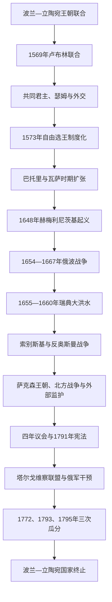

# 波兰-立陶宛联邦

## 时间

1569年7月1日—1795年10月24日。其前身是1385—1386年以后波兰王国与立陶宛大公国的王朝联合；1795年第三次瓜分后共同国家终止。

## 概括

波兰—立陶宛联邦由卢布林联合建立，是一个共同选举君主、共同瑟姆与共同外交下的复合国家。波兰王国王冠领地和立陶宛大公国保留各自法律、军队、财政、官职与行政传统，王室普鲁士、利沃尼亚、乌克兰—罗斯各省又具有不同制度。它既不是现代联邦制国家，也不是波兰单方面吞并立陶宛。

16世纪末至17世纪初，联邦以贵族政治参与、宗教相对宽容、谷物贸易和广阔领土成为欧洲大国。17世纪中期的赫梅利尼茨基起义、俄波战争、瑞典“大洪水”、奥斯曼战争和内战造成财政、人口与城市经济重创。自由否决、选王空位和大贵族派系让外部势力更容易介入，但这些制度弱点必须与长期战争、农奴庄园经济、常备税军不足和俄普奥国家能力增长合并解释。18世纪后期改革试图恢复多数决、常备军和世袭王位，俄国与保守贵族武装干预，三次瓜分最终使国家消失。

## 建立背景

### 王朝联合的局限

1385—1386年克雷沃安排使立陶宛大公雅盖沃皈依天主教、迎娶雅德维加并成为波兰国王。此后两国通常共享君主，却保留各自议会、官职和军队；君主死亡、立陶宛选大公与波兰选王之间仍可能产生分歧。对条顿骑士团的共同战争证明联合的军事价值，但莫斯科向立陶宛东部扩张又暴露临时王朝联合的协调不足。

### 无嗣继承与利沃尼亚战争

齐格蒙特二世·奥古斯特没有子嗣，雅盖隆王朝即将绝嗣。立陶宛在利沃尼亚战争中承受莫斯科军事压力，需要波兰长期援助；波兰贵族希望获得东部土地和共同政治权。立陶宛大贵族担心失去官位与法律自主，谈判一度退出。

国王把波德拉谢、沃里尼亚、基辅和布拉茨拉夫等地转入波兰王冠，以改变谈判力量。1569年双方最终同意共同选举君主、共同瑟姆与对外政策，立陶宛仍保留成文法、财政、军队和行政。联合是压力、战争和妥协共同结果。

## 政体与社会结构

| 层级 | 机构／群体 | 权力与限制 |
|---|---|---|
| 共同君主 | 波兰国王兼立陶宛大公，由全体贵族自由选举 | 任命高官、统帅、外交与司法象征；必须遵守亨利条款和个人协约条款，无固定世袭权。 |
| 瑟姆 | 国王、参议院、众议院三部分 | 同意税收、立法、征兵与外交大事；众议员受地方议会指令约束。 |
| 地方议会 | 各省什拉赫塔会议 | 选举议员、分配地方税、组织民兵和监督官员，是贵族政治日常基础。 |
| 贵族等级 | 从小土地骑士到拥有私人军队的大贵族 | 原则上政治平等、免于无判决逮捕；实际财富差距使大贵族能控制客户网络。 |
| 王冠与立陶宛机关 | 两套大法官、司库、陆军统帅、法庭与军队 | 维持复合国家二元性；共同政策需要跨机构协调。 |
| 王室普鲁士与自治城市 | 格但斯克、托伦等 | 享有较强城市自治和贸易资源，与中央围绕税收、宗教和军务谈判。 |
| 农民与庄园 | 农役制庄园经济主体 | 政治权利极少；谷物出口扩大使农役加重，地区差异显著。 |
| 宗教社群 | 天主教、东正教、联合教会、新教、犹太与亚美尼亚社群 | 1573年华沙联盟保障贵族宗教和平；平等并不完整，17世纪反宗教改革后宽容收缩。 |
| 哥萨克 | 第聂伯边疆军事共同体，部分登记服役 | 承担边防和战争任务，却难获与贵族相等的法律地位，成为边疆冲突核心。 |

## 分阶段发展

### 1569—1573年：共同国家与首次空位

卢布林联合后，王冠获得乌克兰—罗斯大片领地，立陶宛则取得更稳定的波兰军事支持。齐格蒙特二世1572年去世，首次无王期检验新制度。格涅兹诺总主教任“临时元首”，地方贵族结成联盟维持秩序。1573年贵族直接参加选王，法国王子亨利当选并签署“亨利条款”：定期召开瑟姆、不得擅自征税出兵、贵族在君主违法时有抵抗权。华沙联盟同年承诺宗教和平。

### 巴托里与行政军事整合

亨利返法继位后，联邦认定其放弃王位。安娜·雅盖隆与特兰西瓦尼亚的斯特凡·巴托里共同即位。巴托里改革步兵和最高上诉法庭，依贵族税收对莫斯科展开利沃尼亚战争，收复波洛茨克并迫使伊凡四世议和。他的成功来自立陶宛战区经验、王冠资源与教廷调停，不代表王权可绕过瑟姆。

### 瓦萨王朝与早期鼎盛

齐格蒙特三世·瓦萨同时有瑞典王位，引发跨波罗的战争。他在联邦内部推动天主教复兴，1596年布列斯特联合使部分东正教主教承认教皇、保留东方礼，形成鲁塞尼亚联合教会。许多东正教贵族、教士和哥萨克反对，宗教归属由此与社会、民族和权利冲突结合。原笔记所说西罗斯“被迫改信天主教”并非所有居民一致改宗；更准确地说，是国家与地主压力、教会联合和职位机会促成部分转宗，同时东正教网络持续存在并反抗。

17世纪初联邦军进入俄国“混乱时期”，一度占领莫斯科，王子瓦迪斯瓦夫获部分俄国贵族推举，却因宗教、军事和齐格蒙特三世政策未能建立稳定王位。1618年和约使联邦领土达到高峰。与此同时，1606—1608年泽布日多夫斯基叛乱表明贵族抵抗权也可形成内战。

### 哥萨克起义与东部危机

乌克兰边疆的大庄园扩张、农役加重、宗教冲突和登记哥萨克名额限制积累不满。1648年博赫丹·赫梅利尼茨基联合扎波罗热哥萨克与克里米亚汗国，接连击败王冠军。起义包含哥萨克自治、东正教权利、农民反庄园和地方精英建国等多重目标，并伴随对波兰贵族、天主教神职与犹太社群的暴力。

1649年、1651年的和约未能解决登记范围与领土自治。赫梅利尼茨基1654年与沙皇俄国达成佩列亚斯拉夫安排，俄国以保护哥萨克为名参战。1658年哈佳奇条约曾设想把鲁塞尼亚作为联邦第三组成部分，却因战争、社会反对与条款缩水失败。

### 俄波战争与瑞典“大洪水”

1654—1667年俄波战争和1655年瑞典入侵重叠。部分立陶宛大贵族在凯代尼艾与瑞典结盟，瑞军迅速占领华沙、克拉科夫；修道院抵抗、农民游击与国王返国推动反攻。勃兰登堡—普鲁士以转变阵营换取摆脱波兰宗主权，成为未来瓜分者之一。

“大洪水”造成城镇、庄园、人口和文化财产巨大损失。1667年安德鲁索沃停战把第聂伯河左岸和基辅交给俄国，哥萨克酋长国被俄波分割。所谓“十三年战争”通常指1654—1667年俄波战争；它不是孤立战争，而是17世纪中期多线危机的一部分。

### 内部党争与索别斯基阶段

扬二世·卡齐米日试图以生前选王和常备军改革增强中央权力，大元帅卢博米尔斯基发动叛乱迫使其放弃，国王1668年退位。米哈乌时期奥斯曼夺取波多利亚。军事统帅扬·索别斯基当选后于1673年霍京取胜，1683年率军参与解救维也纳，联邦在反奥斯曼联盟中恢复声望。

维也纳胜利未能解决财政制度。军队工资常拖欠，瑟姆容易因派系冲突破裂，索别斯基也未能让儿子继位。贵族自由仍有真实地方参与，不应简单等同“无政府”；问题在于大国竞争和大贵族赞助把一致同意规则武器化。

### 萨克森王朝、北方战争与俄国影响

奥古斯特二世兼任萨克森选侯，把联邦卷入大北方战争。瑞典国王卡尔十二世扶植斯坦尼斯瓦夫·莱什琴斯基，奥古斯特被迫退位；俄国波尔塔瓦胜利后他复位。1717年“沉默瑟姆”在俄国调停和军力压力下限制国王与萨克森军，也把俄国变成联邦宪制的外部保证者。

奥古斯特三世时期多数瑟姆无法完成立法，大贵族派系依俄、普、法、奥资助竞争。经济并非所有地区同时衰败，18世纪中叶庄园和城市出现恢复；政治问题在于国家税军规模远低于邻国，任何改革都可能被外国以维护“自由”为名阻止。

### 波尼亚托夫斯基、改革与第一次瓜分

1764年斯坦尼斯瓦夫·奥古斯特在俄国支持下当选。他推动财政委员会、铸币、教育和行政改革。反对俄国控制和宗教异见者权利安排的巴尔联盟发动战争，俄军介入；俄、普、奥以防止彼此独占为逻辑于1772年第一次瓜分。瓜分不是联邦自然解体，而是三国协议和军事占领。

1773年教育委员会接管解散耶稣会后的学校，被视为早期国家教育机关。常设委员会改善行政，却因受俄国影响而遭部分爱国派怀疑。

### 四年议会、1791年宪法与灭亡

俄国陷入对奥斯曼战争时，1788年四年议会扩军、改革城市权利并削弱外国控制。1791年5月3日宪法取消自由否决和自由选王，建立世袭王位、较稳定的责任政府，并给予王室城市市民政治权。它保留贵族优势和农民保护的有限表述，却是从等级一致同意向多数宪政的重要转向。

部分大贵族组成塔尔戈维察联盟，请俄国“恢复自由”。1792年俄军入侵，国王为避免彻底失败加入该联盟，改革阵营崩解。1793年俄普第二次瓜分。1794年塔德乌什·科希丘什科起义试图结合国家独立、城市动员与减轻农民负担，因军力、补给和国际孤立失败。1795年俄、普、奥第三次瓜分，国王退位，联邦直接灭亡。

## 重要事件

| 时间 | 事件 | 长期意义 |
|---|---|---|
| 1569年 | 卢布林联合 | 建立共同君主、瑟姆与外交的复合国家。 |
| 1573年 | 华沙联盟与亨利条款 | 确立宗教和平、自由选王和君主受约束原则。 |
| 1596年 | 布列斯特教会联合 | 形成联合教会，也激化东正教权利争议。 |
| 1610年—1618年 | 莫斯科远征与领土高峰 | 展示军事能力，也造成与俄国长期敌对。 |
| 1648年 | 赫梅利尼茨基起义 | 庄园、哥萨克、宗教和边疆制度矛盾全面爆发。 |
| 1654年—1667年 | 俄波战争 | 左岸乌克兰和基辅转入俄国控制，力量平衡东移。 |
| 1655年—1660年 | 瑞典“大洪水” | 造成系统性人口经济损失，普鲁士摆脱宗主权。 |
| 1683年 | 维也纳战役 | 索别斯基取得军事声望，联邦参与反奥斯曼联盟。 |
| 1717年 | 沉默瑟姆 | 俄国成为联邦政治的外部保证者，主权受限加深。 |
| 1772年 | 第一次瓜分 | 邻国由干预内部政治转为直接吞并领土。 |
| 1791年 | 五三宪法 | 试图重建多数决、世袭王位和责任政府。 |
| 1792年—1795年 | 俄军干预、第二三次瓜分与起义 | 改革失败、科希丘什科起义被镇压，国家终止。 |

## 崛起、鼎盛与衰亡原因

### 崛起与繁荣条件

- 波兰人口、财政和波罗的贸易与立陶宛广阔领土、军事传统相结合。
- 贵族地方议会提供高参与度和政治认同，宗教相对宽容吸引移民、商人与受迫害群体。
- 维斯瓦河—格但斯克谷物出口把庄园经济接入西欧市场，王室普鲁士城市提供税收与航运。
- 雅盖隆遗产和选举制度使联邦可吸纳外来君主、与欧洲王朝建立网络。

### 结构性弱点

- 税收和常备军必须反复经瑟姆批准，战争危机下动员慢；君主缺乏稳定世袭行政班底。
- 大贵族拥有私人军队、跨省庄园和客户网络，普通贵族的形式平等常被赞助关系操纵。
- 自由否决原为保障地方同意，17世纪后变成单个议员或外国资助派系阻断整个议会的手段。
- 农役庄园扩大谷物出口，却压低内部消费与城市自主；地区经济差异使统一改革困难。
- 多民族、多宗教本身不是衰亡原因；问题在于政治权利主要限于贵族，哥萨克、农民、城市和非天主教精英的诉求未被稳定纳入。

### 外部压力

俄国取得常备军和对乌克兰东部的控制，普鲁士掌握波罗的战略通道，奥地利在南部扩张。三国都能以候选王、宗教权利或“贵族自由”为名干预。大北方战争后联邦不再能自主排除外国军队。

### 直接灭亡过程

1791年改革触动俄国地缘利益与部分大贵族特权。塔尔戈维察联盟提供干预借口，1792年俄军胜利使宪法中止；第二次瓜分削弱国家生存资源。1794年起义失败后，三国担心剩余波兰再次成为革命与战争中心，遂于1795年彻底瓜分。制度弱点是长期条件，邻国军事占领和瓜分条约才是直接灭亡机制。

## 君主世系

### 联邦选举君主表

| 顺序 | 君主 | 在位时间 | 说明 |
|---:|---|---|---|
| 1 | 齐格蒙特二世·奥古斯特 | 1569年—1572年 | 卢布林联合后首位联邦君主，雅盖隆男系终结。 |
| 2 | 亨利·瓦卢瓦 | 1573年—1575年 | 首位自由选举君主，后返法继承法国王位。 |
| 3 | 安娜·雅盖隆、斯特凡·巴托里 | 1575／1576年—1586年 | 安娜为雅盖隆继承象征，巴托里掌握主要军政实权；安娜名义王位延续至1596年。 |
| 4 | 齐格蒙特三世·瓦萨 | 1587年—1632年 | 瓦萨王朝君主，曾兼瑞典国王；马克西米利安三世同时获部分贵族推选但战败。 |
| 5 | 瓦迪斯瓦夫四世 | 1632年—1648年 | 齐格蒙特三世之子。 |
| 6 | 扬二世·卡齐米日 | 1648年—1668年 | 赫梅利尼茨基起义、俄波战争和“大洪水”时期君主。 |
| 7 | 米哈乌·科雷布特·维希尼奥维茨基 | 1669年—1673年 | 本土贵族出身。 |
| 8 | **扬三世·索别斯基** | 1674年—1696年 | 维也纳战役统帅。 |
| 9 | 奥古斯特二世 | 1697年—1706年、1709年—1733年 | 萨克森选侯，大北方战争中被迫退位后复位。 |
| 10 | 斯坦尼斯瓦夫·莱什琴斯基 | 1704年—1709年、1733年—1736年 | 在瑞典、后法国支持下两度争位。 |
| 11 | 奥古斯特三世 | 1733年—1763年 | 萨克森王朝，王位继承战争后稳固。 |
| 12 | **斯坦尼斯瓦夫·奥古斯特·波尼亚托夫斯基** | 1764年—1795年 | 末代君主，三次瓜分后退位。 |

从早期波兰君主到所有联邦选举王、争议选王和复位，见[波兰君主与选举王世系表](/%E4%BA%BA%E6%96%87%E7%A7%91%E5%AD%A6/%E5%8E%86%E5%8F%B2/%E6%AC%A7%E6%B4%B2/%E6%96%AF%E6%8B%89%E5%A4%AB/%E8%A5%BF%E6%96%AF%E6%8B%89%E5%A4%AB/%E6%B3%A2%E5%85%B0%E5%90%9B%E4%B8%BB%E4%B8%8E%E9%80%89%E4%B8%BE%E7%8E%8B%E4%B8%96%E7%B3%BB%E8%A1%A8.md)。

## 演变关系

- 前一节点：[波兰王国](/%E4%BA%BA%E6%96%87%E7%A7%91%E5%AD%A6/%E5%8E%86%E5%8F%B2/%E6%AC%A7%E6%B4%B2/%E6%96%AF%E6%8B%89%E5%A4%AB/%E8%A5%BF%E6%96%AF%E6%8B%89%E5%A4%AB/%E6%B3%A2%E5%85%B0%E7%8E%8B%E5%9B%BD.md)与立陶宛大公国的长期王朝联合。
- 相关东斯拉夫节点：[加利西亚-沃里尼亚王国](/%E4%BA%BA%E6%96%87%E7%A7%91%E5%AD%A6/%E5%8E%86%E5%8F%B2/%E6%AC%A7%E6%B4%B2/%E6%96%AF%E6%8B%89%E5%A4%AB/%E4%B8%9C%E6%96%AF%E6%8B%89%E5%A4%AB/%E5%8A%A0%E5%88%A9%E8%A5%BF%E4%BA%9A-%E6%B2%83%E9%87%8C%E5%B0%BC%E4%BA%9A%E7%8E%8B%E5%9B%BD.md)、[哥萨克酋长国](/%E4%BA%BA%E6%96%87%E7%A7%91%E5%AD%A6/%E5%8E%86%E5%8F%B2/%E6%AC%A7%E6%B4%B2/%E6%96%AF%E6%8B%89%E5%A4%AB/%E4%B8%9C%E6%96%AF%E6%8B%89%E5%A4%AB/%E5%93%A5%E8%90%A8%E5%85%8B%E9%85%8B%E9%95%BF%E5%9B%BD.md)、[沙皇俄国](/%E4%BA%BA%E6%96%87%E7%A7%91%E5%AD%A6/%E5%8E%86%E5%8F%B2/%E6%AC%A7%E6%B4%B2/%E6%96%AF%E6%8B%89%E5%A4%AB/%E4%B8%9C%E6%96%AF%E6%8B%89%E5%A4%AB/%E6%B2%99%E7%9A%87%E4%BF%84%E5%9B%BD.md)。
- 反奥斯曼战争背景：[奥斯曼帝国](/%E4%BA%BA%E6%96%87%E7%A7%91%E5%AD%A6/%E5%8E%86%E5%8F%B2/%E8%A5%BF%E4%BA%9A/%E5%9C%9F%E8%80%B3%E5%85%B6/%E5%A5%A5%E6%96%AF%E6%9B%BC%E5%B8%9D%E5%9B%BD/README.md)。
- 瓜分后的主要帝国节点：[俄罗斯帝国](/%E4%BA%BA%E6%96%87%E7%A7%91%E5%AD%A6/%E5%8E%86%E5%8F%B2/%E6%AC%A7%E6%B4%B2/%E6%96%AF%E6%8B%89%E5%A4%AB/%E4%B8%9C%E6%96%AF%E6%8B%89%E5%A4%AB/%E4%BF%84%E7%BD%97%E6%96%AF%E5%B8%9D%E5%9B%BD.md)。
- 现代复国：[波兰](/%E4%BA%BA%E6%96%87%E7%A7%91%E5%AD%A6/%E5%8E%86%E5%8F%B2/%E6%AC%A7%E6%B4%B2/%E6%96%AF%E6%8B%89%E5%A4%AB/%E8%A5%BF%E6%96%AF%E6%8B%89%E5%A4%AB/%E6%B3%A2%E5%85%B0.md)。
- 返回：[西斯拉夫历史](/%E4%BA%BA%E6%96%87%E7%A7%91%E5%AD%A6/%E5%8E%86%E5%8F%B2/%E6%AC%A7%E6%B4%B2/%E6%96%AF%E6%8B%89%E5%A4%AB/%E8%A5%BF%E6%96%AF%E6%8B%89%E5%A4%AB/README.md)。
