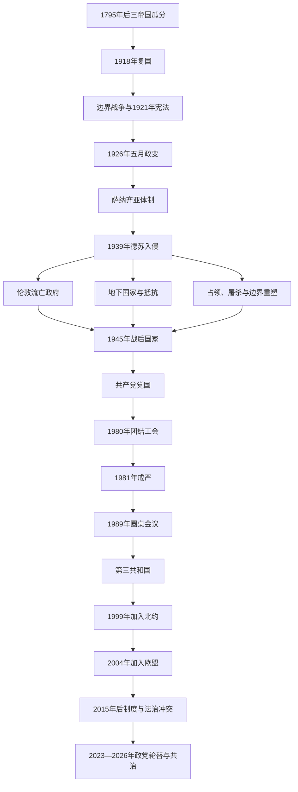

# 波兰

## 时间

1918年11月复国—至今。1939—1945年领土被德国与苏联占领，但伦敦流亡政府和国内抵抗维持国家法统；1944／1945—1989年为苏联势力范围内的人民共和国体制；1989—1990年完成向第三共和国的制度转型。

## 概括

现代波兰继承中世纪王国、波兰—立陶宛联邦、瓜分时期起义与民族文化传统。1918年复国不是1795年国家机关原样恢复，而是把德国、奥地利、俄罗斯三个帝国统治区及多支军队、法律和货币整合为新共和国。第二共和国在波苏战争中确定东部边界，1926年毕苏斯基政变后转向威权。1939年纳粹德国与苏联从两面入侵，政府流亡，国内遭占领、屠杀和领土重塑。

战后边界整体西移，苏联支持的共产党取得国家权力。工业化、教育普及和社会流动与政治镇压、短缺经济、对苏依赖并存。1980年团结工会把工人诉求、天主教网络与民主反对结合，戒严未能恢复体制长期合法性；1989年圆桌会议和半自由选举开启和平转型。此后波兰实行总统—议会共和制，1999年加入北约、2004年加入欧盟。2015年以后司法、媒体与欧盟法治争议加剧；2023年图斯克联盟重新执政，2025年纳夫罗茨基当选总统，形成分属不同政治阵营的共治格局。

## 复国背景

19世纪的波兰政治并非只有武装起义。拿破仑时期华沙公国、1815年会议王国、1830—1831年十一月起义、1863—1864年一月起义维持国家记忆；普鲁士区合作社与教育、奥地利加利西亚自治、俄罗斯区地下教育又形成不同政治文化。第一次世界大战使三个瓜分帝国彼此交战，波兰军团、德奥摄政委员会、俄国境内波兰军和侨民外交竞逐代表权。

1918年11月德国战败、奥匈解体、俄罗斯陷入内战。摄政委员会向获释返国的约瑟夫·毕苏斯基移交军政权，地方委员会和武装解除占领军。帕德雷夫斯基政府使民族民主派和毕苏斯基阵营暂时合作并取得国际承认。建国仍需统一五种货币、三套法律、铁路轨距和官僚体系。

## 分阶段发展

### 1918—1921年：边界战争与共和国建制

新国家与西乌克兰人民共和国争夺东加利西亚，与捷克斯洛伐克争夺切申西里西亚，波兹南起义促使大波兰并入。波苏战争的目标既涉及防御布尔什维克西进，也涉及毕苏斯基建立中东欧联邦的构想。1920年苏军逼近华沙，波兰反攻取胜；1921年里加和约把边界推至白俄罗斯、乌克兰人口众多地区。

1921年宪法建立强议会、弱总统制，比例代表制容纳多民族和多党，却使联盟频繁更替。土地改革、少数族群权利和教会地位争论持续。1922年首任总统纳鲁托维奇遭刺杀，显示民族主义极化。

### 1921—1926年：议会危机与经济整合

政府在通胀、退伍军人安置和三帝国经济区整合中频繁更替。格拉布斯基1924年建立兹罗提和独立中央银行，稳定货币。法国同盟和对苏防御是外交主轴，德国拒绝承认东部边界。议会民主并非完全失效，但政党碎片化、经济冲击和军人对“党争”的蔑视削弱信任。

### 1926—1939年：五月政变与萨纳齐亚体制

毕苏斯基以“净化政治”为名发动五月政变，军队在华沙与政府军交战，沃伊切霍夫斯基总统和维托斯政府辞职。他未自任总统，却通过总理、军务和亲信“上校集团”掌握实际方向。1930年反对派领袖被捕并在布列斯特受审，1935年宪法强化总统任命和解散议会权。

体制保留选举、议会和反对党，却以行政压力、审查和选举规则限制竞争，属威权化而非完全极权。中央工业区和格丁尼亚港推动现代化，农村贫困、乌克兰和白俄罗斯少数族群政策、反犹主义及大萧条问题未解。毕苏斯基1935年死后，莫希齐茨基总统、雷兹-希米格维元帅和政府集团分掌权力。

### 1939年：外交孤立与两面入侵

波兰与德国有1934年互不侵犯宣言，却拒绝把格但斯克和走廊纳入德国要求。英国、法国1939年给予安全保证。8月德苏秘密议定书划分势力范围；9月1日德国进攻，9月17日苏联从东部入侵。波军在装备、空中力量和战略纵深上处于劣势，盟国虽对德宣战却未发动足够西线攻势。政府越境罗马尼亚后被扣留，依法在法国重建流亡国家。

军事失败的结构原因包括两大邻国联合、边界过长和现代装备不足；直接原因是德苏协调进攻。不能把它简单解释为骑兵落后或单一指挥错误。

### 1939—1945年：占领、地下国家与流亡政府

德国把西部并入本土，在中部设总督府，实行精英屠杀、强迫劳动、殖民和集中营体系。纳粹在占领波兰境内建立灭绝营，杀害约三百万波兰犹太人及数百万非犹太公民。苏联吞并东部，驱逐居民、镇压官员并在卡廷等地杀害战俘。1941年德国进攻苏联后占领全境。

伦敦流亡政府指挥海外军队和国内军总司令部；地下国家设教育、司法、政党代表和武装。1943年华沙犹太区起义与1944年华沙起义性质不同：前者是犹太居民反抗灭绝，后者由国内军试图在苏军到来前解放首都。苏军停留于维斯瓦河东岸，德军镇压起义并摧毁华沙。流亡政府与苏联因卡廷、边界和苏联扶植的卢布林委员会决裂。

### 1944—1948年：边界西移与共产党夺权

雅尔塔、波茨坦安排使波兰失去寇松线以东领土，获得奥得—尼斯河以东的前德国领土。数百万德国人被驱逐或逃离，东部波兰人、乌克兰人、白俄罗斯人也经历迁移；“向西移动”使战后国家民族结构更同质，却伴随巨大暴力和财产断裂。

苏联支持的民族解放委员会随红军推进建立行政，伦敦派人士部分加入民族团结政府。1946年公投和1947年选举遭操纵，反对派农民党被压制，国内军后续抵抗遭安全机关镇压。1948年工人党与社会党被迫合并为统一工人党，贝鲁特成为党国最高领导。

### 1948—1956年：斯大林化

大工业国有化、农业集体化和重工业优先改变经济；教育、医疗与女性就业扩大，消费与住房短缺严重。秘密警察、政治审判和对教会施压建立恐怖统治。1953年斯大林死后变化缓慢，1956年波兹南工人抗议遭镇压；哥穆尔卡复出，争取苏联接受有限“波兰道路”，停止强制集体化并放松部分文化控制。

### 1956—1970年：哥穆尔卡时期

早期“十月解冻”带来政治犯释放和教会妥协，随后言论空间收紧。经济增长逐渐放缓，1968年学生抗议遭镇压，党内反犹运动迫使大量犹太人和知识分子离国。同年波兰军参与入侵捷克斯洛伐克。1970年食品涨价触发格但斯克等沿海城市罢工，军警开火，哥穆尔卡下台。

### 1970—1980年：盖莱克发展与债务危机

盖莱克借西方贷款进口技术、提高消费和住房建设，早期生活水平改善。石油危机、低效率投资和外债使增长无法持续。1976年涨价抗议后，知识分子成立工人保卫委员会，为工人与异议者合作提供网络。波兰籍教皇若望保禄二世1979年访问强化天主教公共社会和民族动员。

### 1980—1989年：团结工会、戒严与圆桌会议

1980年格但斯克列宁造船厂罢工形成跨厂委员会，政府接受21项要求，独立自治工会“团结”迅速拥有约千万成员。它不是单一反共政党，而是工会、民族、天主教、知识分子与自治愿景的联盟。经济崩溃、党内强硬派和苏联压力使妥协难以维持。

雅鲁泽尔斯基1981年12月实施戒严，逮捕领导人、军管企业并镇压矿工。苏联是否计划直接入侵仍有争议，戒严的国内决策责任不能完全归给外部威胁。团结转入地下，西方制裁和经济短缺继续。1988年新罢工、苏联改革与政府财政无力促成圆桌会议；1989年半自由选举中团结阵营赢得几乎所有可竞争席位，马佐维耶茨基组建非共产党政府。

### 1989—2004年：第三共和国与欧美整合

市场“休克疗法”迅速放开价格、贸易与私有化，终结短缺并为增长创造条件，也造成失业、通胀和国营企业地区衰退。1990年瓦文萨成为总统，伦敦流亡总统移交国玺。1997年宪法稳定总统、议会、政府和宪法法院关系。

政党重组频繁，前团结阵营与前共产党改革派轮流执政。波兰1999年加入北约，2004年加入欧盟；外资、供应链、农业与基础设施资金推动长期增长，大规模劳务迁移和地区差距也产生社会政治影响。

### 2005—2015年：两大阵营形成

法律与公正党和公民纲领逐渐取代早期碎片化。前者强调国家主权、社会保守和历史政策，后者强调市场、地方自治和欧盟整合。图斯克政府经历全球金融危机，波兰避免年度经济衰退，但公共服务、合同劳动和城乡差异不满累积。2010年斯摩棱斯克空难造成总统及多名国家精英遇难，事故解释和纪念政治加深阵营分裂。

### 2015—2023年：法律与公正党多数时期

法律与公正党以“家庭500+”等转移支付、退休政策和国家产业议程扩大支持。政府改变宪法法院、全国司法委员会、最高法院与公共媒体治理，欧盟机构和国内反对者认为削弱司法独立，执政党则称清理旧精英和加强民主问责。欧盟启动法治程序并冻结部分资金。

俄乌战争后波兰成为乌克兰重要军事和人道支援地，大量难民进入；同时能源、通胀、农业进口和对乌历史问题造成摩擦。2023年选举中法律与公正党仍为最大单党，却无多数；公民联盟、第三条道路和左翼形成多数，莫拉维茨基短暂组阁未获信任，图斯克回任。

### 2023—2026年：制度修复争议与总统—政府共治

图斯克政府更换公共媒体管理、推进检察与司法改革并恢复欧盟资金。由于部分旧制度由法律、总统任命和宪法法院判决保护，快速调整又引发程序合法性争议。总统杜达通过否决和任命制约政府。

2025年卡罗尔·纳夫罗茨基当选总统并于8月6日就职，与图斯克联盟政治立场对立。至2026年7月14日，图斯克仍任总理，纳夫罗茨基任总统。当前格局是宪法框架内的共治和否决竞争，不应把总统称为政府首脑。

## 统治结构与实际权力

| 阶段 | 法定结构 | 实际权力 |
|---|---|---|
| 1918—1926年 | 议会共和国、弱总统、责任内阁 | 多党联盟与议会主导，毕苏斯基仍具军政影响。 |
| 1926—1935年 | 宪法机构保留 | 毕苏斯基和萨纳齐亚集团掌握实际方向。 |
| 1935—1939年 | 强总统制宪法 | 总统、元帅与政府集团分权，军政精英主导。 |
| 1939—1945年 | 流亡总统和政府、国内地下国家 | 占领区实权在德苏机关；流亡与地下维持法统和抵抗。 |
| 1944—1989年 | 总统／国务委员会、议会、政府 | 统一工人党第一书记与政治局为最高决策中心，苏联构成外部约束。 |
| 1989年至今 | 总统—议会共和制 | 总理和内阁负责日常政策，总统有否决、任命及外交国防影响。 |

## 重要事件

| 时间 | 事件 | 意义 |
|---|---|---|
| 1918年 | 复国 | 三个瓜分区进入共同国家。 |
| 1920年 | 华沙战役 | 阻止苏军推进，影响东部边界与国家合法性。 |
| 1921年 | 里加和约、三月宪法 | 确立边界和议会共和国。 |
| 1926年 | 五月政变 | 第二共和国由议会主导转向萨纳齐亚威权。 |
| 1939年 | 德苏入侵 | 本土国家战败，流亡与占领并立。 |
| 1943年、1944年 | 两次华沙起义 | 犹太灭绝抵抗与国内军国家起义分别展开。 |
| 1945年 | 边界西移 | 领土、人口和社会结构根本重塑。 |
| 1947—1948年 | 操纵选举与党合并 | 共产党消灭竞争政治。 |
| 1956年 | 波兹南抗议与十月转折 | 斯大林化松动但党国保留。 |
| 1970年 | 沿海抗议 | 工人镇压触发领导层更替。 |
| 1980年 | 团结工会成立 | 独立群众组织挑战党国垄断。 |
| 1981年 | 戒严 | 暂时镇压公开组织，未解决合法性和经济危机。 |
| 1989年 | 圆桌会议与半自由选举 | 和平转型开始。 |
| 1999年、2004年 | 加入北约、欧盟 | 安全与经济制度锚定西方体系。 |
| 2015年—2023年 | 司法与法治争议 | 国内制度竞争与欧盟冲突加深。 |
| 2023年、2025年 | 政府和总统分别轮替 | 形成图斯克政府与纳夫罗茨基总统共治。 |

## 政权兴衰与转型原因

### 第二共和国的成就与弱点

国家能在战争、通胀和三套制度基础上完成统一，靠军队、教会、教育、铁路与货币建设。弱点是多民族边界争议、土地分配不均、政府不稳和军人政治。五月政变的直接触发是新政府成立与毕苏斯基军队对峙，长期原因则是议会信任危机和战后军政权威未被完全纳入文官制度。

### 1939年灭亡

外部结构是德国和苏联共同扩张、英法无法及时提供地面支援；内部限制包括装备、工业与战略纵深。德苏进攻是直接原因，不能把受害国家的政治问题倒推为侵略必然。

### 党国兴起与衰落

共产党崛起依靠红军占领、苏联外交安排、强力机关和战后社会革命。工业化和福利提供一段发展合法性，但计划经济低效、政治垄断、教会与民族社会韧性、外债和工人抗议逐步侵蚀它。团结工会将体制声称代表的工人转化为反对力量；戒严只能压制组织。苏联放弃武力保证、1988年罢工和财政危机使谈判成为直接转型机制。

### 第三共和国的稳定与冲突

北约、欧盟、外资与地方自治推动安全和增长，宪法竞争选举实现多次和平轮替。转型成本、城乡差距、历史记忆和文化议题塑造两大阵营。司法改革争议既是具体法律与任命之争，也是“多数民意能否重塑制衡”与“宪法机构应否限制多数”的冲突。

## 国家元首与政府首脑

第二共和国、流亡共和国、国内党国和第三共和国的全部国家元首、代行者、总理及共产党实际领导，见[波兰国家元首、政府首脑与实际领导表](/%E4%BA%BA%E6%96%87%E7%A7%91%E5%AD%A6/%E5%8E%86%E5%8F%B2/%E6%AC%A7%E6%B4%B2/%E6%96%AF%E6%8B%89%E5%A4%AB/%E8%A5%BF%E6%96%AF%E6%8B%89%E5%A4%AB/%E6%B3%A2%E5%85%B0%E5%9B%BD%E5%AE%B6%E5%85%83%E9%A6%96%E6%94%BF%E5%BA%9C%E9%A6%96%E8%84%91%E4%B8%8E%E5%AE%9E%E9%99%85%E9%A2%86%E5%AF%BC%E8%A1%A8.md)。

截至2026年7月14日：

| 角色 | 人物 | 就任时间 | 权力定位 |
|---|---|---|---|
| 总统 | 卡罗尔·纳夫罗茨基 | 2025年8月6日 | 国家元首，具有否决、任命及外交国防职能。 |
| 总理 | 唐纳德·图斯克 | 2023年12月13日 | 领导内阁并对众议院负责，是日常政府首脑。 |

## 演变关系

- 中世纪与近世前史：[波兰王国](/%E4%BA%BA%E6%96%87%E7%A7%91%E5%AD%A6/%E5%8E%86%E5%8F%B2/%E6%AC%A7%E6%B4%B2/%E6%96%AF%E6%8B%89%E5%A4%AB/%E8%A5%BF%E6%96%AF%E6%8B%89%E5%A4%AB/%E6%B3%A2%E5%85%B0%E7%8E%8B%E5%9B%BD.md)、[波兰-立陶宛联邦](/%E4%BA%BA%E6%96%87%E7%A7%91%E5%AD%A6/%E5%8E%86%E5%8F%B2/%E6%AC%A7%E6%B4%B2/%E6%96%AF%E6%8B%89%E5%A4%AB/%E8%A5%BF%E6%96%AF%E6%8B%89%E5%A4%AB/%E6%B3%A2%E5%85%B0-%E7%AB%8B%E9%99%B6%E5%AE%9B%E8%81%94%E9%82%A6.md)。
- 君主脉络：[波兰君主与选举王世系表](/%E4%BA%BA%E6%96%87%E7%A7%91%E5%AD%A6/%E5%8E%86%E5%8F%B2/%E6%AC%A7%E6%B4%B2/%E6%96%AF%E6%8B%89%E5%A4%AB/%E8%A5%BF%E6%96%AF%E6%8B%89%E5%A4%AB/%E6%B3%A2%E5%85%B0%E5%90%9B%E4%B8%BB%E4%B8%8E%E9%80%89%E4%B8%BE%E7%8E%8B%E4%B8%96%E7%B3%BB%E8%A1%A8.md)。
- 同区域现代共同节点：[捷克斯洛伐克](/%E4%BA%BA%E6%96%87%E7%A7%91%E5%AD%A6/%E5%8E%86%E5%8F%B2/%E6%AC%A7%E6%B4%B2/%E6%96%AF%E6%8B%89%E5%A4%AB/%E8%A5%BF%E6%96%AF%E6%8B%89%E5%A4%AB/%E6%8D%B7%E5%85%8B%E6%96%AF%E6%B4%9B%E4%BC%90%E5%85%8B.md)。
- 返回：[西斯拉夫历史](/%E4%BA%BA%E6%96%87%E7%A7%91%E5%AD%A6/%E5%8E%86%E5%8F%B2/%E6%AC%A7%E6%B4%B2/%E6%96%AF%E6%8B%89%E5%A4%AB/%E8%A5%BF%E6%96%AF%E6%8B%89%E5%A4%AB/README.md)。
