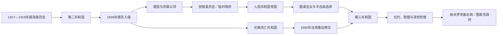

# 波兰国家元首、政府首脑与实际领导表

## 范围与角色区分

本表覆盖1918年复国至2026年7月14日。1939—1990年存在伦敦流亡共和国与德苏占领、苏联支持的国内政权并立；流亡总统延续第二共和国法统，国内国家元首则掌握领土、行政和国际承认。1948—1989年重大政策最终由波兰统一工人党中央决定，因此另列党内最高领导。各体系不能拼成一条没有分叉的普通总统世系。

现任总统卡罗尔·纳夫罗茨基于2025年8月6日宣誓就职，现任总理唐纳德·图斯克自2023年12月13日起执政；两人截至2026年7月14日均在任。

## 第二共和国国家元首

| 顺序 | 国家元首 | 任期 | 法律身份 | 关键事件与备注 |
|---:|---|---|---|---|
| — | 摄政委员会 | 1917年10月—1918年11月 | 德奥占领下的三人摄政 | 卡科夫斯基、卢博米尔斯基、奥斯特罗夫斯基代行未设王位的元首职能；1918年把军权、民政权交给毕苏斯基。 |
| 1 | **约瑟夫·毕苏斯基** | 1918年11月14日—1922年12月11日 | 临时国家元首，1919年起国家元首 | 统合各地机构、组织军队和制宪议会；波苏战争后推动1921年宪法秩序。 |
| 2 | **加布里埃尔·纳鲁托维奇** | 1922年12月11日—12月16日 | 首位共和国总统 | 由国民议会选出；就职五天后遭极端民族主义者刺杀。 |
| — | 马切伊·拉塔伊 | 1922年12月16日—12月22日 | 众议院议长依法代行 | 主持快速选举继任总统。 |
| 3 | 斯坦尼斯瓦夫·沃伊切霍夫斯基 | 1922年12月22日—1926年5月14日 | 共和国总统 | 五月政变中拒绝毕苏斯基要求并辞职，避免内战继续扩大。 |
| — | 马切伊·拉塔伊 | 1926年5月15日—6月4日 | 第二次代行总统 | 政变后完成莫希齐茨基选举与交接。 |
| 4 | **伊格纳齐·莫希齐茨基** | 1926年6月4日—1939年9月30日 | 共和国总统 | 在毕苏斯基实际主导的“萨纳齐亚”体制下任职；1935年宪法扩大总统权。入侵后在罗马尼亚被扣留并辞职。 |

## 第二共和国政府首脑

| 顺序 | 总理 | 任期 | 政府更替与关键事件 |
|---:|---|---|---|
| 1 | 延杰伊·莫拉切夫斯基 | 1918年11月—1919年1月 | 复国后首届中央政府，确立八小时工作制和普选框架。 |
| 2 | 伊格纳齐·扬·帕德雷夫斯基 | 1919年1月—12月 | 争取国际承认、签署凡尔赛条约。 |
| 3 | 利奥波德·斯库尔斯基 | 1919年12月—1920年6月 | 波苏战争升级中失去议会支持。 |
| 4 | 瓦迪斯瓦夫·格拉布斯基 | 1920年6月—7月 | 首次组阁，战争危机与协约国谈判后辞职。 |
| 5 | **温岑蒂·维托斯** | 1920年7月—1921年9月 | 国防联合政府，华沙战役与里加和约时期。 |
| 6 | 安东尼·波尼科夫斯基 | 1921年9月—1922年6月 | 两届内阁，实施1921年宪法初期行政。 |
| 7 | 阿图尔·希利温斯基 | 1922年6月—7月 | 短期过渡内阁。 |
| 8 | 朱利安·诺瓦克 | 1922年7月—12月 | 组织首次总统选举。 |
| 9 | 瓦迪斯瓦夫·西科尔斯基 | 1922年12月—1923年5月 | 纳鲁托维奇遇刺后恢复秩序。 |
| 10 | 温岑蒂·维托斯 | 1923年5月—12月 | “赫耶诺—皮雅斯特”联盟，通胀与工潮中倒台。 |
| 11 | **瓦迪斯瓦夫·格拉布斯基** | 1923年12月—1925年11月 | 货币改革，建立兹罗提和波兰银行；财政压力后辞职。 |
| 12 | 亚历山大·斯克任斯基 | 1925年11月—1926年5月 | 广泛联盟因经济与党争瓦解。 |
| 13 | 温岑蒂·维托斯 | 1926年5月10日—14日 | 第三次组阁，五月政变直接推翻。 |
| 14 | 卡齐米日·巴尔泰尔 | 1926年5月—9月 | 政变后连续组织三届内阁，毕苏斯基掌握实际政治方向。 |
| 15 | **约瑟夫·毕苏斯基** | 1926年10月—1928年6月 | 亲任总理，巩固萨纳齐亚体制。 |
| 16 | 卡齐米日·巴尔泰尔 | 1928年6月—1929年4月 | 再任总理，与议会冲突上升。 |
| 17 | 卡齐米日·希维塔尔斯基 | 1929年4月—12月 | “上校集团”政府，准备提前选举。 |
| 18 | 卡齐米日·巴尔泰尔 | 1929年12月—1930年3月 | 最后一次组阁，因议会关系辞职。 |
| 19 | 瓦莱雷·斯瓦韦克 | 1930年3月—8月 | 首届政府，反对派受压。 |
| 20 | 约瑟夫·毕苏斯基 | 1930年8月—12月 | 亲自主持“布列斯特选举”时期政府。 |
| 21 | 瓦莱雷·斯瓦韦克 | 1930年12月—1931年5月 | 第二届政府。 |
| 22 | 亚历山大·普里斯托尔 | 1931年5月—1933年5月 | 大萧条与行政集权时期。 |
| 23 | 亚努什·延杰耶维奇 | 1933年5月—1934年5月 | 教育改革与新宪制筹备。 |
| 24 | 莱昂·科兹沃夫斯基 | 1934年5月—1935年3月 | 建立别列扎·卡尔图斯卡拘禁营，镇压政治对手。 |
| 25 | 瓦莱雷·斯瓦韦克 | 1935年3月—10月 | 第三届政府，1935年宪法生效；毕苏斯基去世后权力重组。 |
| 26 | 马里安·曾德拉姆-科希恰乌科夫斯基 | 1935年10月—1936年5月 | 社会抗议与经济政策分歧中辞职。 |
| 27 | 费利齐扬·斯瓦沃伊-斯克瓦德科夫斯基 | 1936年5月—1939年9月 | 最后一任战前总理；德国入侵后政府撤入罗马尼亚。 |

## 伦敦流亡共和国国家元首

| 顺序 | 流亡总统／争议机构 | 任期 | 法统与争议 |
|---:|---|---|---|
| 1 | **瓦迪斯瓦夫·拉奇凯维奇** | 1939年9月30日—1947年6月6日 | 依1935年宪法由莫希齐茨基指定；接受限制总统权的“巴黎协定”，维持战时联合。 |
| 2 | 奥古斯特·扎莱斯基 | 1947年6月9日—1972年4月7日 | 拒绝在七年任期后卸任，造成流亡阵营宪制分裂。 |
| — | 三人委员会 | 1954年—1972年，竞争性集体元首 | 阿尔齐谢夫斯基、安德斯、拉钦斯基等反扎莱斯基派轮替参与；主张代行合法总统权，并非各国普遍承认的另一国家。 |
| 3 | 斯坦尼斯瓦夫·奥斯特罗夫斯基 | 1972年4月9日—1979年4月8日 | 扎莱斯基死后双方逐步和解，恢复七年任期。 |
| 4 | 爱德华·伯纳德·拉钦斯基 | 1979年4月8日—1986年4月8日 | 外交家，维持流亡机构与国内反对运动联系。 |
| 5 | 卡齐米日·萨巴特 | 1986年4月8日—1989年7月19日 | 任内波兰国内圆桌会议和半自由选举展开；在任去世。 |
| 6 | **雷沙德·卡乔罗夫斯基** | 1989年7月19日—1990年12月22日 | 末任流亡总统；向民选总统瓦文萨交还战前总统旗帜和印玺，象征两条法统合流。 |

## 伦敦流亡政府首脑

| 顺序 | 总理 | 任期 | 关键事件与备注 |
|---:|---|---|---|
| 1 | **瓦迪斯瓦夫·西科尔斯基** | 1939年9月—1943年7月 | 兼武装力量总司令；与苏联恢复关系，卡廷争议后关系破裂；空难身亡。 |
| 2 | 斯坦尼斯瓦夫·米科瓦伊奇克 | 1943年7月—1944年11月 | 华沙起义与苏军推进时期；为争取妥协辞职，后回国参政。 |
| 3 | 托马什·阿尔齐谢夫斯基 | 1944年11月—1947年7月 | 反对雅尔塔安排；西方1945年转而承认国内临时民族团结政府。 |
| 4 | 塔德乌什·博尔-科莫罗夫斯基 | 1947年7月—1949年4月 | 前国内军司令，重组战后流亡机构。 |
| 5 | 塔德乌什·托马谢夫斯基 | 1949年4月—1950年8月 | 任内流亡阵营围绕总统任期分歧扩大。 |
| 6 | 罗曼·奥杰任斯基 | 1950年9月—1953年12月 | 冷战早期维持流亡行政。 |
| 7 | 耶日·赫雷涅夫斯基 | 1954年1月—5月 | 短期内阁。 |
| 8 | 斯坦尼斯瓦夫·马茨凯维奇 | 1954年6月—1955年6月 | 与总统扎莱斯基合作，后辞职。 |
| 9 | 胡贡·汉克 | 1955年8月—9月 | 短任后返回波兰人民共和国，引发震动。 |
| 10 | 安东尼·帕永克 | 1955年9月—1965年6月 | 长期维持流亡政府，宪制分裂持续。 |
| 11 | 亚历山大·扎维沙 | 1965年6月—1970年7月 | 推动侨社组织联系。 |
| 12 | 齐格蒙特·穆赫涅夫斯基 | 1970年7月—1972年7月 | 扎莱斯基去世后参与和解过渡。 |
| 13 | 阿尔弗雷德·乌尔班斯基 | 1972年7月—1976年8月 | 流亡机构重新统一后的政府。 |
| 14 | 卡齐米日·萨巴特 | 1976年8月—1986年4月 | 后转任流亡总统；支持国内工会和反对运动。 |
| 15 | 爱德华·什切帕尼克 | 1986年4月—1990年12月 | 末任流亡总理；随法统象征移交结束机构。 |

## 国内国家元首：占领、临时政权与人民共和国

| 顺序 | 国家元首／机构 | 任期 | 法律身份 | 实际控制与备注 |
|---:|---|---|---|---|
| — | 德国总督汉斯·弗兰克 | 1939年10月—1945年1月 | 德国占领行政首脑 | 统治“波兰总督府”，并非波兰国家元首；西部领土直接并入德国。 |
| — | 苏联占领与加盟共和国机关 | 1939年9月—1941年6月 | 苏联占领行政 | 东部领土被并入白俄罗斯、乌克兰等苏联加盟共和国；没有独立波兰元首。 |
| 1 | **博莱斯瓦夫·贝鲁特** | 1944年1月—1947年2月 | 全国民族委员会主席 | 苏军支持的国内政治中心；1944年后随苏军推进取得领土控制。 |
| 2 | **博莱斯瓦夫·贝鲁特** | 1947年2月—1952年11月 | 波兰共和国总统 | 操纵选举后建立共产党优势；1948年起兼统一工人党第一书记。 |
| 3 | 亚历山大·扎瓦兹基 | 1952年11月—1964年8月 | 国务委员会主席 | 1952年宪法取消单一总统，以集体国务委员会为国家元首。 |
| 4 | 爱德华·奥哈布 | 1964年8月—1968年4月 | 国务委员会主席 | 1968年政治危机和反犹运动中辞职。 |
| 5 | 马里安·斯彼哈尔斯基 | 1968年4月—1970年12月 | 国务委员会主席 | 格但斯克工人抗议和党领导更替时卸任。 |
| 6 | 约瑟夫·西伦凯维兹 | 1970年12月—1972年3月 | 国务委员会主席 | 长期总理转任礼仪元首。 |
| 7 | 亨里克·雅布翁斯基 | 1972年3月—1985年11月 | 国务委员会主席 | 盖莱克时期和团结工会危机中的法定元首，实权在党领导。 |
| 8 | **沃伊切赫·雅鲁泽尔斯基** | 1985年11月—1989年7月为国务委员会主席；1989年7月—1990年12月为总统 | 党国领导、后经国民议会选为总统 | 曾于1981年实施戒严；圆桌协议后在权力分享中保留总统职位，随后提前交权。 |
| 9 | **莱赫·瓦文萨** | 1990年12月22日—1995年12月22日 | 首位全民直选的战后总统 | 团结工会领袖；流亡总统向其移交法统象征，市场转型中与议会、政府多次冲突。 |
| 10 | **亚历山大·克瓦希涅夫斯基** | 1995年12月23日—2005年12月23日 | 全民直选，两届 | 前共产党改革派；推动1997年宪法，任内加入北约、欧盟。 |
| 11 | **莱赫·卡钦斯基** | 2005年12月23日—2010年4月10日 | 全民直选 | 强调历史记忆和国家主权；斯摩棱斯克空难中遇难。 |
| — | 布罗尼斯瓦夫·科莫罗夫斯基 | 2010年4月10日—7月8日 | 众议院议长依法代行 | 空难后主持过渡，因当选总统须辞议长。 |
| — | 博格丹·博鲁塞维奇 | 2010年7月8日，数小时 | 参议院议长临时代行 | 在众议院议长空缺至新议长选出之间短暂承担职权。 |
| — | 格热戈日·谢蒂纳 | 2010年7月8日—8月6日 | 新任众议院议长代行 | 代行至科莫罗夫斯基宣誓。 |
| 12 | 布罗尼斯瓦夫·科莫罗夫斯基 | 2010年8月6日—2015年8月6日 | 全民直选 | 与图斯克、科帕奇政府合作；2015年竞选连任失败。 |
| 13 | 安杰伊·杜达 | 2015年8月6日—2025年8月6日 | 全民直选，两届 | 与法律与公正党政府同盟，但也曾否决部分法案；司法改革与欧盟法治冲突贯穿任期。 |
| 14 | **卡罗尔·纳夫罗茨基** | 2025年8月6日至今 | 全民直选 | 历史学者、前国家记忆研究院院长；与图斯克政府分属对立阵营。截至2026年7月14日在任。 |

## 国内政府首脑：1944年至今

| 顺序 | 总理／政府主席 | 任期 | 政治阶段与关键事件 |
|---:|---|---|---|
| 1 | 爱德华·奥苏布卡-莫拉夫斯基 | 1944年7月—1947年2月 | 民族解放委员会、临时政府和民族团结政府首脑；共产党逐步排挤盟党。 |
| 2 | **约瑟夫·西伦凯维兹** | 1947年2月—1952年11月 | 社会党与共产党合并、斯大林化和镇压时期。 |
| 3 | 博莱斯瓦夫·贝鲁特 | 1952年11月—1954年3月 | 宪法改国名后兼任政府主席，党权仍为核心。 |
| 4 | **约瑟夫·西伦凯维兹** | 1954年3月—1970年12月 | 再任并跨越1956年转折；1970年沿海抗议后离任。 |
| 5 | 彼得·雅罗谢维奇 | 1970年12月—1980年2月 | 外债驱动工业化，1976年涨价抗议后经济恶化。 |
| 6 | 爱德华·巴比乌赫 | 1980年2月—8月 | 经济危机和罢工浪潮中短任。 |
| 7 | 约瑟夫·平科夫斯基 | 1980年8月—1981年2月 | 签署八月协议后与团结工会谈判。 |
| 8 | **沃伊切赫·雅鲁泽尔斯基** | 1981年2月—1985年11月 | 兼党第一书记和国防权，1981年12月实施戒严。 |
| 9 | 兹比格涅夫·梅斯内尔 | 1985年11月—1988年9月 | 经济改革失败和1988年罢工后辞职。 |
| 10 | 梅奇斯瓦夫·拉科夫斯基 | 1988年9月—1989年8月 | 推动有限市场化；圆桌会议和半自由选举终结共产党独占组阁。 |
| 11 | **塔德乌什·马佐维耶茨基** | 1989年8月—1991年1月 | 战后首位非共产党总理；实施“休克疗法”和民主制度重建。 |
| 12 | 扬·克日什托夫·别莱茨基 | 1991年1月—12月 | 延续市场改革，完成首次完全自由议会选举。 |
| 13 | 扬·奥尔谢夫斯基 | 1991年12月—1992年6月 | 少数政府，围绕去共产化名单与总统冲突而倒台。 |
| 14 | 瓦尔德马尔·帕夫拉克 | 1992年6月—7月 | 首次短暂受命，未能组成稳定内阁。 |
| 15 | 汉娜·苏霍茨卡 | 1992年7月—1993年10月 | 首位女性总理；多党联盟因不信任案倒台。 |
| 16 | 瓦尔德马尔·帕夫拉克 | 1993年10月—1995年3月 | 农民党—民主左翼联盟；与总统瓦文萨冲突后更替。 |
| 17 | 约瑟夫·奥莱克西 | 1995年3月—1996年2月 | 遭间谍指控后辞职，指控后来未获定罪支持。 |
| 18 | 弗沃齐米日·齐莫谢维奇 | 1996年2月—1997年10月 | 任内通过1997年宪法和北约入盟准备。 |
| 19 | **耶日·布泽克** | 1997年10月—2001年10月 | 团结选举行动联盟；行政区、养老金、教育与医疗改革。 |
| 20 | 莱谢克·米莱尔 | 2001年10月—2004年5月 | 完成欧盟入盟谈判；腐败丑闻与党内危机后辞职。 |
| 21 | 马雷克·贝尔卡 | 2004年5月—2005年10月 | 入盟初期专家型政府。 |
| 22 | 卡齐米日·马尔钦凯维奇 | 2005年10月—2006年7月 | 法律与公正党领导少数／联盟过渡。 |
| 23 | 雅罗斯瓦夫·卡钦斯基 | 2006年7月—2007年11月 | 与民粹、自卫党及家庭联盟合作，联盟冲突后提前选举。 |
| 24 | **唐纳德·图斯克** | 2007年11月—2014年9月 | 公民纲领—农民党联盟；金融危机中维持增长，后出任欧洲理事会主席。 |
| 25 | 埃娃·科帕奇 | 2014年9月—2015年11月 | 延续公民纲领联盟；2015年选举失利交权。 |
| 26 | 贝娅塔·希德沃 | 2015年11月—2017年12月 | 法律与公正党多数；社会转移支付扩张和司法改革开端。 |
| 27 | **马特乌什·莫拉维茨基** | 2017年12月—2023年12月 | 法律与公正党主导；疫情、俄乌战争、能源安全与欧盟法治争端。2023年选后短暂第三次组阁未获信任。 |
| 28 | **唐纳德·图斯克** | 2023年12月13日至今 | 公民联盟、第三条道路与左翼联合政府；推动恢复欧盟资金、调整司法和公共媒体治理；与杜达、纳夫罗茨基总统的共治冲突延续。截至2026年7月14日在任。 |

## 共产党时期实际最高领导

| 顺序 | 党内最高领导 | 任期 | 实际权力与转折 |
|---:|---|---|---|
| 1 | 瓦迪斯瓦夫·哥穆尔卡 | 1943年—1948年 | 波兰工人党总书记；主张“波兰道路”，1948年被指民族主义而撤职。 |
| 2 | **博莱斯瓦夫·贝鲁特** | 1948年—1956年 | 统一工人党总书记／第一书记；斯大林化、政治审判与集体化时期最高领导。 |
| 3 | 爱德华·奥哈布 | 1956年3月—10月 | 贝鲁特死后的过渡第一书记。 |
| 4 | **瓦迪斯瓦夫·哥穆尔卡** | 1956年10月—1970年12月 | 复出后取得苏联承认；早期松动，后期停滞与镇压，沿海抗议后下台。 |
| 5 | 爱德华·盖莱克 | 1970年12月—1980年9月 | 以西方贷款推动消费和工业化；债务、短缺及团结工会兴起使其失势。 |
| 6 | 斯坦尼斯瓦夫·卡尼亚 | 1980年9月—1981年10月 | 尝试在党内强硬派、苏联压力和团结工会间妥协。 |
| 7 | **沃伊切赫·雅鲁泽尔斯基** | 1981年10月—1989年7月 | 兼任总理、军权和党权的重要阶段；戒严镇压后最终参与圆桌谈判。 |
| 8 | 梅奇斯瓦夫·拉科夫斯基 | 1989年7月—1990年1月 | 末任第一书记；统一工人党在失去国家领导地位后自行解散。 |

## 并立法统与权力转换

1. 1939年莫希齐茨基依1935年宪法指定继任者，法国反对最初人选后改由拉奇凯维奇接任。流亡政府的合法性来自战前宪法和盟国承认，但1945年后失去主要国际承认，仍作为侨民政治机构延续。
2. 国内临时政权依苏军控制领土和雅尔塔安排获得权力；1947年选举受到胁迫和操纵，随后反对党被消灭。其法定总统、国务委员会和总理不能代表全部实际决策链。
3. 1989年圆桌协议保留雅鲁泽尔斯基总统与共产党一定席位，以换取团结工会合法化和竞争选举；选举结果使非共产党政府提前出现。
4. 1990年卡乔罗夫斯基向瓦文萨移交国玺，是象征性法统合流，而非两个政府签署国家合并条约。
5. 第三共和国总统与总理经常分属不同阵营。总统有否决、任命和外交国防职能，政府则对众议院负责；“共治”冲突不等于双首长制崩溃。

## 连续性检查

- 流亡总统与国内国家元首在1939—1990年并行，必须分表。
- 西伦凯维兹、维托斯、格拉布斯基、毕苏斯基、巴尔泰尔、斯瓦韦克、帕夫拉克和图斯克均有多次或不连续任期，表中据实拆分。
- 2010年空难后有三段代行：科莫罗夫斯基、博鲁塞维奇数小时、谢蒂纳。
- 截至2026年7月14日，卡罗尔·纳夫罗茨基任总统，唐纳德·图斯克任总理。

## 相关笔记

- 现代国家主线：[波兰](/%E4%BA%BA%E6%96%87%E7%A7%91%E5%AD%A6/%E5%8E%86%E5%8F%B2/%E6%AC%A7%E6%B4%B2/%E6%96%AF%E6%8B%89%E5%A4%AB/%E8%A5%BF%E6%96%AF%E6%8B%89%E5%A4%AB/%E6%B3%A2%E5%85%B0.md)
- 王国与联邦前史：[波兰王国](/%E4%BA%BA%E6%96%87%E7%A7%91%E5%AD%A6/%E5%8E%86%E5%8F%B2/%E6%AC%A7%E6%B4%B2/%E6%96%AF%E6%8B%89%E5%A4%AB/%E8%A5%BF%E6%96%AF%E6%8B%89%E5%A4%AB/%E6%B3%A2%E5%85%B0%E7%8E%8B%E5%9B%BD.md)、[波兰-立陶宛联邦](/%E4%BA%BA%E6%96%87%E7%A7%91%E5%AD%A6/%E5%8E%86%E5%8F%B2/%E6%AC%A7%E6%B4%B2/%E6%96%AF%E6%8B%89%E5%A4%AB/%E8%A5%BF%E6%96%AF%E6%8B%89%E5%A4%AB/%E6%B3%A2%E5%85%B0-%E7%AB%8B%E9%99%B6%E5%AE%9B%E8%81%94%E9%82%A6.md)
- 君主世系：[波兰君主与选举王世系表](/%E4%BA%BA%E6%96%87%E7%A7%91%E5%AD%A6/%E5%8E%86%E5%8F%B2/%E6%AC%A7%E6%B4%B2/%E6%96%AF%E6%8B%89%E5%A4%AB/%E8%A5%BF%E6%96%AF%E6%8B%89%E5%A4%AB/%E6%B3%A2%E5%85%B0%E5%90%9B%E4%B8%BB%E4%B8%8E%E9%80%89%E4%B8%BE%E7%8E%8B%E4%B8%96%E7%B3%BB%E8%A1%A8.md)
- 总览：[西斯拉夫历史](/%E4%BA%BA%E6%96%87%E7%A7%91%E5%AD%A6/%E5%8E%86%E5%8F%B2/%E6%AC%A7%E6%B4%B2/%E6%96%AF%E6%8B%89%E5%A4%AB/%E8%A5%BF%E6%96%AF%E6%8B%89%E5%A4%AB/README.md)
