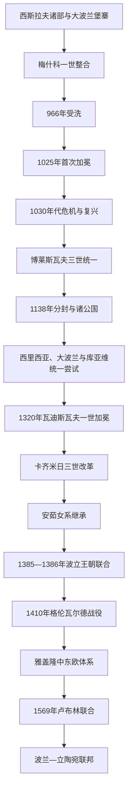

# 波兰王国

## 时间

约960年皮雅斯特国家形成；1025年首次国王加冕；1138—1320年长期分裂；1320年王国重新统一；1385—1386年起与立陶宛形成王朝联合；1569年卢布林联合后成为波兰—立陶宛联邦的组成王国。1815—1918年另有俄国皇帝兼王的“会议波兰王国”和1916—1918年无国王的摄政王国，它们不是中世纪王国的主权直线延续。

## 概括

波兰王国由大波兰地区的皮雅斯特家族整合西斯拉夫诸部形成。966年梅什科一世受洗，把新国家纳入拉丁基督教、教皇与帝国外交体系；1025年博莱斯瓦夫一世加冕，建立王国象征。王国随后经历1030年代危机、1138年分封造成的两世纪诸公国竞争、14世纪重新统一，以及安茹—雅盖隆女系继承。

波兰的崛起不是不断向外扩张的单线故事。它在神圣罗马帝国、波希米亚、匈牙利、基辅罗斯、条顿骑士团与蒙古西侵之间调整边界；国内则在王权、教会、贵族和地方公爵之间反复重组。雅盖隆时期与立陶宛共同对抗条顿骑士团并向东扩展，贵族议会也获得日益广泛的税收与立法权。1569年建立联邦后，“波兰王国王冠领地”仍保留法律身份，但共同君主和共同议会使其历史进入新的复合国家阶段。

## 建立背景与国家形成

### 皮雅斯特中心

奥得河、维斯瓦河流域的西斯拉夫社群并非一开始就构成统一“波兰民族国家”。9—10世纪，大波兰的格涅兹诺、波兹南等堡寨网络迅速扩建，皮雅斯特首领以军事随从、贡赋和俘虏贸易控制周边。梅什科一世兼并库亚维、马佐维亚和部分西里西亚、波美拉尼亚，把不同部落区连接为王朝国家。

### 966年受洗

梅什科迎娶波希米亚公主杜布拉娃并接受拉丁礼基督教。受洗有信仰与政治双重作用：建立教会文字行政、避免被以“异教改宗”为名征服、获得与欧洲王室通婚的资格。968年波兹南主教区建立，后来格涅兹诺教省使波兰教会减少对德意志总主教区的依赖。

### 博莱斯瓦夫一世与王国象征

博莱斯瓦夫一世利用神圣罗马皇帝奥托三世的普世帝国构想，在1000年格涅兹诺会议提升地位。奥托三世死后，他与亨利二世长期战争，并一度控制波希米亚、卢萨蒂亚和基辅。1025年加冕是对王朝主权和教会组织的确认，但扩张依赖个人军事与贡赋，难以自动转化为稳定行政。

## 分阶段发展

### 1030年代危机与卡齐米日复兴

梅什科二世同时遭帝国、基辅罗斯和兄弟进攻，1031年失去王位。贝斯普里姆夺位、王室内部暴力、沉重贡税和教会扩张引发地方反抗；1038年前后波希米亚军掠夺格涅兹诺，国家中心几乎瓦解。危机不是单一“异教复辟”，而是王朝继承、社会负担、外敌和地方离心的叠加。

卡齐米日一世在帝国和基辅支援下返国，以克拉科夫为新中心，重建教会和军政网络。其子博莱斯瓦夫二世借教皇改革运动恢复国王加冕，却因与主教斯坦尼斯瓦夫冲突被放逐。此后瓦迪斯瓦夫·赫尔曼的权力受权臣和诸子限制，显示统一国家仍高度依赖王室内部合作。

### 博莱斯瓦夫三世与1138年分封

博莱斯瓦夫三世击败兄长兹比格涅夫，抵御帝国干预，并使西波美拉尼亚接受宗主权与基督教。为避免诸子争位，他在遗嘱中把领地分封，同时规定掌握克拉科夫的最年长宗室为“资深公爵”。制度本意是以一个最高职位维持整体，却同时给每支宗室可世袭的财政军事基地。

瓦迪斯瓦夫二世试图重建单一王权，遭弟弟和贵族联合放逐。此后克拉科夫资深位多次易手，西里西亚、大波兰、马佐维亚、小波兰、桑多梅日等公国形成各自王朝。地方化促进城镇、修道院和德意志法移民，却削弱统一外交和防御。

### 蒙古入侵、条顿骑士团与统一尝试

康拉德·马佐维亚邀请条顿骑士团对付普鲁士异教部落，骑士团逐渐建立自身国家，后来成为波兰最持久的北方竞争者。1241年蒙古军在莱格尼察击败亨里克二世，后者阵亡使西里西亚支系接近统一的计划崩溃。蒙古军主要目标是掩护对匈牙利作战，并未长期占领波兰；因此蒙古入侵是中断因素，不是两世纪分裂的根本原因。

13世纪城市、矿业、教区和跨公国贵族关系增长，使“波兰王国”记忆仍然存在。大波兰的普热梅斯乌二世1295年恢复国王加冕，但翌年遇刺。波希米亚国王瓦茨拉夫二世借婚姻、贵族支持和军力加冕为波兰王；其子遇刺后，库亚维公爵瓦迪斯瓦夫“短小者”逐步夺回克拉科夫和大波兰。

### 1320年再统一与卡齐米日三世改革

瓦迪斯瓦夫一世1320年在克拉科夫加冕，通常视为统一王国恢复。西里西亚多数公国仍逐渐臣属波希米亚，条顿骑士团也占据格但斯克波美拉利亚，因此“统一”并非恢复旧边界。王国的核心成了小波兰和大波兰的政治结合。

卡齐米日三世改革法律和王室法庭、整顿货币税收、兴建城堡与城市，设立克拉科夫大学，并向加利西亚—沃里尼亚罗斯扩展。他与波希米亚达成继承与边界妥协，承认对西里西亚的现实损失，以换取波兰王号不再受争议。他没有合法男性后嗣，1370年王位按协议传给外甥、匈牙利国王路德维克。

### 安茹继承、雅德维加与立陶宛联合

路德维克为确保女儿继承，向波兰贵族授予科希采特权，减轻税负并承诺征税、出征需获同意。1384年幼女雅德维加以“波兰国王”身份加冕。波兰精英选择她与立陶宛大公雅盖沃联姻，原因包括对抗条顿骑士团、立陶宛基督教化和避免哈布斯堡控制。

雅盖沃1386年受洗并以瓦迪斯瓦夫二世身份加冕。克雷沃安排首先是王朝和婚姻联合，两国并未立即合并行政。雅德维加1399年去世后，雅盖沃仍以贵族承认和新王朝继承维持王位。他必须不断确认贵族特权，换取儿子继承。

### 条顿战争与雅盖隆鼎盛

条顿骑士团以立陶宛改宗“不真诚”为由继续扩张。1410年格伦瓦尔德战役中，波兰—立陶宛联军击败骑士团主力，但未能立即攻下马尔堡。十三年战争中，普鲁士城市与贵族反抗骑士团，波兰王室依财政和雇佣军作战；1466年第二次托伦和约使王室普鲁士与格但斯克进入波兰王冠，骑士团残余对波兰称臣。

雅盖隆家族成员同时取得波希米亚和匈牙利王位，构成中东欧王朝网络。波兰—立陶宛控制波罗的海至黑海间广阔空间，谷物通过维斯瓦河与格但斯克出口西欧。鼎盛基础是王朝联合、贵族骑兵、城市贸易和对条顿胜利；弱点则是不同领地的制度差异、王室常备财政不足与贵族不断扩权。

### 贵族共和国形成

贵族并非单一大地主集团。普通什拉赫塔通过地方议会和全国瑟姆参与政治，1493年两院制议会趋于定型。1505年“无共同同意则无新法”规定国王不能脱离参议院和众议院立法，王国从王朝君主制走向贵族参与的混合政体。

齐格蒙特一世时期王后博娜推动王室领地清查，1525年条顿骑士团国转为世俗普鲁士公国并向波兰国王行臣服礼。宗教改革进入城市和贵族社会，王国相较西欧宗教战争保持较大宽容。齐格蒙特二世无嗣，而莫斯科国家在利沃尼亚战争中施压，促使波兰和立陶宛重新谈判共同国家结构。

### 1569年卢布林联合

立陶宛大贵族担忧波兰政治优势，波兰贵族则希望取得东部土地权利。齐格蒙特二世把波德拉谢、沃里尼亚、基辅等地并入波兰王冠，以压力推动谈判。最终建立共同选举君主、共同瑟姆与外交体系，同时保留两地军队、财政、法律和官职。

因此，联邦既不是两个完全独立国家的松散同盟，也不是波兰把立陶宛完全吞并。波兰王国在联邦内部继续称“王冠”，其乌克兰和罗斯领地、普鲁士自治和本部省份具有显著差异。

## 统治结构

| 层级 | 机构／群体 | 作用与演变 |
|---|---|---|
| 公爵／国王 | 皮雅斯特、安茹、雅盖隆君主 | 统军、司法、授地、任命与外交；从早期家产国家逐步受贵族特权和议会制约。 |
| 王室堡寨与总督 | 城堡伯爵、地方官、王室庄园 | 早期征税征兵核心；分裂时期转为各公国制度，统一后重新纳入王国。 |
| 教会 | 格涅兹诺总主教、主教区、修道院 | 提供书写行政、教育和王权加冕；总主教在空位和政治调停中重要。 |
| 地方公爵 | 皮雅斯特各支系 | 1138年后拥有世袭领地、法庭和军队；部分支系臣属波希米亚或逐步绝嗣。 |
| 什拉赫塔 | 从地方骑士到大贵族 | 以服役、土地与特权形成政治等级；15世纪以后通过地方议会和瑟姆参与征税立法。 |
| 王室城市 | 克拉科夫、波兹南、格但斯克等 | 提供税收、手工业和贸易；政治权利低于贵族，格但斯克等自治城市例外较强。 |
| 瑟姆 | 国王、参议院、众议院 | 15—16世纪形成全国议会；同意税收、法律和大规模军事动员。 |

## 重要事件

| 时间 | 事件 | 过程与影响 |
|---|---|---|
| 966年 | 梅什科一世受洗 | 波兰进入拉丁基督教欧洲，建立独立教会与王朝外交基础。 |
| 1000年 | 格涅兹诺会议 | 强化教省组织与博莱斯瓦夫一世的准王权地位。 |
| 1025年 | 首次国王加冕 | 波兰王国象征建立；同年两位君主相继去世，随即进入危机。 |
| 1030年代 | 王朝、社会与外敌危机 | 国家中心瓦解，卡齐米日一世以后在克拉科夫重建。 |
| 1138年 | 博莱斯瓦夫三世分封 | 资深公爵制未能阻止内战，开启长期诸公国时期。 |
| 1226年前后 | 条顿骑士团受邀 | 原为边疆军事方案，最终形成独立骑士团国家。 |
| 1241年 | 莱格尼察战役 | 亨里克二世阵亡，西里西亚统一尝试受挫。 |
| 1320年 | 瓦迪斯瓦夫一世加冕 | 统一王国恢复，但西里西亚与波美拉利亚问题仍存。 |
| 1385—1386年 | 克雷沃联合与雅盖沃加冕 | 波兰—立陶宛王朝共同体形成，立陶宛转入拉丁基督教。 |
| 1410年 | 格伦瓦尔德战役 | 条顿军事威望受重创，波立联合成为区域强权。 |
| 1466年 | 第二次托伦和约 | 波兰取得王室普鲁士和出海贸易优势。 |
| 1505年 | “无共同同意则无新法” | 全国立法须经议会，贵族共和国制度成形。 |
| 1525年 | 普鲁士臣服 | 条顿国家世俗化为普鲁士公国，成为波兰封臣。 |
| 1569年 | 卢布林联合 | 波兰王国与立陶宛大公国建立联邦，历史进入新阶段。 |

## 崛起、分裂与再统一原因

### 早期崛起

- 大波兰堡寨密度、军事随从和贡赋贸易为皮雅斯特扩张提供物质基础。
- 受洗、主教区和王室婚姻把征服联盟转化为有书写、教法和国际承认的国家。
- 位于帝国、波希米亚、罗斯和波罗的海之间，使波兰既受压力，也能借对手之间的竞争扩展。

### 1030年代衰退

结构因素是扩张国家财政依赖高强度贡赋、教会和贵族利益尚未稳定；外部压力来自帝国、基辅罗斯与波希米亚；直接触发则是梅什科二世的多线战争和兄弟夺位。把危机只称作“异教反动”会忽略王朝与社会原因。

### 1138年后分裂

遗嘱分封赋予诸子世袭地盘，资深公爵却缺乏直接控制各支军队和税收的手段。贵族、主教和城市能在竞争者间选择，皇帝与邻国也介入。地方发展和德意志法城市化在分裂中推进，因此这一时期并非纯粹停滞。

### 14世纪再统一

共同教省、克拉科夫加冕传统、跨地区贵族与对条顿战争维持王国认同。波希米亚普热米斯尔王朝绝嗣给瓦迪斯瓦夫一世机会，卡齐米日三世又以法律、财政和外交巩固成果。再统一依赖妥协边界，而非收复所有皮雅斯特旧地。

### 雅盖隆鼎盛与制度转型

波兰和立陶宛资源互补，对条顿胜利打开波罗的贸易；谷物出口、城市和王朝婚姻扩大影响。与此同时，君主为取得税收、战争支持和子嗣继承，不断确认贵族权利。王权受限并非立即导致衰落，却使16世纪无嗣继承必须通过议会和跨国谈判解决。

## 君主世系

从梅什科一世、分裂时期资深公爵到雅盖隆君主、联邦选举王和瓜分时期名义王位，见[波兰君主与选举王世系表](/%E4%BA%BA%E6%96%87%E7%A7%91%E5%AD%A6/%E5%8E%86%E5%8F%B2/%E6%AC%A7%E6%B4%B2/%E6%96%AF%E6%8B%89%E5%A4%AB/%E8%A5%BF%E6%96%AF%E6%8B%89%E5%A4%AB/%E6%B3%A2%E5%85%B0%E5%90%9B%E4%B8%BB%E4%B8%8E%E9%80%89%E4%B8%BE%E7%8E%8B%E4%B8%96%E7%B3%BB%E8%A1%A8.md)。分裂时期表格按克拉科夫最高权位列示，并明确地方公爵并立，避免把资深公爵误作实际统一国王。

## 演变关系

- 同区域早期节点：[大摩拉维亚](/%E4%BA%BA%E6%96%87%E7%A7%91%E5%AD%A6/%E5%8E%86%E5%8F%B2/%E6%AC%A7%E6%B4%B2/%E6%96%AF%E6%8B%89%E5%A4%AB/%E8%A5%BF%E6%96%AF%E6%8B%89%E5%A4%AB/%E5%A4%A7%E6%91%A9%E6%8B%89%E7%BB%B4%E4%BA%9A.md)影响部分小波兰与西斯拉夫基督教环境，但波兰国家主要从大波兰皮雅斯特堡寨独立形成，不能写成其直接继承者。
- 并行与竞争：[波希米亚公国与王国](/%E4%BA%BA%E6%96%87%E7%A7%91%E5%AD%A6/%E5%8E%86%E5%8F%B2/%E6%AC%A7%E6%B4%B2/%E6%96%AF%E6%8B%89%E5%A4%AB/%E8%A5%BF%E6%96%AF%E6%8B%89%E5%A4%AB/%E6%B3%A2%E5%B8%8C%E7%B1%B3%E4%BA%9A%E5%85%AC%E5%9B%BD%E4%B8%8E%E7%8E%8B%E5%9B%BD.md)；两国围绕西里西亚、克拉科夫王位与帝国关系竞争并联姻。
- 后一节点：[波兰-立陶宛联邦](/%E4%BA%BA%E6%96%87%E7%A7%91%E5%AD%A6/%E5%8E%86%E5%8F%B2/%E6%AC%A7%E6%B4%B2/%E6%96%AF%E6%8B%89%E5%A4%AB/%E8%A5%BF%E6%96%AF%E6%8B%89%E5%A4%AB/%E6%B3%A2%E5%85%B0-%E7%AB%8B%E9%99%B6%E5%AE%9B%E8%81%94%E9%82%A6.md)；1569年后波兰王国以“王冠领地”身份留在联邦内。
- 现代继承：[波兰](/%E4%BA%BA%E6%96%87%E7%A7%91%E5%AD%A6/%E5%8E%86%E5%8F%B2/%E6%AC%A7%E6%B4%B2/%E6%96%AF%E6%8B%89%E5%A4%AB/%E8%A5%BF%E6%96%AF%E6%8B%89%E5%A4%AB/%E6%B3%A2%E5%85%B0.md)。
- 返回：[西斯拉夫历史](/%E4%BA%BA%E6%96%87%E7%A7%91%E5%AD%A6/%E5%8E%86%E5%8F%B2/%E6%AC%A7%E6%B4%B2/%E6%96%AF%E6%8B%89%E5%A4%AB/%E8%A5%BF%E6%96%AF%E6%8B%89%E5%A4%AB/README.md)。
