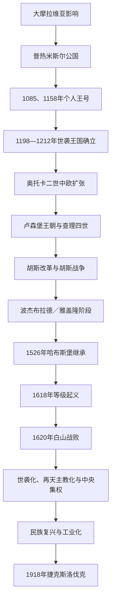

# 波希米亚公国与王国

## 时间

约9世纪末—1918年。约1198年以前主要为公国；1198年后王号逐渐世袭，1212年获得稳定确认；1526年后为哈布斯堡复合君主国中的捷克王冠核心领地。

## 概括

波希米亚以布拉格盆地为政治中心，由普热米斯尔家族在大摩拉维亚衰亡前后整合捷克诸部。它不是从一开始就独立于德意志—神圣罗马帝国的现代民族国家，而是在帝国框架、地方王朝、贵族等级和教会网络之间逐步形成的王国。14世纪卢森堡王朝使布拉格成为中欧帝国中心；15世纪胡斯战争把宗教改革、捷克语政治和等级权力结合；1526年以后王位归于哈布斯堡，1620年白山战役与1627年《更新土地宪章》又把较强的等级王国改造成世袭、再天主教化和中央集权程度更高的王冠领地。

波希米亚没有在某次“亡国”中立即消失。其王国法统、王冠领地和议会机构一直保留至1918年，只是主权与权力中心逐渐转往维也纳。1918年奥匈帝国战败、国内民族动员与海外外交共同促成捷克斯洛伐克成立，波希米亚、摩拉维亚和部分西里西亚成为新共和国的捷克土地核心。

## 建立背景

### 大摩拉维亚遗产与布拉格中心

9世纪的波希米亚诸部处在法兰克传教、大摩拉维亚扩张和地方首领竞争之间。博日沃伊一世受洗说明普热米斯尔家族最初与大摩拉维亚政治文化相连。约900年前后大摩拉维亚衰落，马扎尔人进入多瑙河盆地，布拉格一带的城堡、贸易路线和贡赋网络为普热米斯尔家族提供了独立扩张空间。

布拉格位于易北河—伏尔塔瓦河交通网和中欧东西商路上。王朝以布拉格城堡、地方堡寨、随从武士和教会中心控制人口与贡税。圣瓦茨拉夫被弟弟博莱斯拉夫杀害后成为守护圣人，既把王朝暴力转化为宗教合法性，也为后世“圣瓦茨拉夫王冠”提供象征。

### 进入拉丁基督教与帝国体系

973年布拉格主教区建立，波希米亚由雷根斯堡教会影响下逐渐形成自己的教区中心。公爵向德意志国王纳贡、参加帝国会议或战争，同时在国内保持广泛自治。帝国关系既是约束，也是资源：失位者常求皇帝支持，胜利者也可借封授、婚姻和军功巩固地位。

## 分阶段发展

### 普热米斯尔公国与王号确立

10—11世纪王朝通过摧毁斯拉夫尼克家族、夺取摩拉维亚和建立堡寨行政完成核心整合。1000年前后波兰勇敢王博莱斯瓦夫短暂占领布拉格，暴露继承内斗对外部干预的开放性。布热季斯拉夫一世试图以家族长幼继承减少分裂，实际却使兄弟、叔侄和摩拉维亚支系不断争位。

弗拉季斯拉夫二世在1085年、弗拉迪斯拉夫二世在1158年分别获个人王号，均不能自动传子。普热米斯尔·奥托卡一世利用霍亨斯陶芬与韦尔夫的帝国内战反复结盟，1198年取得王号；1212年《西西里金玺诏书》确认王位世袭、国王在帝国内的特权与较低义务，王国制度才稳定。

### 13世纪扩张与奥托卡二世的崛起、失败

城市建置、矿业、德语移民和修道院垦殖扩大王室收入。奥托卡二世继承奥地利并控制施蒂里亚、克恩滕等地，波希米亚一度成为从易北河到亚得里亚方向的中欧强权。其优势来自银矿、骑士军队、王室城市和巴本堡继承危机，不仅是个人军事才能。

他争夺德意志王位失败，又拒绝承认新选出的哈布斯堡鲁道夫一世。帝国诸侯、匈牙利和本地反对力量结盟，1278年摩拉维亚原野战役中奥托卡战死。直接失败来自联盟战争，结构原因则是扩张范围超过王室能稳定整合的贵族与行政基础。幼王瓦茨拉夫二世被勃兰登堡监护，国内一度陷入掠夺和权力真空；随后依库特纳霍拉银矿、布拉格格罗申和外交联姻重建王权。

### 1306年王朝断绝与卢森堡黄金时代

瓦茨拉夫三世遇刺使普热米斯尔男系绝嗣。哈布斯堡鲁道夫、克恩滕亨利与卢森堡约翰围绕婚姻继承和等级承认争位，1310年卢森堡约翰控制布拉格。约翰常在国外征战，以承认贵族权利换取王位稳定，并把西里西亚诸公国、上卢萨蒂亚等纳入捷克王冠体系。

查理四世以波希米亚为帝国权力基础。1348年设布拉格大学、建立新城，扩建圣维特主教座堂和卡尔施泰因城堡；他以“捷克王冠”概念把波希米亚、摩拉维亚、西里西亚和卢萨蒂亚描述为超越君主个人的领地共同体。布拉格成为神圣罗马皇帝宫廷，矿业、贸易、教会和教育同时繁荣。这一鼎盛依赖王国资源与帝国地位结合，也埋下王室国际事务和本地贵族利益之间的张力。

### 胡斯改革与战争

14世纪末教会大分裂、教产集中、城市民族冲突和王权—贵族斗争交织。布拉格大学教授扬·胡斯主张教会改革，受威克里夫思想影响；1415年他在康斯坦茨会议被处死，成为宗教与民族政治的引爆点。瓦茨拉夫四世1419年去世后，弟弟西吉斯蒙德的继承遭胡斯派拒绝。

1420—1434年多次反胡斯十字军未能征服波希米亚。塔博尔派、奥雷布派、布拉格市民和温和圣杯派并非统一阵营；他们以车堡战术和群众动员取胜，也因社会、礼仪和财产目标不同而分裂。1434年利帕尼战役中，温和派联合天主教贵族击败激进派；1436年宗教协定使圣杯礼获得有限承认，西吉斯蒙德才被接纳。

战争破坏经济和教会组织，却没有简单毁灭捷克国家。等级议会、地方军事联盟和捷克语宗教文化获得长期影响。波杰布拉德的伊日以温和胡斯派领袖身份由等级选王，试图在教皇压力下维持宗教妥协；匈牙利国王马加什·科尔维努斯随后控制摩拉维亚、西里西亚和卢萨蒂亚，造成王冠领地分裂。

### 雅盖隆妥协与1526年继承

弗拉迪斯拉夫二世1471年即位，1490年兼任匈牙利国王后重新合并马加什控制区。王室长期居于布达，波希米亚贵族和城市等级扩大税收、土地与官职控制。王权财政薄弱不等于国家立即衰落：矿业、城市和文艺复兴文化继续发展，但对奥斯曼威胁和常备军的动员不足。

1526年路德维克二世在莫哈奇战役阵亡且无嗣。其姐夫哈布斯堡的斐迪南凭婚姻条约、等级选举和军事资源取得波希米亚王位。波希米亚由此与奥地利、匈牙利西部构成长期复合君主国。

### 哈布斯堡、宗教冲突与白山战役

斐迪南一世建立中央宫廷机关、要求税收支持对奥斯曼战争，1547年镇压拒绝出兵的波希米亚等级。16世纪路德宗、圣杯派、弟兄会和天主教并存，等级把宗教自由与政治特权绑定。鲁道夫二世以布拉格为帝国宫廷，艺术、天文学与收藏繁荣；1609年在压力下颁发宗教自由诏书。

1618年新教等级认为王室侵犯宗教保障，把两名总督和书记从布拉格城堡窗户抛下，组成临时政府。1619年等级废黜斐迪南二世，选普法尔茨的腓特烈五世为王。起义者财政、军队和跨领地协调不足，未能稳固获得诸新教国家支援；哈布斯堡、西班牙和天主教联盟则组成优势联盟。1620年白山战役仅数小时即告失败，腓特烈流亡。

1621年布拉格处决27名起义领袖，大规模没收地产改变精英结构。1627年《更新土地宪章》确认哈布斯堡世袭、天主教特权与德语并列地位。反宗教改革迫使非天主教贵族和知识分子改宗或流亡。白山不是捷克文化突然“消失”，但它确实终结了等级另选国王和制度化宗教多元的可能。

### 三十年战争后至18世纪改革

战争、征发、瘟疫与瑞典军队侵入造成严重人口经济损失。战后大庄园、农役和贵族行政加强，布拉格不再是常驻帝国宫廷。1740年玛丽亚·特蕾西亚继位引发战争，普鲁士夺取西里西亚大部，捷克王冠领地的范围缩小。

玛丽亚·特蕾西亚与约瑟夫二世推行常备军、税收、义务教育、宗教宽容和农役改革。改革削弱地方等级的财政军政自主，也为人口识字、官僚治理和工业化创造条件。1781年农奴人身依附被取消，农役负担仍到1848年才最终废除。

### 19世纪民族复兴、工业化与奥匈政治

捷克语学者、出版者和博物馆通过语法、文学、历史叙事恢复捷克语公共文化。波希米亚成为哈布斯堡工业最发达地区之一，纺织、煤炭、玻璃和机械制造推动城市化；捷克语与德语人口在城市行政、教育和选举权上竞争。

1848年革命提出自治、宪政和斯拉夫合作，布拉格起义被军队镇压，但农役被废、近代行政与议会政治不可逆转。1867年奥匈妥协承认匈牙利王国，却未给予波希米亚同等地位；捷克政治家以“历史国家权利”要求恢复王冠领地整体。弗朗茨·约瑟夫一世曾讨论加冕和基本条款，最终未实现。普选扩大、政党政治、工人运动和民族分区方案继续发展，未能解决双语地区的主权归属。

## 统治结构

| 层级 | 机构／群体 | 功能与变化 |
|---|---|---|
| 君主 | 公爵、国王，1526年后多兼奥地利与匈牙利君主 | 统帅、最高司法、授官和召集等级；1627年后世袭与中央任命权增强。 |
| 王冠领地 | 波希米亚、摩拉维亚、西里西亚、上／下卢萨蒂亚 | 共享君主与王冠概念，但各有议会、法律和行政；不能把它们视为普通省份的同质集合。 |
| 等级议会 | 高级贵族、骑士、王室城市，早期教会等级 | 同意税收、确认君主、制定土地法；胡斯时代和16世纪影响尤其大，白山后受限。 |
| 地方官职 | 最高城堡伯爵、最高法官、土地官员等 | 多由本地贵族占有，连接王室命令与庄园网络。 |
| 城市与矿区 | 布拉格诸城、库特纳霍拉等 | 提供税收、铸币和军事资源；城市等级在胡斯战争中成为独立政治力量。 |
| 教会 | 布拉格主教／总主教、修道院、教区 | 提供文字行政和合法性；胡斯改革后被重组，白山后成为再天主教化核心。 |
| 哈布斯堡中央机关 | 维也纳宫廷议会、财政与战争机关 | 逐步统筹税收、军队和外交；18世纪改革后地方等级自治进一步压缩。 |

## 重要事件

| 时间 | 事件 | 过程与影响 |
|---|---|---|
| 973年 | 布拉格主教区建立 | 王国教会组织从外部传教转向稳定本地机构。 |
| 1212年 | 《西西里金玺诏书》 | 确认世袭王位和帝国内特权，是公国向稳定王国转变的制度节点。 |
| 1278年 | 摩拉维亚原野战役 | 奥托卡二世战死，中欧扩张帝国崩解；哈布斯堡由此站稳奥地利。 |
| 1348年 | 布拉格大学与新城建立 | 查理四世把布拉格建设为帝国、教育和贸易中心。 |
| 1415年—1436年 | 胡斯殉难、战争与宗教和约 | 改革运动演变为长期战争，最终形成有限宗教妥协和等级政治。 |
| 1526年 | 莫哈奇战役后的哈布斯堡继承 | 波希米亚进入横跨中欧的复合君主国。 |
| 1609年 | 宗教自由诏书 | 承认新教等级权利，也成为后续冲突的法律依据。 |
| 1618年—1620年 | 掷出窗外、等级起义与白山战败 | 王位和宗教制度之争以哈布斯堡军事胜利结束。 |
| 1627年 | 《更新土地宪章》 | 王位世袭化、天主教化和中央集权制度化。 |
| 1848年 | 革命与农役废除 | 起义失败，但封建农役和旧等级社会受到决定性改变。 |
| 1918年 | 捷克斯洛伐克成立 | 奥匈战败、国内权力转移和海外承认共同终结哈布斯堡王位。 |

## 崛起、鼎盛与转型原因

### 崛起机制

- 布拉格的交通位置、堡寨贡税与教会书写行政提供长期国家能力。
- 普热米斯尔家族虽内斗频繁，仍能把王朝圣人、主教区和摩拉维亚领地整合为共同政治传统。
- 身处帝国既带来干预，也让统治者借军功、婚姻与帝国危机取得王号和扩张机会。
- 银矿、城市、移民技术与铸币把王室从单纯土地贡赋提升为区域财政强权。

### 14世纪鼎盛条件

- 卢森堡王朝同时掌握波希米亚王位与帝国王位，把本地资源转化为国际地位。
- 查理四世通过大学、城市、教会和法律建设强化布拉格中心，而非只靠战争扩张。
- “捷克王冠”让不同领地形成超越君主个人的法统共同体，提高继承连续性。

### 权力下降与主权转移

- 王朝绝嗣、跨国君主长期不在本地和等级特权扩张削弱王室直接统治。
- 宗教分裂并非必然导致衰亡；真正使1618年起义失败的是财政动员不足、盟友不稳与哈布斯堡联盟的军事优势。
- 白山后没收、流亡和中央集权改变本地精英与制度，维也纳成为决策中心。
- 18—19世纪工业化反而增强捷克社会力量，但其诉求转向民族自治和民主代表，旧王国框架无法解决德捷混居与帝国二元制问题。
- 1918年的直接终点是奥匈军事战败和帝国政府失去控制；长期因素则是民族政治、群众参政、战争动员与国际民族自决环境。

## 王朝世系

完整公爵、国王、复位者、并立王与哈布斯堡捷克王位，见[波希米亚与捷克王冠统治者世系表](/%E4%BA%BA%E6%96%87%E7%A7%91%E5%AD%A6/%E5%8E%86%E5%8F%B2/%E6%AC%A7%E6%B4%B2/%E6%96%AF%E6%8B%89%E5%A4%AB/%E8%A5%BF%E6%96%AF%E6%8B%89%E5%A4%AB/%E6%B3%A2%E5%B8%8C%E7%B1%B3%E4%BA%9A%E4%B8%8E%E6%8D%B7%E5%85%8B%E7%8E%8B%E5%86%A0%E7%BB%9F%E6%B2%BB%E8%80%85%E4%B8%96%E7%B3%BB%E8%A1%A8.md)。该表把胡斯战争空位、马加什一世的部分领地统治、1619年选王和1741年并立王位分别说明，不省略任何一段争议统治。

## 演变关系

- 前一节点：[大摩拉维亚](/%E4%BA%BA%E6%96%87%E7%A7%91%E5%AD%A6/%E5%8E%86%E5%8F%B2/%E6%AC%A7%E6%B4%B2/%E6%96%AF%E6%8B%89%E5%A4%AB/%E8%A5%BF%E6%96%AF%E6%8B%89%E5%A4%AB/%E5%A4%A7%E6%91%A9%E6%8B%89%E7%BB%B4%E4%BA%9A.md)；波希米亚早期基督教和王权形成受其影响，但不是整个大摩拉维亚的简单等同继承。
- 并行节点：[波兰王国](/%E4%BA%BA%E6%96%87%E7%A7%91%E5%AD%A6/%E5%8E%86%E5%8F%B2/%E6%AC%A7%E6%B4%B2/%E6%96%AF%E6%8B%89%E5%A4%AB/%E8%A5%BF%E6%96%AF%E6%8B%89%E5%A4%AB/%E6%B3%A2%E5%85%B0%E7%8E%8B%E5%9B%BD.md)；两国在西里西亚、王位与帝国关系上既竞争又联姻。
- 后一节点：[捷克斯洛伐克](/%E4%BA%BA%E6%96%87%E7%A7%91%E5%AD%A6/%E5%8E%86%E5%8F%B2/%E6%AC%A7%E6%B4%B2/%E6%96%AF%E6%8B%89%E5%A4%AB/%E8%A5%BF%E6%96%AF%E6%8B%89%E5%A4%AB/%E6%8D%B7%E5%85%8B%E6%96%AF%E6%B4%9B%E4%BC%90%E5%85%8B.md)；1918年后波希米亚与摩拉维亚进入共和国。
- 现代延续：[捷克](/%E4%BA%BA%E6%96%87%E7%A7%91%E5%AD%A6/%E5%8E%86%E5%8F%B2/%E6%AC%A7%E6%B4%B2/%E6%96%AF%E6%8B%89%E5%A4%AB/%E8%A5%BF%E6%96%AF%E6%8B%89%E5%A4%AB/%E6%8D%B7%E5%85%8B.md)。
- 返回：[西斯拉夫历史](/%E4%BA%BA%E6%96%87%E7%A7%91%E5%AD%A6/%E5%8E%86%E5%8F%B2/%E6%AC%A7%E6%B4%B2/%E6%96%AF%E6%8B%89%E5%A4%AB/%E8%A5%BF%E6%96%AF%E6%8B%89%E5%A4%AB/README.md)。
