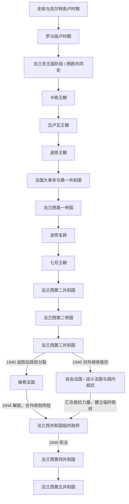

# 法国历史

[返回欧洲历史](/%E4%BA%BA%E6%96%87%E7%A7%91%E5%AD%A6/%E5%8E%86%E5%8F%B2/%E6%AC%A7%E6%B4%B2/README.md)

## 范围与对象

本页以现代法国疆域和法国国家形成过程为主线，上溯高卢、罗马统治与法兰克共同史，但不把这些跨境历史对象视为现代法国民族国家的直线前身。古罗马、法兰克王国等共同背景由欧洲通史维护；法国海外帝国的扩张、殖民统治与去殖民化则需与美洲、非洲和亚洲的本地历史并读。

## 历史主线

法国历史的主线可以概括为：高卢部落社会被罗马帝国整合，西罗马瓦解后由法兰克王国承接；但法兰克王国不是法国单独的历史，而是同时关系到法国、德意志、意大利北部和低地地区的西欧共同史。843年以后，西法兰克逐渐演化为中世纪法兰西王国；卡佩、瓦卢瓦、波旁三大王朝持续强化王权和领土整合；1789年大革命后，法国在共和国、帝国和君主立宪之间多次摆动。1940年战败使第三共和国后的国家合法性分裂为维希政权与自由法国 / 抵抗主线；自由法国和国内抵抗汇合后建立法兰西共和国临时政府，再由1946年宪法开启第四共和国，1958年后形成以第五共和国为核心的现代法国。

## 文明连续性

| 观察轴 | 长时段连续性与变化 |
|---|---|
| 空间与城市 | 罗马高卢留下城市、道路和行省网络；中世纪王权以法兰西岛和巴黎为核心逐步扩张，近现代中央国家再整合边疆。现代国界不能直接投射到古代高卢。 |
| 语言与文化 | 高卢的拉丁化促成高卢—罗曼语演变，北部法语逐渐成为王权和国家行政语言；奥克语、布列塔尼语、阿尔萨斯语、科西嘉语等区域传统仍长期存在。 |
| 宗教与政治观念 | 基督教化、天主教王权、宗教战争、启蒙与大革命、共和主义及政教分离依次重塑公共秩序，既有断裂也有制度记忆。 |
| 国家与法律 | 中世纪和旧制度王权积累行政、司法和财政能力；大革命改造主权与公民身份，拿破仑法典和省级行政体系又被后续政体继承。 |
| 人口与社会 | 高卢居民、罗马移民、法兰克及其他迁入群体长期融合；近现代工业化、欧洲迁移、殖民与后殖民迁移继续改变法国社会。 |
| 经济与对外网络 | 地中海和大陆网络、城市与行会、近代大西洋贸易和殖民体系、工业化以及欧洲一体化，依次改变法国与外部世界的联系。 |

## 关键断裂与现代继承

| 转折 | 断裂 | 延续 / 现代承接 |
|---|---|---|
| 843—987年 | 法兰克帝国分裂，西法兰克王权长期地方化；这不是一个现代民族国家的即时诞生。 | 卡佩王朝从既有王国与教会秩序中扩张，逐步形成法兰西王国。 |
| 1789—1804年 | 旧制度、等级特权与君主主权遭到革命性改造，共和国又转入拿破仑帝国。 | 中央行政、法律统一、公民身份和革命政治语言被后续君主制与共和国不同程度继承。 |
| 1870—1875年 | 第二帝国战败，巴黎公社与政体斗争使国家秩序重组。 | 第三共和国确立较持久的共和制度、议会政治与世俗公共教育框架。 |
| 1940—1946年 | 军事失败造成占领、维希合作政权与国家合法性分裂，不能把维希简单画成第四共和国的正统前身。 | 自由法国、战斗法国与国内抵抗汇合为临时政府，恢复共和合法性并承接第四共和国。 |
| 1958年 | 阿尔及利亚危机促使第四共和国体制终结，新宪法显著加强总统权力。 | 国家行政、共和合法性和战后社会政策延续，第五共和国成为当代政体框架。 |

## 法兰克王国时期引用

法兰克王国时期的详细内容已移入通史目录：[法兰克王国](/%E4%BA%BA%E6%96%87%E7%A7%91%E5%AD%A6/%E5%8E%86%E5%8F%B2/%E6%AC%A7%E6%B4%B2/_%E9%80%9A%E5%8F%B2/%E5%90%8E%E7%BD%97%E9%A9%AC%E6%97%B6%E4%BB%A3%E7%9A%84%E6%97%A5%E8%80%B3%E6%9B%BC%E8%AF%B8%E5%9B%BD/%E6%B3%95%E5%85%B0%E5%85%8B%E7%8E%8B%E5%9B%BD/README.md)。法国史中只保留其与法国形成相关的主线：

- [墨洛温王朝](/%E4%BA%BA%E6%96%87%E7%A7%91%E5%AD%A6/%E5%8E%86%E5%8F%B2/%E6%AC%A7%E6%B4%B2/_%E9%80%9A%E5%8F%B2/%E5%90%8E%E7%BD%97%E9%A9%AC%E6%97%B6%E4%BB%A3%E7%9A%84%E6%97%A5%E8%80%B3%E6%9B%BC%E8%AF%B8%E5%9B%BD/%E6%B3%95%E5%85%B0%E5%85%8B%E7%8E%8B%E5%9B%BD/%E5%A2%A8%E6%B4%9B%E6%B8%A9%E7%8E%8B%E6%9C%9D.md)：取得北高卢核心区域，是法国史源头之一，但政权本身不是法国。
- [加洛林王朝](/%E4%BA%BA%E6%96%87%E7%A7%91%E5%AD%A6/%E5%8E%86%E5%8F%B2/%E6%AC%A7%E6%B4%B2/_%E9%80%9A%E5%8F%B2/%E5%90%8E%E7%BD%97%E9%A9%AC%E6%97%B6%E4%BB%A3%E7%9A%84%E6%97%A5%E8%80%B3%E6%9B%BC%E8%AF%B8%E5%9B%BD/%E6%B3%95%E5%85%B0%E5%85%8B%E7%8E%8B%E5%9B%BD/%E5%8A%A0%E6%B4%9B%E6%9E%97%E7%8E%8B%E6%9C%9D.md)：查理曼帝国三分后，西法兰克成为法国王国的重要前身。
- [西法兰克王国](/%E4%BA%BA%E6%96%87%E7%A7%91%E5%AD%A6/%E5%8E%86%E5%8F%B2/%E6%AC%A7%E6%B4%B2/_%E9%80%9A%E5%8F%B2/%E5%90%8E%E7%BD%97%E9%A9%AC%E6%97%B6%E4%BB%A3%E7%9A%84%E6%97%A5%E8%80%B3%E6%9B%BC%E8%AF%B8%E5%9B%BD/%E6%B3%95%E5%85%B0%E5%85%8B%E7%8E%8B%E5%9B%BD/%E8%A5%BF%E6%B3%95%E5%85%B0%E5%85%8B%E7%8E%8B%E5%9B%BD.md)：843年以后逐渐走向卡佩王朝和法兰西王国。

## 名称辨析：法兰克、西法兰克、法兰西

| 名称 | 大致使用阶段 | 含义 | 与法国史的关系 |
|---|---|---|---|
| 法兰克 | 3世纪以后作为日耳曼部族名称出现；486年-843年通常用于墨洛温、加洛林法兰克王国 | 最初是莱茵河下游一带的日耳曼部族联盟，后来成为统治高卢、日耳曼和意大利部分地区的法兰克王国 / 法兰克帝国 | 这一阶段还不是“法国”民族国家，而是横跨今日法国、德国、低地国家和意大利北部的法兰克政治共同体。 |
| 西法兰克 | 843年《凡尔登条约》后至10-12世纪逐渐过渡 | 查理曼帝国分裂后的西部王国，拉丁文常称 West Francia / Francia occidentalis | 西法兰克覆盖今日法国核心地区，是法兰西王国的直接前身；987年卡佩王朝仍可理解为“西法兰克王国中的王权更替”。 |
| 法兰西 | 987年卡佩王朝后逐渐成型；12-13世纪以后“法兰西王国”称呼更稳定 | 从西法兰克演变出的中世纪法国王国，王室核心在法兰西岛，后来逐步整合法国各地 | 不是某一年突然改名，而是政治中心、王室称号和领土认同长期转化；到腓力二世时期，王权扩张和“法兰西国王 / 法兰西王国”用法更加明确。 |

简化记忆：486年以后是法兰克王国主线；843年帝国三分后，法国方向称西法兰克；987年卡佩王朝开启后逐渐从“西法兰克”过渡为“法兰西王国”。

## 按时间排序的时期导航

| 顺序 | 名称 | 时间 | 简要概括 |
|---|---|---|---|
| 1 | [史前与凯尔特高卢时期](/%E4%BA%BA%E6%96%87%E7%A7%91%E5%AD%A6/%E5%8E%86%E5%8F%B2/%E6%AC%A7%E6%B4%B2/%E6%B3%95%E5%9B%BD/%E5%8F%B2%E5%89%8D%E4%B8%8E%E5%87%AF%E5%B0%94%E7%89%B9%E9%AB%98%E5%8D%A2%E6%97%B6%E6%9C%9F.md) | 约前180万年-前52年 | 从旧石器时代遗存、农业扩散到凯尔特高卢部落社会，形成罗马征服前法国地域的族群与地域基础。 |
| 2 | [罗马高卢时期](/%E4%BA%BA%E6%96%87%E7%A7%91%E5%AD%A6/%E5%8E%86%E5%8F%B2/%E6%AC%A7%E6%B4%B2/%E6%B3%95%E5%9B%BD/%E7%BD%97%E9%A9%AC%E9%AB%98%E5%8D%A2%E6%97%B6%E6%9C%9F.md) | 前52年-486年 | 凯撒征服高卢后，罗马在高卢建立行省、城市、道路和拉丁文化，后期受基督教传播与日耳曼迁徙冲击。 |
| 3 | [法兰克王国阶段](/%E4%BA%BA%E6%96%87%E7%A7%91%E5%AD%A6/%E5%8E%86%E5%8F%B2/%E6%AC%A7%E6%B4%B2/_%E9%80%9A%E5%8F%B2/%E5%90%8E%E7%BD%97%E9%A9%AC%E6%97%B6%E4%BB%A3%E7%9A%84%E6%97%A5%E8%80%B3%E6%9B%BC%E8%AF%B8%E5%9B%BD/%E6%B3%95%E5%85%B0%E5%85%8B%E7%8E%8B%E5%9B%BD/README.md) | 486年-987年 | 法兰克王国与西法兰克是法国史的重要源头，但属于西欧共同史，详见法兰克王国目录。 |
| 4 | [卡佩王朝](/%E4%BA%BA%E6%96%87%E7%A7%91%E5%AD%A6/%E5%8E%86%E5%8F%B2/%E6%AC%A7%E6%B4%B2/%E6%B3%95%E5%9B%BD/%E5%8D%A1%E4%BD%A9%E7%8E%8B%E6%9C%9D.md) | 987年-1328年 | 雨果·卡佩建立卡佩王朝，王室从法兰西岛逐步扩张，王权、行政、司法和巴黎中心地位不断强化。 |
| 5 | [瓦卢瓦王朝](/%E4%BA%BA%E6%96%87%E7%A7%91%E5%AD%A6/%E5%8E%86%E5%8F%B2/%E6%AC%A7%E6%B4%B2/%E6%B3%95%E5%9B%BD/%E7%93%A6%E5%8D%A2%E7%93%A6%E7%8E%8B%E6%9C%9D.md) | 1328年-1589年 | 瓦卢瓦支系继承王位，经历百年战争、法国统一加强、意大利战争和宗教战争，最终由波旁王朝继承。 |
| 6 | [波旁王朝](/%E4%BA%BA%E6%96%87%E7%A7%91%E5%AD%A6/%E5%8E%86%E5%8F%B2/%E6%AC%A7%E6%B4%B2/%E6%B3%95%E5%9B%BD/%E6%B3%A2%E6%97%81%E7%8E%8B%E6%9C%9D.md) | 1589年-1792年 | 亨利四世开创波旁统治，法国形成绝对君主制和欧洲强国地位，路易十六时期财政危机引发大革命。 |
| 7 | [法国大革命与第一共和国](/%E4%BA%BA%E6%96%87%E7%A7%91%E5%AD%A6/%E5%8E%86%E5%8F%B2/%E6%AC%A7%E6%B4%B2/%E6%B3%95%E5%9B%BD/%E6%B3%95%E5%9B%BD%E5%A4%A7%E9%9D%A9%E5%91%BD%E4%B8%8E%E7%AC%AC%E4%B8%80%E5%85%B1%E5%92%8C%E5%9B%BD.md) | 1789年-1804年 | 三级会议、攻占巴士底狱、废除封建特权和王政，经历国民公会、督政府、执政府，最终拿破仑称帝。 |
| 8 | [法兰西第一帝国](/%E4%BA%BA%E6%96%87%E7%A7%91%E5%AD%A6/%E5%8E%86%E5%8F%B2/%E6%AC%A7%E6%B4%B2/%E6%B3%95%E5%9B%BD/%E6%B3%95%E5%85%B0%E8%A5%BF%E7%AC%AC%E4%B8%80%E5%B8%9D%E5%9B%BD.md) | 1804年-1814年；1815年 | 拿破仑建立帝国，以《拿破仑法典》和大陆战争重塑欧洲秩序，滑铁卢后终结。 |
| 9 | [波旁复辟](/%E4%BA%BA%E6%96%87%E7%A7%91%E5%AD%A6/%E5%8E%86%E5%8F%B2/%E6%AC%A7%E6%B4%B2/%E6%B3%95%E5%9B%BD/%E6%B3%A2%E6%97%81%E5%A4%8D%E8%BE%9F.md) | 1814年-1830年 | 路易十八与查理十世复辟君主制，在革命遗产与旧制度复兴之间摇摆，七月革命后被推翻。 |
| 10 | [七月王朝](/%E4%BA%BA%E6%96%87%E7%A7%91%E5%AD%A6/%E5%8E%86%E5%8F%B2/%E6%AC%A7%E6%B4%B2/%E6%B3%95%E5%9B%BD/%E4%B8%83%E6%9C%88%E7%8E%8B%E6%9C%9D.md) | 1830年-1848年 | 奥尔良支系路易-菲利普建立自由派君主制，依赖资产阶级政治联盟，1848年革命中倒台。 |
| 11 | [法兰西第二共和国](/%E4%BA%BA%E6%96%87%E7%A7%91%E5%AD%A6/%E5%8E%86%E5%8F%B2/%E6%AC%A7%E6%B4%B2/%E6%B3%95%E5%9B%BD/%E6%B3%95%E5%85%B0%E8%A5%BF%E7%AC%AC%E4%BA%8C%E5%85%B1%E5%92%8C%E5%9B%BD.md) | 1848年-1852年 | 二月革命后成立共和国，实行男性普选；路易-拿破仑当选总统后发动政变并称帝。 |
| 12 | [法兰西第二帝国](/%E4%BA%BA%E6%96%87%E7%A7%91%E5%AD%A6/%E5%8E%86%E5%8F%B2/%E6%AC%A7%E6%B4%B2/%E6%B3%95%E5%9B%BD/%E6%B3%95%E5%85%B0%E8%A5%BF%E7%AC%AC%E4%BA%8C%E5%B8%9D%E5%9B%BD.md) | 1852年-1870年 | 拿破仑三世实行威权现代化并推动巴黎改造和工业化，普法战争失败导致帝国崩溃。 |
| 13 | [法兰西第三共和国](/%E4%BA%BA%E6%96%87%E7%A7%91%E5%AD%A6/%E5%8E%86%E5%8F%B2/%E6%AC%A7%E6%B4%B2/%E6%B3%95%E5%9B%BD/%E6%B3%95%E5%85%B0%E8%A5%BF%E7%AC%AC%E4%B8%89%E5%85%B1%E5%92%8C%E5%9B%BD.md) | 1870年-1940年 | 普法战争后建立共和国，经历巴黎公社、共和制度稳定、殖民扩张、两次世界大战，1940年被德国击败。 |
| 14 | [维希法国、自由法国与临时政府](/%E4%BA%BA%E6%96%87%E7%A7%91%E5%AD%A6/%E5%8E%86%E5%8F%B2/%E6%AC%A7%E6%B4%B2/%E6%B3%95%E5%9B%BD/%E7%BB%B4%E5%B8%8C%E6%B3%95%E5%9B%BD%E4%B8%8E%E8%87%AA%E7%94%B1%E6%B3%95%E5%9B%BD.md) | 1940年-1946年 | 1940年后维希政权与自由法国 / 抵抗主线并立；1944年解放后由临时政府恢复共和合法性并过渡到第四共和国。 |
| 15 | [法兰西第四共和国](/%E4%BA%BA%E6%96%87%E7%A7%91%E5%AD%A6/%E5%8E%86%E5%8F%B2/%E6%AC%A7%E6%B4%B2/%E6%B3%95%E5%9B%BD/%E6%B3%95%E5%85%B0%E8%A5%BF%E7%AC%AC%E5%9B%9B%E5%85%B1%E5%92%8C%E5%9B%BD.md) | 1946年-1958年 | 战后重建和福利国家扩展，但议会制政府不稳、殖民战争尤其阿尔及利亚危机导致体制崩溃。 |
| 16 | [法兰西第五共和国](/%E4%BA%BA%E6%96%87%E7%A7%91%E5%AD%A6/%E5%8E%86%E5%8F%B2/%E6%AC%A7%E6%B4%B2/%E6%B3%95%E5%9B%BD/%E6%B3%95%E5%85%B0%E8%A5%BF%E7%AC%AC%E4%BA%94%E5%85%B1%E5%92%8C%E5%9B%BD.md) | 1958年至今 | 戴高乐建立半总统制共和国，总统权力增强，法国完成去殖民化并在欧洲一体化中保持大国角色。 |

## 重要转折与时间节点

| 时间 | 事件 | 所处时期 | 意义 |
|---|---|---|---|
| 前52年 | 阿莱西亚战役后罗马征服高卢 | [罗马高卢时期](/%E4%BA%BA%E6%96%87%E7%A7%91%E5%AD%A6/%E5%8E%86%E5%8F%B2/%E6%AC%A7%E6%B4%B2/%E6%B3%95%E5%9B%BD/%E7%BD%97%E9%A9%AC%E9%AB%98%E5%8D%A2%E6%97%B6%E6%9C%9F.md) | 高卢纳入罗马世界，拉丁文化、城市和道路体系影响深远。 |
| 486年 | 克洛维击败苏瓦松罗马残余政权 | [法兰克王国](/%E4%BA%BA%E6%96%87%E7%A7%91%E5%AD%A6/%E5%8E%86%E5%8F%B2/%E6%AC%A7%E6%B4%B2/_%E9%80%9A%E5%8F%B2/%E5%90%8E%E7%BD%97%E9%A9%AC%E6%97%B6%E4%BB%A3%E7%9A%84%E6%97%A5%E8%80%B3%E6%9B%BC%E8%AF%B8%E5%9B%BD/%E6%B3%95%E5%85%B0%E5%85%8B%E7%8E%8B%E5%9B%BD/README.md) | 法兰克王国取得北高卢核心地位，但仍属于西欧共同史。 |
| 800年 | 查理曼加冕皇帝 | [加洛林王朝](/%E4%BA%BA%E6%96%87%E7%A7%91%E5%AD%A6/%E5%8E%86%E5%8F%B2/%E6%AC%A7%E6%B4%B2/_%E9%80%9A%E5%8F%B2/%E5%90%8E%E7%BD%97%E9%A9%AC%E6%97%B6%E4%BB%A3%E7%9A%84%E6%97%A5%E8%80%B3%E6%9B%BC%E8%AF%B8%E5%9B%BD/%E6%B3%95%E5%85%B0%E5%85%8B%E7%8E%8B%E5%9B%BD/%E5%8A%A0%E6%B4%9B%E6%9E%97%E7%8E%8B%E6%9C%9D.md) | 法兰克王国达到帝国高度，奠定中世纪西欧秩序想象。 |
| 843年 | 《凡尔登条约》 | [西法兰克王国](/%E4%BA%BA%E6%96%87%E7%A7%91%E5%AD%A6/%E5%8E%86%E5%8F%B2/%E6%AC%A7%E6%B4%B2/_%E9%80%9A%E5%8F%B2/%E5%90%8E%E7%BD%97%E9%A9%AC%E6%97%B6%E4%BB%A3%E7%9A%84%E6%97%A5%E8%80%B3%E6%9B%BC%E8%AF%B8%E5%9B%BD/%E6%B3%95%E5%85%B0%E5%85%8B%E7%8E%8B%E5%9B%BD/%E8%A5%BF%E6%B3%95%E5%85%B0%E5%85%8B%E7%8E%8B%E5%9B%BD.md) | 西法兰克成为法国国家形成的重要前身。 |
| 987年 | 雨果·卡佩即位 | [卡佩王朝](/%E4%BA%BA%E6%96%87%E7%A7%91%E5%AD%A6/%E5%8E%86%E5%8F%B2/%E6%AC%A7%E6%B4%B2/%E6%B3%95%E5%9B%BD/%E5%8D%A1%E4%BD%A9%E7%8E%8B%E6%9C%9D.md) | 卡佩王朝开端，法国王权主线形成。 |
| 1337-1453年 | 百年战争 | [瓦卢瓦王朝](/%E4%BA%BA%E6%96%87%E7%A7%91%E5%AD%A6/%E5%8E%86%E5%8F%B2/%E6%AC%A7%E6%B4%B2/%E6%B3%95%E5%9B%BD/%E7%93%A6%E5%8D%A2%E7%93%A6%E7%8E%8B%E6%9C%9D.md) | 推动法国王权、财政军事和民族意识发展。 |
| 1589年 | 亨利四世继位 | [波旁王朝](/%E4%BA%BA%E6%96%87%E7%A7%91%E5%AD%A6/%E5%8E%86%E5%8F%B2/%E6%AC%A7%E6%B4%B2/%E6%B3%95%E5%9B%BD/%E6%B3%A2%E6%97%81%E7%8E%8B%E6%9C%9D.md) | 波旁王朝开始，宗教战争走向终结。 |
| 1789年 | 法国大革命爆发 | [法国大革命与第一共和国](/%E4%BA%BA%E6%96%87%E7%A7%91%E5%AD%A6/%E5%8E%86%E5%8F%B2/%E6%AC%A7%E6%B4%B2/%E6%B3%95%E5%9B%BD/%E6%B3%95%E5%9B%BD%E5%A4%A7%E9%9D%A9%E5%91%BD%E4%B8%8E%E7%AC%AC%E4%B8%80%E5%85%B1%E5%92%8C%E5%9B%BD.md) | 旧制度崩溃，现代公民、宪法和革命政治兴起。 |
| 1804年 | 拿破仑称帝 | [法兰西第一帝国](/%E4%BA%BA%E6%96%87%E7%A7%91%E5%AD%A6/%E5%8E%86%E5%8F%B2/%E6%AC%A7%E6%B4%B2/%E6%B3%95%E5%9B%BD/%E6%B3%95%E5%85%B0%E8%A5%BF%E7%AC%AC%E4%B8%80%E5%B8%9D%E5%9B%BD.md) | 革命成果与帝国扩张结合，法国制度影响欧洲。 |
| 1870年 | 第三共和国建立 | [法兰西第三共和国](/%E4%BA%BA%E6%96%87%E7%A7%91%E5%AD%A6/%E5%8E%86%E5%8F%B2/%E6%AC%A7%E6%B4%B2/%E6%B3%95%E5%9B%BD/%E6%B3%95%E5%85%B0%E8%A5%BF%E7%AC%AC%E4%B8%89%E5%85%B1%E5%92%8C%E5%9B%BD.md) | 法国最终长期转向共和制度。 |
| 1940年 | 法国战败、维希政权建立与自由法国兴起 | [维希法国与自由法国](/%E4%BA%BA%E6%96%87%E7%A7%91%E5%AD%A6/%E5%8E%86%E5%8F%B2/%E6%AC%A7%E6%B4%B2/%E6%B3%95%E5%9B%BD/%E7%BB%B4%E5%B8%8C%E6%B3%95%E5%9B%BD%E4%B8%8E%E8%87%AA%E7%94%B1%E6%B3%95%E5%9B%BD.md) | 第三共和国后的国家合法性分裂为合作政权与抵抗主线。 |
| 1944—1946年 | 法国解放、临时政府与第四共和国建立 | [维希法国、自由法国与临时政府](/%E4%BA%BA%E6%96%87%E7%A7%91%E5%AD%A6/%E5%8E%86%E5%8F%B2/%E6%AC%A7%E6%B4%B2/%E6%B3%95%E5%9B%BD/%E7%BB%B4%E5%B8%8C%E6%B3%95%E5%9B%BD%E4%B8%8E%E8%87%AA%E7%94%B1%E6%B3%95%E5%9B%BD.md) | 自由法国与抵抗力量汇合，临时政府恢复共和合法性，并由1946年宪法承接第四共和国。 |
| 1958年 | 第五共和国建立 | [法兰西第五共和国](/%E4%BA%BA%E6%96%87%E7%A7%91%E5%AD%A6/%E5%8E%86%E5%8F%B2/%E6%AC%A7%E6%B4%B2/%E6%B3%95%E5%9B%BD/%E6%B3%95%E5%85%B0%E8%A5%BF%E7%AC%AC%E4%BA%94%E5%85%B1%E5%92%8C%E5%9B%BD.md) | 半总统制确立，现代法国政治制度成型。 |

## 跨区域转折

法国的形成从来不只发生在今天的法国疆域内。下列节点应从共同史或另一地区的本地视角进入：

| 转折 | 需要并读的范围 | 入口 |
|---|---|---|
| 高卢纳入罗马世界 | 地中海帝国、城市网络、拉丁化与基督教传播 | [古罗马](/%E4%BA%BA%E6%96%87%E7%A7%91%E5%AD%A6/%E5%8E%86%E5%8F%B2/%E6%AC%A7%E6%B4%B2/_%E9%80%9A%E5%8F%B2/%E5%8F%A4%E7%BD%97%E9%A9%AC/README.md) |
| 法兰克扩张与843年分裂 | 西欧共同史，以及法国、德意志、意大利北部和低地地区的分化 | [法兰克王国](/%E4%BA%BA%E6%96%87%E7%A7%91%E5%AD%A6/%E5%8E%86%E5%8F%B2/%E6%AC%A7%E6%B4%B2/_%E9%80%9A%E5%8F%B2/%E5%90%8E%E7%BD%97%E9%A9%AC%E6%97%B6%E4%BB%A3%E7%9A%84%E6%97%A5%E8%80%B3%E6%9B%BC%E8%AF%B8%E5%9B%BD/%E6%B3%95%E5%85%B0%E5%85%8B%E7%8E%8B%E5%9B%BD/README.md) |
| 法国大革命与拿破仑战争 | 欧洲政治语言、法典、战争、占领与反法民族动员 | [欧洲通史](/%E4%BA%BA%E6%96%87%E7%A7%91%E5%AD%A6/%E5%8E%86%E5%8F%B2/%E6%AC%A7%E6%B4%B2/_%E9%80%9A%E5%8F%B2/README.md) |
| 两次世界大战与战后重建 | 全球战争、占领、抵抗、冷战和欧洲一体化 | [两次世界大战](/%E4%BA%BA%E6%96%87%E7%A7%91%E5%AD%A6/%E5%8E%86%E5%8F%B2/_%E9%80%9A%E5%8F%B2/%E4%B8%A4%E6%AC%A1%E4%B8%96%E7%95%8C%E5%A4%A7%E6%88%98.md) |

### 帝国、殖民与去殖民化

殖民帝国不能只作为法国对外政策的附属章节。殖民征服、奴隶制、土地与劳工制度、反殖民运动和独立后的国家建构，应以被殖民地区的主笔记为规范入口。

| 阶段 | 法国侧主线 | 被殖民地区与全球入口 |
|---|---|---|
| 17—18世纪大西洋帝国 | 新法兰西、加勒比种植园、奴隶贸易与英法帝国竞争 | [原住民社会与新法兰西](/%E4%BA%BA%E6%96%87%E7%A7%91%E5%AD%A6/%E5%8E%86%E5%8F%B2/%E7%BE%8E%E6%B4%B2/%E5%8C%97%E7%BE%8E/%E5%8A%A0%E6%8B%BF%E5%A4%A7/%E5%8E%9F%E4%BD%8F%E6%B0%91%E7%A4%BE%E4%BC%9A%E4%B8%8E%E6%96%B0%E6%B3%95%E5%85%B0%E8%A5%BF.md)、[海地革命与法属加勒比](/%E4%BA%BA%E6%96%87%E7%A7%91%E5%AD%A6/%E5%8E%86%E5%8F%B2/%E7%BE%8E%E6%B4%B2/%E5%8A%A0%E5%8B%92%E6%AF%94/%E6%B5%B7%E5%9C%B0%E9%9D%A9%E5%91%BD%E4%B8%8E%E6%B3%95%E5%B1%9E%E5%8A%A0%E5%8B%92%E6%AF%94.md) |
| 19—20世纪初第二殖民帝国 | 阿尔及利亚定居殖民、法属非洲与法属印度支那扩张 | [阿尔及利亚历史](/%E4%BA%BA%E6%96%87%E7%A7%91%E5%AD%A6/%E5%8E%86%E5%8F%B2/%E5%8C%97%E9%9D%9E/%E9%98%BF%E5%B0%94%E5%8F%8A%E5%88%A9%E4%BA%9A/README.md)、[西非历史](/%E4%BA%BA%E6%96%87%E7%A7%91%E5%AD%A6/%E5%8E%86%E5%8F%B2/%E9%9D%9E%E6%B4%B2/%E8%A5%BF%E9%9D%9E/README.md)、[阮朝与法属印度支那](/%E4%BA%BA%E6%96%87%E7%A7%91%E5%AD%A6/%E5%8E%86%E5%8F%B2/%E4%B8%9C%E5%8D%97%E4%BA%9A/%E8%B6%8A%E5%8D%97/%E9%98%AE%E6%9C%9D%E4%B8%8E%E6%B3%95%E5%B1%9E%E5%8D%B0%E5%BA%A6%E6%94%AF%E9%82%A3.md) |
| 1945年后去殖民化 | 印度支那战争、阿尔及利亚战争、帝国解体与海外领地关系重组 | [冷战、非殖民化与全球化](/%E4%BA%BA%E6%96%87%E7%A7%91%E5%AD%A6/%E5%8E%86%E5%8F%B2/_%E9%80%9A%E5%8F%B2/%E5%86%B7%E6%88%98%E3%80%81%E9%9D%9E%E6%AE%96%E6%B0%91%E5%8C%96%E4%B8%8E%E5%85%A8%E7%90%83%E5%8C%96.md)、[独立战争与现代阿尔及利亚](/%E4%BA%BA%E6%96%87%E7%A7%91%E5%AD%A6/%E5%8E%86%E5%8F%B2/%E5%8C%97%E9%9D%9E/%E9%98%BF%E5%B0%94%E5%8F%8A%E5%88%A9%E4%BA%9A/%E7%8B%AC%E7%AB%8B%E6%88%98%E4%BA%89%E4%B8%8E%E7%8E%B0%E4%BB%A3%E9%98%BF%E5%B0%94%E5%8F%8A%E5%88%A9%E4%BA%9A.md)、[独立战争、分裂与统一](/%E4%BA%BA%E6%96%87%E7%A7%91%E5%AD%A6/%E5%8E%86%E5%8F%B2/%E4%B8%9C%E5%8D%97%E4%BA%9A/%E8%B6%8A%E5%8D%97/%E7%8B%AC%E7%AB%8B%E6%88%98%E4%BA%89%E3%80%81%E5%88%86%E8%A3%82%E4%B8%8E%E7%BB%9F%E4%B8%80.md) |

## 相关欧洲历史

- 高卢罗马化背景见[古罗马](/%E4%BA%BA%E6%96%87%E7%A7%91%E5%AD%A6/%E5%8E%86%E5%8F%B2/%E6%AC%A7%E6%B4%B2/_%E9%80%9A%E5%8F%B2/%E5%8F%A4%E7%BD%97%E9%A9%AC/README.md)；西罗马衰亡后的共同史见[后罗马时代的日耳曼诸国](/%E4%BA%BA%E6%96%87%E7%A7%91%E5%AD%A6/%E5%8E%86%E5%8F%B2/%E6%AC%A7%E6%B4%B2/_%E9%80%9A%E5%8F%B2/%E5%90%8E%E7%BD%97%E9%A9%AC%E6%97%B6%E4%BB%A3%E7%9A%84%E6%97%A5%E8%80%B3%E6%9B%BC%E8%AF%B8%E5%9B%BD/README.md)。
- 法国形成前史与[法兰克王国](/%E4%BA%BA%E6%96%87%E7%A7%91%E5%AD%A6/%E5%8E%86%E5%8F%B2/%E6%AC%A7%E6%B4%B2/_%E9%80%9A%E5%8F%B2/%E5%90%8E%E7%BD%97%E9%A9%AC%E6%97%B6%E4%BB%A3%E7%9A%84%E6%97%A5%E8%80%B3%E6%9B%BC%E8%AF%B8%E5%9B%BD/%E6%B3%95%E5%85%B0%E5%85%8B%E7%8E%8B%E5%9B%BD/README.md)、[西法兰克王国](/%E4%BA%BA%E6%96%87%E7%A7%91%E5%AD%A6/%E5%8E%86%E5%8F%B2/%E6%AC%A7%E6%B4%B2/_%E9%80%9A%E5%8F%B2/%E5%90%8E%E7%BD%97%E9%A9%AC%E6%97%B6%E4%BB%A3%E7%9A%84%E6%97%A5%E8%80%B3%E6%9B%BC%E8%AF%B8%E5%9B%BD/%E6%B3%95%E5%85%B0%E5%85%8B%E7%8E%8B%E5%9B%BD/%E8%A5%BF%E6%B3%95%E5%85%B0%E5%85%8B%E7%8E%8B%E5%9B%BD.md)直接相连，同时也影响[德意志](/%E4%BA%BA%E6%96%87%E7%A7%91%E5%AD%A6/%E5%8E%86%E5%8F%B2/%E6%AC%A7%E6%B4%B2/%E5%BE%B7%E6%84%8F%E5%BF%97/README.md)和[意大利](/%E4%BA%BA%E6%96%87%E7%A7%91%E5%AD%A6/%E5%8E%86%E5%8F%B2/%E6%AC%A7%E6%B4%B2/%E6%84%8F%E5%A4%A7%E5%88%A9/README.md)。
- 百年战争、诺曼与英法王权竞争可与[英格兰](/%E4%BA%BA%E6%96%87%E7%A7%91%E5%AD%A6/%E5%8E%86%E5%8F%B2/%E6%AC%A7%E6%B4%B2/%E4%B8%8D%E5%88%97%E9%A2%A0%E7%BE%A4%E5%B2%9B/%E8%8B%B1%E6%A0%BC%E5%85%B0/README.md)和[不列颠群岛](/%E4%BA%BA%E6%96%87%E7%A7%91%E5%AD%A6/%E5%8E%86%E5%8F%B2/%E6%AC%A7%E6%B4%B2/%E4%B8%8D%E5%88%97%E9%A2%A0%E7%BE%A4%E5%B2%9B/README.md)对读。
- 意大利战争、拿破仑战争和近代欧洲均势，需与[意大利](/%E4%BA%BA%E6%96%87%E7%A7%91%E5%AD%A6/%E5%8E%86%E5%8F%B2/%E6%AC%A7%E6%B4%B2/%E6%84%8F%E5%A4%A7%E5%88%A9/README.md)、[神圣罗马帝国](/%E4%BA%BA%E6%96%87%E7%A7%91%E5%AD%A6/%E5%8E%86%E5%8F%B2/%E6%AC%A7%E6%B4%B2/%E5%BE%B7%E6%84%8F%E5%BF%97/%E7%A5%9E%E5%9C%A3%E7%BD%97%E9%A9%AC%E5%B8%9D%E5%9B%BD/README.md)、[德意志](/%E4%BA%BA%E6%96%87%E7%A7%91%E5%AD%A6/%E5%8E%86%E5%8F%B2/%E6%AC%A7%E6%B4%B2/%E5%BE%B7%E6%84%8F%E5%BF%97/README.md)对读。
