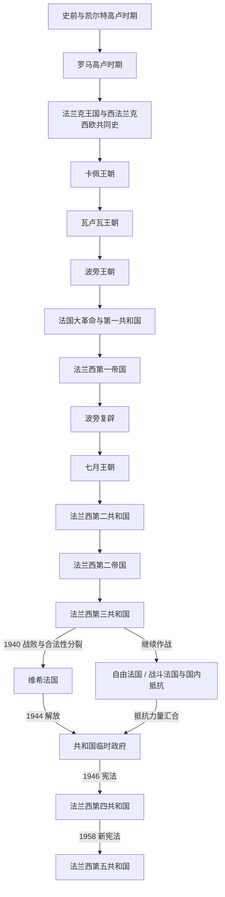

# 法国历史

[返回欧洲历史](/%E4%BA%BA%E6%96%87%E7%A7%91%E5%AD%A6/%E5%8E%86%E5%8F%B2/%E6%AC%A7%E6%B4%B2/README.md)

## 范围与对象

本目录以现代法国疆域和法国国家形成过程为主线。高卢、罗马统治和法兰克王国属于跨区域共同史，不能直接视为现代法国的线性前身；843 年后的西法兰克、987 年后的卡佩王权才逐步形成法兰西王国。海外帝国、殖民战争和去殖民化则需与被殖民地区的本地历史并读。

## 历史主线

- **高卢与罗马遗产**：史前聚落、农业扩散和铁器时代部落构成早期基础；罗马征服带来行省、城市、道路、拉丁语和基督教网络。西罗马政权消退后，政治权力并非一夜消失，而由高卢—罗马精英、教会和日耳曼军事集团重新组合。
- **法兰克共同史与王国形成**：墨洛温和加洛林法兰克王国横跨今日法国、德国、低地国家和意大利部分地区。843 年帝国分裂后，西法兰克逐渐成为法国方向的政治核心；卡佩、瓦卢瓦和波旁王朝依靠继承、司法、税收、常备军和战争扩张王权。
- **革命后的政体试验**：1789 年革命废除等级特权并重塑公民、主权和法律；1792—1870 年间，共和国、帝国和君主立宪数次更替，但中央行政、法典、男性普选和议会政治持续积累。
- **共和制度与战争危机**：第三共和国把世俗教育、议会政治和殖民扩张制度化。1940 年战败造成维希合作政权与自由法国—抵抗主线并立；共和国临时政府在解放后恢复共和合法性并实施战后改革。
- **战后国家**：第四共和国完成重建并启动欧洲一体化，却在殖民战争和军政危机中终结。第五共和国以强总统和责任政府结合的宪制延续至今；截至 2026 年 7 月，法国处于总统任期延续而国民议会无稳定绝对多数的阶段。

## 名称辨析

| 名称 | 大致时间 | 含义与法国史关系 |
|---|---|---|
| 法兰克王国 | 486—843 年为统一主线，后有分裂政权 | 横跨西欧的共同政治体，不等于现代法国 |
| 西法兰克 | 843 年以后 | 加洛林帝国西部王国，是法兰西王国的直接前身 |
| 法兰西王国 | 987 年后逐步成型，12—13 世纪称呼趋于稳定 | 以卡佩王权和法兰西岛为核心逐步整合领土，并非某一年突然完成民族国家改名 |
| 法兰西共和国 | 1792 年后分多次建立 | 各共和国并非连续同一宪制，须按第一至第五共和国分别阅读 |
| 法兰西国家 | 1940—1944 年 | 维希合作政权的正式称谓；共和国临时政府否认其共和合法继承地位 |

## 按时间排序的时期导航

| 顺序 | 名称 | 时间 | 简要概括 |
|---:|---|---|---|
| 1 | [史前与凯尔特高卢时期](/%E4%BA%BA%E6%96%87%E7%A7%91%E5%AD%A6/%E5%8E%86%E5%8F%B2/%E6%AC%A7%E6%B4%B2/%E6%B3%95%E5%9B%BD/%E5%8F%B2%E5%89%8D%E4%B8%8E%E5%87%AF%E5%B0%94%E7%89%B9%E9%AB%98%E5%8D%A2%E6%97%B6%E6%9C%9F.md) | 约前 180 万年—前 52 年 | 从早期人类、农业与冶金扩散到铁器时代高卢社会及罗马征服 |
| 2 | [罗马高卢时期](/%E4%BA%BA%E6%96%87%E7%A7%91%E5%AD%A6/%E5%8E%86%E5%8F%B2/%E6%AC%A7%E6%B4%B2/%E6%B3%95%E5%9B%BD/%E7%BD%97%E9%A9%AC%E9%AB%98%E5%8D%A2%E6%97%B6%E6%9C%9F.md) | 前 52 年—486 年 | 行省治理、城市化、拉丁化、基督教化及后期权力重组 |
| 3 | [法兰克王国阶段](/%E4%BA%BA%E6%96%87%E7%A7%91%E5%AD%A6/%E5%8E%86%E5%8F%B2/%E6%AC%A7%E6%B4%B2/_%E9%80%9A%E5%8F%B2/%E5%90%8E%E7%BD%97%E9%A9%AC%E6%97%B6%E4%BB%A3%E7%9A%84%E6%97%A5%E8%80%B3%E6%9B%BC%E8%AF%B8%E5%9B%BD/%E6%B3%95%E5%85%B0%E5%85%8B%E7%8E%8B%E5%9B%BD/README.md) | 486—987 年 | 墨洛温、加洛林和西法兰克主线，由欧洲通史统一维护 |
| 4 | [卡佩王朝](/%E4%BA%BA%E6%96%87%E7%A7%91%E5%AD%A6/%E5%8E%86%E5%8F%B2/%E6%AC%A7%E6%B4%B2/%E6%B3%95%E5%9B%BD/%E5%8D%A1%E4%BD%A9%E7%8E%8B%E6%9C%9D.md) | 987—1328 年 | 连续继承、领地扩张和司法行政制度推动王权成长 |
| 5 | [瓦卢瓦王朝](/%E4%BA%BA%E6%96%87%E7%A7%91%E5%AD%A6/%E5%8E%86%E5%8F%B2/%E6%AC%A7%E6%B4%B2/%E6%B3%95%E5%9B%BD/%E7%93%A6%E5%8D%A2%E7%93%A6%E7%8E%8B%E6%9C%9D.md) | 1328—1589 年 | 百年战争复国、领土整合、意大利战争和宗教战争 |
| 6 | [波旁王朝](/%E4%BA%BA%E6%96%87%E7%A7%91%E5%AD%A6/%E5%8E%86%E5%8F%B2/%E6%AC%A7%E6%B4%B2/%E6%B3%95%E5%9B%BD/%E6%B3%A2%E6%97%81%E7%8E%8B%E6%9C%9D.md) | 1589—1792 年 | 宗教和解、绝对君主制、欧洲霸权与财政—革命危机 |
| 7 | [法国大革命与第一共和国](/%E4%BA%BA%E6%96%87%E7%A7%91%E5%AD%A6/%E5%8E%86%E5%8F%B2/%E6%AC%A7%E6%B4%B2/%E6%B3%95%E5%9B%BD/%E6%B3%95%E5%9B%BD%E5%A4%A7%E9%9D%A9%E5%91%BD%E4%B8%8E%E7%AC%AC%E4%B8%80%E5%85%B1%E5%92%8C%E5%9B%BD.md) | 1789—1804 年 | 从君主立宪、共和国和督政府到拿破仑执政府 |
| 8 | [法兰西第一帝国](/%E4%BA%BA%E6%96%87%E7%A7%91%E5%AD%A6/%E5%8E%86%E5%8F%B2/%E6%AC%A7%E6%B4%B2/%E6%B3%95%E5%9B%BD/%E6%B3%95%E5%85%B0%E8%A5%BF%E7%AC%AC%E4%B8%80%E5%B8%9D%E5%9B%BD.md) | 1804—1814 年；1815 年 | 法典与国家制度扩散、大陆霸权、俄国失败和百日复辟 |
| 9 | [波旁复辟](/%E4%BA%BA%E6%96%87%E7%A7%91%E5%AD%A6/%E5%8E%86%E5%8F%B2/%E6%AC%A7%E6%B4%B2/%E6%B3%95%E5%9B%BD/%E6%B3%A2%E6%97%81%E5%A4%8D%E8%BE%9F.md) | 1814—1830 年 | 宪章君主制在革命遗产与保王反动之间摆动 |
| 10 | [七月王朝](/%E4%BA%BA%E6%96%87%E7%A7%91%E5%AD%A6/%E5%8E%86%E5%8F%B2/%E6%AC%A7%E6%B4%B2/%E6%B3%95%E5%9B%BD/%E4%B8%83%E6%9C%88%E7%8E%8B%E6%9C%9D.md) | 1830—1848 年 | 财产资格君主制、工业化、殖民扩张与二月革命 |
| 11 | [法兰西第二共和国](/%E4%BA%BA%E6%96%87%E7%A7%91%E5%AD%A6/%E5%8E%86%E5%8F%B2/%E6%AC%A7%E6%B4%B2/%E6%B3%95%E5%9B%BD/%E6%B3%95%E5%85%B0%E8%A5%BF%E7%AC%AC%E4%BA%8C%E5%85%B1%E5%92%8C%E5%9B%BD.md) | 1848—1852 年 | 男性普选、社会共和国冲突、总统政变 |
| 12 | [法兰西第二帝国](/%E4%BA%BA%E6%96%87%E7%A7%91%E5%AD%A6/%E5%8E%86%E5%8F%B2/%E6%AC%A7%E6%B4%B2/%E6%B3%95%E5%9B%BD/%E6%B3%95%E5%85%B0%E8%A5%BF%E7%AC%AC%E4%BA%8C%E5%B8%9D%E5%9B%BD.md) | 1852—1870 年 | 威权现代化、后期自由化与普法战争失败 |
| 13 | [法兰西第三共和国](/%E4%BA%BA%E6%96%87%E7%A7%91%E5%AD%A6/%E5%8E%86%E5%8F%B2/%E6%AC%A7%E6%B4%B2/%E6%B3%95%E5%9B%BD/%E6%B3%95%E5%85%B0%E8%A5%BF%E7%AC%AC%E4%B8%89%E5%85%B1%E5%92%8C%E5%9B%BD.md) | 1870—1940 年 | 议会共和国、世俗化、殖民帝国、一战胜利与 1940 年崩溃 |
| 14 | [维希法国、自由法国与共和国临时政府](/%E4%BA%BA%E6%96%87%E7%A7%91%E5%AD%A6/%E5%8E%86%E5%8F%B2/%E6%AC%A7%E6%B4%B2/%E6%B3%95%E5%9B%BD/%E7%BB%B4%E5%B8%8C%E6%B3%95%E5%9B%BD%E4%B8%8E%E8%87%AA%E7%94%B1%E6%B3%95%E5%9B%BD.md) | 1940—1946 年 | 占领、合作、抵抗、解放和共和合法性恢复 |
| 15 | [法兰西第四共和国](/%E4%BA%BA%E6%96%87%E7%A7%91%E5%AD%A6/%E5%8E%86%E5%8F%B2/%E6%AC%A7%E6%B4%B2/%E6%B3%95%E5%9B%BD/%E6%B3%95%E5%85%B0%E8%A5%BF%E7%AC%AC%E5%9B%9B%E5%85%B1%E5%92%8C%E5%9B%BD.md) | 1946—1958 年 | 战后重建、欧洲整合、殖民战争和五月危机 |
| 16 | [法兰西第五共和国](/%E4%BA%BA%E6%96%87%E7%A7%91%E5%AD%A6/%E5%8E%86%E5%8F%B2/%E6%AC%A7%E6%B4%B2/%E6%B3%95%E5%9B%BD/%E6%B3%95%E5%85%B0%E8%A5%BF%E7%AC%AC%E4%BA%94%E5%85%B1%E5%92%8C%E5%9B%BD.md) | 1958 年—至今 | 半总统体制、去殖民化、欧洲化、共治及碎片化议会 |

## 国家领导人专表

| 范围 | 专表 | 覆盖内容 |
|---|---|---|
| 1870—1959 年 | [法兰西第三与第四共和国国家领导人表](/%E4%BA%BA%E6%96%87%E7%A7%91%E5%AD%A6/%E5%8E%86%E5%8F%B2/%E6%AC%A7%E6%B4%B2/%E6%B3%95%E5%9B%BD/%E6%B3%95%E5%85%B0%E8%A5%BF%E7%AC%AC%E4%B8%89%E4%B8%8E%E7%AC%AC%E5%9B%9B%E5%85%B1%E5%92%8C%E5%9B%BD%E5%9B%BD%E5%AE%B6%E9%A2%86%E5%AF%BC%E4%BA%BA%E8%A1%A8.md) | 第三、第四共和国全部国家元首和政府首脑，以及实际权力结构 |
| 1959 年—至今 | [法兰西第五共和国总统与总理表](/%E4%BA%BA%E6%96%87%E7%A7%91%E5%AD%A6/%E5%8E%86%E5%8F%B2/%E6%AC%A7%E6%B4%B2/%E6%B3%95%E5%9B%BD/%E6%B3%95%E5%85%B0%E8%A5%BF%E7%AC%AC%E4%BA%94%E5%85%B1%E5%92%8C%E5%9B%BD%E6%80%BB%E7%BB%9F%E4%B8%8E%E6%80%BB%E7%90%86%E8%A1%A8.md) | 全部总统、代理总统和总理；现状核验截至 2026 年 7 月 14 日 |

## 重要转折与时间节点

| 时间 | 转折 | 意义与入口 |
|---|---|---|
| 前 52 年 | 阿莱西亚战役与罗马征服完成 | 高卢纳入罗马行省体系，见[罗马高卢时期](/%E4%BA%BA%E6%96%87%E7%A7%91%E5%AD%A6/%E5%8E%86%E5%8F%B2/%E6%AC%A7%E6%B4%B2/%E6%B3%95%E5%9B%BD/%E7%BD%97%E9%A9%AC%E9%AB%98%E5%8D%A2%E6%97%B6%E6%9C%9F.md) |
| 486 年 | 克洛维击败苏瓦松政权 | 法兰克人取得北高卢核心，见[法兰克王国](/%E4%BA%BA%E6%96%87%E7%A7%91%E5%AD%A6/%E5%8E%86%E5%8F%B2/%E6%AC%A7%E6%B4%B2/_%E9%80%9A%E5%8F%B2/%E5%90%8E%E7%BD%97%E9%A9%AC%E6%97%B6%E4%BB%A3%E7%9A%84%E6%97%A5%E8%80%B3%E6%9B%BC%E8%AF%B8%E5%9B%BD/%E6%B3%95%E5%85%B0%E5%85%8B%E7%8E%8B%E5%9B%BD/README.md) |
| 843 年 | 《凡尔登条约》 | 西法兰克形成，见[西法兰克王国](/%E4%BA%BA%E6%96%87%E7%A7%91%E5%AD%A6/%E5%8E%86%E5%8F%B2/%E6%AC%A7%E6%B4%B2/_%E9%80%9A%E5%8F%B2/%E5%90%8E%E7%BD%97%E9%A9%AC%E6%97%B6%E4%BB%A3%E7%9A%84%E6%97%A5%E8%80%B3%E6%9B%BC%E8%AF%B8%E5%9B%BD/%E6%B3%95%E5%85%B0%E5%85%8B%E7%8E%8B%E5%9B%BD/%E8%A5%BF%E6%B3%95%E5%85%B0%E5%85%8B%E7%8E%8B%E5%9B%BD.md) |
| 987 年 | 雨果·卡佩即位 | 王朝连续继承主线开启，见[卡佩王朝](/%E4%BA%BA%E6%96%87%E7%A7%91%E5%AD%A6/%E5%8E%86%E5%8F%B2/%E6%AC%A7%E6%B4%B2/%E6%B3%95%E5%9B%BD/%E5%8D%A1%E4%BD%A9%E7%8E%8B%E6%9C%9D.md) |
| 1337—1453 年 | 百年战争 | 王位、封地和国家能力竞争重塑法国，见[瓦卢瓦王朝](/%E4%BA%BA%E6%96%87%E7%A7%91%E5%AD%A6/%E5%8E%86%E5%8F%B2/%E6%AC%A7%E6%B4%B2/%E6%B3%95%E5%9B%BD/%E7%93%A6%E5%8D%A2%E7%93%A6%E7%8E%8B%E6%9C%9D.md) |
| 1598 年 | 《南特敕令》 | 宗教战争核心阶段结束，见[波旁王朝](/%E4%BA%BA%E6%96%87%E7%A7%91%E5%AD%A6/%E5%8E%86%E5%8F%B2/%E6%AC%A7%E6%B4%B2/%E6%B3%95%E5%9B%BD/%E6%B3%A2%E6%97%81%E7%8E%8B%E6%9C%9D.md) |
| 1789—1792 年 | 大革命与王政废除 | 主权、等级和公民秩序改造，见[法国大革命与第一共和国](/%E4%BA%BA%E6%96%87%E7%A7%91%E5%AD%A6/%E5%8E%86%E5%8F%B2/%E6%AC%A7%E6%B4%B2/%E6%B3%95%E5%9B%BD/%E6%B3%95%E5%9B%BD%E5%A4%A7%E9%9D%A9%E5%91%BD%E4%B8%8E%E7%AC%AC%E4%B8%80%E5%85%B1%E5%92%8C%E5%9B%BD.md) |
| 1804 年 | 拿破仑称帝 | 共和国转为帝国，革命法制与战争扩张结合 |
| 1815 年 | 滑铁卢与第二次复辟 | 拿破仑帝国终结，欧洲协调体系形成 |
| 1848 年 | 二月革命与男性普选 | 七月王朝终结，第二共和国建立 |
| 1870—1875 年 | 第二帝国战败与共和国定型 | 法国最终转向持久共和制度 |
| 1905 年 | 政教分离法 | 奠定现代世俗公共权力原则 |
| 1940 年 | 战败与合法性分裂 | 维希合作政权和自由法国—抵抗主线并立 |
| 1944—1946 年 | 解放、临时政府和新宪法 | 恢复共和国并建立战后社会制度 |
| 1958—1962 年 | 第五共和国与总统直选 | 强化行政权和总统直接民主授权 |
| 1962 年 | 阿尔及利亚独立 | 法国殖民帝国核心解体并引发人口迁移和记忆政治 |
| 1986 年 | 首次左右共治 | 验证双首长制在多数分裂时的运作 |
| 2022—2026 年 | 无绝对多数与政府更替 | 议会谈判、不信任案和预算成为制度运行中心 |

## 共同史与跨区域入口

| 主题 | 规范入口 |
|---|---|
| 罗马世界与高卢行省 | [古罗马](/%E4%BA%BA%E6%96%87%E7%A7%91%E5%AD%A6/%E5%8E%86%E5%8F%B2/%E6%AC%A7%E6%B4%B2/_%E9%80%9A%E5%8F%B2/%E5%8F%A4%E7%BD%97%E9%A9%AC/README.md) |
| 西罗马之后的日耳曼诸国 | [后罗马时代的日耳曼诸国](/%E4%BA%BA%E6%96%87%E7%A7%91%E5%AD%A6/%E5%8E%86%E5%8F%B2/%E6%AC%A7%E6%B4%B2/_%E9%80%9A%E5%8F%B2/%E5%90%8E%E7%BD%97%E9%A9%AC%E6%97%B6%E4%BB%A3%E7%9A%84%E6%97%A5%E8%80%B3%E6%9B%BC%E8%AF%B8%E5%9B%BD/README.md) |
| 墨洛温—加洛林—西法兰克 | [法兰克王国](/%E4%BA%BA%E6%96%87%E7%A7%91%E5%AD%A6/%E5%8E%86%E5%8F%B2/%E6%AC%A7%E6%B4%B2/_%E9%80%9A%E5%8F%B2/%E5%90%8E%E7%BD%97%E9%A9%AC%E6%97%B6%E4%BB%A3%E7%9A%84%E6%97%A5%E8%80%B3%E6%9B%BC%E8%AF%B8%E5%9B%BD/%E6%B3%95%E5%85%B0%E5%85%8B%E7%8E%8B%E5%9B%BD/README.md)、[墨洛温王朝](/%E4%BA%BA%E6%96%87%E7%A7%91%E5%AD%A6/%E5%8E%86%E5%8F%B2/%E6%AC%A7%E6%B4%B2/_%E9%80%9A%E5%8F%B2/%E5%90%8E%E7%BD%97%E9%A9%AC%E6%97%B6%E4%BB%A3%E7%9A%84%E6%97%A5%E8%80%B3%E6%9B%BC%E8%AF%B8%E5%9B%BD/%E6%B3%95%E5%85%B0%E5%85%8B%E7%8E%8B%E5%9B%BD/%E5%A2%A8%E6%B4%9B%E6%B8%A9%E7%8E%8B%E6%9C%9D.md)、[加洛林王朝](/%E4%BA%BA%E6%96%87%E7%A7%91%E5%AD%A6/%E5%8E%86%E5%8F%B2/%E6%AC%A7%E6%B4%B2/_%E9%80%9A%E5%8F%B2/%E5%90%8E%E7%BD%97%E9%A9%AC%E6%97%B6%E4%BB%A3%E7%9A%84%E6%97%A5%E8%80%B3%E6%9B%BC%E8%AF%B8%E5%9B%BD/%E6%B3%95%E5%85%B0%E5%85%8B%E7%8E%8B%E5%9B%BD/%E5%8A%A0%E6%B4%9B%E6%9E%97%E7%8E%8B%E6%9C%9D.md)、[西法兰克王国](/%E4%BA%BA%E6%96%87%E7%A7%91%E5%AD%A6/%E5%8E%86%E5%8F%B2/%E6%AC%A7%E6%B4%B2/_%E9%80%9A%E5%8F%B2/%E5%90%8E%E7%BD%97%E9%A9%AC%E6%97%B6%E4%BB%A3%E7%9A%84%E6%97%A5%E8%80%B3%E6%9B%BC%E8%AF%B8%E5%9B%BD/%E6%B3%95%E5%85%B0%E5%85%8B%E7%8E%8B%E5%9B%BD/%E8%A5%BF%E6%B3%95%E5%85%B0%E5%85%8B%E7%8E%8B%E5%9B%BD.md) |
| 英法王权、百年战争 | [英格兰](/%E4%BA%BA%E6%96%87%E7%A7%91%E5%AD%A6/%E5%8E%86%E5%8F%B2/%E6%AC%A7%E6%B4%B2/%E4%B8%8D%E5%88%97%E9%A2%A0%E7%BE%A4%E5%B2%9B/%E8%8B%B1%E6%A0%BC%E5%85%B0/README.md)、[不列颠群岛](/%E4%BA%BA%E6%96%87%E7%A7%91%E5%AD%A6/%E5%8E%86%E5%8F%B2/%E6%AC%A7%E6%B4%B2/%E4%B8%8D%E5%88%97%E9%A2%A0%E7%BE%A4%E5%B2%9B/README.md) |
| 意大利战争、帝国和欧洲均势 | [意大利](/%E4%BA%BA%E6%96%87%E7%A7%91%E5%AD%A6/%E5%8E%86%E5%8F%B2/%E6%AC%A7%E6%B4%B2/%E6%84%8F%E5%A4%A7%E5%88%A9/README.md)、[神圣罗马帝国](/%E4%BA%BA%E6%96%87%E7%A7%91%E5%AD%A6/%E5%8E%86%E5%8F%B2/%E6%AC%A7%E6%B4%B2/%E5%BE%B7%E6%84%8F%E5%BF%97/%E7%A5%9E%E5%9C%A3%E7%BD%97%E9%A9%AC%E5%B8%9D%E5%9B%BD/README.md)、[德意志](/%E4%BA%BA%E6%96%87%E7%A7%91%E5%AD%A6/%E5%8E%86%E5%8F%B2/%E6%AC%A7%E6%B4%B2/%E5%BE%B7%E6%84%8F%E5%BF%97/README.md) |
| 革命、拿破仑与欧洲共同史 | [欧洲通史](/%E4%BA%BA%E6%96%87%E7%A7%91%E5%AD%A6/%E5%8E%86%E5%8F%B2/%E6%AC%A7%E6%B4%B2/_%E9%80%9A%E5%8F%B2/README.md) |
| 两次世界大战 | [两次世界大战](/%E4%BA%BA%E6%96%87%E7%A7%91%E5%AD%A6/%E5%8E%86%E5%8F%B2/_%E9%80%9A%E5%8F%B2/%E4%B8%A4%E6%AC%A1%E4%B8%96%E7%95%8C%E5%A4%A7%E6%88%98.md) |
| 冷战与全球非殖民化 | [冷战、非殖民化与全球化](/%E4%BA%BA%E6%96%87%E7%A7%91%E5%AD%A6/%E5%8E%86%E5%8F%B2/_%E9%80%9A%E5%8F%B2/%E5%86%B7%E6%88%98%E3%80%81%E9%9D%9E%E6%AE%96%E6%B0%91%E5%8C%96%E4%B8%8E%E5%85%A8%E7%90%83%E5%8C%96.md) |

## 帝国、殖民与去殖民化入口

| 阶段 | 法国侧观察点 | 被殖民地区入口 |
|---|---|---|
| 17—18 世纪大西洋帝国 | 新法兰西、加勒比种植园、奴隶贸易与帝国竞争 | [原住民社会与新法兰西](/%E4%BA%BA%E6%96%87%E7%A7%91%E5%AD%A6/%E5%8E%86%E5%8F%B2/%E7%BE%8E%E6%B4%B2/%E5%8C%97%E7%BE%8E/%E5%8A%A0%E6%8B%BF%E5%A4%A7/%E5%8E%9F%E4%BD%8F%E6%B0%91%E7%A4%BE%E4%BC%9A%E4%B8%8E%E6%96%B0%E6%B3%95%E5%85%B0%E8%A5%BF.md)、[海地革命与法属加勒比](/%E4%BA%BA%E6%96%87%E7%A7%91%E5%AD%A6/%E5%8E%86%E5%8F%B2/%E7%BE%8E%E6%B4%B2/%E5%8A%A0%E5%8B%92%E6%AF%94/%E6%B5%B7%E5%9C%B0%E9%9D%A9%E5%91%BD%E4%B8%8E%E6%B3%95%E5%B1%9E%E5%8A%A0%E5%8B%92%E6%AF%94.md) |
| 19—20 世纪初第二殖民帝国 | 阿尔及利亚定居殖民、法属非洲和法属印度支那 | [阿尔及利亚历史](/%E4%BA%BA%E6%96%87%E7%A7%91%E5%AD%A6/%E5%8E%86%E5%8F%B2/%E5%8C%97%E9%9D%9E/%E9%98%BF%E5%B0%94%E5%8F%8A%E5%88%A9%E4%BA%9A/README.md)、[西非历史](/%E4%BA%BA%E6%96%87%E7%A7%91%E5%AD%A6/%E5%8E%86%E5%8F%B2/%E9%9D%9E%E6%B4%B2/%E8%A5%BF%E9%9D%9E/README.md)、[阮朝与法属印度支那](/%E4%BA%BA%E6%96%87%E7%A7%91%E5%AD%A6/%E5%8E%86%E5%8F%B2/%E4%B8%9C%E5%8D%97%E4%BA%9A/%E8%B6%8A%E5%8D%97/%E9%98%AE%E6%9C%9D%E4%B8%8E%E6%B3%95%E5%B1%9E%E5%8D%B0%E5%BA%A6%E6%94%AF%E9%82%A3.md) |
| 1945 年后去殖民化 | 印度支那战争、阿尔及利亚战争与海外领地重组 | [独立战争与现代阿尔及利亚](/%E4%BA%BA%E6%96%87%E7%A7%91%E5%AD%A6/%E5%8E%86%E5%8F%B2/%E5%8C%97%E9%9D%9E/%E9%98%BF%E5%B0%94%E5%8F%8A%E5%88%A9%E4%BA%9A/%E7%8B%AC%E7%AB%8B%E6%88%98%E4%BA%89%E4%B8%8E%E7%8E%B0%E4%BB%A3%E9%98%BF%E5%B0%94%E5%8F%8A%E5%88%A9%E4%BA%9A.md)、[独立战争、分裂与统一](/%E4%BA%BA%E6%96%87%E7%A7%91%E5%AD%A6/%E5%8E%86%E5%8F%B2/%E4%B8%9C%E5%8D%97%E4%BA%9A/%E8%B6%8A%E5%8D%97/%E7%8B%AC%E7%AB%8B%E6%88%98%E4%BA%89%E3%80%81%E5%88%86%E8%A3%82%E4%B8%8E%E7%BB%9F%E4%B8%80.md) |
