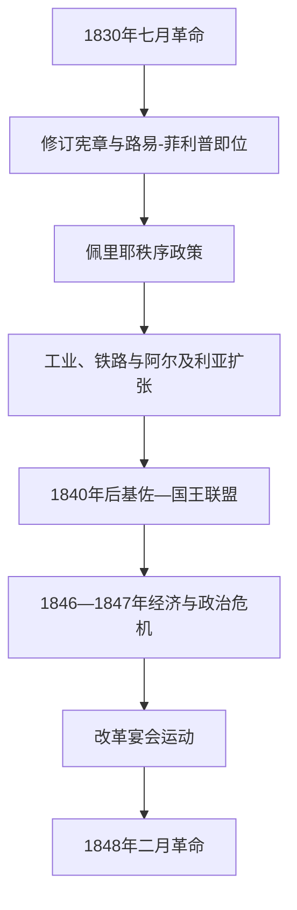

# 七月王朝

## 时间

1830—1848年

## 别称

奥尔良王朝、七月君主制

## 概括

1830年七月革命推翻查理十世后，议会自由派为避免共和国和外国干预，拥立波旁—奥尔良支系的路易-菲利普。“法国人的国王”称号、三色旗和修订宪章强调国民契约，取消国王以普通法令暂停法律的空间，并稍微扩大选民；但政权仍由不足成年男性一小部分的高额纳税选民控制。

七月王朝见证银行、铁路、煤铁、城市工业和阿尔及利亚征服扩张，也经历工人起义、共和密谋和政治刺杀。路易-菲利普借议会派系和个人外交维持十八年，基佐1840年后以“不改革”保持多数。1846—1847年歉收、经济危机和腐败丑闻让选举改革成为社会不满焦点；政府禁止改革宴会后，1848年2月巴黎示威、军队开火与国民自卫军倒戈迅速瓦解王朝。

## 演进图

## 君主世系

| 顺序 | 君主 | 在位 | 王室 | 关键说明 |
|---:|---|---|---|---|
| 1 | **路易-菲利普一世** | 1830年8月9日—1848年2月24日 | 波旁—奥尔良支系 | 七月王朝唯一君主；称“法国人的国王”，革命中退位并流亡英国。 |

王储奥尔良公爵费迪南-菲利普1842年意外去世，继承人巴黎伯爵尚幼。1848年退位时，奥尔良公爵夫人海伦试图以儿子名义建立摄政，但议会和街头已转向共和国，未形成实际统治。

## 统治结构

| 权力中心 | 角色 | 实际运行 |
|---|---|---|
| 国王 | 任命大臣、外交军权、解散众议院 | 路易-菲利普积极影响组阁和外交，不是纯礼仪君主。 |
| 贵族院 | 终身任命成员审议法律 | 1830年后取消世袭贵族席位。 |
| 众议院 | 预算、法律和支持政府 | 财产资格选举；选民由约十万扩大到约二十余万，仍排除绝大多数男性与全部女性。 |
| 政府首脑与部长 | 需要国王信任及众院多数 | 议会派系个人化，国王可在梯也尔、苏尔特、基佐等人间平衡。 |
| 国民自卫军 | 城市秩序和中产公民武装 | 1830年支持新王朝，1848年部分拒绝镇压改革派。 |

## 历届政府首脑

| 顺序 | 政府首脑 | 任期 | 关键事件 |
|---:|---|---|---|
| 1 | 雅克·拉菲特 | 1830—1831年 | “运动派”自由主义者，支持欧洲革命但同国王分歧。 |
| 2 | 卡西米尔·佩里耶 | 1831—1832年 | 强硬恢复秩序，镇压里昂丝织工起义；死于霍乱。 |
| 3 | 苏尔特元帅 | 1832—1834年、1839—1840年、1840—1847年 | 多次任首相；后期多由基佐主导政策。 |
| 4 | 热拉尔元帅 | 1834年 | 短期政府。 |
| 5 | 巴萨诺公爵马雷 | 1834年 | “三日内阁”，未获议会支持。 |
| 6 | 莫蒂埃元帅 | 1834—1835年 | 遭遇菲耶斯基刺杀案时期。 |
| 7 | 布罗伊公爵 | 1835—1836年 | 保守自由派政府。 |
| 8 | 阿道夫·梯也尔 | 1836年、1840年 | 倾向积极外交；1840年东方危机后被国王解职。 |
| 9 | 莫莱伯爵 | 1836—1839年 | 依赖国王支持，面对议会联合反对。 |
| 10 | **弗朗索瓦·基佐** | 1840年起实际主导、1847—1848年正式首相 | 维护狭窄选举制度，反对改革，二月革命前辞职。 |

1848年2月危机中，莫莱、梯也尔等曾被短暂召请组阁，但未能建立可运作政府，不列为稳定任期。

## 发展过程与重要事件

| 时间 | 事件 | 影响 |
|---|---|---|
| 1830年8月 | 修订宪章与路易-菲利普即位 | 主权语言由神授转向国民契约，但普选未实现。 |
| 1830—1831年 | 承认比利时独立 | 在列强协调下避免大规模欧洲战争。 |
| 1831、1834年 | 里昂丝织工起义 | 工资与劳动组织问题显现，军队镇压。 |
| 1832年 | 巴黎共和起义 | 王朝击败共和派，但城市激进政治延续。 |
| 1835年 | 菲耶斯基刺杀案与九月法令 | 国王幸存，政府加强新闻与共和组织管制。 |
| 1830—1847年 | 阿尔及利亚征服扩大 | 比若等采取高强度殖民战争，不能只视为法国领土增长。 |
| 1840年 | 东方危机 | 法国在埃及—奥斯曼问题上被孤立，梯也尔下台。 |
| 1842年 | 铁路法与王储死亡 | 国家—私人合作加速铁路建设，继承稳定性同时下降。 |
| 1846—1847年 | 粮食、金融和就业危机 | 面包价格和失业上升，政治改革诉求社会化。 |
| 1847年 | 改革宴会运动 | 反对派绕过集会禁令推动扩大选举权。 |
| 1848年2月 | 禁止宴会、示威与枪击 | 基佐辞职未平息危机，路易-菲利普退位，共和国宣布。 |

## 鼎盛与覆亡原因

- **维持条件**：资产阶级、官僚、军官和部分旧贵族接受宪章秩序；经济增长、和平外交和国王的派系操作提供稳定。
- **结构压力**：纳税资格把工人、农民、小资产者和多数中产排除在政治外；议员兼任官职和商业利益产生腐败观感。
- **社会经济压力**：工业化扩大财富也造成劳动冲突；1846年歉收、铁路投机收缩和失业把政治不满推向街头。
- **外部与殖民因素**：对外谨慎避免欧洲战争，但1840年孤立损伤民族声望；阿尔及利亚战争耗费资源并实施暴力殖民。
- **直接触发**：政府拒绝温和扩大选举权并禁止2月22日宴会；士兵枪击示威者后，街垒和国民自卫军倒戈使内阁更替失效。
- **灭亡过程**：国王退位给年幼孙子，摄政方案未获议会和群众承认，临时政府在市政厅宣布第二共和国。

## 演变关系

- 前一节点：[波旁复辟](/%E4%BA%BA%E6%96%87%E7%A7%91%E5%AD%A6/%E5%8E%86%E5%8F%B2/%E6%AC%A7%E6%B4%B2/%E6%B3%95%E5%9B%BD/%E6%B3%A2%E6%97%81%E5%A4%8D%E8%BE%9F.md)。
- 后一节点：[法兰西第二共和国](/%E4%BA%BA%E6%96%87%E7%A7%91%E5%AD%A6/%E5%8E%86%E5%8F%B2/%E6%AC%A7%E6%B4%B2/%E6%B3%95%E5%9B%BD/%E6%B3%95%E5%85%B0%E8%A5%BF%E7%AC%AC%E4%BA%8C%E5%85%B1%E5%92%8C%E5%9B%BD.md)。
- 所属总览：[法国历史](/%E4%BA%BA%E6%96%87%E7%A7%91%E5%AD%A6/%E5%8E%86%E5%8F%B2/%E6%AC%A7%E6%B4%B2/%E6%B3%95%E5%9B%BD/README.md)。
