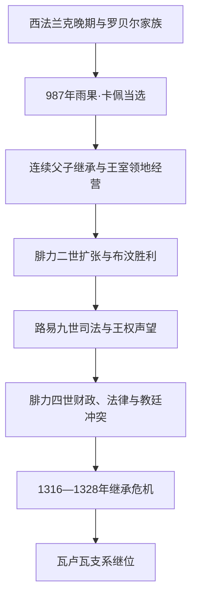

# 卡佩王朝

## 时间

987—1328年

## 别称

卡佩直系、法兰西王国形成期

## 概括

987年西法兰克加洛林王系失去稳定继承人后，大贵族和教会推举法兰西公爵雨果·卡佩为王。早期卡佩国王的直属领地主要在巴黎—奥尔良一带，诺曼底、安茹、阿基坦、佛兰德和图卢兹等诸侯远比王室富强。王朝并非凭一次征服建立中央集权，而是依靠父子连续继承、提前加冕、教会合法性、婚姻、没收封地、购买领地、司法上诉和战争，用三百余年把脆弱王权转化为法兰西王国的制度中心。

腓力二世时期夺取金雀花家族在法国北部的大部分领地，1214年布汶战役巩固成果；路易九世以王室司法、调查官和仲裁声望强化合法性；腓力四世扩展税收、法律家官僚和三级会议，却同教廷、圣殿骑士及各社会群体发生激烈冲突。1316—1328年的连续继承危机使卡佩直系男性断绝，瓦卢瓦支系继位。王朝并非被外敌灭亡，而是由同宗旁支在既有国家框架内承接。

## 王朝演进图

## 建立背景与崛起机制

10世纪西法兰克王位在加洛林家族和罗贝尔家族之间竞争，国王需要诸侯与兰斯教会支持。987年路易五世死后，兰斯大主教阿达尔贝隆反对加洛林旁支洛林的查理，支持雨果·卡佩。雨果随即让儿子罗贝尔共同加冕，以减少再次选举的不确定性。此后多代国王在生前为继承人加冕，直到世袭已被默认。

卡佩王权的增长有几项相互强化的机制：

- 王室核心领地位于塞纳河和卢瓦尔河交通带，巴黎、奥尔良和圣但尼提供财政、宗教与象征资源。
- 国王以“最高封君”和受膏者身份处理诸侯争端，王室法院逐步成为上诉中心。
- 无嗣没收、婚姻、购买及征服把诺曼底、安茹、图赖讷等纳入王领；新领地由总管、司法官和地方官管理。
- 与教会和城市的合作削弱盘踞地方城堡的领主，也为文书、教育和法学官僚提供人才。
- 从“法兰克人的国王”到“法兰西国王”的称号变化反映领土王权增长，但不是987年突然完成的民族国家改名。

## 分阶段发展

### 王朝巩固（987—1108年）

雨果·卡佩、罗贝尔二世、亨利一世和腓力一世主要任务是保持王位在父子间传递。王室在直属领地外控制有限，还要面对诺曼底公爵、安茹伯爵和布卢瓦家族。1066年诺曼底公爵威廉征服英格兰后，英王同时是法王封臣，双方身份不对称成为后来英法长期冲突的根源。

### 法兰西岛王权与金雀花挑战（1108—1180年）

路易六世与圣但尼院长叙热打击王领内城堡领主，强化道路和教会保护。路易七世参加第二次十字军，并同阿基坦的埃莉诺离婚；埃莉诺随后嫁给安茹伯爵亨利，后者成为英王亨利二世，形成从英格兰到法国西部的“安茹帝国”。王室领地一度远小于英王在法封地，但法王仍拥有封建法理上的最高地位。

### 腓力二世与领土突破（1180—1223年）

腓力二世利用金雀花家族内斗，以封臣不履行义务为由没收约翰王封地，1204年前后取得诺曼底、安茹、曼恩和图赖讷。1214年布汶战役中，法王军击败神圣罗马皇帝、佛兰德伯爵和英王盟军，既巩固领土，也提高王权与巴黎的政治声望。王室开始更系统使用司法官、总管、账目和档案管理新领地。

### 圣路易与制度化（1223—1285年）

路易八世继续阿尔比十字军背景下的南方扩张；1229年巴黎条约为图卢兹领地最终并入王室铺路。路易九世成年后派调查官纠正地方官滥权，发展王室法院和书面司法，以仲裁欧洲君主争端建立“圣王”形象。他两次发动十字军，最终于1270年在突尼斯病逝，显示宗教声望与军事冒险并存。

### 腓力四世与继承危机（1285—1328年）

腓力四世为对英格兰、佛兰德作战扩大货币操作和对教士、犹太社群及商业群体征税。1302年金马刺战役受挫，同年召开三级会议争取社会等级支持；他与教皇博尼法斯八世冲突，并在1307年打击圣殿骑士团。国家文书和法律论证增强，却也引发财政与合法性争议。

路易十世死后，其遗腹子约翰一世仅存活数日，腓力五世取得王位；腓力五世和查理四世又均无存活男性继承人。1328年诸侯选择腓力四世侄子、瓦卢瓦的腓力，而非经女性血缘提出权利的英王爱德华三世。后来被概括为“萨利克继承原则”的规则在争议中逐步制度化，并成为百年战争的王位背景。

## 完整君主世系

| 顺序 | 君主 | 在位 | 生卒 | 与前任关系 | 关键事件与备注 |
|---:|---|---|---|---|---|
| 1 | **雨果·卡佩** | 987—996年 | 约940—996年 | 开国君主；罗贝尔家族 | 经贵族与教会推举即位，并让儿子共同加冕。 |
| 2 | 罗贝尔二世 | 996—1031年 | 约972—1031年 | 雨果之子 | 早在987年共同加冕，巩固世袭惯例。 |
| 3 | 亨利一世 | 1031—1060年 | 约1008—1060年 | 罗贝尔二世之子 | 诸侯强盛，依靠联盟维持王领。 |
| 4 | 腓力一世 | 1060—1108年 | 1052—1108年 | 亨利一世之子 | 幼年即位；同诺曼、佛兰德和教会周旋。 |
| 5 | 路易六世 | 1108—1137年 | 1081—1137年 | 腓力一世之子 | 整顿法兰西岛王领，与叙热合作。 |
| 6 | 路易七世 | 1137—1180年 | 1120—1180年 | 路易六世之子 | 第二次十字军；与埃莉诺离婚后金雀花势力扩大。 |
| 7 | **腓力二世** | 1180—1223年 | 1165—1223年 | 路易七世之子 | 夺取诺曼底等地，1214年布汶胜利；“法兰西国王”用法稳定。 |
| 8 | 路易八世 | 1223—1226年 | 1187—1226年 | 腓力二世之子 | 延续对英战争和南方扩张。 |
| 9 | **路易九世** | 1226—1270年 | 1214—1270年 | 路易八世之子 | 幼年由卡斯蒂利亚的布兰卡摄政；司法改革、两次十字军，后封圣。 |
| 10 | 腓力三世 | 1270—1285年 | 1245—1285年 | 路易九世之子 | 扩展王室继承，阿拉贡十字军中病逝。 |
| 11 | 腓力四世 | 1285—1314年 | 1268—1314年 | 腓力三世之子 | 强化财政与法律官僚，对抗教廷并打击圣殿骑士。 |
| 12 | 路易十世 | 1314—1316年 | 1289—1316年 | 腓力四世长子 | 其死引发王位与女性继承争议。 |
| 13 | 约翰一世 | 1316年 | 1316年 | 路易十世遗腹子 | 出生即为王，五日后夭折；由叔父腓力摄政。 |
| 14 | 腓力五世 | 1316—1322年 | 1293—1322年 | 路易十世之弟、约翰一世之叔 | 排除路易十世之女让娜继承法国王位。 |
| 15 | 查理四世 | 1322—1328年 | 1294—1328年 | 腓力五世之弟 | 无存活男嗣，卡佩直系男性终结。 |

## 统治结构

| 机构 | 演变 | 作用 |
|---|---|---|
| 国王与王室领地 | 由小型王领扩展为全国最大领地主体 | 国王同时依靠封建权利、神圣加冕和领地收入。 |
| 王室会议 | 大贵族与主教会议逐渐分化出专业法律、财政人员 | 形成最高法院、审计和政策咨询的制度基础。 |
| 地方官 | 王室司法官、总管、南部地方长官 | 监督司法、征收和军役，但会受地方利益和交通条件限制。 |
| 教会 | 兰斯加冕、圣但尼象征、修道院和主教网络 | 提供合法性与文书人才；国王也不断争夺任命和税收。 |
| 三级会议 | 1302年起按需要召集教士、贵族和城市代表 | 不是常设议会，主要用于财政与政治动员。 |
| 城市与特许状 | 王室确认公社、市场和城市自由 | 城市可成为税源及对抗地方领主的盟友。 |

## 重要事件

| 时间 | 事件 | 影响 |
|---|---|---|
| 987年 | 雨果·卡佩当选并安排罗贝尔共同加冕 | 建立王朝并降低选举王权的不确定性。 |
| 1066年 | 诺曼征服英格兰 | 英王在法国拥有大片封地，形成长期英法权利冲突。 |
| 1137—1152年 | 路易七世与阿基坦的埃莉诺婚姻及离婚 | 阿基坦转入金雀花网络，王室面临“安茹帝国”。 |
| 1204年 | 腓力二世取得诺曼底 | 王室领地和财政能力跃升。 |
| 1214年 | 布汶战役 | 击败跨国联盟，确认北法领土成果。 |
| 1229年 | 巴黎条约 | 图卢兹继承安排推动南法纳入王室。 |
| 1259年 | 巴黎条约 | 英王保有部分阿基坦但向法王行封臣礼，矛盾未消。 |
| 1270年 | 路易九世死于突尼斯 | 十字军理想与王权声望的转折。 |
| 1302年 | 三级会议与金马刺战役 | 王权寻求国内动员，同时在佛兰德受挫。 |
| 1307年 | 逮捕圣殿骑士 | 财政、司法与教廷政治交织。 |
| 1316—1328年 | 三次继承危机 | 男系继承原则强化，瓦卢瓦旁支承接王位。 |

## 鼎盛、压力与王朝终结

- **鼎盛条件**：连续继承避免长期内战；巴黎交通和教会资源支撑王室；金雀花内部冲突让腓力二世取得领土；法律家和地方官把征服转化为财政司法控制。
- **结构压力**：战争、十字军和宫廷需要不断扩大征税；新领地语言法律多样，中央执行仍依靠地方精英；王权扩张会激起佛兰德城市、教士与诸侯抵抗。
- **外部压力**：英王兼法王封臣的双重身份、帝国和佛兰德联盟、教廷冲突长期存在。
- **直接终结**：查理四世无男嗣，而王国政治精英拒绝通过女性血缘让英王继承。瓦卢瓦并非推翻卡佩国家，而是卡佩旁支的王朝更替。
- **历史后果**：王位争议与英王在阿基坦的封地问题共同引向[瓦卢瓦王朝](/%E4%BA%BA%E6%96%87%E7%A7%91%E5%AD%A6/%E5%8E%86%E5%8F%B2/%E6%AC%A7%E6%B4%B2/%E6%B3%95%E5%9B%BD/%E7%93%A6%E5%8D%A2%E7%93%A6%E7%8E%8B%E6%9C%9D.md)时期的百年战争。

## 演变关系

- 前一节点：[西法兰克王国](/%E4%BA%BA%E6%96%87%E7%A7%91%E5%AD%A6/%E5%8E%86%E5%8F%B2/%E6%AC%A7%E6%B4%B2/_%E9%80%9A%E5%8F%B2/%E5%90%8E%E7%BD%97%E9%A9%AC%E6%97%B6%E4%BB%A3%E7%9A%84%E6%97%A5%E8%80%B3%E6%9B%BC%E8%AF%B8%E5%9B%BD/%E6%B3%95%E5%85%B0%E5%85%8B%E7%8E%8B%E5%9B%BD/%E8%A5%BF%E6%B3%95%E5%85%B0%E5%85%8B%E7%8E%8B%E5%9B%BD.md)。
- 后一节点：[瓦卢瓦王朝](/%E4%BA%BA%E6%96%87%E7%A7%91%E5%AD%A6/%E5%8E%86%E5%8F%B2/%E6%AC%A7%E6%B4%B2/%E6%B3%95%E5%9B%BD/%E7%93%A6%E5%8D%A2%E7%93%A6%E7%8E%8B%E6%9C%9D.md)。
- 所属总览：[法国历史](/%E4%BA%BA%E6%96%87%E7%A7%91%E5%AD%A6/%E5%8E%86%E5%8F%B2/%E6%AC%A7%E6%B4%B2/%E6%B3%95%E5%9B%BD/README.md)。
