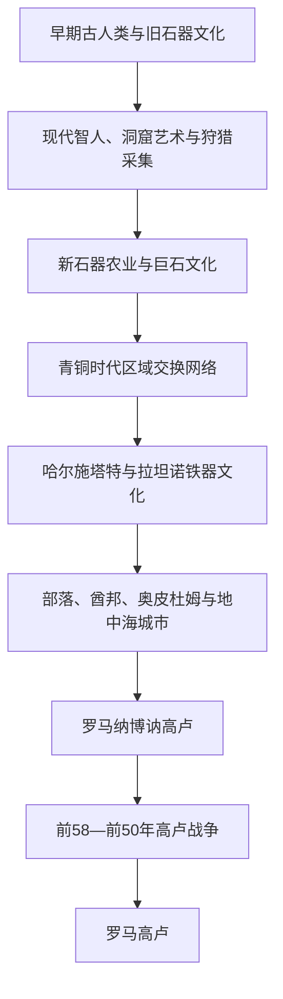

# 史前与凯尔特高卢时期

## 时间

约前180万年—前52年（罗马征服在前51—前50年仍有收尾战事）

## 别称

史前法国、罗马征服前的高卢

## 概括

现代法国疆域在史前时期并非单一文化区，更不存在“法国人”的连续民族共同体。阿尔卑斯、地中海、莱茵河、大西洋和比利牛斯之间的不同生态带，先后经历古人类活动、现代智人迁入、农业传播、巨石文化、青铜交换网络以及铁器时代部落社会。所谓“高卢人”是希腊、罗马作者对多个语言和政治共同体的概括，其中凯尔特语群占重要地位，但巴斯克语先民、利古里亚人、伊比利亚相关群体和希腊殖民城市同样构成区域历史。

前2世纪罗马已控制地中海沿岸；凯撒在前58—前50年利用部落矛盾、罗马同盟和军事优势征服其余高卢。前52年阿莱西亚失败是决定性转折，却不是全部抵抗的最后一天，也不意味着人口被整体替换。

## 演进图

## 社会与政治结构

| 阶段 | 社会组织 | 经济与文化 | 关键辨析 |
|---|---|---|---|
| 旧石器时代 | 流动或半流动狩猎采集群体 | 打制石器、用火、狩猎与洞窟艺术 | 尼安德特人与现代智人曾先后及部分重叠活动，不能视为一个民族世系。 |
| 中石器时代 | 小型地区共同体 | 适应冰期结束后的森林、河流与海岸环境 | 生活方式变化并非农业在一夜间取代采集。 |
| 新石器时代 | 村落、亲属群体和地方仪式网络 | 谷物、畜牧、陶器、磨制石器与巨石建筑 | 农业由地中海和中欧等多条路线传播，并伴随人口迁移和知识扩散。 |
| 青铜时代 | 地方首领、聚落和跨区交换网络 | 金属、盐、琥珀与大西洋—地中海贸易 | “青铜文化”是技术与网络概念，不等于统一王国。 |
| 铁器时代高卢 | 数十个部落及其贵族议事、战士集团、附庸与祭司阶层 | 铁器、铸币、农业庄园、奥皮杜姆和长距离贸易 | 阿维尔尼、埃杜维、雷米、塞夸尼等既竞争又结盟；没有全高卢世袭王朝。 |
| 地中海沿岸 | 希腊城邦、土著共同体与后来的罗马行省行政 | 马赛港、葡萄酒、陶器、文字和货币交换 | 海岸地区早于内陆深度进入地中海政治经济体系。 |

## 分阶段发展

### 早期人类与旧石器艺术

法国南部和中央多处遗址显示古人类很早即在欧洲西部活动；“约前180万年”是对最早阶段的宽泛上限，具体遗址年代仍随测年研究调整。尼斯附近泰拉阿马塔、佩里戈尔的尼安德特人遗址，以及肖维、拉斯科等洞窟，分别反映居住、埋葬争议、象征行为和晚期旧石器艺术。肖维洞画年代远早于拉斯科，后者约在前17000年前后形成；不能用单一洞窟代表整个旧石器时代。

### 农业、巨石与金属网络

前6千纪起，农业与畜牧从地中海沿岸和莱茵—多瑙方向逐渐进入。定居没有消灭狩猎、捕鱼和季节迁移，而是形成混合生计。布列塔尼卡纳克石列、墓冢和石室墓主要形成于前5—前3千纪，显示共同劳动、仪式和地方权威，却没有证据支持一个覆盖法国的“巨石王国”。

青铜时代的金属原料需要远距离运输，大西洋沿岸、英吉利海峡、罗讷河和阿尔卑斯通道的重要性上升。聚落防御、武器、储藏和精英墓葬说明财富分化加深，但地方发展不均。

### 铁器时代与凯尔特高卢

前8世纪以后，哈尔施塔特和随后拉坦诺文化的器物风格、武器与精英网络影响广泛。将所有使用这些物质文化的人简单称作同质“凯尔特民族”并不准确；语言、考古文化和政治身份并非完全重合。高卢部落通常拥有贵族、战士、平民、附属人口和德鲁伊等宗教—知识角色，部分保留王制，部分由贵族议事与年度官员治理。

前600年左右，来自福西亚的希腊人建立马萨利亚（今马赛），促进沿罗讷河的葡萄酒、陶器、金属和奴隶贸易。内陆奥皮杜姆既是设防聚落，也是工艺、铸币、市场和政治中心。高卢社会因此并非凯撒笔下的“原始部落”，而是规模、制度和城市化程度不同的复杂共同体。

### 罗马介入与征服

罗马在前125—前121年间征服地中海沿岸并建立后来称纳博讷高卢的行省，以保障意大利通往西班牙的陆路。前58年，凯撒以赫尔维蒂人迁徙及埃杜维盟友求援为契机介入，随后击败阿里奥维斯图斯、比利时诸部和沿海联盟，并两度渡海远征不列颠。

罗马征收、驻军和人质政策激起反抗。前52年，阿维尔尼贵族维钦托利试图建立跨部落联盟，采用焦土和集中兵力；他在热尔戈维获胜，却在阿莱西亚被凯撒内外两重围城工事击败。前51年于克塞洛杜努姆等地仍有抵抗，前50年前后军事征服才基本完成。罗马获胜来自军团组织、工程、补给与分化同盟，不是“文明程度”单一因素。

## 重要事件

| 时间 | 事件 | 影响 |
|---|---|---|
| 约前40万年及以后 | 多处早期人类活动遗址 | 显示法国地域长期处于欧洲古人类迁徙与适应网络。 |
| 约前36000年 | 肖维洞窟早期艺术 | 证明复杂象征艺术远早于拉斯科时期。 |
| 约前17000年 | 拉斯科洞窟壁画 | 成为马格德林文化艺术与动物知识的重要遗存。 |
| 前6千纪起 | 新石器农业传播 | 村落、畜牧、陶器和土地利用方式逐步改变。 |
| 前5—前3千纪 | 布列塔尼巨石建筑兴盛 | 反映仪式网络、集体劳动与地方分层。 |
| 前8—前1世纪 | 铁器文化与奥皮杜姆发展 | 贵族政治、铸币、手工业及跨区贸易扩大。 |
| 约前600年 | 马萨利亚建立 | 高卢南部与希腊地中海网络长期连接。 |
| 前121年前后 | 罗马控制南高卢 | 纳博讷地区成为罗马进入西欧的基地。 |
| 前58—前50年 | 高卢战争 | 罗马逐步征服高卢大部。 |
| 前52年 | 热尔戈维与阿莱西亚 | 维钦托利先胜后败，跨部落抵抗的主力瓦解。 |

## 转折原因与历史影响

- **内部条件**：部落联盟能在危机中形成，却受地方利益、贵族竞争和既有罗马同盟牵制；高卢并非统一国家。
- **外部压力**：日耳曼群体迁徙、罗马商贸与行省扩张改变力量平衡，凯撒又把高卢战争用于个人政治和军事实力积累。
- **直接触发**：赫尔维蒂迁徙和盟友请求给凯撒以干预理由；阿莱西亚围城失败使前52年大联盟瓦解。
- **长期影响**：征服后既有部落与地方精英并未消失，而是在罗马行省、城市和公民制度中重新定位；高卢语言和宗教逐渐与拉丁文化融合。

## 演变关系

- 后一节点：[罗马高卢时期](/%E4%BA%BA%E6%96%87%E7%A7%91%E5%AD%A6/%E5%8E%86%E5%8F%B2/%E6%AC%A7%E6%B4%B2/%E6%B3%95%E5%9B%BD/%E7%BD%97%E9%A9%AC%E9%AB%98%E5%8D%A2%E6%97%B6%E6%9C%9F.md)。
- 罗马跨区域背景见[古罗马](/%E4%BA%BA%E6%96%87%E7%A7%91%E5%AD%A6/%E5%8E%86%E5%8F%B2/%E6%AC%A7%E6%B4%B2/_%E9%80%9A%E5%8F%B2/%E5%8F%A4%E7%BD%97%E9%A9%AC/README.md)。
- 所属总览：[法国历史](/%E4%BA%BA%E6%96%87%E7%A7%91%E5%AD%A6/%E5%8E%86%E5%8F%B2/%E6%AC%A7%E6%B4%B2/%E6%B3%95%E5%9B%BD/README.md)。
