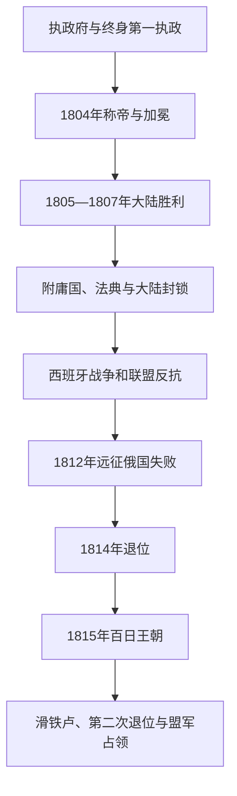

# 法兰西第一帝国

## 时间

1804—1814年；1815年百日王朝

## 别称

拿破仑帝国、波拿巴第一帝国

## 概括

拿破仑把执政府的个人权力改造为世袭帝国，同时保留大革命后法律平等、财产重分配、行政省制和职业晋升的许多成果。皇帝通过宪法元老院决议、公民投票、国务委员会、部长、省长和军队统治；立法机关存在，但议程、选举名单与新闻受到控制。帝国以征兵、税收、附庸王国和战场胜利扩张，1807年前后达到大陆优势。

《民法典》、行政法院、法兰西银行、教育体系和政教协定为后世提供稳定制度；与此同时，审查、警察、贵族头衔、殖民奴隶制恢复和持续战争限制革命自由。英国海权、大陆封锁的经济反作用、西班牙游击战、民族反抗和1812年俄国远征共同耗尽优势。1814年盟军入巴黎后拿破仑退位；1815年百日复辟又因滑铁卢战败终结。

## 演进图

## 建立与统治结构

1804年参政院以宪法元老院决议宣布“共和国政府托付给一位皇帝”，公民投票予以确认。拿破仑12月在巴黎圣母院加冕，教皇出席但皇帝亲自戴冠，象征宗教合法性服从国家。新贵族、元帅和家族王位把革命军功同王朝政治结合。

| 机构 | 法定与实际作用 | 限制与特点 |
|---|---|---|
| 皇帝 | 任免部长、提出法律、指挥军队、外交与赦免；拿破仑一世为实际最高领导 | 依赖战场声望、官僚执行、财政和公民投票合法性。 |
| 国务委员会 | 起草法律、处理行政争议并培养高官 | 由皇帝主持和任命，是专业治理核心。 |
| 元老院、保民院、立法团 | 审议或通过法案，元老院可调整宪制 | 候选和议程受控制；保民院1807年被取消。 |
| 部长与省长 | 管理财政、警察、战争、内政和各省 | 无对议会负责的首相，部长直接向皇帝负责。 |
| 军队与元帅 | 征兵、征服和附庸政权支柱 | 伤亡、补给和多线战争最终超过国家承受力。 |
| 附庸王国与盟国 | 由波拿巴亲属、元帅或本地盟友统治 | 法律改革与贡赋并行，激起本地精英和民族抵抗。 |

## 分阶段发展

### 制度巩固与大陆霸权（1804—1807年）

第三次反法联盟中，英国在特拉法加保持海权，拿破仑却于奥斯特里茨击败俄奥；1806年耶拿—奥尔施泰特击溃普鲁士，神圣罗马帝国解体；1807年弗里德兰后《提尔西特和约》确立法俄暂时合作。帝国在意大利、德意志、波兰和尼德兰建立附庸或联盟，把法典、行政改革和征兵扩散出去。

### 大陆封锁与“帝国家族”（1806—1811年）

拿破仑以大陆封锁禁止欧洲同英国贸易，希望弥补海军劣势。走私、港口衰退和原料短缺使政策反噬盟国与法国部分地区，皇帝遂吞并荷兰、教皇领地和北德海岸以加强执行。约瑟夫、路易、热罗姆等亲属被置于西班牙、荷兰和威斯特法伦王位，家族政治同革命任人唯才能原则发生张力。

1808年强迫西班牙波旁退位引发全国起义，英军在葡萄牙建立战线，半岛战争成为长期消耗。1809年法国虽在瓦格拉姆再胜奥地利，却付出更高代价。拿破仑同约瑟芬离婚，1810年娶奥地利公主玛丽-路易丝，1811年生子，试图获得传统王朝承认。

### 俄国灾难、帝国崩解与百日（1812—1815年）

俄国逐渐退出大陆封锁，波兰、贸易和联盟争议激化。1812年大军团入俄，俄军后撤、焦土和博罗季诺血战后拿破仑进入莫斯科，却未获和谈；严寒、饥饿、疾病、哥萨克袭击和补给崩溃导致撤退灾难。普鲁士、奥地利等转入第六次联盟，1813年莱比锡“民族会战”失败后附庸体系瓦解。

1814年盟军进入巴黎，元老院宣布废黜，拿破仑在枫丹白露退位并被送往厄尔巴。1815年返回法国后军队倒戈，路易十八出逃；拿破仑以《帝国宪法附加法》承诺自由化，但缺乏时间重建联盟。滑铁卢战败后第二次退位，临时政府无法阻止盟军入巴黎，波旁再次复辟。

## 皇帝、名义继承人与实际政府

### 皇帝世系

| 顺序 | 皇帝 | 在位 | 生卒 | 继承关系 | 关键说明 |
|---:|---|---|---|---|---|
| 1 | **拿破仑一世** | 1804—1814年；1815年3月20日—6月22日 | 1769—1821年 | 帝国建立者 | 第一执政称帝；1814年退位，1815年百日复位后再次退位。 |
| 2 | 拿破仑二世 | 1815年6月22日—7月7日名义在位 | 1811—1832年 | 拿破仑一世之子 | 父亲退位时指定继承；人在奥地利且未执政，法国实际由政府委员会控制，盟军复辟波旁。 |

### 1815年政府委员会

| 职务 | 人物 | 实际作用 |
|---|---|---|
| 委员会主席 | 约瑟夫·富歇 | 第二次退位后主持临时政府，与议会、盟军和波旁方面谈判。 |
| 委员 | 拉扎尔·卡诺 | 内政与共和派代表。 |
| 委员 | 阿尔芒·德·科兰古 | 外交经验与和谈。 |
| 委员 | 保罗·格勒尼耶 | 军方代表。 |
| 委员 | 尼古拉·基内特 | 政治与行政代表。 |

## 重要事件

| 时间 | 事件 | 影响 |
|---|---|---|
| 1804年 | 称帝、加冕与《民法典》 | 共和个人统治王朝化，法律统一延续。 |
| 1805年 | 特拉法加与奥斯特里茨 | 海上入侵英国无望，陆上霸权达到高点。 |
| 1806年 | 莱茵邦联与大陆封锁 | 神圣罗马帝国终结，经济战开始。 |
| 1807年 | 弗里德兰与《提尔西特和约》 | 法国取得暂时大陆优势。 |
| 1808年 | 西班牙王位干预 | 半岛战争和游击战长期消耗法国。 |
| 1809年 | 瓦格拉姆战役 | 再胜奥地利但伤亡增大。 |
| 1810—1811年 | 同玛丽-路易丝婚姻及皇子出生 | 帝国试图建立传统王朝继承。 |
| 1812年 | 俄国远征 | 大军团损失惨重，欧洲盟友转向。 |
| 1813年 | 莱比锡战役 | 附庸体系瓦解，法国退回本土。 |
| 1814年 | 巴黎陷落与第一次退位 | 第一帝国主阶段终结，波旁复辟。 |
| 1815年 | 百日、滑铁卢与第二次退位 | 拿破仑政治军事复出失败，第二次复辟。 |

## 鼎盛与灭亡原因

- **鼎盛条件**：革命和执政府已建立征兵、行政省制、职业晋升和统一财政；拿破仑的机动作战与对手协调失误带来连续胜利。
- **结构压力**：帝国需在多国驻军、征兵和征税，法国人口与盟国忠诚有限；海军弱势又迫使大陆经济战。
- **外部压力**：英国金融与海权持续支撑联盟；西班牙抵抗、俄国纵深和普奥改革让对手学习法国战争方式。
- **内部矛盾**：附庸国的法律平等同法国贡赋、征兵和家族任命并存，改革也能催生反法民族政治。
- **直接触发**：1812年远征失败使盟国转向，1813—1814年本土防御无法弥补兵力；1815年滑铁卢则直接终结百日。
- **制度遗产**：帝国灭亡后，波旁仍保留《民法典》、省长、法兰西银行和多数革命财产安排。

## 演变关系

- 前一节点：[法国大革命与第一共和国](/%E4%BA%BA%E6%96%87%E7%A7%91%E5%AD%A6/%E5%8E%86%E5%8F%B2/%E6%AC%A7%E6%B4%B2/%E6%B3%95%E5%9B%BD/%E6%B3%95%E5%9B%BD%E5%A4%A7%E9%9D%A9%E5%91%BD%E4%B8%8E%E7%AC%AC%E4%B8%80%E5%85%B1%E5%92%8C%E5%9B%BD.md)。
- 后一节点：[波旁复辟](/%E4%BA%BA%E6%96%87%E7%A7%91%E5%AD%A6/%E5%8E%86%E5%8F%B2/%E6%AC%A7%E6%B4%B2/%E6%B3%95%E5%9B%BD/%E6%B3%A2%E6%97%81%E5%A4%8D%E8%BE%9F.md)。
- 拿破仑战争的意大利和德意志影响应与当地历史并读。
- 所属总览：[法国历史](/%E4%BA%BA%E6%96%87%E7%A7%91%E5%AD%A6/%E5%8E%86%E5%8F%B2/%E6%AC%A7%E6%B4%B2/%E6%B3%95%E5%9B%BD/README.md)。
