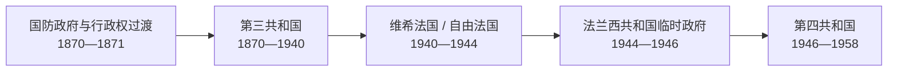

# 法兰西第三与第四共和国国家领导人表

## 范围与读法

本表集中列出第三共和国与第四共和国的国家元首和政府首脑，用于保持长序列的连续性。第三共和国在 1870—1871 年由国防政府和行政权首脑过渡到共和国总统制；第四共和国则由临时政府过渡到 1946 年宪法下的议会共和国。重复组阁者合并在同一行，但所有任期均按时间列出。

## 第三共和国国家元首

| 顺序 | 姓名 | 职位与任期 | 政治背景 | 关键事件 / 备注 |
|---|---|---|---|---|
| 过渡 | 路易·朱尔·特罗胥 | 国防政府主席，1870—1871 | 军人 | 普法战争末期主持巴黎防务；1871 年辞职 |
| 1 | **阿道夫·梯也尔** | 行政权首脑，1871；共和国总统，1871—1873 | 温和共和派 | 镇压巴黎公社、完成赔款与德军撤离；因与君主派议会冲突辞职 |
| 2 | 帕特里斯·德·麦克马洪 | 1873—1879 | 保守君主派、军人 | 1875 年宪法确立期间在任；1877 年“五月十六日危机”失败后总统权力收缩 |
| 3 | 朱尔·格雷维 | 1879—1887 | 共和派 | 形成总统避免主动干预议会政治的“格雷维惯例”；因勋章丑闻辞职 |
| 4 | 萨迪·卡诺 | 1887—1894 | 温和共和派 | 布朗热危机与共和制度巩固；1894 年遇刺 |
| 5 | 让·卡西米尔-佩里埃 | 1894—1895 | 温和共和派 | 因总统权力有限及政治攻击辞职 |
| 6 | 费利克斯·福尔 | 1895—1899 | 温和共和派 | 德雷福斯事件激化期间在任；任内去世 |
| 7 | 埃米尔·卢贝 | 1899—1906 | 左翼共和派 | 德雷福斯平反进程、政教冲突和 1905 年政教分离法 |
| 8 | 阿尔芒·法利埃 | 1906—1913 | 激进共和派 | 社会改革、摩洛哥危机与对德紧张升级 |
| 9 | **雷蒙·普恩加莱** | 1913—1920 | 民主共和联盟 | 第一次世界大战和“神圣联合”；战后初期 |
| 10 | 保罗·德沙内尔 | 1920 | 民主共和联盟 | 因健康原因在任数月后辞职 |
| 11 | 亚历山大·米勒兰 | 1920—1924 | 国家联盟 | 试图强化总统作用；左翼联盟胜选后辞职 |
| 12 | 加斯东·杜梅格 | 1924—1931 | 激进派 | 战后财政与内阁更替；1934 年危机后又以总理身份组阁 |
| 13 | 保罗·杜美 | 1931—1932 | 独立派 | 任内遇刺 |
| 14 | **阿尔贝·勒布伦** | 1932—1940 | 民主共和联盟 | 大萧条、人民阵线与第二次世界大战；1940 年宪政秩序被贝当体制取代 |

## 第三共和国政府首脑

1870—1871 年国防政府由特罗胥主持；其后政府首脑通常称部长会议主席。下表按首次就任顺序列出全部正式政府首脑，同一人物多次组阁的任期合并列示。

| 顺序 | 姓名 | 任期 | 主要阶段 / 备注 |
|---|---|---|---|
| 过渡 | 路易·朱尔·特罗胥 | 1870—1871 | 国防政府主席；巴黎围城和停战前过渡 |
| 1 | **朱尔·迪福尔** | 1871—1873；1876；1877—1879 | 共和制度奠基、危机后的共和派组阁 |
| 2 | 阿尔贝·德·布罗伊 | 1873—1874；1877 | 保守派“道德秩序”；五月十六日危机 |
| 3 | 埃内斯特·库尔托·德·西塞 | 1874—1875 | 军人内阁 |
| 4 | 路易·比费 | 1875—1876 | 1875 年宪法性法律实施初期 |
| 5 | 朱尔·西蒙 | 1876—1877 | 与麦克马洪冲突，被迫辞职 |
| 6 | 加埃唐·德·罗什布埃 | 1877 | 五月十六日危机末期短命军人内阁 |
| 7 | 威廉·沃丁顿 | 1879 | 共和派控制全部宪政机关后的过渡 |
| 8 | 夏尔·德·弗雷西内 | 1879—1880；1882；1886；1890—1892 | 公共工程、世俗化与对外政策 |
| 9 | **朱尔·费里** | 1880—1881；1883—1885 | 世俗义务教育、殖民扩张；因东京事件倒台 |
| 10 | 莱昂·甘必大 | 1881—1882 | “大内阁”未能稳定多数 |
| 11 | 夏尔·迪克莱尔 | 1882—1883 | 埃及与殖民政策争论 |
| 12 | 阿尔芒·法利埃 | 1883 | 短期过渡内阁 |
| 13 | 亨利·布里松 | 1885—1886；1898 | 激进共和派；德雷福斯危机阶段 |
| 14 | 勒内·戈布莱 | 1886—1887 | 世俗政策与布朗热崛起 |
| 15 | 莫里斯·鲁维埃 | 1887；1905—1906 | 布朗热危机、政教分离后的财政与外交 |
| 16 | 皮埃尔·蒂拉尔 | 1887—1888；1889—1890 | 应对布朗热运动 |
| 17 | 夏尔·弗洛凯 | 1888—1889 | 激进派政府；与布朗热对抗 |
| 18 | 埃米尔·卢贝 | 1892 | 巴拿马运河丑闻爆发 |
| 19 | 亚历山大·里博 | 1892—1893；1895；1914；1917 | 多次危机内阁；一战期间再度组阁 |
| 20 | 夏尔·迪皮伊 | 1893；1894—1895；1898—1899 | 无政府主义暴力、德雷福斯事件 |
| 21 | 让·卡西米尔-佩里埃 | 1893—1894 | 后当选共和国总统 |
| 22 | 莱昂·布尔茹瓦 | 1895—1896 | 社会连带主义与税制改革受阻 |
| 23 | 朱尔·梅利纳 | 1896—1898 | 农业保护主义；德雷福斯事件初期 |
| 24 | **皮埃尔·瓦尔德克-卢梭** | 1899—1902 | “保卫共和”内阁、结社法与德雷福斯平反转折 |
| 25 | 埃米尔·孔布 | 1902—1905 | 强力反教权政策，推动政教分离 |
| 26 | 费迪南·萨里安 | 1906 | 政教分离法实施初期 |
| 27 | **乔治·克列孟梭** | 1906—1909；1917—1920 | 社会冲突与治安；一战胜利和巴黎和会 |
| 28 | **阿里斯蒂德·白里安** | 1909—1911；1913；1915—1917；1921—1922；1925—1926；1929 | 政教分离执行、一战内阁、战后和解外交 |
| 29 | 埃内斯特·莫尼 | 1911 | 阿加迪尔危机前夕 |
| 30 | 约瑟夫·卡约 | 1911—1912 | 与德国达成摩洛哥—刚果安排；财政改革 |
| 31 | **雷蒙·普恩加莱** | 1912—1913；1922—1924；1926—1929 | 战前结盟、鲁尔占领、法郎稳定 |
| 32 | 路易·巴尔杜 | 1913 | 三年兵役法 |
| 33 | 加斯东·杜梅格 | 1913—1914；1934 | 战前过渡；二月六日危机后的“国家联合” |
| 34 | 勒内·维维亚尼 | 1914—1915 | 一战爆发和“神圣联合” |
| 35 | 保罗·潘勒韦 | 1917；1925 | 一战危机与战后左翼联盟 |
| 36 | 亚历山大·米勒兰 | 1920 | 战后重建，后任总统 |
| 37 | 乔治·莱格 | 1920—1921 | 战后外交与财政 |
| 38 | 弗雷德里克·弗朗索瓦-马萨尔 | 1924 | 国家联盟败选后的数日过渡 |
| 39 | 爱德华·赫里欧 | 1924—1925；1926；1932 | 左翼联盟、财政危机与裁军外交 |
| 40 | 安德烈·塔迪厄 | 1929—1930；1930；1932 | 大萧条初期与行政改革设想 |
| 41 | 卡米耶·肖当 | 1930；1933—1934；1937—1938 | 斯塔维斯基事件、人民阵线后期 |
| 42 | 泰奥多尔·斯泰格 | 1930—1931 | 大萧条初期短期内阁 |
| 43 | 皮埃尔·赖伐尔 | 1931—1932；1935—1936 | 紧缩与对意妥协；后来成为维希政府首脑 |
| 44 | 约瑟夫·保罗-邦库尔 | 1932—1933 | 裁军与集体安全 |
| 45 | **爱德华·达拉第** | 1933；1934；1938—1940 | 二月六日危机、慕尼黑协定和二战初期 |
| 46 | 阿尔贝·萨罗 | 1933；1936 | 殖民政策与国内安全 |
| 47 | 皮埃尔-艾蒂安·弗朗丹 | 1934—1935 | 经济危机与对德政策 |
| 48 | 费尔南·布伊松 | 1935 | 仅维持数日的短期内阁 |
| 49 | **莱昂·布鲁姆** | 1936—1937；1938 | 人民阵线、马蒂尼翁协议与社会改革 |
| 50 | 保罗·雷诺 | 1940 | 主张继续作战；因停战争议辞职 |
| 51 | 菲利普·贝当 | 1940 年 6—7 月 | 请求停战；7 月 10 日获制宪全权，第三共和国终结 |

## 第四共和国国家元首

| 顺序 | 姓名 | 任期 | 政治背景 | 关键事件 / 备注 |
|---|---|---|---|---|
| 1 | **樊尚·奥里奥尔** | 1947—1954 | 社会党 | 战后重建、三党联合瓦解、冷战与印度支那战争 |
| 2 | **勒内·科蒂** | 1954—1959 | 独立共和派 | 殖民危机、阿尔及利亚战争；1958 年邀请戴高乐组阁，任至第五共和国总统就职 |

## 第四共和国政府首脑

第四共和国共有二十四届内阁，但只有十六位部长会议主席。重复组阁任期在同一行列出。

| 顺序 | 姓名 | 任期 | 主要阶段 / 备注 |
|---|---|---|---|
| 1 | 保罗·拉马迪埃 | 1947 | 第四共和国首届政府；共产党部长退出，三党联合结束 |
| 2 | **罗贝尔·舒曼** | 1947—1948；1948 | 第三力量联盟；后推动欧洲煤钢共同体 |
| 3 | 安德烈·马里 | 1948 | 短期联合政府 |
| 4 | 亨利·克耶 | 1948—1949；1950；1951 | 多次维持中间派联合，处理财政与社会冲突 |
| 5 | 乔治·皮杜尔 | 1949—1950 | 北约建立、欧洲合作和印度支那战争 |
| 6 | 勒内·普利文 | 1950—1951；1951—1952 | “普利文计划”与欧洲防务共同体构想 |
| 7 | **埃德加·富尔** | 1952；1955—1956 | 财政稳定；摩洛哥问题和提前选举 |
| 8 | 安托万·比内 | 1952 | 稳定法郎与反通胀政策 |
| 9 | 勒内·梅耶 | 1953 | 欧洲防务共同体和印度支那经费争议 |
| 10 | 约瑟夫·拉尼埃尔 | 1953—1954 | 奠边府战败前后的印度支那危机 |
| 11 | **皮埃尔·孟戴斯-弗朗斯** | 1954—1955 | 日内瓦协议结束印度支那战争，推进突尼斯自治 |
| 12 | **居伊·摩勒** | 1956—1957 | 阿尔及利亚战争升级、苏伊士危机与欧洲经济共同体谈判 |
| 13 | 莫里斯·布尔热-莫努里 | 1957 | 阿尔及利亚政策与欧洲条约实施 |
| 14 | 费利克斯·加亚尔 | 1957—1958 | 萨基耶特·西迪·优素福轰炸引发外交危机 |
| 15 | 皮埃尔·弗林姆兰 | 1958 | 五月十三日危机中仅执政数周 |
| 16 | **夏尔·戴高乐** | 1958—1959 | 获特别授权处理危机，主持制定第五共和国宪法 |

## 实际权力结构比较

| 维度 | 第三共和国 | 第四共和国 |
|---|---|---|
| 国家元首 | 总统由两院联席会议选举；1877 年后通常不主动挑战议会多数 | 总统由议会选举，具有任命、调解和礼仪职能，但日常政策由内阁负责 |
| 政府首脑 | 部长会议主席须维持众议院多数；党派松散造成频繁换阁 | 部长会议主席须经国民议会投资表决；比例代表制与多党联盟增加组阁成本 |
| 议会 | 众议院掌握政治主动；参议院拥有重要立法与倒阁影响 | 国民议会居主导地位；共和国院权力弱于第三共和国参议院 |
| 实际连续性 | 内阁虽常更换，但高级公务员、议会委员会和长期任职部长维持政策连续 | 计划总署、财政与行政体系、政党领袖维持经济和欧洲政策连续 |
| 主要脆弱点 | 行政首脑缺乏稳定多数；战争危机中决策链条迟缓 | 联盟破裂与殖民战争相互放大，行政权难以承担长期军事—政治责任 |

## 相关笔记

- [法兰西第三共和国](/%E4%BA%BA%E6%96%87%E7%A7%91%E5%AD%A6/%E5%8E%86%E5%8F%B2/%E6%AC%A7%E6%B4%B2/%E6%B3%95%E5%9B%BD/%E6%B3%95%E5%85%B0%E8%A5%BF%E7%AC%AC%E4%B8%89%E5%85%B1%E5%92%8C%E5%9B%BD.md)
- [维希法国、自由法国与共和国临时政府](/%E4%BA%BA%E6%96%87%E7%A7%91%E5%AD%A6/%E5%8E%86%E5%8F%B2/%E6%AC%A7%E6%B4%B2/%E6%B3%95%E5%9B%BD/%E7%BB%B4%E5%B8%8C%E6%B3%95%E5%9B%BD%E4%B8%8E%E8%87%AA%E7%94%B1%E6%B3%95%E5%9B%BD.md)
- [法兰西第四共和国](/%E4%BA%BA%E6%96%87%E7%A7%91%E5%AD%A6/%E5%8E%86%E5%8F%B2/%E6%AC%A7%E6%B4%B2/%E6%B3%95%E5%9B%BD/%E6%B3%95%E5%85%B0%E8%A5%BF%E7%AC%AC%E5%9B%9B%E5%85%B1%E5%92%8C%E5%9B%BD.md)
- [法国历史总览](/%E4%BA%BA%E6%96%87%E7%A7%91%E5%AD%A6/%E5%8E%86%E5%8F%B2/%E6%AC%A7%E6%B4%B2/%E6%B3%95%E5%9B%BD/README.md)
