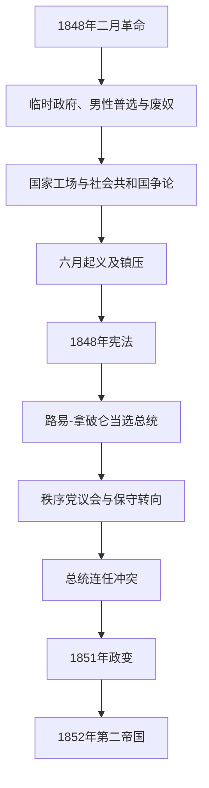

# 法兰西第二共和国

## 时间

1848年2月24日—1852年12月2日

## 别称

第二共和国、1848年共和国

## 概括

1848年二月革命推翻七月王朝，临时政府立即宣布共和、男性普选、结社与新闻自由，并在殖民地再次废除奴隶制。社会共和派要求国家保障劳动，政府建立国家工场；温和共和派则强调财产、预算与秩序。4月普选产生的制宪议会较保守，关闭国家工场引发六月起义，卡芬雅克军队镇压使工人与共和政府决裂。

1848年宪法仿照美国模式设全民直选总统和一院议会，却没有解决两者发生冲突时的仲裁机制，总统又不得立即连任。路易-拿破仑凭姓氏、秩序承诺、农村选票和跨阶层支持当选；保守“秩序党”在议会占优，限制普选、教育世俗化和共和社团。总统无法合法连任，议会拒绝修宪，他遂于1851年12月2日发动政变，以军队镇压反抗并经公投延长权力；一年后建立第二帝国。

## 演进图

## 建立与社会改革

临时政府由温和共和派、激进派和社会主义者组成。它取消政治死刑、扩大新闻与集会空间，并通过全国男性普选把选民从约二十余万扩大到九百余万；女性仍被排除在正式选举外。路易·布朗推动设立卢森堡委员会讨论劳工问题，国家工场则主要成为失业救济和公共工程，而非其完整合作生产方案。

1848年4月27日法令在法国殖民地废除奴隶制，维克多·舍尔歇等人发挥关键作用，奴隶自身反抗和海地革命遗产同样构成压力。废奴并未终止殖民统治、强迫劳动和种族不平等。

## 六月危机与宪法

4月选举显示农村选民对激进巴黎的警惕；5月15日示威者闯入议会后，左翼领袖被捕。政府关闭国家工场并要求青年工人参军或赴外省，引发6月23—26日街垒战。卡芬雅克获非常权力，军队和国民自卫军镇压，数千人死亡、被捕或流放。事件让“社会共和国”与“秩序共和国”分裂，也促使中产和农民支持强行政。

11月宪法设四年任期、直接普选的总统和单一国民议会。总统任命部长、掌军政但不能解散议会，也不得连续连任；议会不能通过不信任简单罢免总统。两种普选合法性并列而缺乏仲裁，为冲突埋伏笔。

## 路易-拿破仑总统与政变

路易-拿破仑1848年12月以压倒优势当选，既借拿破仑传奇，又承诺宗教、财产、社会关怀和秩序。1849年法国军队镇压罗马共和国、恢复教皇，满足天主教保守派却疏远共和左翼。1850年《法卢法》扩大教会教育作用；5月选举法要求三年固定居住，剥夺大量流动工人和贫困选民资格。

总统逐渐撤换秩序党大臣，巡视各地争取军队与群众。议会未能达到修宪所需多数后，他在拿破仑一世加冕周年和奥斯特里茨纪念日12月2日逮捕反对派、解散议会、恢复男性普选。巴黎及外省部分共和派抵抗遭军队镇压，大批人员被捕、流放或遣送阿尔及利亚。12月公投认可新权力，1852年宪法建立十年总统制；11月公投后，12月2日称帝。

## 国家元首

| 顺序 | 国家元首或集体权力 | 任期 | 法定身份与实际作用 |
|---:|---|---|---|
| 1 | 杜邦·德勒尔主持的临时政府 | 1848年2月24日—5月9日 | 集体国家与行政权；拉马丁、阿拉戈、赖德律-洛兰、路易·布朗等代表不同共和倾向。 |
| 2 | 执行委员会 | 1848年5月9日—6月24日 | 阿拉戈主持，成员包括拉马丁、加尼耶-帕热斯、赖德律-洛兰和马里；受制宪议会监督。 |
| 3 | **路易-欧仁·卡芬雅克** | 1848年6月24日—12月20日 | 先获军事非常权力，后任行政权首脑；镇压六月起义并组织制宪。 |
| 4 | **路易-拿破仑·波拿巴** | 1848年12月20日—1852年12月2日 | 共和国唯一民选总统；1851年政变后已属个人威权，1852年称拿破仑三世。 |

## 政府首脑与实际行政

第二共和国没有连续、独立于总统的现代总理职位；临时政府和卡芬雅克阶段由集体机关或行政权首脑执政，总统时期大臣直接向总统负责。

| 阶段或协调者 | 时间 | 实际作用 |
|---|---|---|
| 临时政府部长会议 | 1848年2—5月 | 集体决策，内部存在温和、民主社会主义与工人代表。 |
| 卡芬雅克政府 | 1848年6—12月 | 卡芬雅克兼实际国家元首和政府首脑。 |
| 奥迪隆·巴罗 | 1848年12月—1849年10月 | 总统任命的主要部长，依靠秩序党议会；推动远征罗马。 |
| 奥普尔将军 | 1849年10月—1851年1月 | 保守内阁主要协调者，总统逐步削弱议会党派。 |
| 莱昂·福歇 | 1851年4—10月 | 政变前最后一个重要议会保守内阁协调者。 |
| 路易-拿破仑直接统治 | 1851年10月—1852年12月 | 总统任用个人亲信；政变后不存在独立政府首脑。 |

## 重要事件

| 时间 | 事件 | 结果与影响 |
|---|---|---|
| 1848年2月 | 二月革命与共和国宣布 | 七月王朝崩溃，临时政府建立。 |
| 1848年3月 | 男性普选和国家工场 | 政治参与跃升，劳动权争论制度化。 |
| 1848年4月 | 殖民地废奴 | 法律上结束法国殖民地奴隶制。 |
| 1848年4月23日 | 制宪议会选举 | 首次全国男性普选显示农村保守力量。 |
| 1848年5月15日 | 示威者闯入议会 | 激进领袖被捕，左右分裂加深。 |
| 1848年6月 | 六月起义 | 国家工场关闭引发内战式镇压。 |
| 1848年11月 | 新宪法通过 | 建立直选总统与一院议会的双重合法性。 |
| 1848年12月 | 路易-拿破仑当选 | 拿破仑记忆和秩序联盟获胜。 |
| 1849年 | 法军攻占罗马 | 恢复教皇世俗统治，法国卷入意大利民族问题。 |
| 1850年 | 《法卢法》与选举法 | 教会教育扩张，大量男性失去投票资格。 |
| 1851年12月2日 | 总统政变 | 议会被解散，抵抗被镇压，男性普选被用作公投合法性。 |
| 1852年12月2日 | 帝国宣布 | 第二共和国终结。 |

## 兴起与覆亡原因

- **兴起条件**：经济危机、宴会运动受禁、枪击示威者和国民自卫军不愿镇压，使七月王朝在数日内瓦解。
- **结构矛盾**：普选扩大政治参与，社会与殖民地平等却远未实现；财产权与劳动保障的冲突在国家工场问题上爆发。
- **制度缺陷**：总统与议会各自拥有全国普选合法性，不能解散、连任或有效罢免的设计使冲突趋向零和。
- **社会基础**：路易-拿破仑同时吸引农民、天主教徒、保守资产者、军人和部分社会改革期待者，议会共和派缺乏相同全国网络。
- **直接触发**：修宪失败意味着总统1852年必须离任；他以军队、人事控制和公投发动政变。
- **覆亡过程**：共和国先在1851年政变中失去宪政实质，再于1852年经公投与元老院决议正式改为帝国。

## 演变关系

- 前一节点：[七月王朝](/%E4%BA%BA%E6%96%87%E7%A7%91%E5%AD%A6/%E5%8E%86%E5%8F%B2/%E6%AC%A7%E6%B4%B2/%E6%B3%95%E5%9B%BD/%E4%B8%83%E6%9C%88%E7%8E%8B%E6%9C%9D.md)。
- 后一节点：[法兰西第二帝国](/%E4%BA%BA%E6%96%87%E7%A7%91%E5%AD%A6/%E5%8E%86%E5%8F%B2/%E6%AC%A7%E6%B4%B2/%E6%B3%95%E5%9B%BD/%E6%B3%95%E5%85%B0%E8%A5%BF%E7%AC%AC%E4%BA%8C%E5%B8%9D%E5%9B%BD.md)。
- 所属总览：[法国历史](/%E4%BA%BA%E6%96%87%E7%A7%91%E5%AD%A6/%E5%8E%86%E5%8F%B2/%E6%AC%A7%E6%B4%B2/%E6%B3%95%E5%9B%BD/README.md)。
