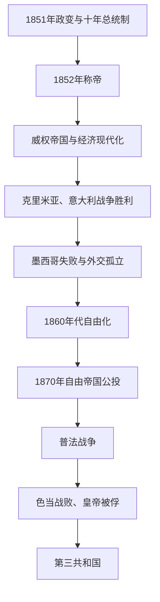

# 法兰西第二帝国

## 时间

1852年12月2日—1870年9月4日

## 别称

拿破仑三世帝国、Second French Empire

## 概括

路易-拿破仑在1851年政变后通过公投建立十年总统制，1852年再以元老院决议和公投恢复世袭帝国，称拿破仑三世。帝国前期是“公民投票式威权”：普选保留，但官方候选、行政干预、新闻限制和皇帝独占行政权削弱议会竞争。经济增长、铁路、银行、城市工程和对外胜利为政权提供支持。

1860年代后，反对派增长、财政压力和对外挫折促使皇帝逐步扩大议会辩论、罢工权与部长责任，1870年形成“自由帝国”。这一转型在公投中获多数，却未解决对普鲁士崛起的战略焦虑。埃姆斯电报危机中，法国政府误判盟友和军备，1870年7月宣战；色当战败及皇帝被俘直接摧毁王朝，巴黎宣布第三共和国。

## 演进图

## 皇帝与继承

| 顺序 | 皇帝 | 在位 | 生卒 | 继承与说明 |
|---:|---|---|---|---|
| 1 | **拿破仑三世** | 1852—1870年 | 1808—1873年 | 路易·波拿巴之子、拿破仑一世侄；第二帝国唯一实际皇帝，色当被俘后巴黎废黜。 |

皇太子拿破仑-欧仁1856年出生，是法定继承人，但帝国在父亲尚在位时覆亡，他从未即位。欧仁妮皇后曾在皇帝出征或出访时临时摄政，尤其1859年、1865年和1870年；摄政不构成独立君主世系。

## 统治结构与政府首脑

| 阶段 | 国家元首 | 政府或实际行政 | 特点 |
|---|---|---|---|
| 1852—1860年 | 拿破仑三世 | 皇帝直接主持部长会议；部长只向皇帝负责 | 立法团权力弱、官方候选和新闻管制明显。 |
| 1860—1869年 | 拿破仑三世 | 鲁埃等国务大臣协调议会，皇帝仍是政府首脑 | 允许议会答复御座演说、公开辩论和较大预算监督。 |
| 1869—1870年8月 | 拿破仑三世 | **埃米尔·奥利维耶**领导责任内阁 | 共和温和派转为帝国改革者，推动“自由帝国”。 |
| 1870年8—9月 | 拿破仑三世被俘前仍为皇帝 | **帕利考伯爵库赞-蒙托邦**主持战时政府，欧仁妮摄政 | 色当消息传到巴黎后政府和帝国同时崩溃。 |

## 经济与社会现代化

铁路里程迅速增长，巴黎—里昂—地中海等公司连接全国；佩雷尔兄弟的动产信贷银行等新金融机构动员资本。奥斯曼男爵主持巴黎改造，开辟大道、下水道、公园与车站，改善交通卫生，也造成拆迁、债务与贫困居民外移。1860年英法商约降低关税，促进竞争和贸易，却遭部分工业家反对。

政府承认互助社团并在1864年有限承认罢工权，工人运动和第一国际仍受警察监控。农业商品化和城市消费扩大，但区域贫困、劳动时间和住房不平等持续。现代化不是皇帝单人计划，而是国家、地方、银行、工程师和私人资本共同作用。

## 对外扩张与自由化

1854—1856年克里米亚战争使法国同英国、奥斯曼结盟击败俄国，巴黎和会恢复法国欧洲中心地位。1859年援助撒丁击败奥地利，取得萨伏依和尼斯，并推动意大利统一；法国随后为保护教皇驻军罗马，同意大利民族主义者关系复杂。

在阿尔及利亚，军事征服、土地没收和殖民定居扩大；塞内加尔、印度支那和太平洋据点也延伸帝国。1862—1867年墨西哥远征企图扶植马克西米连帝国，遭墨西哥共和国抵抗和美国内战后施压，撤军后马克西米连被处决，严重损害威信。

皇帝健康恶化、天主教徒不满意大利政策、自由派反对威权、保守工商界担忧自由贸易，共同促成改革。1869年反对派议席增长，奥利维耶组阁；1870年新宪制使部长对议会更负责，5月公投以多数确认，但政权随即进入战争。

## 重要事件

| 时间 | 事件 | 影响 |
|---|---|---|
| 1852年12月 | 拿破仑三世称帝 | 政变后的个人总统制世袭化。 |
| 1853—1870年 | 巴黎大改造 | 基础设施与公共卫生改善，拆迁、债务和社会空间重组并存。 |
| 1854—1856年 | 克里米亚战争 | 打破维也纳体系对法国限制，帝国国际声望上升。 |
| 1859—1860年 | 意大利战争与取得萨伏依、尼斯 | 支持意大利统一并扩张法国边界。 |
| 1860年 | 英法商约 | 自由贸易和工业竞争加深。 |
| 1861—1867年 | 墨西哥远征 | 扶植帝国失败，暴露海外战略过度扩张。 |
| 1864年 | 有限承认罢工权 | 工人结社空间扩大，是自由化重要一步。 |
| 1867年 | 第二次巴黎世界博览会 | 展示工业和帝国繁荣，也处于外交转弱之际。 |
| 1869年 | 反对派选举进展 | 皇帝接受责任内阁方向。 |
| 1870年1—5月 | 奥利维耶政府与自由帝国公投 | 政体获多数确认，议会权力扩大。 |
| 1870年7月 | 对普鲁士宣战 | 法国误判军备、动员和盟友，战争迅速失利。 |
| 1870年9月2—4日 | 色当投降与共和国宣布 | 皇帝被俘，巴黎政治力量废除帝制。 |

## 鼎盛与灭亡原因

- **鼎盛条件**：普选公投、拿破仑记忆、秩序需求和经济增长构成跨阶层支持；军队早期胜利恢复法国大国地位。
- **结构压力**：个人权力让政策依赖皇帝健康与判断；议会和独立信息受限，外交冒险缺乏有效纠错。
- **社会经济矛盾**：现代化创造就业、资本和城市设施，也扩大工人组织、拆迁不满和对官商网络的批评。
- **外部压力**：意大利和德意志统一改变力量平衡；墨西哥失败、奥地利1866年败北及英国中立使法国日益孤立。
- **直接触发**：西班牙王位候选和经俾斯麦编辑的埃姆斯电报刺激法国舆论，政府在准备不足时宣战。
- **灭亡过程**：法军动员混乱并在边境败退，麦克马洪集团于色当被包围，皇帝投降；巴黎无可接受的摄政或继承政府，共和派于9月4日夺取政权。

## 演变关系

- 前一节点：[法兰西第二共和国](/%E4%BA%BA%E6%96%87%E7%A7%91%E5%AD%A6/%E5%8E%86%E5%8F%B2/%E6%AC%A7%E6%B4%B2/%E6%B3%95%E5%9B%BD/%E6%B3%95%E5%85%B0%E8%A5%BF%E7%AC%AC%E4%BA%8C%E5%85%B1%E5%92%8C%E5%9B%BD.md)。
- 后一节点：[法兰西第三共和国](/%E4%BA%BA%E6%96%87%E7%A7%91%E5%AD%A6/%E5%8E%86%E5%8F%B2/%E6%AC%A7%E6%B4%B2/%E6%B3%95%E5%9B%BD/%E6%B3%95%E5%85%B0%E8%A5%BF%E7%AC%AC%E4%B8%89%E5%85%B1%E5%92%8C%E5%9B%BD.md)。
- 意大利统一与德意志统一的另一侧应分别见相关国家史。
- 所属总览：[法国历史](/%E4%BA%BA%E6%96%87%E7%A7%91%E5%AD%A6/%E5%8E%86%E5%8F%B2/%E6%AC%A7%E6%B4%B2/%E6%B3%95%E5%9B%BD/README.md)。
