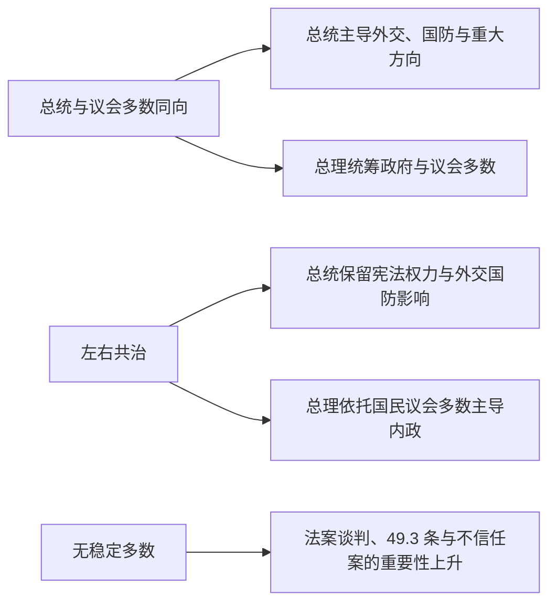

# 法兰西第五共和国总统与总理表

## 范围与读法

本表列出 1959 年以来全部总统、代理总统和总理任期，并以 2026 年 7 月 14 日为现状核验截止点。总理辞职后在新政府成立前通常继续处理日常事务；同一人重新获任命时分行列示，以免把不同内阁合并。

## 总统与代理总统

| 顺序 | 姓名 | 任期 | 政治阵营 | 关键事件 / 备注 |
|---|---|---|---|---|
| 1 | **夏尔·戴高乐** | 1959—1969 | 戴高乐派 | 建立强总统制实践、阿尔及利亚独立、核威慑与 1968 年五月风暴；1969 年公投失败后辞职 |
| 代理 | 阿兰·波埃尔 | 1969 年 4—6 月 | 中间派 | 戴高乐辞职后以参议院议长代理总统 |
| 2 | 乔治·蓬皮杜 | 1969—1974 | 戴高乐派 | 工业现代化、欧洲共同体扩大；任内去世 |
| 代理 | 阿兰·波埃尔 | 1974 年 4—5 月 | 中间派 | 蓬皮杜逝世后第二次代理总统 |
| 3 | 瓦莱里·吉斯卡尔·德斯坦 | 1974—1981 | 中右翼 | 投票年龄降至十八岁、堕胎合法化、欧洲货币合作；石油危机与失业上升 |
| 4 | **弗朗索瓦·密特朗** | 1981—1995 | 社会党 | 轮替执政、废除死刑、国有化与紧缩转向；经历 1986—1988、1993—1995 两次共治 |
| 5 | **雅克·希拉克** | 1995—2007 | 共和国联盟 / 人民运动联盟 | 1995 年社会运动、职业军队、承认维希国家责任；1997—2002 年共治、反对伊拉克战争 |
| 6 | 尼古拉·萨科齐 | 2007—2012 | 人民运动联盟 | 金融危机、欧元区危机、宪法改革与利比亚战争 |
| 7 | 弗朗索瓦·奥朗德 | 2012—2017 | 社会党 | 同性婚姻合法化、恐怖袭击与紧急状态、马里军事干预 |
| 8 | **埃马纽埃尔·马克龙** | 2017—至今 | 复兴党及中间派联盟 | 2017、2022 年当选；黄背心、疫情、退休制度改革；2024 年解散国民议会后进入碎片化议会阶段 |

## 总理完整序列

| 顺序 | 姓名 | 任期 | 同期总统 | 多数与关键说明 |
|---|---|---|---|---|
| 1 | **米歇尔·德勃雷** | 1959—1962 | 戴高乐 | 奠定新宪法行政实践；因阿尔及利亚政策分歧离任 |
| 2 | **乔治·蓬皮杜** | 1962—1968 | 戴高乐 | 戴高乐派多数；经济增长与 1968 年五月危机 |
| 3 | 莫里斯·顾夫·德姆维尔 | 1968—1969 | 戴高乐 | 危机后恢复秩序与总统辞职前过渡 |
| 4 | 雅克·沙邦-戴尔马 | 1969—1972 | 蓬皮杜 | “新社会”改革构想 |
| 5 | 皮埃尔·梅斯梅尔 | 1972—1974 | 蓬皮杜 | 石油危机与核电扩张决策 |
| 6 | **雅克·希拉克** | 1974—1976 | 吉斯卡尔·德斯坦 | 中右翼同向；因权力与路线冲突辞职 |
| 7 | 雷蒙·巴尔 | 1976—1981 | 吉斯卡尔·德斯坦 | 兼任经济部长，推行反通胀与紧缩政策 |
| 8 | 皮埃尔·莫鲁瓦 | 1981—1984 | 密特朗 | 左翼改革、国有化与 1983 年“紧缩转向” |
| 9 | 洛朗·法比尤斯 | 1984—1986 | 密特朗 | 现代化、私营化前奏与“彩虹勇士号”事件 |
| 10 | **雅克·希拉克** | 1986—1988 | 密特朗 | 第一次左右共治；私有化与内政由议会多数主导 |
| 11 | 米歇尔·罗卡尔 | 1988—1991 | 密特朗 | 相对多数政府；最低融入收入和新喀里多尼亚协议 |
| 12 | 埃迪特·克勒松 | 1991—1992 | 密特朗 | 法国首位女总理；经济与政治支持下降 |
| 13 | 皮埃尔·贝雷戈瓦 | 1992—1993 | 密特朗 | 马斯特里赫特条约、公投与经济衰退 |
| 14 | 爱德华·巴拉迪尔 | 1993—1995 | 密特朗 | 第二次左右共治；私有化与财政整顿 |
| 15 | 阿兰·朱佩 | 1995—1997 | 希拉克 | 社会保障和退休改革引发 1995 年大罢工 |
| 16 | **利昂内尔·若斯潘** | 1997—2002 | 希拉克 | 第三次左右共治；三十五小时工作制、民事结合契约和欧元启用 |
| 17 | 让-皮埃尔·拉法兰 | 2002—2005 | 希拉克 | 中右翼统一多数；分权与养老金改革 |
| 18 | 多米尼克·德维尔潘 | 2005—2007 | 希拉克 | 郊区骚乱；首次雇佣合同因抗议撤回 |
| 19 | 弗朗索瓦·菲永 | 2007—2012 | 萨科齐 | 金融与欧元区危机、养老金改革 |
| 20 | 让-马克·艾罗 | 2012—2014 | 奥朗德 | 同性婚姻法、税收与竞争力政策调整 |
| 21 | 曼努埃尔·瓦尔斯 | 2014—2016 | 奥朗德 | 恐袭、紧急状态和劳动法争议 |
| 22 | 贝尔纳·卡泽纳夫 | 2016—2017 | 奥朗德 | 任期末过渡、反恐与安全政策 |
| 23 | 爱德华·菲利普 | 2017—2020 | 马克龙 | 新多数；铁路、税制改革，黄背心与疫情初期 |
| 24 | 让·卡斯泰 | 2020—2022 | 马克龙 | 疫情治理、经济复苏与疫苗政策 |
| 25 | 伊丽莎白·博尔内 | 2022—2024 | 马克龙 | 失去绝对多数；多次使用宪法第 49 条第 3 款，完成退休年龄改革 |
| 26 | 加布里埃尔·阿塔尔 | 2024 年 1—9 月 | 马克龙 | 欧洲议会选举后解散国民议会；提前选举后看守执政 |
| 27 | 米歇尔·巴尼耶 | 2024 年 9—12 月 | 马克龙 | 依赖相对少数与外部默许；预算争议引发不信任案，政府倒台 |
| 28 | 弗朗索瓦·贝鲁 | 2024 年 12 月—2025 年 9 月 | 马克龙 | 碎片化议会下寻求预算妥协；在信任投票中失去国民议会支持 |
| 29 | 塞巴斯蒂安·勒科尔尼 | 2025 年 9 月 9 日—10 月 6 日 | 马克龙 | 首届政府组建困难，宣布辞职并处理日常事务 |
| 30 | **塞巴斯蒂安·勒科尔尼** | 2025 年 10 月 10 日—至今 | 马克龙 | 重新获任命；截至 2026 年 7 月 14 日在任，在无稳定多数的议会中推动预算和立法妥协 |

## 实际权力结构

| 角色 / 机制 | 宪法位置 | 实际运行 |
|---|---|---|
| 共和国总统 | 任命总理、主持部长会议，可诉诸公投、解散国民议会并在严重危机中使用第 16 条特别权力 | 当总统阵营掌握议会多数时通常主导政策方向；任期与议会任期同为五年后，这种同向状态更常见 |
| 总理与政府 | 政府决定并执行国家政策，总理领导政府并对国民议会负责 | 负责预算、法案与行政协调；无绝对多数时须逐案谈判，或承担使用第 49 条第 3 款后的不信任风险 |
| 国民议会 | 直接选举，可通过不信任案迫使政府辞职 | 多数结构决定总理的生存；1986、1993、1997 年选举曾造成共治，2022 年后则形成不稳定多数 |
| 参议院 | 间接选举，与国民议会共同立法 | 在两院分歧时国民议会通常可获最终决定权，但宪法修改须两院同意文本 |
| 宪法委员会 | 审查法律与选举争议 | 1971 年后以权利规范扩大审查；2008 年改革后个人可经司法程序提出合宪性问题 |
| 左右共治 | 总统与国民议会多数分属不同阵营 | 总理主导内政和多数管理，总统在外交、国防及制度仲裁上保留显著影响 |
| 碎片化议会 | 任何阵营都无稳定绝对多数 | 组阁、预算与不信任案成为政治中心，政府更替速度上升，行政连续性由总统府与常任文官共同维持 |

## 关键制度节点

| 时间 | 节点 | 影响 |
|---|---|---|
| 1958 | 新宪法公投通过 | 强化行政权并建立半总统制框架 |
| 1962 | 总统改由全民直选 | 总统获得直接民主授权 |
| 1986 | 首次左右共治 | 证明总统与敌对议会多数可以在同一宪法内分权运行 |
| 2000—2001 | 总统任期改为五年并调整选举日程 | 降低共治概率，强化总统与议会多数联动 |
| 2008 | 宪法改革 | 限制总统连续任期、增强部分议会权利并引入事后合宪审查机制 |
| 2022 | 执政联盟失去绝对多数 | 少数政府和跨党谈判成为常态 |
| 2024 | 解散国民议会后的提前选举 | 三大政治板块并立，政府稳定性显著下降 |
| 2025—2026 | 总理更替与预算危机 | 显示强总统宪制也依赖可运作的国民议会多数 |

## 相关笔记

- [法兰西第五共和国](/%E4%BA%BA%E6%96%87%E7%A7%91%E5%AD%A6/%E5%8E%86%E5%8F%B2/%E6%AC%A7%E6%B4%B2/%E6%B3%95%E5%9B%BD/%E6%B3%95%E5%85%B0%E8%A5%BF%E7%AC%AC%E4%BA%94%E5%85%B1%E5%92%8C%E5%9B%BD.md)
- [法兰西第四共和国](/%E4%BA%BA%E6%96%87%E7%A7%91%E5%AD%A6/%E5%8E%86%E5%8F%B2/%E6%AC%A7%E6%B4%B2/%E6%B3%95%E5%9B%BD/%E6%B3%95%E5%85%B0%E8%A5%BF%E7%AC%AC%E5%9B%9B%E5%85%B1%E5%92%8C%E5%9B%BD.md)
- [法国历史总览](/%E4%BA%BA%E6%96%87%E7%A7%91%E5%AD%A6/%E5%8E%86%E5%8F%B2/%E6%AC%A7%E6%B4%B2/%E6%B3%95%E5%9B%BD/README.md)
