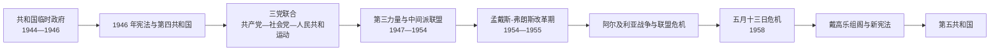

# 法兰西第四共和国

## 时间

1946 年 10 月 27 日—1958 年 10 月 4 日；总统和最后一届政府的制度交接延续至 1959 年 1 月。

## 概括

第四共和国在解放、临时政府改革和两次制宪公投后建立。它延续议会共和传统，以国民议会为政治中心；短命内阁频繁更替，却完成战后重建、福利制度扩张、现代化计划和欧洲一体化起步。政权的根本困难不只是“内阁不稳”，而是多党联盟、殖民战争和军队政治化相互强化：当阿尔及利亚战争把本土政府、殖民者和军方推向公开冲突时，现有制度失去有效指挥能力，戴高乐在 1958 年危机中重返政坛并建立第五共和国。

## 建立背景

- 1945 年公投否决简单恢复第三共和国制度，选民授权制宪会议起草新宪法。共产党、社会党和人民共和运动构成“三党联合”，共同支持国有化、社会保障与计划重建。
- 第一份偏重一院制的宪法草案在 1946 年 5 月公投中被否决。第二届制宪会议增加共和国院和总统等制衡机构，10 月公投通过，27 日公布实施。
- 戴高乐主张拥有独立民意基础的强行政权，反对政党和议会主导，在 1946 年巴约演说中提出另一种宪政构想；他在第一份草案完成前已辞去临时政府首脑职务。
- 新宪法设总统、部长会议主席、国民议会和共和国院。国民议会通过对政府的投资表决并能倒阁；党派数量多、内部纪律有限，使多数联盟易因预算、教育、殖民和外交问题破裂。

## 统治结构

| 层级 | 产生方式 | 权力与实际作用 |
|---|---|---|
| 共和国总统 | 由议会选举 | 任命部长会议主席、主持部分国家礼仪和调解；不直接领导日常政策 |
| 部长会议主席 | 总统提名并须取得国民议会支持 | 组织内阁、提出政策，对国民议会负责；早期复杂投资程序增加组阁难度 |
| 国民议会 | 直接选举 | 掌握立法、预算和政府生存；是制度的政治中心 |
| 共和国院 | 间接选举 | 起初主要咨询和复议，后经改革恢复部分立法影响，但仍弱于国民议会 |
| 政党与联盟 | 共产党、社会党、人民共和运动、激进党、独立派、戴高乐派等 | 党团协商决定内阁构成；共产党和戴高乐派长期处于体制外反对位置 |
| 常任行政与计划机构 | 高级文官、财政部门、计划总署等 | 在内阁更替间维持重建、预算、殖民行政和欧洲政策连续 |

两位共和国总统、十六位部长会议主席及二十四届内阁的连续关系见[法兰西第三与第四共和国国家领导人表](/%E4%BA%BA%E6%96%87%E7%A7%91%E5%AD%A6/%E5%8E%86%E5%8F%B2/%E6%AC%A7%E6%B4%B2/%E6%B3%95%E5%9B%BD/%E6%B3%95%E5%85%B0%E8%A5%BF%E7%AC%AC%E4%B8%89%E4%B8%8E%E7%AC%AC%E5%9B%9B%E5%85%B1%E5%92%8C%E5%9B%BD%E5%9B%BD%E5%AE%B6%E9%A2%86%E5%AF%BC%E4%BA%BA%E8%A1%A8.md)。

## 分阶段发展

### 三党联合与冷战转折：1946—1947

- 共产党、社会党和人民共和运动继承临时政府改革，但在工资、物价、印度支那战争和对美关系上分歧扩大。1947 年拉马迪埃解除共产党部长职务，三党联合结束。
- 大罢工、配给短缺与冷战对立同时加剧。共产党成为强大反对党，戴高乐建立法兰西人民联盟，从另一方向批评“政党制度”；中间党派于是组成排除两者的“第三力量”。
- 马歇尔计划向法国提供物资、设备和外汇，莫内计划把煤、电、钢、交通、农业机械化等列为优先部门，为国家引导的现代化提供框架。

### 重建、增长与欧洲整合：1948—1954

- 工业产量、基础设施和住房逐步恢复，国有企业、信贷控制和私人企业共同构成混合经济。婴儿潮、农村人口向城市迁移和消费社会起步，形成后来所谓“辉煌三十年”的早期阶段。
- 经济增长并未消除生活困难：住房短缺、通胀、工资冲突和地区差距持续存在。社会保障覆盖扩大，但不同职业制度并不完全统一。
- 1950 年舒曼计划建议把法德煤钢生产置于共同机构，1951 年欧洲煤钢共同体成立。法国借欧洲整合约束德国重工业并扩大共同市场。
- 冷战推动法国加入北约。普利文提出欧洲防务共同体，希望在欧洲框架中重新武装西德；法国国民议会 1954 年拒绝批准，引发政府和联盟危机，西德随后通过西欧联盟和北约框架恢复主权与军力。

### 殖民战争与有限改革：1946—1956

- 法国试图把帝国改造为“法兰西联盟”，但实际权利仍不平等。1947 年马达加斯加起义遭到大规模军事镇压，显示新共和制度仍维持强制殖民秩序。
- 印度支那战争从 1946 年海防、河内冲突升级为与越南民主共和国的全面战争。中华人民共和国成立和朝鲜战争后，冲突国际化；美国承担越来越多法方战争费用。
- 1954 年奠边府战败后，孟戴斯-弗朗斯政府在日内瓦会议接受停火和印度支那分区安排，结束法国主要作战。他同时推动突尼斯内部自治。
- 摩洛哥和突尼斯在 1956 年获得独立。北非改革的部分成功没有延伸到被法律视为法国省份、又有大量欧洲移民定居的阿尔及利亚。

### 阿尔及利亚、苏伊士与制度危机：1954—1958

- 1954 年民族解放阵线发动起义，法国政府把冲突定义为国内治安问题并不断增兵。居伊·摩勒 1956 年获得特别权力，军方在阿尔及尔获得广泛治安权限。
- 1957 年“阿尔及尔战役”中，法军以情报、封锁和系统性酷刑摧毁城市网络，却严重损害共和法治和国际声誉；农村战争、人口迁移与报复暴力持续。
- 1956 年法国与英国、以色列进攻埃及，试图夺回苏伊士运河并打击援助阿尔及利亚民族主义的纳赛尔。美国和苏联压力迫使撤军，暴露欧洲旧强权的战略限度。
- 1957 年《罗马条约》建立欧洲经济共同体和欧洲原子能共同体。欧洲政策在内阁更替中保持连续，成为第四共和国最持久的制度遗产之一。
- 1958 年 5 月，阿尔及尔殖民者、军官和政界人士建立“公共安全委员会”，担忧巴黎政府谈判撤退并要求戴高乐掌权。驻军对科西嘉的控制和进军本土的威胁使危机带有军事政变压力。

## 重要事件

| 时间 | 事件 | 过程与影响 |
|---|---|---|
| 1946 年 5 月、10 月 | 两次制宪公投 | 第一草案被否决，第二草案建立两院议会共和国 |
| 1947 年 5 月 | 共产党部长离开政府 | 三党联合终结，冷战政党格局形成 |
| 1947—1948 | 罢工与马歇尔计划 | 社会冲突加剧，同时获得重建设备与外汇 |
| 1947 | 马达加斯加起义及镇压 | 暴露殖民改革的限度和国家暴力 |
| 1950 | 舒曼宣言 | 启动煤钢共同体和法德制度化合作 |
| 1954 年 5 月 | 奠边府战败 | 印度支那战争进入谈判终局 |
| 1954 年 7 月 | 日内瓦协议 | 法国结束印度支那主要战争，越南暂时分区 |
| 1954 年 11 月 | 阿尔及利亚战争开始 | 殖民危机转为持续军事—政治冲突 |
| 1954 年 8 月 | 欧洲防务共同体被否决 | 暴露议会联盟和德国问题的深刻分歧 |
| 1956 | 摩洛哥、突尼斯独立 | 北非保护国体制结束 |
| 1956 年 10—11 月 | 苏伊士危机 | 法英军事行动在美苏压力下失败 |
| 1957 年 3 月 | 《罗马条约》 | 奠定欧洲经济共同体 |
| 1957 | 阿尔及尔战役 | 军事胜利与酷刑争议同时扩大政治危机 |
| 1958 年 5—6 月 | 五月十三日危机与戴高乐组阁 | 军队和殖民者压力迫使政权转向强行政宪制 |
| 1958 年 9—10 月 | 新宪法公投并公布 | 第四共和国终结，第五共和国成立 |

## 衰落与终结原因

### 结构因素

- 比例代表和多党格局使任何政府都依赖异质联盟；投资程序、倒阁威胁和政党内部派系增加内阁寿命的不确定性。
- 短命内阁没有阻止经济和欧洲政策连续，却妨碍政府为长期殖民战争承担明确责任；议会常把军事权限下放给行政和军队，又难以监督其使用。
- 共产党与戴高乐派分别拥有大量选票却长期不参与多数联盟，中间党派的组合空间因而狭窄。

### 外部压力

- 冷战、德国重建、印度支那战争和阿尔及利亚战争同时消耗财政、军力与政治资本。
- 殖民地民族主义、美国反殖民压力和亚非国际支持削弱维持帝国的条件；欧洲整合又要求法国重新分配战略资源。

### 直接触发

- 1958 年 4 月加亚尔政府倒台后长期组阁困难，皮埃尔·弗林姆兰的谈判倾向刺激阿尔及尔军政集团行动。
- 5 月 13 日公共安全委员会夺取当地政治主动，军方以“复活行动”准备干预本土。科蒂总统宣布若戴高乐不能组阁，自己将辞职。
- 戴高乐获议会授权出任部长会议主席并在六个月内以法令施政、起草新宪法。9 月公投通过、10 月公布后，危机以合法表决形式完成制度更换，但军事压力是不可忽视的背景。

## 演变关系

- 前承：[维希法国、自由法国与共和国临时政府](/%E4%BA%BA%E6%96%87%E7%A7%91%E5%AD%A6/%E5%8E%86%E5%8F%B2/%E6%AC%A7%E6%B4%B2/%E6%B3%95%E5%9B%BD/%E7%BB%B4%E5%B8%8C%E6%B3%95%E5%9B%BD%E4%B8%8E%E8%87%AA%E7%94%B1%E6%B3%95%E5%9B%BD.md)恢复共和合法性并奠定战后社会经济制度。
- 后继：[法兰西第五共和国](/%E4%BA%BA%E6%96%87%E7%A7%91%E5%AD%A6/%E5%8E%86%E5%8F%B2/%E6%AC%A7%E6%B4%B2/%E6%B3%95%E5%9B%BD/%E6%B3%95%E5%85%B0%E8%A5%BF%E7%AC%AC%E4%BA%94%E5%85%B1%E5%92%8C%E5%9B%BD.md)继承欧洲整合和现代化政策，同时以强行政权回应第四共和国危机。
- 领导人专表：[法兰西第三与第四共和国国家领导人表](/%E4%BA%BA%E6%96%87%E7%A7%91%E5%AD%A6/%E5%8E%86%E5%8F%B2/%E6%AC%A7%E6%B4%B2/%E6%B3%95%E5%9B%BD/%E6%B3%95%E5%85%B0%E8%A5%BF%E7%AC%AC%E4%B8%89%E4%B8%8E%E7%AC%AC%E5%9B%9B%E5%85%B1%E5%92%8C%E5%9B%BD%E5%9B%BD%E5%AE%B6%E9%A2%86%E5%AF%BC%E4%BA%BA%E8%A1%A8.md)。
