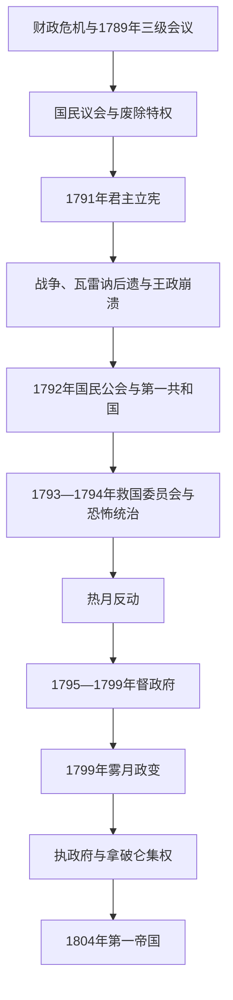

# 法国大革命与第一共和国

## 时间

1789—1804年；第一共和国自1792年9月建立，1799年后进入执政府阶段

## 别称

法国大革命、法兰西第一共和国、督政府与执政府

## 概括

法国大革命源自国家债务与税制失灵，却因粮价、等级特权、启蒙公共舆论、王权决策危机和群众动员而超出一次财政改革。1789—1791年制宪议会废除等级特权、建立公民平等与君主立宪；国王出逃、对外战争和国内反革命使共和国在1792年诞生。国民公会面对欧洲联盟、旺代战争和经济危机，以救国委员会和非常措施动员全国，也造成恐怖统治和政治清洗。

1794年热月政变后，督政府试图以分权宪法防止独裁，却依赖军队、政变和战争收入。1799年拿破仑发动雾月政变，执政府恢复行政稳定、统一法律和财政，同时压缩选举与新闻自由。1804年拿破仑称帝，第一共和国的政体终结；公民身份、行政区划、土地改革和法典却被帝国与后世继承。

## 演进图

## 革命背景

- **财政国家危机**：七年战争和美国独立战争留下高额债务，税收因等级豁免、包税和地区差异无法稳定增长；王室又缺乏常设全国代表机关来批准改革。
- **经济与生计**：1788年歉收推高面包价格，城市工资和就业承压；农民反感封建捐税、什一税和公共负担。
- **政治文化**：启蒙著作、法院争论、报刊、俱乐部和美国革命扩大“国民”“宪法”“权利”的语言，但参与者对君主制、财产、宗教和社会平等并无共识。
- **直接触发**：三级会议的代表名额和按等级或按人头表决争议，使第三等级宣布为国民议会；王室调兵和罢免内克又引发巴黎武装动员。

## 分阶段发展

### 制宪革命与君主立宪（1789—1792年）

1789年6月网球场宣誓宣称代表不会在制定宪法前解散；7月14日巴士底狱被攻占，地方“大恐慌”推动8月4日废除封建特权。《人权和公民权宣言》确立法律平等、国民主权与财产权。教会土地国有化、指券发行和1790年《教士公民组织法》缓解财政却分裂宗教社会。83个省、统一度量衡和司法改革重塑行政空间。

1791年6月瓦雷讷出逃证明国王不接受革命方向；同年宪法仍实行财产资格区分的间接选举。1792年对奥地利开战后法军失利、布伦瑞克宣言威胁巴黎，激进派把国王视为通敌者。8月10日王宫被攻，9月国民公会废除王政并建立共和国。

### 国民公会、战争与恐怖统治（1792—1794年）

国民公会由吉伦特派、山岳派和平原派竞争。1793年1月路易十六被处决，欧洲反法联盟扩大；征兵、粮价和宗教政策引发旺代战争及联邦派起义。巴黎无套裤汉要求限价和惩治囤积，山岳派在群众压力下排除吉伦特派。

救国委员会、治安委员会、革命法庭、全民征兵和最高限价共同组成非常统治。罗伯斯庇尔、圣茹斯特、卡诺等人分工政治与军事；“恐怖”既打击保王派，也吞噬革命派内部的埃贝尔派、丹东派。1794年法军形势改善、派系恐惧和权力集中使国民公会在热月九日逮捕并处决罗伯斯庇尔集团。

革命的普遍权利与殖民现实尖锐冲突。圣多明各奴隶起义迫使专员宣布解放，国民公会1794年废除殖民地奴隶制；拿破仑执政府1802年又恢复奴隶制和奴隶贸易，圣多明各战争最终促成海地独立。

### 热月与督政府（1794—1799年）

热月派关闭雅各宾俱乐部、取消限价并打击激进群众，通货膨胀和粮荒恶化。1795年宪法设五人督政府和两院立法机关，以复杂财产选举和分权防止国民公会式集中。保王派与新雅各宾派都可能赢得选举，督政府便以果月等政变排除反对者。

军队在镇压巴黎保王派、维持国内政权和对外扩张中地位上升。拿破仑意大利战役带来声望、赔款和附庸共和国；埃及远征战略受挫，却未毁其政治资本。财政破产、选举反复被推翻和第二次反法联盟压力让部分精英寻求强行政。

### 执政府与共和国终结（1799—1804年）

西哀士策划改宪，拿破仑以军队支持在雾月十八—十九日迫使议会迁移并解散。共和八年宪法设三名执政，但第一执政拿破仑控制任命、立法提案、外交和军队，公民投票为个人权力提供合法性。省长制、法兰西银行、1801年政教协定、教育和1804年《民法典》稳定国家，也恢复殖民奴隶制、审查新闻并压制反对派。

1802年拿破仑成为终身执政，1804年元老院宣布帝制。称帝不是革命制度被整体复辟：法律平等、行政中央化和财产重分配延续；但共和集体主权被世袭皇位和个人统治取代。

## 国家元首、政府首脑与实际权力结构

### 革命至国民公会

| 阶段 | 法定国家权力 | 行政或政府机构 | 实际权力说明 |
|---|---|---|---|
| 1789—1791年 | 制宪国民议会；路易十六仍为国王 | 国王大臣与议会委员会 | 议会制定宪法，巴黎市政、国民自卫军和群众也能改变决策。 |
| 1791—1792年 | 立法议会与立宪国王 | 国王任命大臣并有暂缓否决权 | 战争和王权信任危机使制度失效。 |
| 1792—1793年 | 国民公会 | 临时执行委员会 | 吉伦特派先居优势，巴黎公社和山岳派压力上升。 |
| 1793—1794年 | 国民公会 | **救国委员会**及治安委员会 | 委员会集体执政；罗伯斯庇尔影响突出但不是法律上的“共和国总统”。 |
| 1794—1795年 | 热月派国民公会 | 改组后的委员会 | 终止雅各宾非常统治并制定新宪法。 |

### 督政府完整督政官

督政府每年轮换一席，政变和辞职造成多次更替；下表列全体曾任督政官者，而非把“督政府”误写成一位总统。

| 顺序 | 督政官 | 任期 | 关键说明 |
|---:|---|---|---|
| 1 | **保罗·巴拉斯** | 1795—1799年 | 唯一贯穿督政府全期者，依赖政治联盟与军队。 |
| 2 | 拉雷韦利耶-勒波 | 1795—1799年 | 原始五督之一，牧月政变后辞职。 |
| 3 | 让-弗朗索瓦·勒贝尔 | 1795—1799年 | 原始五督之一，按轮换退任。 |
| 4 | 拉扎尔·卡诺 | 1795—1797年 | 军事组织者，果月政变后被排除。 |
| 5 | 埃蒂安-弗朗索瓦·勒图尔纳 | 1795—1797年 | 原始五督之一，首位轮换离任。 |
| 6 | 弗朗索瓦·巴泰勒米 | 1797年 | 保守派，果月政变中被捕流放。 |
| 7 | 菲利普-安托万·梅兰·德·杜埃 | 1797—1799年 | 果月政变后入任。 |
| 8 | 弗朗索瓦·德·讷沙托 | 1797—1798年 | 后按轮换离任。 |
| 9 | 让-巴蒂斯特·特雷亚尔 | 1798—1799年 | 其选举后来被判程序无效而离任。 |
| 10 | 埃马纽埃尔-约瑟夫·西哀士 | 1799年 | 策划改宪并联合拿破仑发动雾月政变。 |
| 11 | 罗歇·迪科 | 1799年 | 支持西哀士和雾月政变，后任临时执政。 |
| 12 | 路易-热罗姆·戈耶 | 1799年 | 反对政变，雾月后被迫退出。 |
| 13 | 让-弗朗索瓦-奥古斯特·穆兰 | 1799年 | 军人督政官，反对雾月政变。 |

### 执政府

| 职位 | 人物 | 任期 | 实际作用 |
|---|---|---|---|
| 临时第一执政 | **拿破仑·波拿巴** | 1799年11—12月 | 与西哀士、迪科组成临时三执政，主导新宪法。 |
| 临时执政 | 西哀士、罗歇·迪科 | 1799年11—12月 | 参与政变，正式宪法生效后退出。 |
| 第一执政 | **拿破仑·波拿巴** | 1799—1804年 | 掌行政、任命、军队和外交；1802年成为终身执政。 |
| 第二执政 | 让-雅克-雷吉斯·德·康巴塞雷斯 | 1799—1804年 | 法律与行政协调核心，参与《民法典》。 |
| 第三执政 | 夏尔-弗朗索瓦·勒布伦 | 1799—1804年 | 负责财政行政经验与协调。 |

## 重要事件

| 时间 | 事件 | 结果与影响 |
|---|---|---|
| 1789年5—6月 | 三级会议、国民议会与网球场宣誓 | 财政会议转化为制宪革命。 |
| 1789年7月14日 | 攻占巴士底狱 | 巴黎群众武装介入，王权失去强制主动。 |
| 1789年8月 | 八月法令与《人权宣言》 | 废除等级特权并宣布国民、公民和法律平等原则。 |
| 1790年 | 《教士公民组织法》 | 教会国家化引发宣誓派与拒誓派分裂。 |
| 1791年6月 | 瓦雷讷出逃 | 国王信誉崩溃，共和主义扩大。 |
| 1792年4—9月 | 对外战争、王宫陷落和共和国建立 | 君主立宪失败，革命与欧洲战争结合。 |
| 1793年1月 | 处决路易十六 | 反法联盟扩大，国内政治激化。 |
| 1793年 | 旺代战争、联邦派起义与全民征兵 | 内战与外战推动非常政府。 |
| 1793—1794年 | 恐怖统治与最高限价 | 战时动员加强，同时造成司法与政治暴力。 |
| 1794年2月 | 首次废除殖民地奴隶制 | 革命普遍权利扩展，但1802年被执政府逆转。 |
| 1794年7月 | 热月九日 | 罗伯斯庇尔集团倒台，革命政治右转。 |
| 1795年 | 共和三年宪法 | 五人督政府和两院制建立。 |
| 1797年 | 果月政变 | 督政府以军力推翻不利选举，宪政信誉下降。 |
| 1799年11月 | 雾月政变 | 拿破仑结束督政府，建立执政府。 |
| 1801—1804年 | 政教协定、行政财政与法典改革 | 巩固革命后的国家和财产权秩序。 |
| 1804年 | 拿破仑称帝 | 第一共和国政体终结，进入第一帝国。 |

## 崛起、激进化与终结原因

- **革命成功条件**：财政破产迫使王权开放代表政治；地方和巴黎群众动员阻止强制解散；军队一度不愿镇压；等级内部也有改革派。
- **激进化结构**：革命国家需同时重建税制、教会、地方行政和战争动员；国王出逃、内战与外敌使政治妥协空间缩小。
- **外部压力**：欧洲君主国干预与法国主动宣战相互强化，战争既威胁革命也让军队和将领获得政治资源。
- **恐怖统治终结**：军事局势改善后，非常权力正当性下降；委员会内部互不信任和罗伯斯庇尔清洗威胁促成热月联盟。
- **督政府衰亡**：狭窄选举基础、通胀和财政破产、连续政变及对军队赔款依赖，使其无法建立规则稳定性。
- **直接触发**：西哀士寻求改宪，拿破仑提供声望和军力；雾月政变后第一执政不断集中权力，1804年世袭帝制完成制度转型。

## 演变关系

- 前一节点：[波旁王朝](/%E4%BA%BA%E6%96%87%E7%A7%91%E5%AD%A6/%E5%8E%86%E5%8F%B2/%E6%AC%A7%E6%B4%B2/%E6%B3%95%E5%9B%BD/%E6%B3%A2%E6%97%81%E7%8E%8B%E6%9C%9D.md)。
- 后一节点：[法兰西第一帝国](/%E4%BA%BA%E6%96%87%E7%A7%91%E5%AD%A6/%E5%8E%86%E5%8F%B2/%E6%AC%A7%E6%B4%B2/%E6%B3%95%E5%9B%BD/%E6%B3%95%E5%85%B0%E8%A5%BF%E7%AC%AC%E4%B8%80%E5%B8%9D%E5%9B%BD.md)。
- 海地革命与殖民废奴需从加勒比本地历史并读，本页只说明法国政体决策。
- 所属总览：[法国历史](/%E4%BA%BA%E6%96%87%E7%A7%91%E5%AD%A6/%E5%8E%86%E5%8F%B2/%E6%AC%A7%E6%B4%B2/%E6%B3%95%E5%9B%BD/README.md)。
