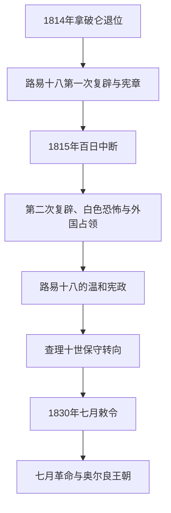

# 波旁复辟

## 时间

1814—1815年；1815—1830年

## 别称

第一次与第二次波旁复辟、Bourbon Restoration

## 概括

反法联盟推翻第一帝国后，路易十六之弟路易十八返回法国。复辟不是1789年前旧制度的简单恢复：《1814年宪章》承认法律平等、革命时期财产转移、《民法典》、两院议会和有限宗教宽容，同时宣称王权授予宪章。王室、贵族、天主教与“极端保王派”希望恢复传统权威，革命和帝国精英则保卫财产与官职；复辟政治一直在两者之间摆动。

路易十八较重妥协，百日王朝后又压制白色恐怖和“无双议院”；查理十世则强化教会、贵族赔偿和王权解释。1820年代经济与外交并非全无成果，法国重新进入列强协调并于1830年占领阿尔及尔；但查理十世用七月敕令解散新议院、限制新闻和改变选举，直接触发三日革命。奥尔良支系随后以“法国人的国王”取代正统波旁支系。

## 演进图

## 建立与统治结构

1814年参议院曾提出由国民主权约束国王的宪法，路易十八拒绝其来源，却在《宪章》中接受许多内容。国王拥有行政权、任命贵族院、提出和批准法律、解散众议院；众议院由高额纳税资格的少数男性选民产生，部长逐渐需要议会支持，但责任内阁原则并未一次写定。

| 权力中心 | 作用 | 实际限制 |
|---|---|---|
| 国王 | 任命部长、外交军权、法令与解散众议院 | 需维持预算、上院、众院和公共舆论支持；革命土地不可轻易收回。 |
| 贵族院 | 世袭或终身贵族组成，审议法律和重大审判 | 由国王任命，可通过增补改变多数。 |
| 众议院 | 审议法律和预算 | 选举权仅属极少数高额纳税男性，政治代表狭窄。 |
| 部长会议 | 执行政策并逐步形成议会责任 | 国王仍可绕过多数选择亲信，最终造成1830年危机。 |
| 高级官僚、军队与司法 | 多数沿用帝国人员和制度 | 保王派不信任“波拿巴分子”，清洗过度又会破坏国家能力。 |

## 完整君主世系

| 顺序 | 君主 | 在位 | 生卒 | 与前任关系 | 关键说明 |
|---:|---|---|---|---|---|
| 1 | **路易十八** | 1814年5月—1815年3月；1815年7月—1824年 | 1755—1824年 | 路易十六之弟；以侄儿“路易十七”名义编号 | 颁布《1814年宪章》，百日期间出逃，第二次复辟后逐步压制极端保王派。 |
| 2 | **查理十世** | 1824—1830年 | 1757—1836年 | 路易十八之弟 | 贵族赔偿、宗教保守与七月敕令；革命后退位流亡。 |

### 1830年名义继承争议

| 人物 | 保王派称号 | 事实 |
|---|---|---|
| 路易-安托万（昂古莱姆公爵） | “路易十九” | 查理十世1830年8月2日退位时，他随后签署放弃；未被议会接受、未组织政府，不能列为实际统治君主。 |
| 亨利（波尔多公爵、尚博尔伯爵） | “亨利五世” | 查理十世希望王位传给孙辈亨利，但议会选择奥尔良公爵路易-菲利普；亨利终身为正统派王位觊觎者。 |

## 历届政府首脑

| 顺序 | 政府首脑 | 任期 | 政治方向与事件 |
|---:|---|---|---|
| 1 | 塔列朗 | 1814年临时政府；1815年7—9月 | 协助第一次复辟外交，第二次复辟初任首相。 |
| 2 | 黎塞留公爵 | 1815—1818年；1820—1821年 | 处理赔款、盟军占领和温和保王联盟。 |
| 3 | 德索勒侯爵 | 1818—1819年 | 自由派保王阶段。 |
| 4 | 德卡兹公爵 | 1819—1820年 | 路易十八宠臣，贝里公爵遇刺后被迫下台。 |
| 5 | 维莱尔伯爵 | 1821—1828年 | 极端保王派长期政府，贵族赔偿与教会政策。 |
| 6 | 马蒂尼亚克子爵 | 1828—1829年 | 温和妥协失败。 |
| 7 | 波利尼亚克亲王 | 1829—1830年 | 无议会多数，推动七月敕令，政权崩溃。 |

## 分阶段发展与重要事件

| 时间 | 事件 | 过程与影响 |
|---|---|---|
| 1814年 | 《1814年宪章》 | 君主制同革命法律平等、财产权和两院制结合。 |
| 1815年3—7月 | 百日王朝 | 路易十八出逃，比利时战役后返回。 |
| 1815年 | 白色恐怖与“无双议院” | 南法保王暴力及议会清洗波拿巴派、共和派；国王1816年解散议院。 |
| 1815—1818年 | 盟军占领与赔款 | 法国偿付赔款后提前结束占领，重新加入列强协调。 |
| 1820年 | 贝里公爵遇刺 | 保王派以此推动选举和新闻管制右转。 |
| 1823年 | 远征西班牙 | 法军恢复西班牙波旁绝对王权，提升复辟外交声望。 |
| 1824年 | 查理十世继位 | 王权礼仪和教会影响增强。 |
| 1825年 | 流亡贵族赔偿与“亵渎法” | 国家补偿革命没收财产，反教权和自由派批评扩大。 |
| 1827—1829年 | 选举失利与马蒂尼亚克妥协 | 国王拒绝长期接受中间路线。 |
| 1830年6月 | 阿尔及尔登陆 | 开启法国长期殖民统治，胜利未挽救国内政权。 |
| 1830年7月 | 七月敕令与三日革命 | 限制新闻、解散议院、改变选举；巴黎起义迫使国王退位。 |

## 崛起与覆亡原因

- **复辟条件**：盟军胜利、战争疲劳和保留革命财产的宪章妥协，使波旁能够返回；行政精英连续性维持国家。
- **结构矛盾**：王权合法性诉诸世袭与神意，社会却已接受国民、公民和财产权；狭窄选举又排除大多数资产者与劳动者。
- **外部环境**：列强初期限制法国，1818年后法国恢复地位；阿尔及利亚行动反而显示外交军事成功不能替代国内合法性。
- **直接触发**：1830年选举给反对派多数，查理十世以宪章第14条发布敕令夺回控制；印刷工、学生、工人与国民自卫军在巴黎筑垒反抗。
- **灭亡过程**：军队无法迅速控制首都，议会自由派拒绝共和国激进路线，转而拥立奥尔良公爵；正统波旁被旁支君主立宷取代。

## 演变关系

- 前一节点：[法兰西第一帝国](/%E4%BA%BA%E6%96%87%E7%A7%91%E5%AD%A6/%E5%8E%86%E5%8F%B2/%E6%AC%A7%E6%B4%B2/%E6%B3%95%E5%9B%BD/%E6%B3%95%E5%85%B0%E8%A5%BF%E7%AC%AC%E4%B8%80%E5%B8%9D%E5%9B%BD.md)。
- 后一节点：[七月王朝](/%E4%BA%BA%E6%96%87%E7%A7%91%E5%AD%A6/%E5%8E%86%E5%8F%B2/%E6%AC%A7%E6%B4%B2/%E6%B3%95%E5%9B%BD/%E4%B8%83%E6%9C%88%E7%8E%8B%E6%9C%9D.md)。
- 殖民阿尔及利亚须与北非本地历史并读。
- 所属总览：[法国历史](/%E4%BA%BA%E6%96%87%E7%A7%91%E5%AD%A6/%E5%8E%86%E5%8F%B2/%E6%AC%A7%E6%B4%B2/%E6%B3%95%E5%9B%BD/README.md)。
