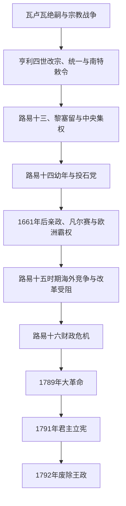

# 波旁王朝

## 时间

1589—1792年（大革命前及君主立宪时期的法国波旁王统）

## 别称

法国波旁王朝、旧制度后期

## 概括

1589年瓦卢瓦绝嗣后，纳瓦拉国王亨利以卡佩男性旁支身份继承法国王位。其新教背景使天主教联盟拒绝承认，亨利经战争、改宗和赦免进入巴黎，1598年《南特敕令》暂时结束宗教战争。路易十三与黎塞留、路易十四与马萨林—科尔贝尔继续压制独立军事贵族、发展地方监察和常备军，使法国成为17世纪欧洲最强国家之一。

“绝对君主制”并不表示国王可不受财政、习惯法、教会、高等法院和地方特权限制。路易十四的战争、宫廷与宗教统一政策扩大国家，也累积债务和社会成本；路易十五时期海外战争失败、税制改革受阻和王权声望下降；路易十六面对债务、特权等级与粮价危机，无法在既有制度内取得全国性税收同意。1789年三级会议转化为革命，1791年君主立宪未能解决国王信任和战争问题，1792年王政被废。

## 王朝演进图

## 建立与崛起

纳瓦拉的亨利在1589年继承时控制法国西南和胡格诺军队，巴黎及天主教联盟则获西班牙支持。亨利1593年改宗天主教，1594年在沙特尔加冕并进入巴黎，以赦免、收买和军事行动瓦解联盟。1598年《韦尔万和约》结束同西班牙战争，《南特敕令》给予胡格诺派礼拜、司法和部分安全保障。絮利整顿债务、道路与农业，王权从数十年内战中恢复。

## 分阶段发展

### 亨利四世与路易十三（1589—1643年）

亨利四世保留宗教妥协，同时重建税收和王室权威；1610年遇刺后，玛丽·德·美第奇为幼子路易十三摄政。黎塞留1624年进入权力核心，围困拉罗谢尔并以1629年《阿莱和约》取消胡格诺派军事政治据点，但保留有限宗教权利。他打击贵族私战和叛乱、派遣非常监察官，并以国家利益为由在三十年战争中反对哈布斯堡。中央集权仍依赖官职、包税和地方中介，并非完整现代官僚制。

### 路易十四的国家与战争（1643—1715年）

路易十四幼年由安娜王后摄政，马萨林掌政。1648—1653年投石党运动由高等法院、贵族与地方不满交织，最终因派系分裂和战争疲劳失败。1661年马萨林死后，路易十四宣布亲政；科尔贝尔整顿财政、制造业、海军和殖民贸易，卢瓦、勒泰利耶等人建设常备军。凡尔赛既集中宫廷恩庇与礼仪，也把贵族服务国家化，但贵族并未失去土地和地方特权。

法国在遗产战争、荷兰战争和“重聚”政策中扩张，1682年王廷迁驻凡尔赛。1685年废除《南特敕令》导致胡格诺派迫害、改宗与外逃。奥格斯堡同盟战争和西班牙王位继承战争促成欧洲联合制衡；1713年《乌得勒支和约》承认波旁亲王为西班牙国王，但规定法西王冠不得合并。法国保住大国地位，却债台高筑、人口与农业受战争和气候冲击。

### 路易十五：繁荣、帝国竞争与信誉下降（1715—1774年）

奥尔良公爵腓力1715—1723年摄政，约翰·劳金融体系的泡沫破裂损害信用。弗勒里红衣主教1726—1743年维持相对节制；其后法国参与奥地利王位继承战争和七年战争。1763年和约使法国失去加拿大和多数印度政治据点，保留加勒比盈利殖民地及贸易站；海军和财政改革却难以突破特权。

启蒙思想、公共舆论和高等法院把财政司法争端政治化。莫普1771年取消旧高等法院并重组司法，试图绕开法官反对；这一强制改革后来被路易十六恢复，使王权在改革与传统合法性之间摇摆。路易十五时期并非经济全面衰落，人口、商业和消费都有增长，关键问题是国家无法公平稳定地征收支撑战争的税。

### 路易十六与革命（1774—1792年）

路易十六先后任用杜尔哥、内克、卡洛讷和布里安，尝试削减支出、放松粮食贸易、设普遍土地税或向特权等级征税。援助美国独立战争打击英国，却显著增加债务。1787年显贵会议拒绝承担改革合法性，巴黎高等法院要求只有三级会议能批准新税；1788年财政停付和歉收迫使国王召集1789年三级会议。

第三等级人数虽加倍，表决方式仍争议不断。国民议会、巴士底狱、八月法令和《人权宣言》摧毁等级特权。1791年宪法保留国王的暂缓否决权和行政权，但国王出逃瓦雷讷使公众怀疑其忠诚。1792年对奥地利战争、败局、王室同外敌联系的证据和巴黎群众动员导致8月10日杜伊勒里宫被攻；9月国民公会废除君主制，路易十六次年被处决。

## 完整君主世系

| 顺序 | 君主 | 在位 | 生卒 | 与前任关系 | 关键事件与备注 |
|---:|---|---|---|---|---|
| 1 | **亨利四世** | 1589—1610年 | 1553—1610年 | 亨利三世远房表亲；卡佩—波旁男性旁支 | 原为纳瓦拉国王和胡格诺派领袖；改宗、统一法国，颁布《南特敕令》，遇刺身亡。 |
| 2 | 路易十三 | 1610—1643年 | 1601—1643年 | 亨利四世之子 | 幼年由母后摄政；黎塞留掌政时期压制贵族与胡格诺军事据点。 |
| 3 | **路易十四** | 1643—1715年 | 1638—1715年 | 路易十三之子 | 幼年由安娜王后摄政；1661年亲政，凡尔赛、常备军、战争与宗教统一。 |
| 4 | 路易十五 | 1715—1774年 | 1710—1774年 | 路易十四曾孙 | 幼年由奥尔良公爵摄政；七年战争失败、改革冲突与王权信誉下降。 |
| 5 | **路易十六** | 1774—1792年 | 1754—1793年 | 路易十五之孙 | 财政改革失败，召集三级会议；1791年成为立宪国王，1792年被废、1793年处决。 |

### 摄政与名义继承辨析

| 人物 | 时间 | 角色与说明 |
|---|---|---|
| 玛丽·德·美第奇 | 1610—1614年 | 路易十三幼年摄政；成年后仍一度掌权，后与国王及黎塞留冲突。 |
| 奥地利的安娜 | 1643—1651年 | 路易十四幼年摄政，马萨林为主要大臣；国王虽1651年成年，至1661年才亲自掌政。 |
| 奥尔良公爵腓力二世 | 1715—1723年 | 路易十五幼年摄政。 |
| “路易十七” | 1793—1795年 | 路易十六之子路易-夏尔在囚禁中被保王派视为国王，但从未执政，不能列为1789年前后实际君主；路易十八的编号以此主张为前提。 |

## 统治结构

| 机构 | 实际作用 | 限制与矛盾 |
|---|---|---|
| 国王与国务会议 | 决定战争、外交、法令和任命；“朕即国家”是后世概括，并非正式宪法条文。 | 受王朝法、天主教身份、财产、地方习惯和财政信用约束。 |
| 大臣与总监 | 财政总监、陆军、海军、外交及宫廷部门专业化 | 大臣靠个人信任，缺乏统一责任内阁。 |
| 地方监察官 | 在财政、警务、司法上代表王权 | 仍需与省级等级会、城市和领主合作。 |
| 高等法院 | 最高司法法院并登记王令 | 法官官职世袭化，以“谏诤”阻挡税收改革，同时维护本身特权。 |
| 三级会议 | 1614年后至1789年未召开 | 缺乏常设全国税收代表机制，危机时只能突然重启。 |
| 教会、贵族与第三等级 | 前两等级享身份和部分税收特权；第三等级内部包括资产者、城市劳动者和农民 | 法律身份与实际财富并不完全一致，特权阻碍公平财政改革。 |
| 殖民与贸易公司 | 管理加勒比、北美、印度洋和非洲据点及奴隶贸易 | 殖民财富伴随奴役、战争和高风险财政，不能只作为“繁荣”叙述。 |

## 重要事件

| 时间 | 事件 | 影响 |
|---|---|---|
| 1593—1594年 | 亨利四世改宗并进入巴黎 | 瓦解天主教联盟的主要合法性障碍。 |
| 1598年 | 《南特敕令》与《韦尔万和约》 | 暂停宗教内战并结束西班牙干预。 |
| 1610年 | 亨利四世遇刺 | 幼主摄政再次出现。 |
| 1627—1629年 | 拉罗谢尔围城与《阿莱和约》 | 取消胡格诺派军事政治特权。 |
| 1635年 | 法国直接参加三十年战争 | 国家利益压过宗教同盟，法国进入欧洲霸权竞争。 |
| 1648—1653年 | 投石党运动 | 反中央与派系叛乱失败，促成路易十四强化王权。 |
| 1661年 | 路易十四亲政 | 不再设首席大臣，行政、宫廷与军队集中。 |
| 1682年 | 王廷正式驻凡尔赛 | 宫廷成为恩庇、礼仪和国家政治中心。 |
| 1685年 | 废除《南特敕令》 | 宗教迫害与胡格诺人口外流。 |
| 1701—1714年 | 西班牙王位继承战争 | 法国抵御欧洲联盟，王冠不得合并且财政重创。 |
| 1756—1763年 | 七年战争 | 失去加拿大及多数印度政治优势，殖民战略重组。 |
| 1778—1783年 | 援助美国独立战争 | 削弱英国但加重法国债务，并传播政治示范。 |
| 1787—1788年 | 显贵会议、司法冲突与财政停付 | 旧制度无法在常规机制内通过税制改革。 |
| 1789年 | 三级会议与大革命 | 等级社会和绝对君主制秩序崩解。 |
| 1791年 | 瓦雷讷出逃与宪法 | 君主立宪成立，但国王信誉严重受损。 |
| 1792年8—9月 | 杜伊勒里宫事件与废除王政 | 波旁实际统治终结，第一共和国建立。 |

## 鼎盛与衰亡原因

- **崛起与鼎盛条件**：宗教战争后对和平的需求、胡格诺派与天主教妥协、常备军和地方监察、欧洲对手分散，使王室恢复并扩张；庞大人口和农业税源支撑17世纪霸权。
- **结构性压力**：战争财政依赖间接税、包税和借贷，教士与贵族特权阻碍普遍税；地区法、法院官职和公司特许使改革成本极高。
- **外部压力**：欧洲列强反复组成制衡联盟，海上殖民战争又要求昂贵海军；美国战争胜利并未带来可持续财政回报。
- **社会与政治压力**：人口增长、粮价、农民负担、城市公共舆论和启蒙批评汇合；高等法院以自由话语维护自身特权，使改革联盟更复杂。
- **直接触发**：1788年财政危机和歉收迫使三级会议召开；表决权冲突、国王反复摇摆、瓦雷讷出逃及1792年战争使君主立宪失去信任。
- **灭亡过程**：王朝不是在1789年即终结，而是先失去绝对权力、成为1791年宪法下的世袭行政元首，最终于1792年9月由国民公会废除。

## 演变关系

- 前一节点：[瓦卢瓦王朝](/%E4%BA%BA%E6%96%87%E7%A7%91%E5%AD%A6/%E5%8E%86%E5%8F%B2/%E6%AC%A7%E6%B4%B2/%E6%B3%95%E5%9B%BD/%E7%93%A6%E5%8D%A2%E7%93%A6%E7%8E%8B%E6%9C%9D.md)。
- 后一节点：[法国大革命与第一共和国](/%E4%BA%BA%E6%96%87%E7%A7%91%E5%AD%A6/%E5%8E%86%E5%8F%B2/%E6%AC%A7%E6%B4%B2/%E6%B3%95%E5%9B%BD/%E6%B3%95%E5%9B%BD%E5%A4%A7%E9%9D%A9%E5%91%BD%E4%B8%8E%E7%AC%AC%E4%B8%80%E5%85%B1%E5%92%8C%E5%9B%BD.md)。
- 波旁君主复位见[波旁复辟](/%E4%BA%BA%E6%96%87%E7%A7%91%E5%AD%A6/%E5%8E%86%E5%8F%B2/%E6%AC%A7%E6%B4%B2/%E6%B3%95%E5%9B%BD/%E6%B3%A2%E6%97%81%E5%A4%8D%E8%BE%9F.md)，两段统治由革命与帝国隔开。
- 所属总览：[法国历史](/%E4%BA%BA%E6%96%87%E7%A7%91%E5%AD%A6/%E5%8E%86%E5%8F%B2/%E6%AC%A7%E6%B4%B2/%E6%B3%95%E5%9B%BD/README.md)。
