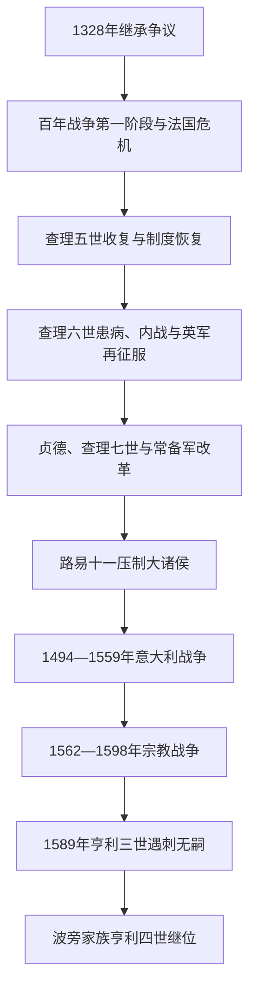

# 瓦卢瓦王朝

## 时间

1328—1589年

## 别称

卡佩—瓦卢瓦支系、Valois Dynasty

## 概括

卡佩直系断绝后，法国诸侯选择瓦卢瓦的腓力为王。英王爱德华三世则经母系提出继承权，王位争议同阿基坦封地、佛兰德贸易和两国财政竞争结合，发展为百年战争。战争初期法国屡败、国王被俘，黑死病和内乱又削弱国家；查理五世一度收复失地，查理六世患病后阿马尼亚克—勃艮第内战却让英军重占北方。查理七世借贞德象征、常设税收、职业军队和火炮恢复王权，1453年基本驱逐英军。

战后路易十一削弱勃艮第等大诸侯，法国成为更集中的欧洲强国。1494年起瓦卢瓦诸王竞逐意大利，虽促进文艺复兴文化与王室外交，却长期消耗财政并把法国卷入哈布斯堡包围。16世纪宗教改革、王位幼主和贵族派系使天主教与胡格诺派战争化；1589年亨利三世遇刺且无子，最近的男性王位继承人是波旁家族的纳瓦拉国王亨利，瓦卢瓦王朝遂由同属卡佩宗族的波旁旁支承接。

## 王朝演进图

## 建立背景

1328年查理四世无男嗣去世。英王爱德华三世是腓力四世的外孙，瓦卢瓦的腓力则是腓力四世之侄。法国政治精英以王位不能经女性传递为由选择后者，即腓力六世；“萨利克法”作为完整继承理论是在此后争论中逐渐整理。爱德华起初向腓力履行阿基坦封臣礼，1337年封地被没收后公开主张法国王位。百年战争因此不是单一民族仇恨，而是王位、封建主权、海峡贸易和联盟政治共同作用。

## 分阶段发展

### 战败、瘟疫与社会危机（1328—1364年）

腓力六世时期法国骑士军在克雷西（1346年）失利，英军次年取得加来。黑死病自1348年前后造成严重人口损失。约翰二世又在1356年普瓦捷战败被俘，王太子查理面对巴黎商人领袖艾蒂安·马塞尔、1358年扎克雷起义和财政崩溃。1360年《布勒丁尼条约》以巨额赎金和大片西南领土换回国王，显示封建征召军和临时税收难以应对长期战争。

### 查理五世收复与查理六世内战（1364—1422年）

查理五世避免大规模决战，任用贝特朗·迪盖克兰，以围困和机动作战逐步夺回英占地；王室文书、图书、税收和防御也恢复。其子查理六世成年后反复精神失常，王叔和王弟争夺摄政，勃艮第派与阿马尼亚克派互相刺杀。英王亨利五世利用内战，于1415年阿金库尔击败法军；1420年《特鲁瓦条约》排除王太子查理，规定亨利五世及其后裔继承法国。1422年后，英格兰幼王亨利六世和瓦卢瓦查理七世在不同地区同时被承认为王，法国合法性发生分裂。

### 查理七世复国与王权军事化（1422—1461年）

1429年贞德抵达奥尔良，解围后护送查理七世在兰斯加冕，打破英军不可战胜的政治印象。贞德1431年被勃艮第人交给英方并处死，但勃艮第公在1435年《阿拉斯条约》转向法王。查理七世以常设“军役税”、王家直属骑兵连和火炮队减少对封建征召依赖；1449—1453年收复诺曼底和除加来外的英属吉耶讷，卡斯蒂永战役通常视为战争结束。

### 领土整合与意大利战争（1461—1559年）

路易十一利用外交、收买和战争瓦解“公益同盟”，勃艮第大胆查理1477年战死后，法国取得勃艮第公国等遗产，但同哈布斯堡争夺尼德兰和弗朗什-孔泰。查理八世1494年以那不勒斯继承权入侵意大利，开启连续战争；路易十二、弗朗索瓦一世和亨利二世先后与西班牙、神圣罗马帝国和意大利诸国竞逐。

弗朗索瓦一世在马里尼亚诺获胜（1515年），又在帕维亚被俘（1525年）；他通过1516年《博洛尼亚政教协定》控制法国高级教职任命，并赞助文艺复兴艺术。1539年《维莱科特雷敕令》要求司法行政文件使用法语并加强出生、死亡登记。1559年《卡托-康布雷西和约》结束意大利战争，法国放弃主要意大利诉求，却保有加来和三主教区等成果。亨利二世同年在比武中受伤身亡，继承人为年幼而脆弱的诸子。

### 宗教战争与王朝终结（1559—1589年）

加尔文宗在城市、贵族和部分地区扩张，吉斯家族领导强硬天主教派，波旁亲王成为胡格诺派保护者，王太后凯瑟琳·德·美第奇试图在幼王时期维持平衡。1562年瓦西屠杀引发第一次宗教战争；停战、婚姻与再开战交替。1572年纳瓦拉亨利同玛格丽特婚礼后，巴黎爆发圣巴托洛缪日大屠杀并蔓延外省。

亨利三世时期，王弟去世使胡格诺派的纳瓦拉亨利成为推定继承人，天主教联盟拒绝接受，形成“三亨利战争”。1588年亨利三世命人杀死吉斯公爵，1589年本人又被修士刺杀。其临终承认纳瓦拉亨利，瓦卢瓦无嗣终结；战争仍延续到波旁亨利改宗、进入巴黎并颁布宽容政策。

## 完整君主世系

| 顺序 | 君主 | 支系 | 在位 | 与前任关系 | 关键事件与备注 |
|---:|---|---|---|---|---|
| 1 | 腓力六世 | 瓦卢瓦直系 | 1328—1350年 | 卡佩查理·瓦卢瓦之子 | 由诸侯选立，百年战争爆发；黑死病传入。 |
| 2 | 约翰二世 | 瓦卢瓦直系 | 1350—1364年 | 腓力六世之子 | 普瓦捷被俘，赎金与领土危机。 |
| 3 | **查理五世** | 瓦卢瓦直系 | 1364—1380年 | 约翰二世之子 | 与迪盖克兰重建军政并收复多数失地。 |
| 4 | 查理六世 | 瓦卢瓦直系 | 1380—1422年 | 查理五世之子 | 精神疾病；阿马尼亚克—勃艮第内战和《特鲁瓦条约》。 |
| 5 | **查理七世** | 瓦卢瓦直系 | 1422—1461年 | 查理六世之子 | 与英王亨利六世并立争位；贞德、常备军改革及百年战争胜利。 |
| 6 | **路易十一** | 瓦卢瓦直系 | 1461—1483年 | 查理七世之子 | 削弱大贵族，取得部分勃艮第遗产。 |
| 7 | 查理八世 | 瓦卢瓦直系 | 1483—1498年 | 路易十一之子 | 幼年由姐姐安妮与姐夫摄政；开启意大利战争，无存活子嗣。 |
| 8 | 路易十二 | 奥尔良支系 | 1498—1515年 | 查理五世曾孙、查理八世族叔兼姐夫 | 继续意大利战争；无男性继承人。 |
| 9 | **弗朗索瓦一世** | 昂古莱姆支系 | 1515—1547年 | 路易十二女婿、路易一世·奥尔良曾孙 | 文艺复兴赞助、帕维亚被俘、行政法语敕令。 |
| 10 | 亨利二世 | 昂古莱姆支系 | 1547—1559年 | 弗朗索瓦一世之子 | 结束意大利战争，比武事故身亡。 |
| 11 | 弗朗索瓦二世 | 昂古莱姆支系 | 1559—1560年 | 亨利二世长子 | 苏格兰女王玛丽之夫；吉斯家族掌权，早逝无嗣。 |
| 12 | 查理九世 | 昂古莱姆支系 | 1560—1574年 | 弗朗索瓦二世之弟 | 幼年由母后摄政；宗教战争和圣巴托洛缪屠杀。 |
| 13 | 亨利三世 | 昂古莱姆支系 | 1574—1589年 | 查理九世之弟 | 三亨利战争中遇刺，无子；承认波旁亨利为继承人。 |

## 统治结构与国家能力

| 机构 | 变化 | 作用与限制 |
|---|---|---|
| 国王与王室会议 | 从大贵族会议发展出国务、财政和司法专门会议 | 战争和幼主时期仍受王族、王后与权臣派系制约。 |
| 常设税收 | 军役税、盐税和间接税扩大 | 资助常备军和火炮，也造成地区特权、逃税和民变。 |
| 常备军与炮兵 | 查理七世后形成直属骑兵连和正规火炮 | 降低封建军依赖，推动百年战争胜利。 |
| 巴黎高等法院及地方法院 | 法令登记、司法上诉和法官职位扩展 | 既执行王法，也可能以登记权反对财政宗教政策。 |
| 三级会议与地方等级会 | 危机或财政需要时召集 | 不是常设立法机关；宗教战争末期成为派系竞争舞台。 |
| 王室地方官与总督 | 司法财政官员增加，大贵族任省总督 | 中央需借助地方精英，战争时总督可能半独立。 |

## 重要事件

| 时间 | 事件 | 影响 |
|---|---|---|
| 1328年 | 腓力六世继位 | 建立瓦卢瓦支系，女性血缘继承争议延续。 |
| 1337年 | 百年战争公开爆发 | 王位、阿基坦与海峡贸易冲突军事化。 |
| 1346年、1356年 | 克雷西与普瓦捷战败 | 法军组织受挫，约翰二世被俘，财政政治危机。 |
| 1360年 | 《布勒丁尼条约》 | 法国暂让大片领土并承担赎金。 |
| 1415—1420年 | 阿金库尔与《特鲁瓦条约》 | 英王取得法国继承安排，瓦卢瓦合法性陷入低谷。 |
| 1429年 | 奥尔良解围与兰斯加冕 | 贞德行动重建查理七世政治声望。 |
| 1435年 | 《阿拉斯条约》 | 勃艮第与英格兰分裂，法王战略局势改善。 |
| 1453年 | 卡斯蒂永战役 | 英军除加来外基本退出法国。 |
| 1477年 | 勃艮第大胆查理战死 | 法王取得部分勃艮第遗产，哈布斯堡竞争开始。 |
| 1494年 | 查理八世入意大利 | 意大利战争开始。 |
| 1515年、1525年 | 马里尼亚诺胜利与帕维亚失败 | 瓦卢瓦—哈布斯堡争霸的高低点。 |
| 1539年 | 《维莱科特雷敕令》 | 行政司法法语和人口登记制度加强。 |
| 1559年 | 《卡托-康布雷西和约》 | 意大利战争结束，王朝转入继承与宗教危机。 |
| 1562年 | 瓦西屠杀 | 法国宗教战争爆发。 |
| 1572年 | 圣巴托洛缪日大屠杀 | 宗派暴力全国化，君主调停信誉受损。 |
| 1589年 | 亨利三世遇刺 | 瓦卢瓦绝嗣，波旁继承但战争未立刻结束。 |

## 鼎盛与衰亡原因

- **崛起与鼎盛**：战争危机迫使王室建立常设税收、军队和火炮；勃艮第转向、英格兰内政问题和地方精英合作使查理七世胜出；路易十一把军事成果转化为领土整合。
- **结构压力**：意大利战争及宫廷财政持续消耗资源；官职出售、税收豁免和地区差异限制中央能力；幼主继位让王族派系控制政府。
- **外部压力**：英格兰、勃艮第和哈布斯堡分别在不同阶段形成包围；宗教改革又把国际新教与天主教竞争带入国内。
- **直接触发**：亨利二世意外死亡后连续三位儿子无稳定男性继承，宗教战争和三亨利竞争摧毁王朝权威；亨利三世遇刺是直系终结的直接事件。
- **承接关系**：波旁亨利不是外来征服者，而是卡佩男性旁支和合法推定继承人；其改宗与军事政治妥协才使继承真正落地。

## 演变关系

- 前一节点：[卡佩王朝](/%E4%BA%BA%E6%96%87%E7%A7%91%E5%AD%A6/%E5%8E%86%E5%8F%B2/%E6%AC%A7%E6%B4%B2/%E6%B3%95%E5%9B%BD/%E5%8D%A1%E4%BD%A9%E7%8E%8B%E6%9C%9D.md)。
- 后一节点：[波旁王朝](/%E4%BA%BA%E6%96%87%E7%A7%91%E5%AD%A6/%E5%8E%86%E5%8F%B2/%E6%AC%A7%E6%B4%B2/%E6%B3%95%E5%9B%BD/%E6%B3%A2%E6%97%81%E7%8E%8B%E6%9C%9D.md)。
- 所属总览：[法国历史](/%E4%BA%BA%E6%96%87%E7%A7%91%E5%AD%A6/%E5%8E%86%E5%8F%B2/%E6%AC%A7%E6%B4%B2/%E6%B3%95%E5%9B%BD/README.md)。
