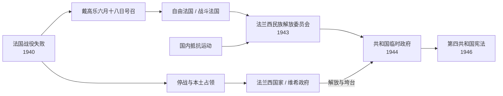

# 维希法国、自由法国与共和国临时政府

## 时间

1940 年 6 月—1946 年 10 月；为交代制度交接，延伸至 1947 年 1 月第四共和国首届常规政府成立。

## 概括

1940 年战败没有产生一条单线政权继承，而造成领土控制、国际承认与共和合法性的分裂。贝当在本土建立“法兰西国家”，废除共和制度并与德国合作；戴高乐则在伦敦号召继续作战，依托海外领地、抵抗网络和盟军支持逐步扩大“自由法国”的军政基础。1943 年阿尔及尔的法兰西民族解放委员会统一主要海外抵抗力量，1944 年改组为共和国临时政府并随解放进入巴黎。临时政府恢复共和合法性、惩治通敌者并推行社会改革，同时面对殖民地民族运动和战争破坏。

## 战败、停战与领土分割

- 1940 年 6 月 16 日贝当接替雷诺组阁，次日宣布寻求停战。6 月 22 日法德停战协定把北部和西部置于德军占领，维希政府在南部“非占领区”保留有限行政权；阿尔萨斯和摩泽尔被德国事实吞并。
- 法国仍须负担占领费用，约一百八十万战俘被扣留。殖民地、舰队和外交代表的归属成为双方争夺重点。
- 英国担忧法国舰队落入轴心国之手，7 月攻击凯比尔港舰队，造成重大伤亡并加深维希宣传中的反英情绪，但多数主力舰艇仍未被德国取得。
- 1942 年 11 月盟军登陆法属北非后，德国占领南部。土伦法国舰队自行凿沉，维希政府仅存的领土自主性基本消失。

## 维希法国

### 统治结构

| 角色 | 人物 / 时段 | 实际作用 |
|---|---|---|
| 国家元首 | **菲利普·贝当**，1940—1944 | 以宪法法令集中行政、立法和任命权，推行“民族革命” |
| 政府主要负责人 | 皮埃尔·赖伐尔，1940 | 主导早期对德合作，后因宫廷斗争被撤 |
| 政府主要负责人 | 皮埃尔-艾蒂安·弗朗丹，1940—1941 | 短期试图在德英之间保留回旋空间 |
| 政府主要负责人 | 弗朗索瓦·达尔朗，1941—1942 | 集中内政、外交和军务；强化国家行政控制 |
| 政府首脑 | **皮埃尔·赖伐尔**，1942—1944 | 在德国压力下扩大劳工输送、警务和政治合作 |
| 占领权力 | 德国军事行政、党卫队与驻法机构 | 决定占领区安全、经济征用和迫害政策；1942 年后控制扩展至全境 |

### 政策与责任

- 贝当以“劳动、家庭、祖国”取代共和口号，解散议会政治，限制工会与结社，宣传权威、天主教家庭伦理和反自由主义。
- 维希政府在德国直接要求之外主动制定 1940、1941 年犹太人身份法，排除犹太人担任公职和多类职业，并参与财产“雅利安化”、登记、拘捕和遣送。
- 1942 年冬季自行车赛场大搜捕中，法国警察拘捕包括儿童在内的大量犹太人；多数受害者后被送往奥斯维辛等灭绝营。行政机关和警察参与迫害是维希体制的核心责任。
- 1943 年强制劳工服务把法国劳工送往德国，反而促使部分青年逃入乡村游击队。维希民兵与德军协作镇压抵抗、拘捕犹太人和政治反对者。
- 政府以向德国供应产品、承担占领费和劳工输送换取有限行政空间；这种合作既出于强制，也出于部分领导人希望在德国主导的欧洲中保留地位的主动选择。

## 自由法国、海外基地与抵抗统一

### 形成过程

- 1940 年 6 月 18 日，戴高乐在伦敦广播号召继续作战。最初响应有限，他仍在英国承认下建立自由法国，并争取乍得、喀麦隆、法属刚果等赤道非洲领地。
- 达喀尔行动失败后，自由法国在加蓬战役中巩固赤道非洲基地；勒克莱尔部队自乍得向利比亚推进。1942 年自由法国部队在比尔哈凯姆抵抗轴心国，提升国际声望。
- 国内抵抗由共产主义者、戴高乐派、社会主义者、基督教民主派和地方网络分别发展，从情报、地下出版逐步转向破坏、营救和武装行动。
- 让·穆兰受戴高乐委托协调组织，1943 年建立全国抵抗委员会，使主要运动、工会和政党承认共同政治纲领。穆兰被捕遇害后，协调机构仍继续运行。
- 1942 年“火炬行动”后，北非先由达尔朗安排停火，继而出现吉罗与戴高乐权力竞争。1943 年两人共同主持法兰西民族解放委员会，戴高乐于同年逐步取得主导。

### 领导结构

| 阶段 | 领导人 | 时间 | 说明 |
|---|---|---|---|
| 自由法国 | **夏尔·戴高乐** | 1940—1941 | 自由法国人领袖，依托伦敦和海外领地 |
| 法兰西民族委员会 | **夏尔·戴高乐** | 1941—1943 | 建立较完整的行政与军事部门；1942 年改称“战斗法国” |
| 法兰西民族解放委员会 | 戴高乐、亨利·吉罗 | 1943 年 6—11 月 | 阿尔及尔双首脑，合并主要海外军政资源 |
| 法兰西民族解放委员会 | **夏尔·戴高乐** | 1943 年 11 月—1944 年 6 月 | 排除吉罗后成为唯一主席 |
| 国内政治代表 | 全国抵抗委员会 | 1943—1944 | 统合主要抵抗组织并提出战后社会改革纲领 |

## 解放与共和国临时政府

### 政权建立

- 1944 年 6 月，民族解放委员会改称法兰西共和国临时政府。盟军诺曼底登陆和普罗旺斯登陆后，法国内地军配合推进；巴黎抵抗组织起义，勒克莱尔第二装甲师和盟军于 8 月进入巴黎。
- 戴高乐坚持共和国从未在法律上消失，宣布维希的宪法法令无效，避免由盟军军事政府直接管理法国。多数国家随后承认临时政府。
- 对通敌者的惩处包括未经审判的“清洗”和随后制度化审判。贝当被判死刑后减为终身监禁，赖伐尔被处决；普通公务员的责任则因部门、行为和证据而异。
- 临时政府赋予女性选举权，恢复工会与政党，国有化法兰西银行、煤炭、电力、雷诺等关键部门，并以 1945 年社会保障制度重建福利国家。
- 殖民秩序并未随解放自动消失。1945 年塞提夫、盖勒马和赫拉塔的示威与暴力引发殖民军警大规模镇压；印度支那独立冲突也迅速升级。

### 临时政府首脑

| 顺序 | 姓名 | 任期 | 关键任务 |
|---|---|---|---|
| 1 | **夏尔·戴高乐** | 1944 年 6 月—1946 年 1 月 | 解放、恢复主权、社会经济改革；因反对议会主导的宪法设计辞职 |
| 2 | 费利克斯·古安 | 1946 年 1—6 月 | 第一次制宪方案被公投否决，继续三党联合 |
| 3 | 乔治·皮杜尔 | 1946 年 6—11 月 | 第二次制宪会议和第四共和国宪法公投 |
| 4 | 莱昂·布鲁姆 | 1946 年 12 月—1947 年 1 月 | 在新宪法生效后主持向常规共和国机构的最后交接 |

## 重要事件

| 时间 | 事件 | 结果与影响 |
|---|---|---|
| 1940 年 6 月 | 停战与六月十八日号召 | 领土控制与合法性分裂开始 |
| 1940 年 7 月 | 贝当获全权 | 议会共和国被威权“法兰西国家”取代 |
| 1940 年 10 月 | 蒙图瓦会晤与犹太人身份法 | 维希公开走向国家合作和制度性排犹 |
| 1940—1941 | 自由法国争取赤道非洲 | 获得领土、兵员和财政基础 |
| 1942 年 7 月 | 自行车赛场大搜捕 | 法国行政机关深度参与犹太人迫害 |
| 1942 年 11 月 | 火炬行动与德军占领南部 | 维希领土自主性消失，北非成为反轴心基地 |
| 1943 | 强制劳工服务、全国抵抗委员会成立 | 抵抗扩大并取得政治统一 |
| 1943 年 6 月 | 民族解放委员会成立 | 戴高乐派与北非军政体系开始合流 |
| 1944 年 6—8 月 | 登陆、巴黎解放与临时政府回国 | 共和国恢复实际统治 |
| 1944 年 4 月 | 女性获得选举权 | 扩大法国公民政治参与 |
| 1945 | 社会保障与国有化 | 奠定战后混合经济和福利国家框架 |
| 1945 年 5 月 | 塞提夫等地镇压 | 加深阿尔及利亚民族主义与法国殖民秩序冲突 |
| 1946 年 10 月 | 第四共和国宪法通过 | 临时政权结束，议会共和国重新制度化 |

## 胜负与转型原因

### 维希失去基础

- 体制依赖德国军事优势，缺乏自由选举授权；战争转向后，“以合作换取主权余地”的承诺越来越无法维持。
- 经济征用、粮食短缺、劳工输送和警察镇压扩大社会疏离；反犹迫害与民兵暴力使政权承担主动合作责任。
- 1942 年德国占领南部和舰队自沉表明维希不能保护领土和主权，行政机构逐渐成为占领政策工具。

### 自由法国崛起

- 赤道非洲、太平洋部分领地和后来北非提供领土、军队、港口与国家机构，使自由法国不只是流亡宣传组织。
- 英美苏承认、盟军军需和法国部队参战提供外部资源；国内抵抗及全国抵抗委员会则赋予本土政治代表性。
- 戴高乐坚持国家连续性，并在解放时快速部署省长、军队和行政机关，阻止权力真空。

### 直接转折

- 1942 年火炬行动和德国占领南部改变力量对比；1943 年抵抗统一与北非军政合流建立替代国家中心。
- 1944 年盟军登陆、苏德战场压力和法国国内起义导致德军撤退，维希领导层被迫迁往德国，临时政府接管本土。

## 演变关系

- 前承：[法兰西第三共和国](/%E4%BA%BA%E6%96%87%E7%A7%91%E5%AD%A6/%E5%8E%86%E5%8F%B2/%E6%AC%A7%E6%B4%B2/%E6%B3%95%E5%9B%BD/%E6%B3%95%E5%85%B0%E8%A5%BF%E7%AC%AC%E4%B8%89%E5%85%B1%E5%92%8C%E5%9B%BD.md)在 1940 年军事与宪政危机中终结。
- 后继：[法兰西第四共和国](/%E4%BA%BA%E6%96%87%E7%A7%91%E5%AD%A6/%E5%8E%86%E5%8F%B2/%E6%AC%A7%E6%B4%B2/%E6%B3%95%E5%9B%BD/%E6%B3%95%E5%85%B0%E8%A5%BF%E7%AC%AC%E5%9B%9B%E5%85%B1%E5%92%8C%E5%9B%BD.md)继承临时政府的共和合法性、社会改革与殖民难题。
- 领导人连续表：[法兰西第三与第四共和国国家领导人表](/%E4%BA%BA%E6%96%87%E7%A7%91%E5%AD%A6/%E5%8E%86%E5%8F%B2/%E6%AC%A7%E6%B4%B2/%E6%B3%95%E5%9B%BD/%E6%B3%95%E5%85%B0%E8%A5%BF%E7%AC%AC%E4%B8%89%E4%B8%8E%E7%AC%AC%E5%9B%9B%E5%85%B1%E5%92%8C%E5%9B%BD%E5%9B%BD%E5%AE%B6%E9%A2%86%E5%AF%BC%E4%BA%BA%E8%A1%A8.md)。
