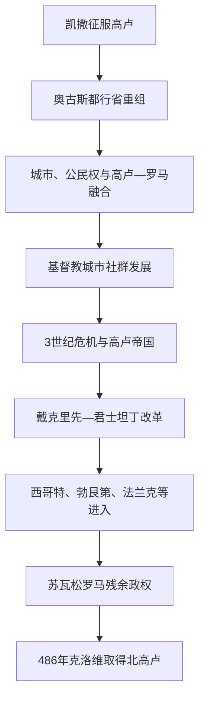

# 罗马高卢时期

## 时间

前52年—486年；南高卢自前2世纪已进入罗马行省体系

## 别称

高卢—罗马时期、Gallia Romana

## 概括

罗马征服没有把高卢居民整体替换为意大利移民，而是通过行省、城市、公民权、军队、道路、税收和地方精英合作，使多种高卢社会逐步进入罗马帝国。拉丁语在行政、法律和城市生活中扩散，同高卢语言长期并存并最终孕育高卢—罗曼语；本地神祇与罗马宗教融合，基督教从城市网络传播。

3世纪后，内战、税负、边防和区域军权上升使高卢多次成为争夺帝位的基地。406年莱茵边界突破只是长期转折之一；西哥特、勃艮第和法兰克先以盟军、移民或征服者身份进入，罗马官僚、主教、庄园与法律仍被后继王国利用。486年克洛维击败苏瓦松的西阿格里乌斯，标志北高卢最后主要罗马军政核心并入法兰克王国，而非古典社会瞬间消失。

## 演进图

## 行政与社会结构

| 层级 | 机构与参与者 | 作用与变化 |
|---|---|---|
| 帝国中央 | 皇帝、近卫与中央财政 | 任命总督、征税、调军；3世纪后高卢军团也能拥立皇帝。 |
| 行省 | 纳博讷高卢、阿基坦高卢、卢格敦高卢、比利时高卢等 | 边界数次调整；晚期又纳入“高卢管区”和高卢大区，不能用一个固定地图覆盖五百年。 |
| 城市共同体 | civitas、殖民城、市议会和地方显贵 | 征税、公共建筑、司法和地方祭祀；许多城市延续部落名称与中心。 |
| 军队与边界 | 莱茵军团、堡垒、道路和盟军 | 防御日耳曼边界，也深度参与帝位内战；晚期越来越依赖蛮族将领和盟军。 |
| 乡村 | 别墅庄园、小农、佃户与奴隶 | 向城市和军队供给粮食；晚期不同地区出现庄园集中、税负和安全差异。 |
| 宗教组织 | 本地祭司、帝国祭祀、犹太社群和基督教主教 | 基督教合法化后主教成为城市代表、救济者和政治中介。 |

## 分阶段发展

### 征服、和解与行省重组

凯撒战争结束后，反抗、军团驻防和土地重组仍持续。奥古斯都时期把除纳博讷行省外的大部高卢重组为阿基坦、卢格敦和比利时三大行省，并利用既有部落共同体建立城市行政。前12年卢格杜努姆三高卢祭坛把地方精英和皇帝崇拜联系起来；里昂也成为道路、铸币和商业枢纽。

地方贵族通过市政官职、军队和罗马公民权进入帝国精英。48年克劳狄一世支持部分高卢显贵进入元老院；212年卡拉卡拉敕令把帝国内多数自由居民纳入公民。所谓“罗马化”应理解为不平等的制度参与和文化混合，而非高卢传统被一律清除。

### 城市经济、语言与宗教

尼姆、阿尔勒、奥朗日、奥坦、兰斯、波尔多和卢格杜努姆等城市拥有浴场、竞技场、引水道、市场和道路。地中海葡萄酒与陶器北运，高卢本地陶器、葡萄酒、金属和农产品也进入帝国市场。地区差异明显：南部较早城市化，北部军镇和乡村网络另有发展。

拉丁语逐渐成为行政和书写语言，本地人口的口语变化形成高卢拉丁语基础；法语不是“纯拉丁语”直接复制，还受到高卢底层和后来法兰克语影响。宗教方面，卢格杜努姆177年殉道记显示基督教社群已出现；4世纪合法化后，图尔的马丁等主教推动城市外传教和圣徒崇拜。

### 3世纪危机与帝国重组

260—274年间，高卢、不列颠和部分西班牙行省形成史称“高卢帝国”的分立政权。它仍使用罗马皇帝、军队、铸币和执政官语言，目标多是保卫西部及争夺帝位，不是高卢民族独立。奥勒良重新统一后，戴克里先和君士坦丁改革行省、税制和军队，特里尔成为重要皇帝驻地。

内战、货币变化、边防袭击和税收重担改变城市与乡村；“巴高达”起事反映地方治安、债务和征税矛盾，但身份与规模因时而异。4世纪仍有城市复兴、基督教建筑和跨区贸易，不能把3世纪以后简单写成连续崩溃。

### 迁徙、盟国与罗马权力瓦解

406年末，汪达尔、苏维汇和阿兰群体越过莱茵，帝国因内战难以恢复边境。418年西哥特作为盟军定居阿基坦，勃艮第人在东部重建王国，法兰克集团则逐步控制北方。451年罗马将领埃提乌斯联合西哥特等力量在沙隆附近阻击阿提拉，说明“罗马”与“蛮族”已是交错联盟。

476年西罗马皇帝被废并未立即终结高卢全部罗马政权。西阿格里乌斯以苏瓦松为中心维持北高卢军政网络，直至486年败于克洛维。南部西哥特和东部勃艮第仍独立；法兰克统一高卢大部是此后数十年的过程。

## 重要事件

| 时间 | 事件 | 影响 |
|---|---|---|
| 前58—前50年 | 凯撒高卢战争 | 高卢大部被纳入罗马政治军事体系。 |
| 前27—前12年 | 奥古斯都行省重组与三高卢祭坛 | 建立长期行省和地方精英合作框架。 |
| 48年 | 克劳狄一世支持高卢显贵入元老院 | 展示地方精英进入帝国统治集团。 |
| 177年 | 卢格杜努姆基督徒殉道 | 反映早期城市基督教网络及迫害。 |
| 212年 | 卡拉卡拉公民权敕令 | 帝国多数自由居民取得公民身份，高卢地方身份与罗马法进一步结合。 |
| 260—274年 | 高卢帝国 | 西部军区分立，后由奥勒良重新统一。 |
| 4世纪 | 特里尔皇帝驻地与基督教制度化 | 高卢在晚期帝国行政、军务和教会中仍居重要地位。 |
| 406年 | 莱茵边界大规模突破 | 多个迁徙群体进入高卢，西罗马控制进一步碎片化。 |
| 418年 | 西哥特盟国定居阿基坦 | 罗马以土地和自治换取军事服务，后发展为独立王国。 |
| 451年 | 沙隆战役 | 罗马—盟军联盟阻止匈人继续向西推进。 |
| 486年 | 苏瓦松之战 | 克洛维击败西阿格里乌斯，北高卢罗马残余政权终结。 |

## 转型原因

- **结构因素**：幅员、军费和税收压力使中央不断重组；地方大地主、军区和主教获得更强资源动员能力。
- **政治因素**：频繁内战抽走莱茵军队，军队拥立皇帝又削弱长期边防协调。
- **外部压力**：日耳曼及草原集团受到自身政治竞争、匈人扩张和罗马招募共同推动，既有入侵也有合法定居。
- **直接转折**：406年边界失守、5世纪中央财政军事支持减少及486年苏瓦松战败，使不同地区转入后罗马王国。
- **延续性**：拉丁语、罗马法、城市主教、道路和庄园制度被法兰克、西哥特、勃艮第统治者继承；政权灭亡不等于社会清零。

## 演变关系

- 前一节点：[史前与凯尔特高卢时期](/%E4%BA%BA%E6%96%87%E7%A7%91%E5%AD%A6/%E5%8E%86%E5%8F%B2/%E6%AC%A7%E6%B4%B2/%E6%B3%95%E5%9B%BD/%E5%8F%B2%E5%89%8D%E4%B8%8E%E5%87%AF%E5%B0%94%E7%89%B9%E9%AB%98%E5%8D%A2%E6%97%B6%E6%9C%9F.md)。
- 后一阶段进入跨国共同史：[法兰克王国](/%E4%BA%BA%E6%96%87%E7%A7%91%E5%AD%A6/%E5%8E%86%E5%8F%B2/%E6%AC%A7%E6%B4%B2/_%E9%80%9A%E5%8F%B2/%E5%90%8E%E7%BD%97%E9%A9%AC%E6%97%B6%E4%BB%A3%E7%9A%84%E6%97%A5%E8%80%B3%E6%9B%BC%E8%AF%B8%E5%9B%BD/%E6%B3%95%E5%85%B0%E5%85%8B%E7%8E%8B%E5%9B%BD/README.md)。
- 罗马帝国完整制度与皇帝世系见[古罗马](/%E4%BA%BA%E6%96%87%E7%A7%91%E5%AD%A6/%E5%8E%86%E5%8F%B2/%E6%AC%A7%E6%B4%B2/_%E9%80%9A%E5%8F%B2/%E5%8F%A4%E7%BD%97%E9%A9%AC/README.md)，本页不复制帝国长世系。
- 所属总览：[法国历史](/%E4%BA%BA%E6%96%87%E7%A7%91%E5%AD%A6/%E5%8E%86%E5%8F%B2/%E6%AC%A7%E6%B4%B2/%E6%B3%95%E5%9B%BD/README.md)。
