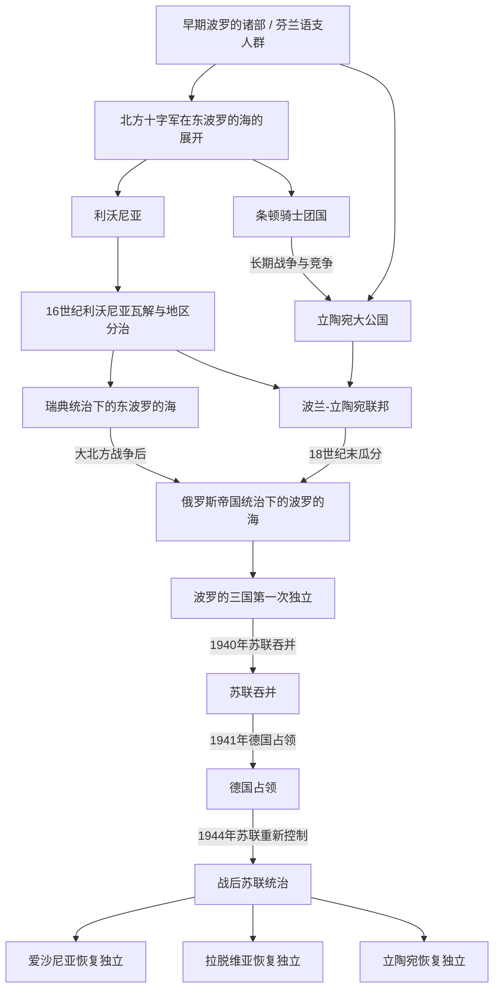

# 波罗的海历史

## 概括

波罗的海东岸是波罗的语族人群、芬兰语支人群、斯堪的纳维亚王权、罗斯与德意志城市网络交汇的地区。这里没有一条适用于所有地方的单线国家史：爱沙尼亚和拉脱维亚大部分地区经历利沃尼亚及瑞典统治，立陶宛则形成大公国并与波兰组成复合国家；三者在俄罗斯帝国、一战后独立、二战和苏联统治中逐渐汇合为可比较的现代区域历史。

## 历史主线

区域走向可以按“早期波罗的部族与芬兰语支人群 → 北方十字军与德意志骑士团 → 利沃尼亚、条顿骑士团国和立陶宛大公国并行 → 波兰-立陶宛联邦及近世列强分治 → 瑞典、波兰-立陶宛、丹麦和俄罗斯争夺 → 俄罗斯帝国统治 → 一战后波罗的三国独立 → 苏联吞并、德国占领与战后苏联统治 → 1990—1991年恢复独立”来理解。

## 波罗的海历史演进图

## 导航表

| 顺序 | 名称 | 时间 | 简要概括 |
|---:|---|---|---|
| 1 | [早期波罗的人](/%E4%BA%BA%E6%96%87%E7%A7%91%E5%AD%A6/%E5%8E%86%E5%8F%B2/%E6%AC%A7%E6%B4%B2/%E6%B3%A2%E7%BD%97%E7%9A%84%E6%B5%B7/%E6%97%A9%E6%9C%9F%E6%B3%A2%E7%BD%97%E7%9A%84%E4%BA%BA.md) | 史前—13世纪前 | 波罗的诸部、芬兰语支人群和东波罗的海贸易网络构成区域早期背景。 |
| 2 | [中世纪波罗的海十字军](/%E4%BA%BA%E6%96%87%E7%A7%91%E5%AD%A6/%E5%8E%86%E5%8F%B2/%E6%AC%A7%E6%B4%B2/%E6%B3%A2%E7%BD%97%E7%9A%84%E6%B5%B7/%E4%B8%AD%E4%B8%96%E7%BA%AA%E6%B3%A2%E7%BD%97%E7%9A%84%E6%B5%B7%E5%8D%81%E5%AD%97%E5%86%9B.md) | 12—15世纪 | 从地区视角说明征服、基督教化、教会建制和城市网络如何改变东波罗的海。 |
| 3 | [利沃尼亚](/%E4%BA%BA%E6%96%87%E7%A7%91%E5%AD%A6/%E5%8E%86%E5%8F%B2/%E6%AC%A7%E6%B4%B2/%E6%B3%A2%E7%BD%97%E7%9A%84%E6%B5%B7/%E5%88%A9%E6%B2%83%E5%B0%BC%E4%BA%9A.md) | 13—16世纪 | 今爱沙尼亚、拉脱维亚一带形成骑士团、主教区、城市和地方贵族交织的复合秩序。 |
| 4 | [条顿骑士团国与波罗的海秩序](/%E4%BA%BA%E6%96%87%E7%A7%91%E5%AD%A6/%E5%8E%86%E5%8F%B2/%E6%AC%A7%E6%B4%B2/%E6%B3%A2%E7%BD%97%E7%9A%84%E6%B5%B7/%E6%9D%A1%E9%A1%BF%E9%AA%91%E5%A3%AB%E5%9B%A2%E5%9B%BD%E4%B8%8E%E6%B3%A2%E7%BD%97%E7%9A%84%E6%B5%B7%E7%A7%A9%E5%BA%8F.md) | 13世纪—1525年 | 聚焦普鲁士骑士团国、波兰—立陶宛竞争和普鲁士公国形成。 |
| 5 | [立陶宛大公国](/%E4%BA%BA%E6%96%87%E7%A7%91%E5%AD%A6/%E5%8E%86%E5%8F%B2/%E6%AC%A7%E6%B4%B2/%E6%B3%A2%E7%BD%97%E7%9A%84%E6%B5%B7/%E7%AB%8B%E9%99%B6%E5%AE%9B%E5%A4%A7%E5%85%AC%E5%9B%BD.md) | 13世纪—1569年为独立扩张主线 | 立陶宛由波罗的政治体扩展为覆盖大量东斯拉夫地区的大公国。 |
| 6 | [波兰-立陶宛联邦](/%E4%BA%BA%E6%96%87%E7%A7%91%E5%AD%A6/%E5%8E%86%E5%8F%B2/%E6%AC%A7%E6%B4%B2/%E6%96%AF%E6%8B%89%E5%A4%AB/%E8%A5%BF%E6%96%AF%E6%8B%89%E5%A4%AB/%E6%B3%A2%E5%85%B0-%E7%AB%8B%E9%99%B6%E5%AE%9B%E8%81%94%E9%82%A6.md) | 1569—1795年 | 波兰与立陶宛组成复合国家，深刻影响立陶宛和整个中东欧格局。 |
| 7 | [瑞典统治下的东波罗的海](/%E4%BA%BA%E6%96%87%E7%A7%91%E5%AD%A6/%E5%8E%86%E5%8F%B2/%E6%AC%A7%E6%B4%B2/%E6%B3%A2%E7%BD%97%E7%9A%84%E6%B5%B7/%E7%91%9E%E5%85%B8%E7%BB%9F%E6%B2%BB%E4%B8%8B%E7%9A%84%E4%B8%9C%E6%B3%A2%E7%BD%97%E7%9A%84%E6%B5%B7.md) | 1561—1721年 | 聚焦瑞典控制爱沙尼亚、利沃尼亚及其地方制度和社会影响。 |
| 8 | [俄罗斯帝国统治下的波罗的海](/%E4%BA%BA%E6%96%87%E7%A7%91%E5%AD%A6/%E5%8E%86%E5%8F%B2/%E6%AC%A7%E6%B4%B2/%E6%B3%A2%E7%BD%97%E7%9A%84%E6%B5%B7/%E4%BF%84%E7%BD%97%E6%96%AF%E5%B8%9D%E5%9B%BD%E7%BB%9F%E6%B2%BB%E4%B8%8B%E7%9A%84%E6%B3%A2%E7%BD%97%E7%9A%84%E6%B5%B7.md) | 18世纪—1918年 | 大北方战争和联邦瓜分后，俄罗斯逐步成为东波罗的海主导力量。 |
| 9 | [波罗的三国独立](/%E4%BA%BA%E6%96%87%E7%A7%91%E5%AD%A6/%E5%8E%86%E5%8F%B2/%E6%AC%A7%E6%B4%B2/%E6%B3%A2%E7%BD%97%E7%9A%84%E6%B5%B7/%E6%B3%A2%E7%BD%97%E7%9A%84%E4%B8%89%E5%9B%BD%E7%8B%AC%E7%AB%8B.md) | 1918—1940年 | 一战和俄罗斯帝国崩溃后，爱沙尼亚、拉脱维亚、立陶宛建立共和国。 |
| 10 | [苏联统治下的波罗的海](/%E4%BA%BA%E6%96%87%E7%A7%91%E5%AD%A6/%E5%8E%86%E5%8F%B2/%E6%AC%A7%E6%B4%B2/%E6%B3%A2%E7%BD%97%E7%9A%84%E6%B5%B7/%E8%8B%8F%E8%81%94%E7%BB%9F%E6%B2%BB%E4%B8%8B%E7%9A%84%E6%B3%A2%E7%BD%97%E7%9A%84%E6%B5%B7.md) | 1940—1991年 | 苏联吞并、德国占领、苏联重新控制和战后苏维埃化塑造20世纪历史。 |
| 11 | [爱沙尼亚历史](/%E4%BA%BA%E6%96%87%E7%A7%91%E5%AD%A6/%E5%8E%86%E5%8F%B2/%E6%AC%A7%E6%B4%B2/%E6%B3%A2%E7%BD%97%E7%9A%84%E6%B5%B7/%E7%88%B1%E6%B2%99%E5%B0%BC%E4%BA%9A/README.md) | 史前至今 | 芬兰语支社会经利沃尼亚、瑞典和俄罗斯统治，形成并恢复现代共和国。 |
| 12 | [拉脱维亚历史](/%E4%BA%BA%E6%96%87%E7%A7%91%E5%AD%A6/%E5%8E%86%E5%8F%B2/%E6%AC%A7%E6%B4%B2/%E6%B3%A2%E7%BD%97%E7%9A%84%E6%B5%B7/%E6%8B%89%E8%84%B1%E7%BB%B4%E4%BA%9A/README.md) | 史前至今 | 利沃尼亚、库尔兰等不同地区在帝国统治和民族运动中整合为现代国家。 |
| 13 | [立陶宛历史](/%E4%BA%BA%E6%96%87%E7%A7%91%E5%AD%A6/%E5%8E%86%E5%8F%B2/%E6%AC%A7%E6%B4%B2/%E6%B3%A2%E7%BD%97%E7%9A%84%E6%B5%B7/%E7%AB%8B%E9%99%B6%E5%AE%9B/README.md) | 13世纪国家形成至今 | 大公国、联邦、帝国瓜分和民族国家构成独特的连续国家传统。 |

## 三国历史主线

| 国家 | 语言与早期背景 | 中世纪与近世核心路径 | 现代国家路径 |
|---|---|---|---|
| [爱沙尼亚](/%E4%BA%BA%E6%96%87%E7%A7%91%E5%AD%A6/%E5%8E%86%E5%8F%B2/%E6%AC%A7%E6%B4%B2/%E6%B3%A2%E7%BD%97%E7%9A%84%E6%B5%B7/%E7%88%B1%E6%B2%99%E5%B0%BC%E4%BA%9A/README.md) | 芬兰语支人群 | 丹麦与骑士团征服 → 利沃尼亚 → 瑞典 → 俄罗斯帝国 | 1918年独立 → 1940年后占领和苏联统治 → 1991年恢复独立 |
| [拉脱维亚](/%E4%BA%BA%E6%96%87%E7%A7%91%E5%AD%A6/%E5%8E%86%E5%8F%B2/%E6%AC%A7%E6%B4%B2/%E6%B3%A2%E7%BD%97%E7%9A%84%E6%B5%B7/%E6%8B%89%E8%84%B1%E7%BB%B4%E4%BA%9A/README.md) | 波罗的诸部与芬兰语支利沃尼亚人 | 利沃尼亚 → 波兰-立陶宛、瑞典和库尔兰等分治 → 俄罗斯帝国 | 1918年独立 → 1940年后占领和苏联统治 → 1991年恢复独立 |
| [立陶宛](/%E4%BA%BA%E6%96%87%E7%A7%91%E5%AD%A6/%E5%8E%86%E5%8F%B2/%E6%AC%A7%E6%B4%B2/%E6%B3%A2%E7%BD%97%E7%9A%84%E6%B5%B7/%E7%AB%8B%E9%99%B6%E5%AE%9B/README.md) | 波罗的诸部 | 立陶宛大公国 → 波兰-立陶宛联邦 → 俄罗斯帝国 | 1918年独立 → 1940年后占领和苏联统治 → 1990/1991年恢复独立 |

## 关键辨析

- **波罗的海是区域概念，不是单一族群**：立陶宛语、拉脱维亚语属于波罗的语支；爱沙尼亚语属于乌拉尔语系芬兰语支。
- **区域阶段并不同步**：爱沙尼亚和拉脱维亚长期处于利沃尼亚及瑞典影响下，立陶宛则拥有大公国和联邦传统。
- **条顿骑士团有组织史和地区史两个层次**：[条顿骑士团通史](/%E4%BA%BA%E6%96%87%E7%A7%91%E5%AD%A6/%E5%8E%86%E5%8F%B2/%E6%AC%A7%E6%B4%B2/_%E9%80%9A%E5%8F%B2/%E5%8D%81%E5%AD%97%E5%86%9B%E4%B8%9C%E5%BE%81/%E5%B9%BF%E4%B9%89%E5%8D%81%E5%AD%97%E5%86%9B%E8%BF%90%E5%8A%A8/%E6%9D%A1%E9%A1%BF%E9%AA%91%E5%A3%AB%E5%9B%A2.md)维护完整生命周期，[条顿骑士团国与波罗的海秩序](/%E4%BA%BA%E6%96%87%E7%A7%91%E5%AD%A6/%E5%8E%86%E5%8F%B2/%E6%AC%A7%E6%B4%B2/%E6%B3%A2%E7%BD%97%E7%9A%84%E6%B5%B7/%E6%9D%A1%E9%A1%BF%E9%AA%91%E5%A3%AB%E5%9B%A2%E5%9B%BD%E4%B8%8E%E6%B3%A2%E7%BD%97%E7%9A%84%E6%B5%B7%E7%A7%A9%E5%BA%8F.md)只解释普鲁士和东波罗的海后果。
- **瑞典帝国不等于东波罗的海省份**：[瑞典帝国](/%E4%BA%BA%E6%96%87%E7%A7%91%E5%AD%A6/%E5%8E%86%E5%8F%B2/%E6%AC%A7%E6%B4%B2/%E5%8C%97%E6%AC%A7/%E7%91%9E%E5%85%B8%E5%B8%9D%E5%9B%BD.md)维护瑞典强权通史，[瑞典统治下的东波罗的海](/%E4%BA%BA%E6%96%87%E7%A7%91%E5%AD%A6/%E5%8E%86%E5%8F%B2/%E6%AC%A7%E6%B4%B2/%E6%B3%A2%E7%BD%97%E7%9A%84%E6%B5%B7/%E7%91%9E%E5%85%B8%E7%BB%9F%E6%B2%BB%E4%B8%8B%E7%9A%84%E4%B8%9C%E6%B3%A2%E7%BD%97%E7%9A%84%E6%B5%B7.md)维护爱沙尼亚和拉脱维亚地区经验。
- **“恢复独立”体现国家连续性主张**：三国均把1990—1991年的变化解释为恢复1940年前的共和国，而不是从零建立国家。

## 相关欧洲历史

- 十字军总体背景参见[北方十字军](/%E4%BA%BA%E6%96%87%E7%A7%91%E5%AD%A6/%E5%8E%86%E5%8F%B2/%E6%AC%A7%E6%B4%B2/_%E9%80%9A%E5%8F%B2/%E5%8D%81%E5%AD%97%E5%86%9B%E4%B8%9C%E5%BE%81/%E5%B9%BF%E4%B9%89%E5%8D%81%E5%AD%97%E5%86%9B%E8%BF%90%E5%8A%A8/%E5%8C%97%E6%96%B9%E5%8D%81%E5%AD%97%E5%86%9B.md)。
- 条顿骑士团的普鲁士—德意志后续可与[德意志历史](/%E4%BA%BA%E6%96%87%E7%A7%91%E5%AD%A6/%E5%8E%86%E5%8F%B2/%E6%AC%A7%E6%B4%B2/%E5%BE%B7%E6%84%8F%E5%BF%97/README.md)对读。
- 瑞典帝国和芬兰方向可与[北欧历史](/%E4%BA%BA%E6%96%87%E7%A7%91%E5%AD%A6/%E5%8E%86%E5%8F%B2/%E6%AC%A7%E6%B4%B2/%E5%8C%97%E6%AC%A7/README.md)对读。
