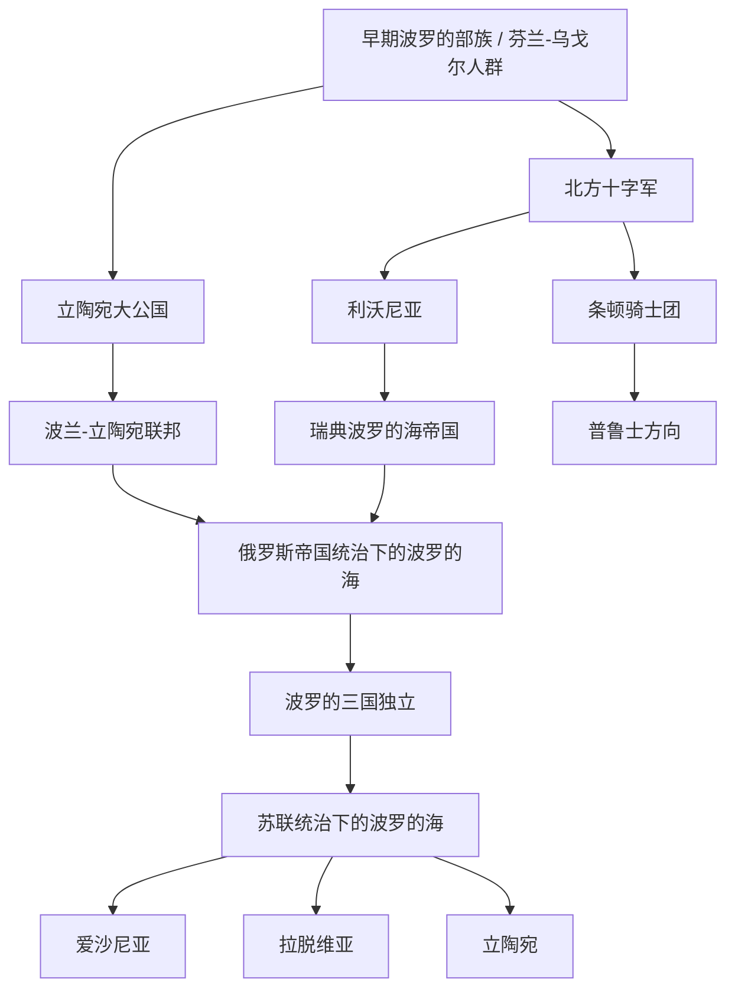

# 波罗的海历史

## 历史主线

波罗的海历史可以按“早期波罗的部族与芬兰-乌戈尔人群 → 北方十字军与德意志骑士团 → 利沃尼亚和条顿骑士团国家 → 立陶宛大公国崛起 → 波兰-立陶宛联邦 → 瑞典、波兰、俄罗斯争夺波罗的海 → 俄罗斯帝国统治 → 一战后波罗的三国独立 → 苏联统治与二战 → 1991年重新独立”来理解。这里的“波罗的海”是区域史概念，不等同于单一族群；爱沙尼亚语言属芬兰-乌戈尔语族，但通常归入波罗的国家。

## 波罗的海历史演变脉络图

## 导航表

| 顺序 | 名称 | 时间 | 简要概括 |
|---:|---|---|---|
| 1 | [早期波罗的人](/%E4%BA%BA%E6%96%87%E7%A7%91%E5%AD%A6/%E5%8E%86%E5%8F%B2/%E6%AC%A7%E6%B4%B2/%E6%B3%A2%E7%BD%97%E7%9A%84%E6%B5%B7/%E6%97%A9%E6%9C%9F%E6%B3%A2%E7%BD%97%E7%9A%84%E4%BA%BA.md) | 史前-13世纪前 | 波罗的部族、芬兰-乌戈尔人群和东波罗的海贸易网络构成区域早期背景。 |
| 2 | [中世纪波罗的海十字军](/%E4%BA%BA%E6%96%87%E7%A7%91%E5%AD%A6/%E5%8E%86%E5%8F%B2/%E6%AC%A7%E6%B4%B2/%E6%B3%A2%E7%BD%97%E7%9A%84%E6%B5%B7/%E4%B8%AD%E4%B8%96%E7%BA%AA%E6%B3%A2%E7%BD%97%E7%9A%84%E6%B5%B7%E5%8D%81%E5%AD%97%E5%86%9B.md) | 12-14世纪 | 北方十字军推动德意志、丹麦、瑞典和骑士团进入东波罗的海。 |
| 3 | [利沃尼亚](/%E4%BA%BA%E6%96%87%E7%A7%91%E5%AD%A6/%E5%8E%86%E5%8F%B2/%E6%AC%A7%E6%B4%B2/%E6%B3%A2%E7%BD%97%E7%9A%84%E6%B5%B7/%E5%88%A9%E6%B2%83%E5%B0%BC%E4%BA%9A.md) | 13世纪-16世纪 | 利沃尼亚是今爱沙尼亚、拉脱维亚一带的中世纪政治和教会复合体。 |
| 4 | [条顿骑士团](/%E4%BA%BA%E6%96%87%E7%A7%91%E5%AD%A6/%E5%8E%86%E5%8F%B2/%E6%AC%A7%E6%B4%B2/%E6%B3%A2%E7%BD%97%E7%9A%84%E6%B5%B7/%E6%9D%A1%E9%A1%BF%E9%AA%91%E5%A3%AB%E5%9B%A2.md) | 13世纪-16世纪 | 条顿骑士团国家连接普鲁士、德意志和波罗的海东岸历史。 |
| 5 | [立陶宛大公国](/%E4%BA%BA%E6%96%87%E7%A7%91%E5%AD%A6/%E5%8E%86%E5%8F%B2/%E6%AC%A7%E6%B4%B2/%E6%B3%A2%E7%BD%97%E7%9A%84%E6%B5%B7/%E7%AB%8B%E9%99%B6%E5%AE%9B%E5%A4%A7%E5%85%AC%E5%9B%BD.md) | 13世纪-1795年相关传统 | 立陶宛从波罗的强权扩展为覆盖大量东斯拉夫地区的大公国。 |
| 6 | [波兰-立陶宛联邦](/%E4%BA%BA%E6%96%87%E7%A7%91%E5%AD%A6/%E5%8E%86%E5%8F%B2/%E6%AC%A7%E6%B4%B2/%E6%96%AF%E6%8B%89%E5%A4%AB/%E8%A5%BF%E6%96%AF%E6%8B%89%E5%A4%AB/%E6%B3%A2%E5%85%B0-%E7%AB%8B%E9%99%B6%E5%AE%9B%E8%81%94%E9%82%A6.md) | 1569年-1795年 | 波兰与立陶宛组成复合国家，深刻影响波罗的海和东欧格局。 |
| 7 | [瑞典波罗的海帝国](/%E4%BA%BA%E6%96%87%E7%A7%91%E5%AD%A6/%E5%8E%86%E5%8F%B2/%E6%AC%A7%E6%B4%B2/%E6%B3%A2%E7%BD%97%E7%9A%84%E6%B5%B7/%E7%91%9E%E5%85%B8%E6%B3%A2%E7%BD%97%E7%9A%84%E6%B5%B7%E5%B8%9D%E5%9B%BD.md) | 17世纪-18世纪初 | 瑞典控制东波罗的海多地，与波兰-立陶宛、丹麦和俄罗斯争霸。 |
| 8 | [俄罗斯帝国统治下的波罗的海](/%E4%BA%BA%E6%96%87%E7%A7%91%E5%AD%A6/%E5%8E%86%E5%8F%B2/%E6%AC%A7%E6%B4%B2/%E6%B3%A2%E7%BD%97%E7%9A%84%E6%B5%B7/%E4%BF%84%E7%BD%97%E6%96%AF%E5%B8%9D%E5%9B%BD%E7%BB%9F%E6%B2%BB%E4%B8%8B%E7%9A%84%E6%B3%A2%E7%BD%97%E7%9A%84%E6%B5%B7.md) | 18世纪-1918年 | 大北方战争后，俄罗斯逐步成为东波罗的海主导力量。 |
| 9 | [波罗的三国独立](/%E4%BA%BA%E6%96%87%E7%A7%91%E5%AD%A6/%E5%8E%86%E5%8F%B2/%E6%AC%A7%E6%B4%B2/%E6%B3%A2%E7%BD%97%E7%9A%84%E6%B5%B7/%E6%B3%A2%E7%BD%97%E7%9A%84%E4%B8%89%E5%9B%BD%E7%8B%AC%E7%AB%8B.md) | 1918年-1940年 | 一战和俄罗斯帝国崩溃后，爱沙尼亚、拉脱维亚、立陶宛独立。 |
| 10 | [苏联统治下的波罗的海](/%E4%BA%BA%E6%96%87%E7%A7%91%E5%AD%A6/%E5%8E%86%E5%8F%B2/%E6%AC%A7%E6%B4%B2/%E6%B3%A2%E7%BD%97%E7%9A%84%E6%B5%B7/%E8%8B%8F%E8%81%94%E7%BB%9F%E6%B2%BB%E4%B8%8B%E7%9A%84%E6%B3%A2%E7%BD%97%E7%9A%84%E6%B5%B7.md) | 1940年-1991年 | 苏联吞并、二战占领和战后苏维埃化塑造20世纪波罗的海历史。 |
| 11 | [爱沙尼亚](/%E4%BA%BA%E6%96%87%E7%A7%91%E5%AD%A6/%E5%8E%86%E5%8F%B2/%E6%AC%A7%E6%B4%B2/%E6%B3%A2%E7%BD%97%E7%9A%84%E6%B5%B7/%E7%88%B1%E6%B2%99%E5%B0%BC%E4%BA%9A/README.md) | 1918年至今 | 芬兰-乌戈尔语族国家，历史上受丹麦、德意志、瑞典、俄罗斯和苏联影响。 |
| 12 | [拉脱维亚](/%E4%BA%BA%E6%96%87%E7%A7%91%E5%AD%A6/%E5%8E%86%E5%8F%B2/%E6%AC%A7%E6%B4%B2/%E6%B3%A2%E7%BD%97%E7%9A%84%E6%B5%B7/%E6%8B%89%E8%84%B1%E7%BB%B4%E4%BA%9A/README.md) | 1918年至今 | 位于利沃尼亚和库尔兰历史空间，受德意志骑士团、波兰-立陶宛、瑞典、俄罗斯影响。 |
| 13 | [立陶宛](/%E4%BA%BA%E6%96%87%E7%A7%91%E5%AD%A6/%E5%8E%86%E5%8F%B2/%E6%AC%A7%E6%B4%B2/%E6%B3%A2%E7%BD%97%E7%9A%84%E6%B5%B7/%E7%AB%8B%E9%99%B6%E5%AE%9B/README.md) | 1918年至今 | 继承立陶宛大公国记忆，又经历波兰-立陶宛联邦、俄罗斯帝国和苏联统治。 |

## 相关欧洲历史

- 北方十字军可与[北方十字军](/%E4%BA%BA%E6%96%87%E7%A7%91%E5%AD%A6/%E5%8E%86%E5%8F%B2/%E6%AC%A7%E6%B4%B2/_%E9%80%9A%E5%8F%B2/%E5%8D%81%E5%AD%97%E5%86%9B%E4%B8%9C%E5%BE%81/%E5%B9%BF%E4%B9%89%E5%8D%81%E5%AD%97%E5%86%9B%E8%BF%90%E5%8A%A8/%E5%8C%97%E6%96%B9%E5%8D%81%E5%AD%97%E5%86%9B.md)对读。
- 条顿骑士团、普鲁士方向可与[德意志](/%E4%BA%BA%E6%96%87%E7%A7%91%E5%AD%A6/%E5%8E%86%E5%8F%B2/%E6%AC%A7%E6%B4%B2/%E5%BE%B7%E6%84%8F%E5%BF%97/README.md)和[条顿骑士团（德意志）](/%E4%BA%BA%E6%96%87%E7%A7%91%E5%AD%A6/%E5%8E%86%E5%8F%B2/%E6%AC%A7%E6%B4%B2/%E5%BE%B7%E6%84%8F%E5%BF%97/%E5%BE%B7%E5%9B%BD/%E6%9D%A1%E9%A1%BF%E9%AA%91%E5%A3%AB%E5%9B%A2.md)对读。
- 瑞典帝国和芬兰方向可与[北欧历史](/%E4%BA%BA%E6%96%87%E7%A7%91%E5%AD%A6/%E5%8E%86%E5%8F%B2/%E6%AC%A7%E6%B4%B2/%E5%8C%97%E6%AC%A7/README.md)对读。
